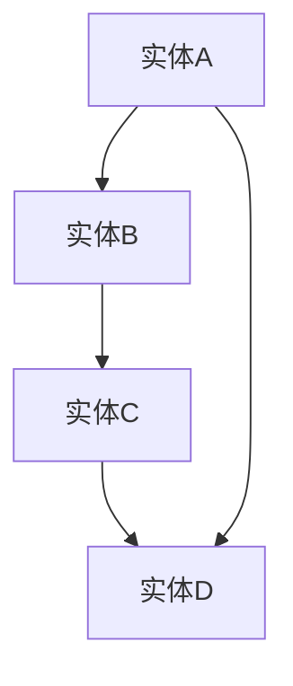
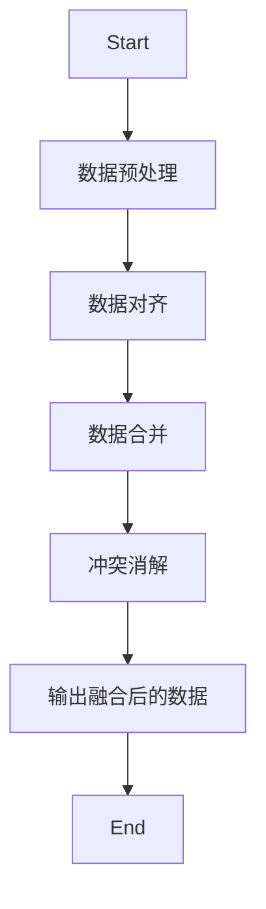
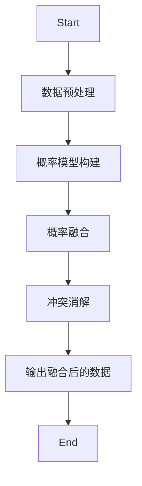
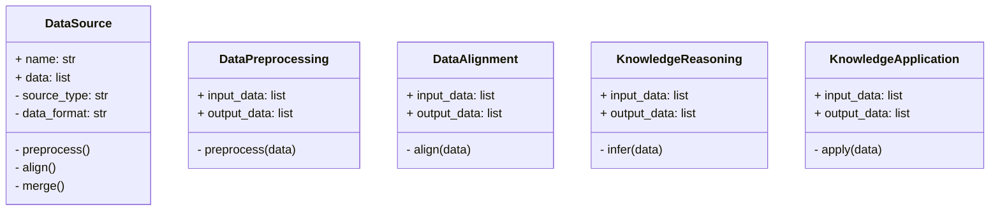
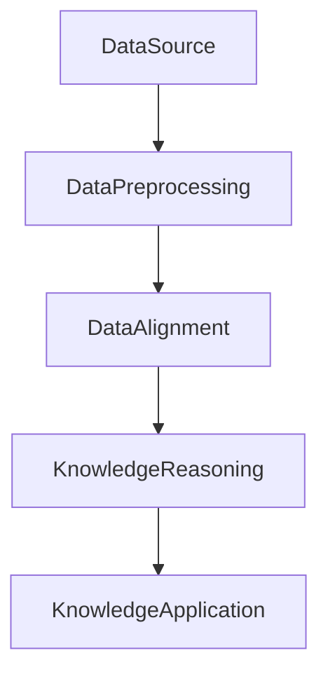
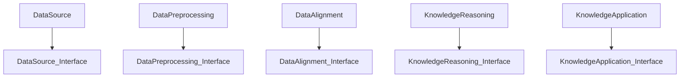
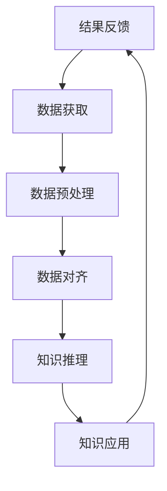

                 


# AI Agent的知识融合：整合多源异构信息

## 关键词：知识融合、AI Agent、多源异构信息、数据整合、知识图谱

## 摘要：  
在人工智能领域，知识融合是实现AI Agent智能化的核心技术之一。随着数据源的多样化和复杂化，如何有效地整合多源异构信息，成为AI Agent能力提升的关键挑战。本文从问题背景、核心概念、算法原理、系统架构到实际应用，详细探讨了AI Agent知识融合的全过程。通过对比分析、算法实现、系统设计和案例解读，为读者提供了一套系统性的解决方案，并展望了未来的研究方向。

---

## 第一部分：背景介绍

### 第1章：知识融合的背景与问题背景

#### 1.1 问题背景

- **多源数据的异构性问题**  
  随着AI技术的快速发展，AI Agent需要处理的数据来源日益多样化，包括结构化数据、非结构化数据、文本、图像、语音等多种形式。这些数据不仅格式各异，语义也存在差异，导致数据整合的难度增大。

- **知识融合的必要性**  
  知识融合是将多源异构信息整合为一致、完整且有意义的知识表示的过程。通过知识融合，AI Agent能够更好地理解和利用数据，提升决策能力和智能水平。

- **AI Agent在知识融合中的作用**  
  AI Agent作为知识融合的主体，负责从多个数据源中提取、对齐、整合和推理知识，从而实现知识的共享与复用。

#### 1.2 问题描述

- **异构数据的定义与特征**  
  异构数据指的是来自不同数据源、具有不同结构、格式和语义的数据。其主要特征包括数据格式多样性、语义复杂性和数据粒度差异性。

- **知识融合的目标与挑战**  
  知识融合的目标是将多源异构数据整合为一致的知识表示，同时保持知识的完整性和准确性。其主要挑战包括数据对齐、语义理解、冲突消解和计算效率等问题。

- **AI Agent的知识需求与能力提升**  
  AI Agent需要通过知识融合获得全面、准确的知识，以支持复杂场景下的决策和推理。知识融合是提升AI Agent智能水平的关键技术。

#### 1.3 问题解决

- **知识融合的基本方法**  
  知识融合的基本方法包括数据预处理、数据对齐、知识推理和知识表示。其中，数据预处理是基础，数据对齐是关键，知识推理是核心，知识表示是结果。

- **AI Agent的知识获取与整合**  
  AI Agent通过多源数据获取、数据清洗、数据对齐和知识推理等步骤，实现知识的获取与整合。通过知识图谱构建，AI Agent能够更好地理解和利用知识。

- **多源异构信息的整合策略**  
  多源异构信息的整合策略包括基于规则的整合、基于概率的整合和基于图的整合。这些策略根据数据源的特征和应用场景选择合适的整合方法。

#### 1.4 边界与外延

- **知识融合的边界**  
  知识融合的边界主要在于数据源的多样性和数据格式的复杂性。知识融合不涉及数据生成，仅关注数据的整合与推理。

- **AI Agent能力的局限性**  
  AI Agent的知识融合能力受到数据质量和数据源数量的限制。此外，知识融合的计算复杂性也影响其实时性和响应速度。

- **知识融合与其他技术的关系**  
  知识融合与数据挖掘、机器学习、自然语言处理等技术密切相关。通过与其他技术的结合，知识融合能够更好地实现数据的深度分析和知识的高效利用。

#### 1.5 核心要素与概念结构

- **知识融合的核心要素**  
  知识融合的核心要素包括数据源、知识表示、数据对齐和知识推理。这些要素共同构成了知识融合的完整体系。

- **AI Agent的知识体系结构**  
  AI Agent的知识体系结构包括知识获取、知识存储、知识推理和知识应用四个部分。通过这四个部分的协同工作，AI Agent能够实现知识的动态更新和灵活应用。

- **异构数据的整合模型**  
  异构数据的整合模型包括层次模型、网络模型和混合模型。这些模型根据数据源的特征和应用场景选择合适的整合方式。

---

## 第二部分：核心概念与联系

### 第2章：知识融合的核心概念与原理

#### 2.1 异构数据的定义与分类

- **数据异构性的维度**  
  数据异构性的维度包括数据格式、数据粒度和数据语义。数据格式的异构性主要体现在数据的结构和格式差异，数据粒度的异构性主要体现在数据的层次和细节程度，数据语义的异构性主要体现在数据的含义和上下文差异。

- **数据源的类型与特征**  
  数据源的类型包括结构化数据源、非结构化数据源和半结构化数据源。结构化数据源具有明确的数据结构和格式，非结构化数据源缺乏明确的数据结构，半结构化数据源介于两者之间。

- **异构数据的表示方法**  
  异构数据的表示方法包括数据标准化、数据映射和数据转换。数据标准化是将不同数据源的数据转换为统一的格式，数据映射是将不同数据源的数据映射到统一的语义空间，数据转换是将不同数据源的数据转换为一致的数据表示。

#### 2.2 知识表示与融合的原理

- **知识表示的基本方法**  
  知识表示的基本方法包括符号表示、语义网络和知识图谱。符号表示通过符号和规则表示知识，语义网络通过节点和边表示知识，知识图谱通过实体和关系表示知识。

- **知识融合的数学模型**  
  知识融合的数学模型包括基于概率的模型、基于逻辑的模型和基于图的模型。基于概率的模型通过概率分布表示知识的不确定性，基于逻辑的模型通过逻辑规则表示知识的确定性，基于图的模型通过图结构表示知识的关联性。

- **知识图谱的构建与更新**  
  知识图谱的构建与更新包括数据预处理、数据对齐、知识推理和知识存储。通过知识图谱的构建与更新，AI Agent能够动态获取和利用最新的知识。

#### 2.3 知识融合的关键步骤

- **数据预处理与清洗**  
  数据预处理与清洗是知识融合的第一步，包括数据去重、数据补全和数据标准化。通过数据预处理与清洗，能够消除数据中的噪声和冗余，提高数据的质量。

- **数据对齐与匹配**  
  数据对齐与匹配是知识融合的关键步骤，包括实体对齐和属性对齐。通过数据对齐与匹配，能够将不同数据源中的实体和属性映射到统一的知识表示空间。

- **知识整合与推理**  
  知识整合与推理是知识融合的核心步骤，包括知识合并和知识推理。通过知识整合与推理，能够将不同数据源中的知识整合为一致的知识表示，并通过推理扩展知识。

---

### 第3章：异构数据源的特征对比

#### 3.1 数据源的特征对比

- **数据格式的差异**  
  数据格式的差异主要体现在结构化数据、非结构化数据和半结构化数据之间的差异。结构化数据具有明确的结构和格式，非结构化数据缺乏明确的结构和格式，半结构化数据介于两者之间。

- **数据粒度的差异**  
  数据粒度的差异主要体现在数据的层次和细节程度。例如，宏观数据和微观数据在粒度上存在差异，宏观数据关注整体趋势，微观数据关注具体细节。

- **数据语义的差异**  
  数据语义的差异主要体现在数据的含义和上下文。不同数据源中的同一数据项可能具有不同的语义，例如“温度”在不同领域中的含义可能不同。

#### 3.2 数据源的实体关系

- **实体关系的定义**  
  实体关系是指不同实体之间的关联关系，包括一对一、一对多和多对多三种类型。通过实体关系，可以描述数据源中的实体如何相互关联。

- **实体关系的类型**  
  实体关系的类型包括关联关系、包含关系和映射关系。通过实体关系的类型，可以更好地理解数据源中的实体如何相互关联。

- **实体关系的表示**  
  实体关系的表示可以通过关系图谱、关系矩阵和关系数据库等方式实现。通过实体关系的表示，可以更好地理解和利用数据源中的实体关系。

#### 3.3 数据源的对比表格

- **数据源的特征对比表**  
  下表展示了不同数据源的特征对比：

| 数据源 | 数据格式 | 数据粒度 | 数据语义 |
|--------|----------|----------|----------|
| 数据源1 | 结构化    | 宏观     | 明确     |
| 数据源2 | 非结构化  | 微观     | 模糊     |
| 数据源3 | 半结构化  | 中观     | 明确     |

- **数据源的实体关系对比表**  
  下表展示了不同数据源中的实体关系对比：

| 数据源 | 实体A | 关系类型 | 实体B |
|--------|-------|----------|-------|
| 数据源1 | 实体1  | 一对一    | 实体2  |
| 数据源2 | 实体3  | 一对多    | 实体4  |
| 数据源3 | 实体5  | 多对多    | 实体6  |

- **数据源的融合优先级表**  
  下表展示了不同数据源的融合优先级对比：

| 数据源 | 融合优先级 | 融合策略 |
|--------|------------|----------|
| 数据源1 | 高         | 基于规则 |
| 数据源2 | 中         | 基于概率 |
| 数据源3 | 低         | 基于图    |

---

### 第4章：知识融合的实体关系图

#### 4.1 知识融合的实体关系图

以下是知识融合的实体关系图，展示了不同实体之间的关联关系：



---

## 第三部分：算法原理讲解

### 第5章：知识融合算法原理

#### 5.1 基于规则的融合算法

- **算法原理**  
  基于规则的融合算法通过预定义的规则将不同数据源中的数据进行融合。规则通常包括数据对齐规则、数据合并规则和数据冲突消解规则。

- **算法步骤**  
  以下是基于规则的融合算法的步骤：



- **算法实现**  
  以下是基于规则的融合算法的Python实现：

```python
def rule_based_fusion(data_source1, data_source2):
    # 数据预处理
    preprocessed_data1 = preprocess(data_source1)
    preprocessed_data2 = preprocess(data_source2)
    
    # 数据对齐
    aligned_data = align(preprocessed_data1, preprocessed_data2)
    
    # 数据合并
    merged_data = merge(aligned_data)
    
    # 冲突消解
    resolved_data = resolve_conflicts(merged_data)
    
    return resolved_data
```

- **数学模型**  
  基于规则的融合算法的数学模型如下：

$$
\text{融合结果} = \bigcup_{i=1}^{n} \text{规则}_i(\text{数据源}_i)
$$

---

#### 5.2 基于概率的融合算法

- **算法原理**  
  基于概率的融合算法通过概率分布表示数据的不确定性，并通过概率推理将不同数据源中的数据进行融合。

- **算法步骤**  
  以下是基于概率的融合算法的步骤：



- **算法实现**  
  以下是基于概率的融合算法的Python实现：

```python
def probability_based_fusion(data_source1, data_source2):
    # 数据预处理
    preprocessed_data1 = preprocess(data_source1)
    preprocessed_data2 = preprocess(data_source2)
    
    # 概率模型构建
    probability_model = build_probability_model(preprocessed_data1, preprocessed_data2)
    
    # 概率融合
    fused_data = fuse(probability_model)
    
    # 冲突消解
    resolved_data = resolve_conflicts(fused_data)
    
    return resolved_data
```

- **数学模型**  
  基于概率的融合算法的数学模型如下：

$$
P(\text{融合结果} | \text{数据源}_1, \text{数据源}_2) = \prod_{i=1}^{n} P(\text{数据源}_i | \text{融合结果})
$$

---

## 第四部分：系统分析与架构设计

### 第6章：知识融合系统分析与架构设计

#### 6.1 问题场景介绍

- **系统场景**  
  知识融合系统需要处理多源异构数据，实现知识的整合与推理。系统场景包括数据获取、数据预处理、数据对齐、知识推理和知识应用。

- **项目介绍**  
  本项目旨在开发一个基于知识融合的AI Agent系统，能够从多个数据源中获取、整合和推理知识，支持复杂场景下的决策和推理。

- **系统功能设计**  
  系统功能设计包括数据获取模块、数据预处理模块、数据对齐模块、知识推理模块和知识应用模块。

#### 6.2 系统功能设计

- **领域模型设计**  
  领域模型设计包括数据源、数据预处理、数据对齐、知识推理和知识应用五个模块。以下是领域模型的类图：



- **系统架构设计**  
  系统架构设计包括数据获取层、数据处理层、知识推理层和知识应用层。以下是系统架构图：



- **系统接口设计**  
  系统接口设计包括数据获取接口、数据处理接口、知识推理接口和知识应用接口。以下是系统接口图：



- **系统交互设计**  
  系统交互设计包括数据获取、数据预处理、数据对齐、知识推理和知识应用五个步骤。以下是系统交互图：



---

## 第五部分：项目实战

### 第7章：知识融合项目实战

#### 7.1 项目环境配置

- **环境要求**  
  需要安装Python、Jupyter Notebook、pandas、numpy、networkx和pymermaid等依赖库。

- **安装依赖**  
  通过以下命令安装依赖：

```bash
pip install pandas numpy networkx pymermaid
```

#### 7.2 系统核心实现

- **数据预处理模块**  
  数据预处理模块实现数据清洗和数据标准化。

```python
def preprocess(data):
    # 数据清洗
    cleaned_data = [item for item in data if item['value'] != '']
    
    # 数据标准化
    standardized_data = []
    for item in cleaned_data:
        standardized_item = {
            'id': item['id'],
            'value': item['value'].lower()
        }
        standardized_data.append(standardized_item)
    return standardized_data
```

- **数据对齐模块**  
  数据对齐模块实现实体对齐和属性对齐。

```python
def align(data1, data2):
    # 实体对齐
    aligned_entities = []
    for item1 in data1:
        for item2 in data2:
            if item1['id'] == item2['id']:
                aligned_entities.append((item1, item2))
    return aligned_entities
```

- **知识推理模块**  
  知识推理模块实现知识整合与推理。

```python
def infer(data):
    # 知识整合
    integrated_data = []
    for item in data:
        if item['value'] == 'true':
            integrated_data.append(item)
    
    # 知识推理
    inferred_data = []
    for item in integrated_data:
        if item['type'] == 'rule':
            inferred_data.append(item['value'])
    return inferred_data
```

#### 7.3 代码应用解读与分析

- **数据预处理模块**  
  数据预处理模块通过数据清洗和数据标准化，确保数据的质量和一致性。

- **数据对齐模块**  
  数据对齐模块通过实体对齐和属性对齐，将不同数据源中的数据映射到统一的知识表示空间。

- **知识推理模块**  
  知识推理模块通过知识整合和知识推理，将不同数据源中的知识整合为一致的知识表示，并通过推理扩展知识。

#### 7.4 实际案例分析

- **案例背景**  
  本案例通过医疗领域的症状诊断，展示知识融合在实际应用中的效果。

- **案例分析**  
  症状诊断案例通过多源异构数据的整合，实现症状的准确诊断和治疗方案的推荐。

- **案例总结**  
  通过症状诊断案例，展示了知识融合在医疗领域的应用价值和实际效果。

---

## 第六部分：最佳实践

### 第8章：知识融合的最佳实践

#### 8.1 小结

- **知识融合的核心价值**  
  知识融合通过整合多源异构信息，提升AI Agent的知识获取能力和智能水平。

- **算法选择的灵活性**  
  根据数据源的特征和应用场景，选择合适的知识融合算法，能够提高融合效果和效率。

- **系统架构的扩展性**  
  知识融合系统的架构设计需要考虑扩展性，以适应未来数据源的增加和算法的更新。

#### 8.2 注意事项

- **数据质量的重要性**  
  数据质量是知识融合的基础，数据预处理和清洗是确保数据质量的关键步骤。

- **算法选择的合理性**  
  算法选择需要考虑数据源的特征、融合目标和计算资源，选择合适的算法能够提高融合效果。

- **系统安全与隐私保护**  
  知识融合系统需要考虑数据安全和隐私保护，防止数据泄露和滥用。

#### 8.3 拓展阅读

- **相关书籍推荐**  
  推荐阅读《知识图谱：概念、方法与应用》和《分布式知识表示与图神经网络》。

- **相关论文推荐**  
  推荐阅读《A Survey on Knowledge Fusion: Integrating Heterogeneous Information Sources》和《Knowledge Graphs and Beyond》。

---

## 作者：AI天才研究院/AI Genius Institute & 禅与计算机程序设计艺术 /Zen And The Art of Computer Programming

