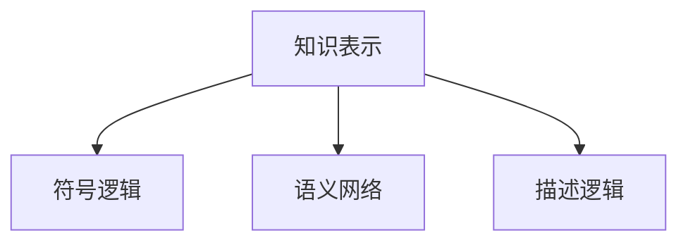
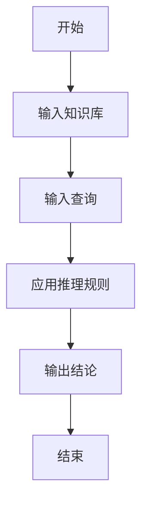
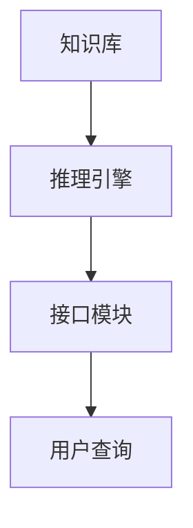
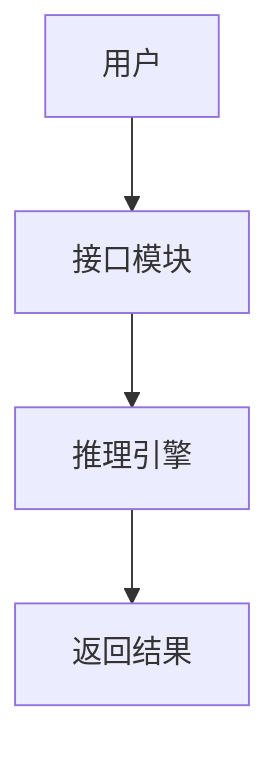

                 


# AI Agent的知识表示与推理系统优化

## 关键词：AI Agent, 知识表示, 推理系统, 优化, 知识图谱, 逻辑推理, 概率推理

## 摘要：本文详细探讨了AI Agent的知识表示与推理系统优化的关键技术，从核心概念、算法原理到系统架构进行了全面分析，并通过实际案例展示优化方法和效果。

---

# 第1章：背景介绍与问题背景

## 1.1 AI Agent的定义与特点
AI Agent（智能体）是指在环境中能够感知并自主行动以实现目标的实体。其特点包括自主性、反应性、目标导向和社交能力。知识表示与推理是AI Agent实现智能决策的核心。

## 1.2 问题背景
当前AI Agent的知识表示与推理系统面临以下问题：
1. 知识表示不够精确，导致推理错误。
2. 推理系统效率低下，无法实时处理复杂任务。
3. 知识表示与推理结合不紧密，影响整体性能。

## 1.3 问题解决
通过优化知识表示和推理算法，提升AI Agent的决策能力。具体方法包括符号逻辑优化、概率推理改进和神经符号结合。

## 1.4 核心概念
知识表示：用符号或语义网络表示知识。
推理系统：通过逻辑推理和概率推理进行推断。
优化目标：提高准确性和效率。

---

# 第2章：知识表示的核心概念与方法

## 2.1 符号逻辑表示法
使用符号和谓词表示知识，如 `parent(X,Y)` 表示X是Y的父。

## 2.2 语义网络表示法
通过节点和边表示概念及其关系，如节点表示实体，边表示关系。

## 2.3 描述逻辑表示法
使用本体论描述概念，支持复杂属性和限制。

## 2.4 对比分析
| 方法       | 优点                   | 缺点                   |
|------------|------------------------|------------------------|
| 符号逻辑   | 精确性高                | 难处理模糊性           |
| 语义网络   | 可视化性强              | 复杂性高                |
| 描述逻辑   | 支持复杂概念            | 实现难度大              |

## 2.5 ER实体关系图


---

# 第3章：知识推理的原理与算法

## 3.1 推理的基本原理
推理是基于现有知识推导新结论的过程，分为逻辑推理和概率推理。

## 3.2 符号逻辑推理
### 算法流程


### 数学模型
$$ \text{结论} = \text{逻辑规则}(\text{前提1}, \text{前提2}) $$

## 3.3 概率推理
### 贝叶斯网络
$$ P(A|B) = \frac{P(B|A)P(A)}{P(B)} $$

## 3.4 神经符号推理
结合神经网络和符号逻辑，提升推理能力。

---

# 第4章：知识表示与推理的结合优化

## 4.1 知识图谱构建
通过知识图谱整合多源数据，提高知识表示的全面性。

## 4.2 本体论优化
使用本体论规范知识表示，减少语义歧义。

## 4.3 符号与数值结合
混合方法兼顾逻辑推理和数据驱动的优势。

---

# 第5章：推理算法的优化与实现

## 5.1 符号逻辑推理优化
通过剪枝和缓存提升效率。

## 5.2 概率推理优化
优化计算方法，降低计算复杂度。

## 5.3 神经符号推理
结合深度学习和符号逻辑，提升推理能力。

---

# 第6章：系统架构与设计

## 6.1 系统架构


## 6.2 接口设计


---

# 第7章：项目实战与案例分析

## 7.1 环境配置
安装Python、TensorFlow和逻辑推理库。

## 7.2 核心代码实现
```python
def symbol_reaseasoning(knowledge_base, query):
    for rule in knowledge_base:
        if rule匹配query:
            return 结论
    return None
```

## 7.3 案例分析
分析医疗诊断场景，优化推理效率。

---

# 第8章：最佳实践与总结

## 8.1 小结
优化知识表示和推理算法是提升AI Agent性能的关键。

## 8.2 注意事项
选择合适的方法，确保数据质量。

## 8.3 未来趋势
神经符号推理和动态知识库优化是未来重点。

---

作者：AI天才研究院 & 禅与计算机程序设计艺术

