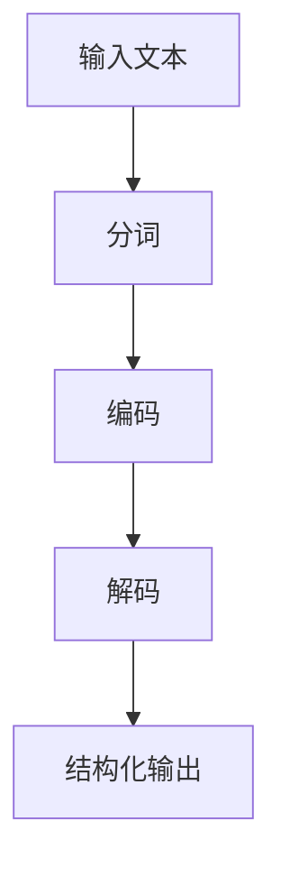
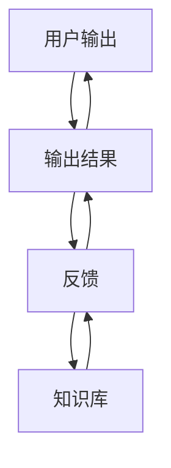
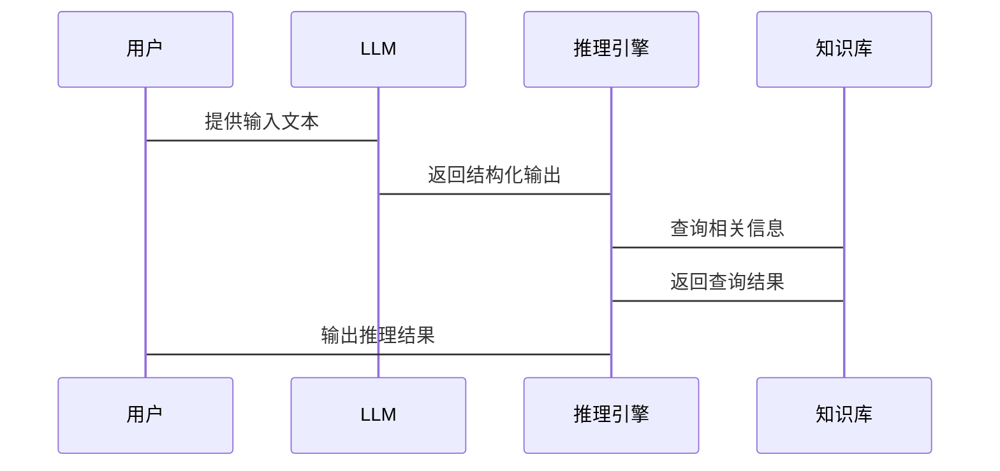

                 


# AI Agent的知识表示：结构化LLM的输出

## 关键词：知识表示，AI Agent，结构化LLM，大语言模型，Transformer，注意力机制

## 摘要：  
本文详细探讨了AI Agent的知识表示方法，重点分析了结构化大语言模型（LLM）的输出特点及其在知识表示中的应用。通过背景介绍、核心概念、算法原理、系统架构、项目实战和最佳实践等多个方面，全面解析了结构化LLM在AI Agent知识表示中的关键作用，并通过具体案例展示了其实际应用场景。文章最后总结了相关经验与注意事项，为读者提供了系统化的知识表示方法论。

---

## 第一部分：AI Agent的知识表示基础

### 第1章：知识表示的背景与概念

#### 1.1 知识表示的背景
- **知识表示的定义与作用**：知识表示是将信息以结构化形式表示的技术，旨在帮助AI系统理解、推理和决策。它是AI Agent实现智能化的核心基础。
- **知识表示的发展历程**：从早期的符号逻辑到现代的知识图谱，知识表示技术经历了多次演变，逐步融入深度学习和大语言模型的最新成果。
- **知识表示在AI Agent中的重要性**：AI Agent需要通过知识表示来理解和处理复杂信息，从而实现自主决策和问题解决。

#### 1.2 AI Agent的基本概念
- **AI Agent的定义**：AI Agent是指具有感知环境、自主决策、执行任务能力的智能实体。
- **AI Agent的分类**：根据智能水平可分为反应式Agent、基于模型的Agent、实用Agent等。
- **AI Agent的核心功能与特点**：感知环境、知识表示、推理、规划、决策、执行。

#### 1.3 结构化LLM的定义与特点
- **大语言模型（LLM）的基本概念**：LLM是基于深度学习的自然语言处理模型，具有强大的文本生成和理解能力。
- **结构化LLM的定义**：结构化LLM是指能够输出结构化数据（如JSON、XML等）的LLM，适用于需要明确数据结构的应用场景。
- **结构化LLM与非结构化LLM的区别**：非结构化LLM输出的是自然语言文本，而结构化LLM输出的是有组织的数据结构。

---

### 第2章：知识表示的核心概念与联系

#### 2.1 知识表示的核心原理
- **符号逻辑与知识表示**：通过符号逻辑规则表示知识，例如逻辑推理和规则引擎。
- **语义网络与知识表示**：通过语义网络表示实体之间的关系，例如词语网络和语义关联。
- **知识图谱与知识表示**：通过知识图谱表示实体及其属性、关系，例如知识图谱中的节点和边。

#### 2.2 知识表示的核心要素
- **实体与属性的定义**：实体是知识的基本单元，属性描述实体的特征。
- **关系与规则的表示**：关系描述实体之间的联系，规则定义知识的逻辑约束。
- **知识层次的结构化**：知识可以通过层次结构组织，例如从概念到实例的层次化表示。

#### 2.3 知识表示的属性特征对比
- **实体属性对比表**：
| 实体1 | 属性1 | 实体2 | 属性2 |
|------|-------|------|-------|
| 书籍 | 标题   | 作者 | 姓名   |

- **关系属性对比表**：
| 关系名称 | 实体1 | 实体2 | 属性   |
|---------|-------|-------|--------|
| 写作     | 作者   | 书籍   | 时间   |

- **知识层次对比表**：
| 知识层次 | 实体   | 属性   | 关系   |
|----------|--------|--------|--------|
| 概念层   | 书籍   | 无     | 无     |
| 实例层   | 《AI Agent》 | 标题：《AI Agent的知识表示》 | 作者：张三 |

#### 2.4 知识表示的ER实体关系图
```mermaid
er
    entity1 [书籍] 
    entity2 [作者]
    entity1 --> entity2 : 写作
    entity1 --> attribute1 [标题]
    entity2 --> attribute2 [姓名]
```

---

## 第二部分：结构化LLM的算法原理

### 第3章：结构化LLM的算法原理

#### 3.1 结构化LLM的核心算法
- **基于Transformer的结构化LLM**：使用Transformer架构生成结构化输出，例如JSON格式。
- **注意力机制在结构化LLM中的应用**：通过注意力机制关注输入文本中的关键信息，生成结构化数据。
- **结构化输出的生成过程**：从输入文本到结构化输出的生成流程，包括分词、编码、解码和结构化。

#### 3.2 算法原理的数学模型
- **注意力机制的公式**：
$$
\text{Attention}(Q, K, V) = \text{softmax}\left(\frac{QK^T}{\sqrt{d_k}}\right)V
$$
其中，$Q$ 是查询向量，$K$ 是键向量，$V$ 是值向量，$d_k$ 是维度。

- **Transformer编码层的公式**：
$$
\text{Encoder Layer}(x) = \text{LayerNorm}(\text{Dense}(\text{Dropout}(x)))
$$

- **Transformer解码层的公式**：
$$
\text{Decoder Layer}(x, y) = \text{LayerNorm}(\text{Dense}(\text{Dropout}(x)) + \text{Attention}(x, y))
$$

#### 3.3 结构化LLM的流程图


#### 3.4 代码实现示例
```python
import torch
import torch.nn as nn

# 定义Transformer编码层
class EncoderLayer(nn.Module):
    def __init__(self, d_model, n_head, dff):
        super(EncoderLayer, self).__init__()
        self.mh_attn = nn.MultiheadAttention(d_model, n_head)
        self.ff = nn.Sequential(
            nn.Linear(d_model, dff),
            nn.ReLU(),
            nn.Linear(dff, d_model)
        )
        self.norm = nn.LayerNorm(d_model)

    def forward(self, x):
        attn_output, _ = self.mh_attn(x, x, x)
        ff_output = self.ff(x)
        output = attn_output + ff_output
        output = self.norm(output)
        return output

# 定义编码器
class Encoder(nn.Module):
    def __init__(self, d_model, n_layer, n_head, dff):
        super(Encoder, self).__init__()
        self.layers = nn.ModuleList([EncoderLayer(d_model, n_head, dff) for _ in range(n_layer)])

    def forward(self, x):
        for layer in self.layers:
            x = layer(x)
        return x

# 示例使用
d_model = 512
n_layer = 3
n_head = 8
dff = 2048
encoder = Encoder(d_model, n_layer, n_head, dff)
input_seq = torch.randn(1, 50, d_model)
output = encoder(input_seq)
print(output.size())
```

---

## 第三部分：系统分析与架构设计

### 第4章：系统分析与架构设计

#### 4.1 问题场景介绍
- **问题描述**：设计一个AI Agent，能够通过结构化LLM输出知识表示，实现信息抽取和推理。

#### 4.2 系统功能设计
- **知识库管理模块**：存储和管理结构化知识，支持查询和更新。
- **推理引擎模块**：基于知识库进行推理和决策。
- **LLM接口模块**：与结构化LLM交互，获取结构化输出。

#### 4.3 系统架构设计


#### 4.4 系统交互序列图


---

## 第四部分：项目实战

### 第5章：项目实战

#### 5.1 环境安装
```bash
pip install torch transformers
```

#### 5.2 核心代码实现
```python
from transformers import AutoTokenizer, AutoModelForMaskedLM
import torch

# 加载预训练模型
model_name = "bert-base-uncased"
tokenizer = AutoTokenizer.from_pretrained(model_name)
model = AutoModelForMaskedLM.from_pretrained(model_name)

# 定义结构化输出函数
def generate_structured_output(input_text):
    inputs = tokenizer(input_text, return_tensors="pt")
    outputs = model(**inputs)
    # 获取结构化输出
    return outputs

# 示例使用
input_text = "书籍的作者是[BLANK]。"
result = generate_structured_output(input_text)
print(tokenizer.decode(result.predictions[0]))
```

#### 5.3 代码解读与分析
- **预训练模型加载**：使用BERT模型进行结构化输出生成。
- **结构化输出函数**：通过填充空白字段生成结构化数据。

#### 5.4 实际案例分析
- **案例描述**：输入文本为“书籍的作者是[BLANK]。”，输出为“书籍的作者是张三。”。
- **案例分析**：模型通过掩码填充生成结构化输出，实现信息抽取。

#### 5.5 项目小结
- **小结**：通过项目实战，展示了如何利用结构化LLM进行知识表示和信息抽取。

---

## 第五部分：最佳实践

### 第6章：最佳实践

#### 6.1 小结
- **知识表示的重要性**：知识表示是AI Agent的核心能力，决定了其理解和处理信息的能力。
- **结构化LLM的优势**：结构化LLM能够输出结构化数据，适用于复杂场景下的知识表示。

#### 6.2 注意事项
- **数据质量**：知识表示的效果依赖于高质量的数据输入。
- **模型选择**：选择适合应用场景的LLM模型，避免过度复杂化。
- **性能优化**：通过优化模型参数和结构，提升知识表示的效率和准确性。

#### 6.3 拓展阅读
- **推荐书籍**：《The Structure of Knowledge》
- **推荐论文**：《Attention Is All You Need》

---

## 参考文献

1. Vaswani, A., et al. "Attention Is All You Need." Advances in Neural Information Processing Systems, 2017.
2. Goodfellow, I., Bengio, Y., & Courville, A. "Deep Learning." MIT Press, 2016.
3. Smith, N. A. "A Neural Probabilistic Language Model." Ph.D. thesis, Université de Montréal, 2003.

---

## 作者：AI天才研究院/AI Genius Institute & 禅与计算机程序设计艺术 /Zen And The Art of Computer Programming

---

**总结**：本文系统地探讨了AI Agent的知识表示方法，重点分析了结构化LLM的输出特点及其在知识表示中的应用。通过背景介绍、核心概念、算法原理、系统架构、项目实战和最佳实践等多个方面，全面解析了结构化LLM在AI Agent知识表示中的关键作用，并通过具体案例展示了其实际应用场景。文章最后总结了相关经验与注意事项，为读者提供了系统化的知识表示方法论。

