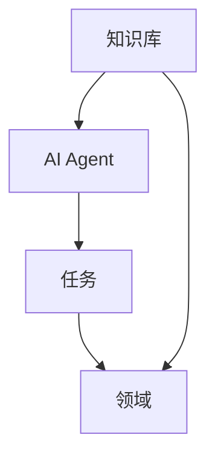
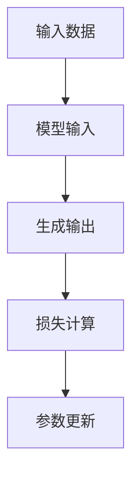
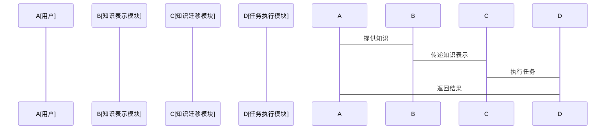

                 

# AI Agent的知识迁移：跨领域应用LLM的能力

> 关键词：AI Agent，知识迁移，LLM，跨领域应用，机器学习，人工智能，知识表示

> 摘要：本文探讨AI Agent的知识迁移能力，特别是大型语言模型（LLM）在跨领域应用中的潜力。通过分析知识表示、迁移算法、系统架构和实际案例，本文揭示了LLM如何增强AI Agent的能力，使其在不同领域中高效应用。

---

# 第1章: AI Agent与知识迁移概述

## 1.1 AI Agent的基本概念
### 1.1.1 AI Agent的定义与特点
AI Agent（人工智能代理）是能够感知环境、自主决策并执行任务的智能实体。其特点包括自主性、反应性、目标导向和社会能力。AI Agent能够通过传感器获取信息，利用知识库进行推理，并通过执行器与环境互动。

### 1.1.2 知识迁移的基本概念
知识迁移是指将知识从一个领域或任务转移到另一个领域或任务的过程。在AI Agent中，知识迁移使模型能够适应不同环境和任务，提升其泛化能力。

### 1.1.3 LLM在AI Agent中的作用
LLM（大型语言模型）通过自然语言处理和生成，为AI Agent提供强大的文本理解和生成能力，使其能够处理多样化的任务，如问答、翻译和对话。

---

## 1.2 知识迁移的背景与意义
### 1.2.1 知识迁移的背景
随着AI Agent的应用场景扩展，单一领域的训练数据难以满足跨领域需求，知识迁移成为必要。知识迁移可减少数据依赖，提升模型的适应性。

### 1.2.2 知识迁移的重要性
知识迁移使AI Agent能够利用已有知识解决新问题，提升效率和性能，降低数据收集和训练成本。

### 1.2.3 LLM在知识迁移中的优势
LLM具有强大的上下文理解和生成能力，适合处理复杂的知识迁移任务。其预训练参数使其能够快速适应新领域。

---

## 1.3 本章小结
本章介绍了AI Agent和知识迁移的基本概念，分析了知识迁移的背景和意义，并探讨了LLM在知识迁移中的优势。

---

# 第2章: 知识迁移的核心概念与联系

## 2.1 知识迁移的原理
### 2.1.1 知识表示与编码
知识表示是将知识结构化的过程，常用向量表示。编码方法包括词嵌入和句嵌入。

### 2.1.2 知识存储与检索
知识存储依赖于数据库或知识图谱，检索基于相似度或关键词匹配。

### 2.1.3 知识迁移的实现机制
通过参数调整、预训练和微调等方法实现知识迁移。

---

## 2.2 LLM与知识迁移的关系
### 2.2.1 LLM的基本原理
LLM通过预训练学习语言模型，参数数量庞大，适用于多种任务。

### 2.2.2 LLM在知识迁移中的应用
LLM通过微调或提示工程技术，实现跨领域的知识应用。

### 2.2.3 LLM与AI Agent的结合
LLM为AI Agent提供语言理解和生成能力，增强其交互和推理能力。

---

## 2.3 知识迁移的实体关系图
使用Mermaid绘制实体关系图，展示知识库、AI Agent、任务、领域等实体之间的关系。

---

## 2.4 本章小结
本章分析了知识迁移的原理及其在LLM中的应用，展示了各实体之间的关系。

---

# 第3章: 知识迁移的算法原理

## 3.1 知识迁移的基本算法
### 3.1.1 相关算法概述
包括参数初始化、正则化和数据增强等技术。

### 3.1.2 算法的优缺点对比
对比无监督、有监督和半监督学习的优缺点。

### 3.1.3 算法的选择与优化
根据任务需求选择合适的算法，并通过超参数调整优化性能。

---

## 3.2 LLM的知识迁移算法
### 3.2.1 LLM的知识迁移流程
1. 预训练：利用大规模数据训练模型参数。
2. 微调：针对目标领域数据进行优化。
3. 提示工程：通过设计提示语引导模型生成所需输出。

### 3.2.2 算法的实现步骤
1. 数据准备：收集并预处理目标领域的数据。
2. 模型加载：选择合适的LLM模型。
3. 微调训练：在目标数据上进行微调。
4. 模型评估：验证模型的迁移能力。

### 3.2.3 算法的数学模型
LLM的训练目标是最小化损失函数：

$$ L = -\sum_{i=1}^{n} \log P(y_i|x_i) $$

其中，$P(y|x)$是条件概率分布，表示给定输入$x$生成输出$y$的概率。

---

## 3.3 算法的数学模型与公式
使用Mermaid绘制算法流程图：

---

## 3.4 本章小结
本章详细讲解了知识迁移的基本算法和LLM的实现过程，展示了数学模型和流程图。

---

# 第4章: 系统分析与架构设计

## 4.1 问题场景分析
### 4.1.1 问题背景介绍
AI Agent需要在多个领域中应用，数据和任务差异大，知识迁移需求强烈。

### 4.1.2 问题目标设定
提升AI Agent在不同领域的任务处理能力。

### 4.1.3 问题约束与假设
资源有限，需高效利用现有数据。

---

## 4.2 系统功能设计
### 4.2.1 功能模块划分
包括知识表示、知识存储、知识迁移和任务执行模块。

### 4.2.2 功能模块的交互设计
各模块通过API进行交互，确保数据流畅通。

### 4.2.3 功能模块的实现方案
采用分布式架构，利用云服务扩展能力。

---

## 4.3 系统架构设计
### 4.3.1 系统架构的选择
采用微服务架构，各模块独立开发和部署。

### 4.3.2 系统架构的实现
使用容器化技术，如Docker，确保系统可扩展性。

### 4.3.3 系统架构的优化
通过负载均衡和缓存技术提升性能。

---

## 4.4 系统接口设计
### 4.4.1 接口的定义与设计
定义RESTful API，确保模块间通信高效。

### 4.4.2 接口的实现与测试
通过单元测试验证接口功能。

### 4.4.3 接口的文档编写
编写API文档，便于开发者理解和使用。

---

## 4.5 系统交互流程设计
### 4.5.1 交互流程的绘制
使用Mermaid序列图展示系统交互流程。

---

## 4.6 本章小结
本章通过问题场景分析和系统架构设计，展示了AI Agent知识迁移系统的实现方案。

---

# 第5章: 项目实战

## 5.1 环境安装与配置
### 5.1.1 开发环境的选择
推荐使用Python 3.8及以上版本。

### 5.1.2 开发工具的安装
安装必要的库，如TensorFlow、PyTorch和Hugging Face Transformers。

### 5.1.3 环境的配置与测试
配置虚拟环境，测试库的安装情况。

---

## 5.2 系统核心实现
### 5.2.1 核心代码的编写
编写知识表示、知识迁移和任务执行模块的代码。

### 5.2.2 代码的调试与优化
通过日志和调试工具排查问题，优化代码性能。

### 5.2.3 代码的测试与验证
进行单元测试和集成测试，确保功能正常。

---

## 5.3 项目实战案例
### 5.3.1 案例分析
以医疗领域问答为例，展示知识迁移的应用。

### 5.3.2 代码实现与解读
展示LLM在医疗问答中的微调过程和代码实现。

### 5.3.3 实际案例分析
分析模型在不同领域的迁移效果，总结经验。

---

## 5.4 项目总结
总结项目的实现过程，提出改进建议和未来方向。

---

# 第6章: 最佳实践与总结

## 6.1 最佳实践
### 6.1.1 知识迁移的关键点
选择合适的迁移策略和工具，确保数据质量。

### 6.1.2 系统设计的注意事项
模块化设计和可扩展性考虑。

### 6.1.3 项目管理的建议
制定合理的开发计划，加强团队协作。

---

## 6.2 小结
知识迁移是AI Agent跨领域应用的核心，LLM提供了强大的技术支持。通过合理设计和优化，AI Agent能够在多个领域中高效应用。

---

## 6.3 注意事项
数据质量和模型选择对迁移效果影响重大，需谨慎处理。

---

## 6.4 拓展阅读
推荐相关书籍和论文，供读者深入学习。

---

# 作者：AI天才研究院/AI Genius Institute & 禅与计算机程序设计艺术 /Zen And The Art of Computer Programming

---

本文通过系统地分析AI Agent的知识迁移能力，详细讲解了LLM在跨领域的应用，为读者提供了理论和实践的全面指导。希望本文能为相关领域的研究和应用提供有价值的参考。

