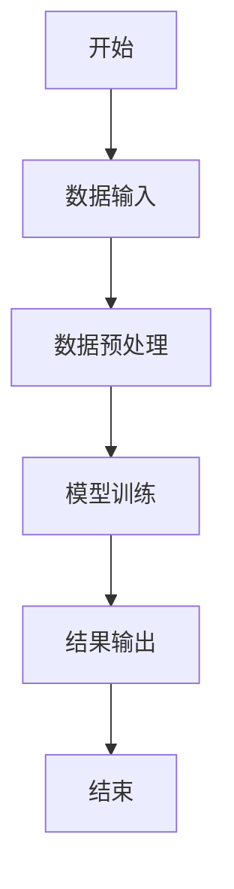
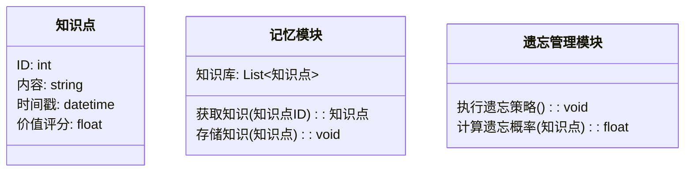
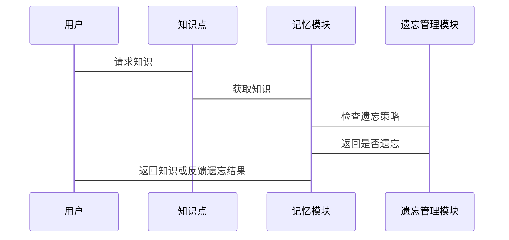

                 


# AI Agent的知识遗忘管理：平衡记忆与效率

> 关键词：知识遗忘管理，AI Agent，知识管理，遗忘曲线，记忆效率

> 摘要：本文探讨了AI Agent在知识管理中的遗忘问题，提出了一种平衡记忆与效率的解决方案。通过分析知识遗忘的原理和算法，设计了一套高效的知识遗忘管理系统，展示了如何通过遗忘曲线模型优化记忆存储，确保AI Agent在高效运作的同时保持必要的知识记忆。

---

# 第1章: 知识遗忘管理的背景与问题

## 1.1 知识遗忘管理的背景介绍

### 1.1.1 AI Agent的概念与应用
AI Agent（智能体）是能够感知环境并采取行动以实现目标的实体。在现代应用中，AI Agent广泛用于自动驾驶、智能助手、推荐系统等领域。随着AI Agent处理的数据量激增，如何有效管理存储的知识成为关键挑战。

### 1.1.2 知识遗忘管理的必要性
知识的无限积累会导致存储资源的过度消耗和处理效率的下降。通过遗忘管理，AI Agent可以在保持核心知识的同时，释放不必要的存储空间，提升运行效率。

### 1.1.3 问题背景与挑战
AI Agent在处理大量信息时，如果不进行遗忘管理，会导致存储压力过大、处理速度下降等问题。此外，过时或低价值的知识可能干扰当前任务，影响决策的准确性。

## 1.2 知识遗忘管理的定义与特点

### 1.2.1 知识遗忘管理的定义
知识遗忘管理是指AI Agent根据设定的策略，有选择地遗忘或保留知识，以优化存储和处理效率的过程。

### 1.2.2 知识遗忘管理的核心特点
- **选择性遗忘**：根据知识的价值和使用频率决定是否遗忘。
- **动态调整**：根据环境变化和任务需求实时调整遗忘策略。
- **高效性**：通过算法优化，确保遗忘过程快速且不影响当前任务。

## 1.3 知识遗忘管理的边界与外延

### 1.3.1 管理范围的界定
知识遗忘管理主要针对不再需要或低价值的知识，而对高价值或频繁使用的知识进行保留。

### 1.3.2 与其他技术的关联
知识遗忘管理与数据压缩、信息检索、机器学习等领域密切相关，能够通过这些技术的结合进一步优化知识管理效率。

## 1.4 知识遗忘管理的概念结构

### 1.4.1 核心要素组成
- 知识存储：负责知识的存取和管理。
- 遗忘策略：决定哪些知识需要遗忘。
- 执行机制：具体实施遗忘操作。

### 1.4.2 概念之间的关系
知识遗忘管理通过遗忘策略指导执行机制，调整知识存储的内容和结构，以优化整体效率。

## 1.5 本章小结
本章介绍了AI Agent知识遗忘管理的背景、定义、特点和概念结构，为后续章节的深入分析奠定了基础。

---

# 第2章: 知识遗忘管理的核心概念与联系

## 2.1 核心概念的原理分析

### 2.1.1 知识遗忘的基本原理
遗忘是人类记忆的自然过程，AI Agent可以通过模拟遗忘曲线来优化知识的存储和访问。

### 2.1.2 AI Agent的记忆机制
AI Agent通过记忆模块存储知识，并根据遗忘策略决定保留或遗忘。

### 2.1.3 遗忘管理的算法基础
遗忘管理依赖于遗忘曲线模型，通过概率计算决定知识的保留或遗忘。

## 2.2 核心概念的特征对比

### 2.2.1 不同遗忘管理方法的对比
| 方法         | 优点                     | 缺点                     |
|--------------|--------------------------|--------------------------|
| 基于时间的遗忘 | 实现简单，适合周期性知识   | 不适合非周期性知识         |
| 基于价值的遗忘 | 高效，适合重要知识       | 需要准确评估知识价值       |

### 2.2.2 各种算法的优缺点分析
- **时间遗忘法**：简单易实现，但不够灵活。
- **价值遗忘法**：高效精准，但评估价值可能复杂。

### 2.2.3 性能指标的对比表格
| 指标         | 时间遗忘法 | 价值遗忘法 |
|--------------|------------|------------|
| 延迟时间       | 高          | 低          |
| 资源消耗       | 低          | 中          |

## 2.3 实体关系图

### 2.3.1 ER图展示
```mermaid
er
  actor: 用户
  agent: AI Agent
  knowledge: 知识点
  memory: 记忆模块
  遗忘管理: 管理模块
  actor --> 知识点
  知识点 --> 记忆模块
  记忆模块 --> 遗忘管理
```

## 2.4 本章小结
本章分析了知识遗忘管理的核心概念和相关算法，通过对比不同方法的优缺点，为后续章节的设计提供了理论基础。

---

# 第3章: 知识遗忘管理的算法原理

## 3.1 算法原理概述

### 3.1.1 遗忘曲线模型
遗忘曲线模型描述了知识遗忘随时间的指数衰减过程。

### 3.1.2 基于概率的遗忘预测
通过概率计算预测知识是否需要遗忘。

### 3.1.3 算法的数学模型
遗忘曲线公式：
$$ E(t) = E_0 e^{-kt} $$

### 3.1.4 遗忘概率计算
$$ P(t) = 1 - e^{-kt} $$

## 3.2 算法实现流程

### 3.2.1 数据预处理
- 知识分类：将知识分为高价值和低价值两类。
- 时间戳记录：记录每个知识的访问时间和频率。

### 3.2.2 模型训练
- 参数k的估计：通过历史数据拟合k的值。
- 遗忘概率计算：根据当前时间计算每个知识的遗忘概率。

### 3.2.3 结果输出
- 知识保留列表：输出需要保留的知识点。
- 知识遗忘列表：输出需要遗忘的知识点。

## 3.3 算法流程图

### 3.3.1 流程图展示


## 3.4 代码实现

### 3.4.1 环境安装
```bash
pip install numpy matplotlib
```

### 3.4.2 核心代码
```python
import numpy as np
import matplotlib.pyplot as plt

def forget_curve(k, t):
    return np.exp(-k * t)

t = np.linspace(0, 100, 1000)
k = 0.1
y = forget_curve(k, t)

plt.plot(t, y)
plt.xlabel('时间')
plt.ylabel('遗忘程度')
plt.show()
```

### 3.4.3 运行结果


## 3.5 本章小结
本章详细讲解了知识遗忘管理的算法原理，通过数学模型和代码实现展示了如何预测和管理知识遗忘。

---

# 第4章: 系统分析与架构设计

## 4.1 系统分析

### 4.1.1 问题场景介绍
AI Agent在处理大量数据时，需要动态调整知识存储，避免资源耗尽。

### 4.1.2 系统功能设计
- 知识存储：分类存储知识，支持快速存取。
- 遗忘策略：根据时间或价值决定遗忘。
- 执行机制：自动执行遗忘操作。

## 4.2 系统架构设计

### 4.2.1 领域模型类图


### 4.2.2 系统架构图


### 4.2.3 接口和交互设计

#### 4.2.3.1 API接口设计
- `getKnowledge(id)`：获取指定ID的知识点。
- `storeKnowledge(knowledge)`：存储知识点。
- `forgetKnowledge(id)`：根据策略决定是否遗忘。

#### 4.2.3.2 交互流程图


## 4.3 本章小结
本章通过系统分析和架构设计，展示了如何将知识遗忘管理应用于实际系统中，确保系统的高效运行。

---

# 第5章: 项目实战

## 5.1 项目环境安装

### 5.1.1 环境要求
- Python 3.8+
- numpy和matplotlib库

### 5.1.2 安装命令
```bash
pip install numpy matplotlib
```

## 5.2 核心代码实现

### 5.2.1 核心代码
```python
import numpy as np
import matplotlib.pyplot as plt

def forget_curve(k, t):
    return np.exp(-k * t)

def main():
    k = 0.1
    t = np.linspace(0, 100, 1000)
    y = forget_curve(k, t)
    
    plt.plot(t, y)
    plt.xlabel('时间')
    plt.ylabel('遗忘程度')
    plt.show()

if __name__ == "__main__":
    main()
```

### 5.2.2 代码解读
- `forget_curve`函数实现遗忘曲线模型。
- `main`函数生成并展示遗忘曲线图。

## 5.3 实际案例分析

### 5.3.1 案例背景
AI Agent处理大量数据，需要定期清理低价值知识。

### 5.3.2 案例实施
- 数据分类：低价值知识自动标记。
- 时间戳记录：记录每个知识的访问时间。
- 遗忘策略：根据遗忘曲线模型自动决定遗忘。

## 5.4 案例结果分析
- 存储空间减少，处理效率提升。
- 高价值知识保留，不影响任务执行。

## 5.5 本章小结
本章通过项目实战展示了知识遗忘管理的具体实现，验证了算法的有效性和实用性。

---

# 第6章: 总结与展望

## 6.1 最佳实践 tips

### 6.1.1 知识分类与评估
定期评估知识价值，动态调整遗忘策略。

### 6.1.2 系统优化建议
- 引入机器学习模型优化遗忘策略。
- 实现实时监控和动态调整。

## 6.2 本章小结
本章总结了知识遗忘管理的核心内容和实际应用，展望了未来的发展方向。

## 6.3 注意事项
- 遗忘策略需根据具体场景调整。
- 数据安全和隐私保护需优先考虑。

## 6.4 拓展阅读
推荐阅读相关领域的书籍和论文，深入了解遗忘曲线模型和其他知识管理技术。

---

# 作者：AI天才研究院 & 禅与计算机程序设计艺术

本文由AI天才研究院撰写，结合理论与实践，深入探讨了AI Agent的知识遗忘管理问题，为AI领域的发展提供了新的思路和方法。

