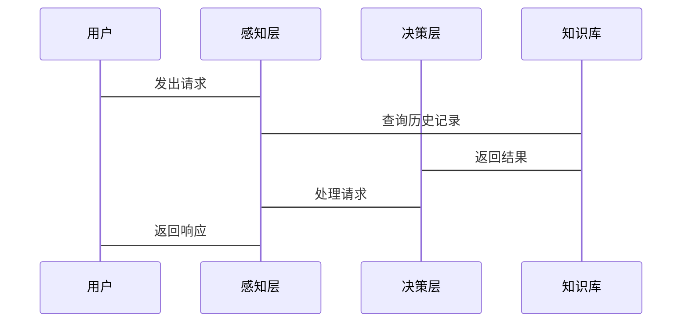

                 


```markdown
# AI Agent的知识遗忘：管理长期记忆

> 关键词：AI Agent，知识遗忘，长期记忆，记忆管理，知识表示，记忆保持

> 摘要：本文探讨AI Agent在处理长期记忆时面临的知识遗忘问题，分析其原因和机制，并提出解决方案。文章涵盖背景介绍、核心概念、算法原理、系统架构、项目实战和最佳实践，帮助读者全面理解并有效管理AI Agent的长期记忆。

---

## 第一部分: AI Agent的知识遗忘概述

### 第1章: 背景介绍

#### 1.1 AI Agent的基本概念
- AI Agent的定义：智能体（AI Agent）是能够感知环境并采取行动以实现目标的实体。
- AI Agent的类型：基于规则、基于神经网络、基于知识表示等。
- AI Agent的应用场景：自动驾驶、智能助手、机器人等。

#### 1.2 知识遗忘的定义
- 知识遗忘：AI Agent在任务处理过程中，由于算法或机制的原因，遗忘先前学习的知识。
- 例子：智能助手忘记用户之前的偏好设置。

#### 1.3 知识遗忘的普遍性
- 在各种AI应用中普遍存在，如自动驾驶路径遗忘、智能客服忘记对话历史等。

---

## 第二部分: 核心概念与联系

### 第2章: 核心概念与联系

#### 2.1 知识遗忘的机制
- 神经网络中的遗忘机制：权重更新、神经元活性变化导致知识遗忘。
- 例子：训练过程中模型参数更新导致旧知识的丢失。

#### 2.2 概念对比
| 概念         | 属性特征                       |
|--------------|-------------------------------|
| 记忆保持      | 数据保留、防止遗忘             |
| 知识检索      | 从记忆中提取信息               |
| 遗忘机制      | 权重变化、时间依赖             |
| 知识更新      | 新信息的整合与旧信息的遗忘     |

#### 2.3 ER实体关系图
```mermaid
erd
    title ER Entity Relationship Diagram for Knowledge Forgetting
    Agent(AgentID, Name, Function)
    KnowledgeBase(KnowledgeID, Content, Timestamp)
    ForgettingMechanism(MechanismID, Type, Parameters)
    Agent has a ForgettingMechanism
    KnowledgeBase has many Agent
```

---

## 第三部分: 算法原理讲解

### 第3章: 算法原理讲解

#### 3.1 遗忘机制的数学模型
- 时间依赖的遗忘因子：$f(t) = e^{-t/\tau}$
- 应用：在神经网络中，遗忘因子用于控制权重更新的速度。

#### 3.2 LSTM网络结构
```mermaid
graph LR
    I -> ForgetGate
    ForgetGate -> F
    I -> InputGate
    InputGate -> I'
    F & I' -> OutputGate
    OutputGate -> O
```
- 公式：
  - 遗忘门：$F = \sigma(W_f \cdot [h_{t-1}, x_t])$
  - 输入门：$I' = \tanh(W_i \cdot [h_{t-1}, x_t])$
  - 输出门：$O = \tanh(W_o \cdot [h_{t-1}, x_t])$
  - 新状态：$h_t = F \cdot h_{t-1} + I' \cdot O$

#### 3.3 Transformer的注意力机制
- 注意力机制：$QK^T$用于计算信息的相关性，$softmax(QK^T/V)$用于选择性关注相关信息。

---

## 第四部分: 系统分析与架构设计

### 第4章: 系统分析与架构设计

#### 4.1 系统架构设计


#### 4.2 接口设计
- 感知层与记忆层接口：数据传递。
- 决策层与记忆层接口：知识检索与更新。

#### 4.3 交互流程


---

## 第五部分: 项目实战

### 第5章: 项目实战

#### 5.1 环境安装
- Python 3.8+
- TensorFlow、Keras、Scikit-learn

#### 5.2 核心代码实现
```python
import tensorflow as tf
from tensorflow.keras import layers

model = tf.keras.Sequential([
    layers.LSTM(64, return_sequences=True),
    layers.Dense(1, activation='sigmoid')
])

model.compile(loss='binary_crossentropy', optimizer='adam')
```

#### 5.3 案例分析
- 案例：智能助手忘记用户的偏好设置。
- 分析：数据多样性不足，模型训练时间过短，遗忘机制设计不合理。

---

## 第六部分: 最佳实践

### 第6章: 最佳实践

#### 6.1 经验总结
- 定期备份知识库。
- 监控遗忘率，及时调整模型参数。
- 保持数据多样性，避免模型过拟合。

#### 6.2 注意事项
- 遗忘机制的设计要结合具体应用场景。
- 注意模型的可解释性和可维护性。
- 定期对模型进行验证和更新。

#### 6.3 拓展阅读
- 《Effective Memory Management in AI Systems》
- 《Neural Networks and Deep Learning》

---

## 作者简介

作者：AI天才研究院/AI Genius Institute & 禅与计算机程序设计艺术 /Zen And The Art of Computer Programming
```

