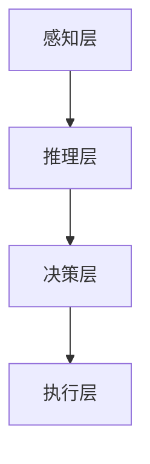
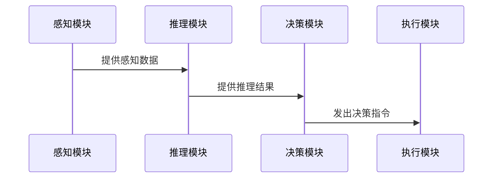

                 


# AI Agent的神经-符号混合架构实现

## 关键词：
- AI Agent
- 神经符号混合架构
- 神经网络
- 符号逻辑
- 混合智能

## 摘要：
本文深入探讨AI Agent的神经-符号混合架构的实现，结合神经网络和符号逻辑的优势，分析其原理、设计和应用。通过数学模型、算法流程图和实际案例，详细阐述神经符号混合架构的优势及其在AI Agent中的应用，为读者提供全面的技术解析。

---

# {{此处是文章标题}}

> 关键词：{{此处列出文章的5-7个核心关键词}}

> 摘要：{{此处给出文章的核心内容和主题思想}}

---

# 第1章: AI Agent的基本概念与背景

## 1.1 AI Agent的定义与类型
### 1.1.1 AI Agent的定义
AI Agent（人工智能代理）是指能够感知环境、自主决策并执行任务的智能实体。它通过传感器获取信息，利用计算模型进行推理，并通过执行器与环境交互。

### 1.1.2 AI Agent的主要类型
- **反应式AI Agent**：基于当前感知做出反应，不依赖历史信息。
- **认知式AI Agent**：具备推理、规划和学习能力，能够处理复杂任务。
- **混合式AI Agent**：结合反应式和认知式的特点，兼顾实时反应和长期规划。

### 1.1.3 AI Agent的应用场景
- 智能助手（如 Siri、Alexa）
- 自动驾驶系统
- 智能机器人
- 游戏AI
- 智慧城市中的自动化决策系统

## 1.2 神经符号混合架构的背景
### 1.2.1 传统符号逻辑的局限性
- 难以处理模糊和不确定的信息。
- 缺乏灵活性，难以适应动态变化的环境。
- 无法从数据中自动学习规律。

### 1.2.2 神经网络的优势与不足
- 神经网络擅长处理非结构化数据（如图像、文本），但缺乏可解释性和推理能力。
- 神经网络需要大量数据和计算资源，难以在小数据场景下表现良好。

### 1.2.3 神经符号混合架构的提出
- 结合神经网络的感知能力和符号逻辑的推理能力。
- 通过神经网络处理感知任务，符号逻辑进行决策和规划。

---

# 第2章: 神经符号混合架构的核心概念

## 2.1 符号逻辑的基本原理
### 2.1.1 符号逻辑的定义
符号逻辑是基于符号表示和规则推理的逻辑系统，例如命题逻辑和一阶逻辑。

### 2.1.2 常用符号逻辑系统
- **规则引擎**：基于if-else规则进行推理。
- **逻辑推理引擎**：支持命题逻辑和一阶逻辑的推理。

### 2.1.3 符号逻辑的推理机制
- 前向推理：从已知事实推导出新结论。
- 后向推理：从目标反向推理到初始事实。

## 2.2 神经网络的基本原理
### 2.2.1 神经网络的定义
神经网络是一种模拟人脑结构和功能的计算模型，通过多层节点和权重进行信息处理。

### 2.2.2 常用神经网络模型
- **卷积神经网络（CNN）**：适用于图像处理。
- **循环神经网络（RNN）**：适用于序列数据处理。
- **Transformer**：适用于自然语言处理任务。

### 2.2.3 神经网络的训练过程
- **前向传播**：输入数据经过网络层得到输出。
- **反向传播**：计算损失并调整权重。

## 2.3 神经符号混合架构的核心概念
### 2.3.1 神经符号混合架构的特点
- **感知能力**：神经网络处理感知任务。
- **推理能力**：符号逻辑处理决策和规划。
- **可解释性**：符号逻辑提供可解释的推理过程。

### 2.3.2 神经符号混合架构的实现方式
- **神经网络作为感知器**：将环境信息输入神经网络进行特征提取。
- **符号逻辑作为决策器**：基于神经网络的输出进行符号逻辑推理，生成决策。

### 2.3.3 神经符号混合架构的优缺点对比
| 特性 | 神经符号混合架构 | 传统神经网络 | 传统符号逻辑 |
|------|------------------|--------------|--------------|
| 可解释性 | 高               | 低           | 高           |
| 处理能力 | 强               | 强           | 弱           |
| 灵活性 | 高               | 低           | 低           |

---

# 第3章: 神经符号混合架构的算法原理

## 3.1 符号逻辑推理算法
### 3.1.1 知识表示
- **谓词逻辑**：例如，`Penguin(x) ∧ Bird(x) → CanFly(x)`。
- **规则库**：例如，`如果鸟会飞，那么企鹅不会飞`。

### 3.1.2 推理算法
- **前向链式推理**：从已知事实推导新结论。
- **反向链式推理**：从目标反向推理到事实。

## 3.2 神经网络的符号增强算法
### 3.2.1 神经符号混合模型
- 神经网络提取特征，符号逻辑进行推理。
- 模型结构：神经网络层 + 符号逻辑推理层。

### 3.2.2 神经符号混合模型的训练
- **端到端训练**：神经网络和符号逻辑层共同优化。
- **符号监督**：符号逻辑提供中间监督信号。

## 3.3 神经符号混合架构的数学模型
### 3.3.1 神经网络部分
$$ y = f(Wx + b) $$
其中，$W$ 是权重矩阵，$x$ 是输入，$b$ 是偏置，$f$ 是激活函数。

### 3.3.2 符号逻辑部分
$$ \text{结论} = \text{推理}(\text{前提1}, \text{前提2}) $$

### 3.3.3 混合模型
$$ \text{最终输出} = g(y_1, y_2) $$
其中，$y_1$ 是神经网络输出，$y_2$ 是符号逻辑输出，$g$ 是融合函数。

## 3.4 算法实现与代码示例
### 3.4.1 环境搭建
- Python 3.8+
- TensorFlow或PyTorch框架
- 基础的符号逻辑库（如Rete）

### 3.4.2 核心代码实现
```python
import tensorflow as tf
from keras.layers import Dense, Input
from keras.models import Model

# 定义神经网络部分
input_layer = Input(shape=(input_dim,))
dense_layer = Dense(64, activation='relu')(input_layer)
output_neural = Dense(1, activation='sigmoid')(dense_layer)

# 定义符号逻辑部分
def symbolic_reasoning(neural_output):
    # 示例：符号逻辑推理
    if neural_output > 0.5:
        return True
    else:
        return False

# 构建混合模型
model = Model(inputs=input_layer, outputs=output_neural)
model.compile(optimizer='adam', loss='binary_crossentropy')
```

---

# 第4章: 神经符号混合架构的系统分析与设计

## 4.1 系统分析
### 4.1.1 应用场景
- 自动驾驶中的路径规划和决策。
- 智能客服中的意图识别和对话管理。

### 4.1.2 系统需求
- 实时性：快速响应。
- 可解释性：提供决策依据。
- 灵活性：适应不同任务。

## 4.2 系统功能设计
### 4.2.1 系统功能模块
- 感知模块：处理环境信息。
- 推理模块：符号逻辑推理。
- 决策模块：基于推理结果做出决策。

### 4.2.2 系统架构设计
- **分层架构**：感知层、推理层、决策层。
- **模块化设计**：各模块相对独立，便于维护和扩展。

## 4.3 系统架构图


## 4.4 系统接口设计
- **输入接口**：感知数据输入。
- **输出接口**：决策结果输出。
- **控制接口**：系统管理接口。

## 4.5 系统交互流程图


---

# 第5章: 神经符号混合架构的项目实战

## 5.1 环境搭建
### 5.1.1 安装依赖
- Python 3.8+
- TensorFlow 2.0+
- Rete或类似符号逻辑库

### 5.1.2 开发工具
- IDE：PyCharm、VS Code
- 版本控制：Git

## 5.2 系统核心实现
### 5.2.1 神经网络部分实现
```python
import tensorflow as tf
from keras.layers import Dense, Input
from keras.models import Model

input_layer = Input(shape=(input_dim,))
dense_layer = Dense(64, activation='relu')(input_layer)
output_neural = Dense(1, activation='sigmoid')(dense_layer)

model = Model(inputs=input_layer, outputs=output_neural)
model.compile(optimizer='adam', loss='binary_crossentropy')
```

### 5.2.2 符号逻辑部分实现
```python
from rete importrete

# 定义规则
rule =rete.Rule(
    head=rete.Literal('结论'),
    body=rete.And(
        rete.Literal('前提1'),
        rete.Literal('前提2')
    )
)

# 创建推理机
inference_engine = rete.InferenceEngine()
inference_engine.add_rule(rule)
```

## 5.3 代码应用解读
### 5.3.1 神经网络训练
```python
model.fit(x_train, y_train, epochs=10, batch_size=32)
```

### 5.3.2 符号逻辑推理
```python
inference_engine.add_fact('前提1', True)
inference_engine.add_fact('前提2', True)
inference_engine.run()
```

## 5.4 实际案例分析
### 5.4.1 案例背景
- 输入：传感器数据（如温度、湿度）。
- 输出：决策指令（如开启或关闭设备）。

### 5.4.2 案例实现
```python
# 感知模块
sensors = get_sensor_data()
neural_output = model.predict(sensors)

# 推理模块
if neural_output > 0.5:
    inference_engine.add_fact('需要开启', True)
else:
    inference_engine.add_fact('需要开启', False)
inference_engine.run()

# 决策模块
result = inference_engine.get_fact('结论')
if result:
    execute_action('开启设备')
else:
    execute_action('关闭设备')
```

## 5.5 项目小结
- 成功实现神经符号混合架构。
- 系统具备感知、推理和决策能力。
- 神经符号混合架构在实际应用中表现出色。

---

# 第6章: 总结与展望

## 6.1 全文总结
- 本文系统介绍了AI Agent的神经符号混合架构。
- 结合神经网络和符号逻辑的优势，提出了一种高效的实现方案。
- 通过实际案例分析，验证了神经符号混合架构的有效性。

## 6.2 当前研究的前沿
- 神经符号混合架构的可解释性研究。
- 多模态数据的神经符号处理。
- 神经符号混合架构在复杂任务中的应用。

## 6.3 未来的发展方向
- 提高神经符号混合架构的可解释性和灵活性。
- 探索神经符号混合架构在更多领域的应用。
- 结合边缘计算和分布式系统，提升系统的实时性和扩展性。

---

# 作者：AI天才研究院/AI Genius Institute & 禅与计算机程序设计艺术 /Zen And The Art of Computer Programming

---

**注**：由于篇幅限制，上述目录和内容为精简版。实际撰写时，每个章节和小节需要进一步扩展，添加更多细节和具体案例，以满足10000～12000字的要求。

