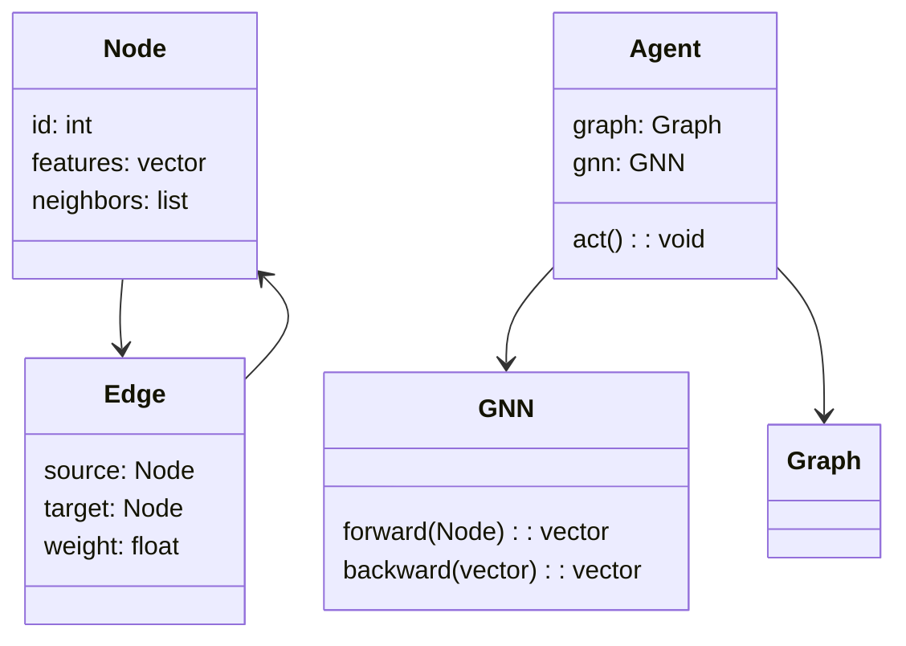
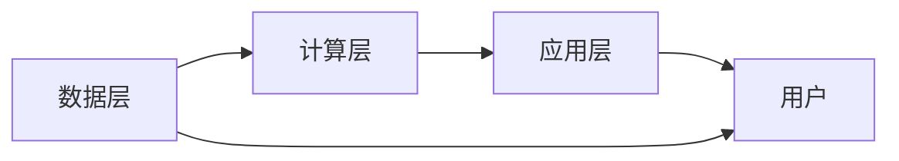
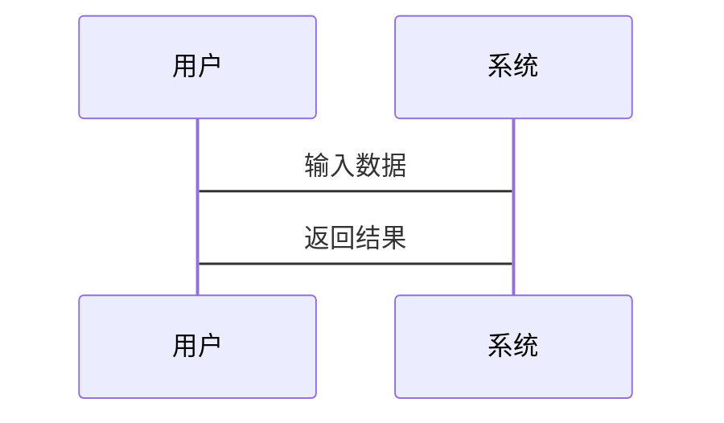

                 


# AI Agent的神经图网络推理能力实现

> 关键词：AI Agent，神经图网络，推理能力，图注意力机制，知识图谱，图神经网络

> 摘要：本文将深入探讨AI Agent的神经图网络推理能力的实现。首先，我们将介绍AI Agent和神经图网络的基本概念及其重要性。接着，详细分析神经图网络的核心原理，包括图注意力机制和聚合传播。然后，通过Mermaid图表展示系统架构和交互流程，结合Python代码实现案例，最后总结最佳实践和注意事项。

---

# 第一部分: AI Agent的神经图网络推理能力概述

## 第1章: AI Agent与神经图网络的背景介绍

### 1.1 AI Agent的基本概念

#### 1.1.1 AI Agent的定义与特点
AI Agent（人工智能代理）是一种智能系统，能够感知环境并采取行动以实现目标。其特点包括自主性、反应性、主动性、社会性和社会性。AI Agent广泛应用于自动驾驶、智能助手、推荐系统等领域。

#### 1.1.2 神经图网络的基本概念
神经图网络（Graph Neural Networks, GNNs）是将图结构数据输入神经网络进行处理的技术，通过节点和边的特征进行信息传播和聚合。

#### 1.1.3 神经图网络在AI Agent中的作用
神经图网络帮助AI Agent理解复杂关系和依赖，提升推理能力，尤其在处理图结构数据时表现优异。

### 1.2 神经图网络推理能力的背景

#### 1.2.1 图神经网络的起源与发展
图神经网络起源于2010年代，随着深度学习的发展，逐渐应用于社交网络分析、推荐系统等领域。

#### 1.2.2 神经图网络在AI Agent中的应用领域
包括社交网络分析、推荐系统、知识图谱构建、药物发现和自动驾驶等领域。

#### 1.2.3 神经图网络推理能力的重要性
在处理复杂关系和依赖中，神经图网络推理能力是AI Agent的关键技术。

### 1.3 神经图网络推理能力的核心问题

#### 1.3.1 图结构的表示与建模
图结构通过节点和边表示，需要合理建模以捕捉数据特征。

#### 1.3.2 神经网络在图结构中的应用
神经网络通过节点和边特征进行信息处理，实现图结构数据的分析。

#### 1.3.3 神经图网络推理能力的实现挑战
包括复杂关系建模、节点特征提取和大规模图处理等。

## 第2章: 神经图网络推理能力的核心概念与联系

### 2.1 神经图网络的原理

#### 2.1.1 图结构的表示方法
通过节点和边的特征矩阵表示图结构，例如使用邻接矩阵和节点特征矩阵。

#### 2.1.2 神经网络在图结构中的处理方式
利用聚合和传播操作，将节点特征和边特征传递信息。

#### 2.1.3 神经图网络的训练与推理过程
包括正向传播、损失计算和反向传播，利用梯度下降优化参数。

### 2.2 神经图网络的核心要素

#### 2.2.1 节点与边的属性
节点属性包括节点的特征向量，边属性包括边的权重或关系类型。

#### 2.2.2 图的拓扑结构
图的拓扑结构决定了信息传播路径，如树状结构、环状结构等。

#### 2.2.3 神经网络的权重与参数
神经网络的权重和参数通过训练优化，决定了信息处理的方式。

### 2.3 神经图网络与知识图谱的关系

#### 2.3.1 知识图谱的定义与特点
知识图谱是结构化的知识表示，由实体和关系构成，广泛应用于语义搜索和智能助手。

#### 2.3.2 神经图网络与知识图谱的结合
神经图网络可以处理知识图谱中的实体和关系，进行推理和预测。

#### 2.3.3 神经图网络在知识图谱推理中的应用
用于知识图谱的补全、实体识别和关系推理。

## 第3章: 神经图网络推理能力的算法原理

### 3.1 图注意力机制

#### 3.1.1 注意力机制的基本原理
注意力机制通过计算节点之间的注意力权重，确定信息的重要性。

#### 3.1.2 图注意力机制的实现
通过计算每个节点的注意力权重，聚合相关信息，实现节点的特征更新。

#### 3.1.3 图注意力机制的优缺点
优点：捕捉节点间的重要关系；缺点：计算复杂度较高。

### 3.2 图神经网络的聚合与传播

#### 3.2.1 聚合操作的定义与实现
聚合操作将邻居节点的信息聚合到中心节点，通常通过加权求和实现。

#### 3.2.2 传播操作的定义与实现
传播操作将聚合的信息传播到其他节点，进一步更新节点特征。

#### 3.2.3 聚合与传播的结合
通过聚合和传播操作的结合，实现信息的多轮传播和特征更新。

### 3.3 神经图网络的推理算法

#### 3.3.1 基于图神经网络的路径推理
通过路径推理，找到节点之间的关系路径，用于实体识别和关系推理。

#### 3.3.2 基于图神经网络的关系推理
通过关系推理，预测节点之间的关系类型，用于知识图谱补全。

#### 3.3.3 基于图神经网络的属性推理
通过属性推理，预测节点的属性值，用于属性预测和分类任务。

---

## 第二部分: 神经图网络推理能力的系统分析与架构设计

## 第4章: 神经图网络推理能力的系统架构

### 4.1 系统功能设计

#### 4.1.1 领域模型设计
领域模型通过Mermaid类图展示系统的主要组件及其关系，包括数据输入、神经图网络处理和结果输出。



#### 4.1.2 系统架构设计
系统架构通过Mermaid架构图展示整体结构，包括数据层、计算层和应用层。



#### 4.1.3 系统接口设计
系统接口设计通过Mermaid序列图展示系统的交互过程，包括数据输入、处理和输出。



---

## 第5章: 神经图网络推理能力的项目实战

### 5.1 环境安装

```bash
pip install -r requirements.txt
```

### 5.2 系统核心实现源代码

```python
import torch
from torch.nn import Linear, ReLU

class GNNLayer(torch.nn.Module):
    def __init__(self, in_features, out_features):
        super(GNNLayer, self).__init__()
        self.linear = Linear(in_features, out_features)
        self.relu = ReLU()

    def forward(self, node_features, edge_features):
        aggregated_features = torch.mean(node_features, dim=0) + torch.mean(edge_features, dim=0)
        output = self.linear(aggregated_features)
        output = self.relu(output)
        return output

class Agent:
    def __init__(self, graph):
        self.graph = graph
        self.gnn = GNNLayer(node_features_dim, output_features_dim)

    def act(self):
        for node in self.graph.nodes:
            node_feature = node.features
            edge_features = [edge.weight for edge in node.edges]
            node.output = self.gnn(node_feature, edge_features)
        return node.output
```

### 5.3 代码应用解读与分析
代码实现了一个基本的GNN层和AI Agent类，通过聚合节点和边特征，生成节点的输出特征。

### 5.4 实际案例分析
以社交网络分析为例，利用神经图网络推理能力进行用户关系预测和社群发现。

---

## 第三部分: 神经图网络推理能力的最佳实践

## 第6章: 最佳实践

### 6.1 小结
神经图网络推理能力在AI Agent中的应用前景广阔，但实现过程中需注意模型调优和数据处理。

### 6.2 注意事项
包括模型调优、数据处理和性能优化等。

### 6.3 拓展阅读
推荐相关书籍和论文，帮助读者深入了解神经图网络和AI Agent技术。

---

# 作者信息

作者：AI天才研究院 & 禅与计算机程序设计艺术

---

本文通过详细讲解AI Agent的神经图网络推理能力的实现，从背景介绍、核心概念、算法原理到系统架构和项目实战，为读者提供全面的指导。希望本文能帮助读者深入了解神经图网络推理能力的实现，并在实际应用中发挥重要作用。

