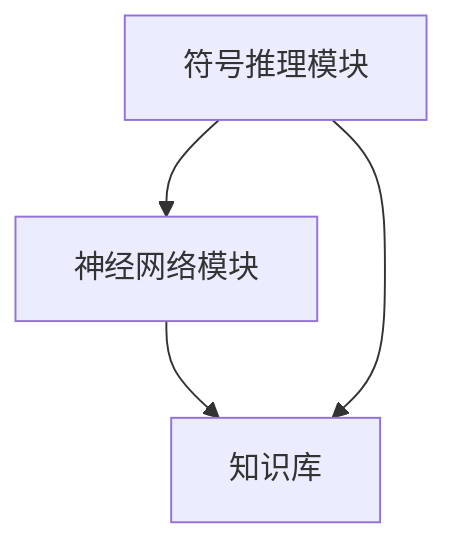
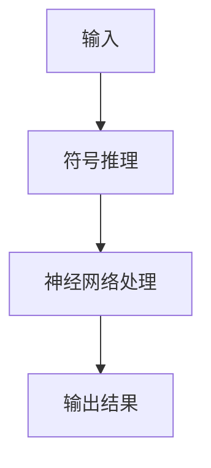
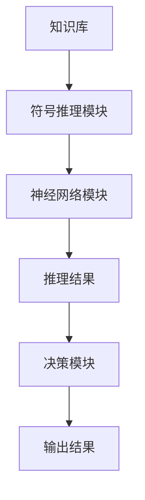

                 


# AI Agent的神经符号推理系统设计

> 关键词：AI Agent, 神经符号推理, 知识表示, 系统设计, 推理算法, 神经网络, 符号推理

> 摘要：本文深入探讨了AI Agent的神经符号推理系统设计，从基础概念到算法实现，再到系统架构，全面解析了神经符号推理的核心原理与应用场景。通过详细的技术分析和实践案例，本文为读者提供了一套完整的神经符号推理系统设计方案。

---

# 第一部分: 神经符号推理的基础概念

## 第1章: AI Agent与神经符号推理概述

### 1.1 AI Agent的基本概念
#### 1.1.1 AI Agent的定义与分类
- 强人工智能(AI Agent)与弱人工智能(AI Agent)的区别
- AI Agent的核心特征：自主性、反应性、目标导向
- AI Agent的分类：简单反射型、基于模型的反应型、目标驱动型、实用驱动型

#### 1.1.2 神经符号推理的定义
- 神经符号推理的定义：结合神经网络和符号推理的混合推理方法
- 神经符号推理的特点：知识表示的符号化与推理的神经化
- 神经符号推理的目标：实现推理的可解释性与可泛化性

#### 1.1.3 神经符号推理的核心目标
- 神经符号推理的三大目标：
  - 知识表示的符号化与知识库的构建
  - 推理过程的神经化与模型的可训练性
  - 符号与神经网络的混合优化

### 1.2 神经符号推理的背景与问题背景
#### 1.2.1 传统符号推理的局限性
- 符号推理的局限性：
  - 知识表示的 rigidity
  - 推理过程的brittle
  - 难以处理非结构化数据

#### 1.2.2 神经网络的局限性
- 神经网络的局限性：
  - 推理过程的不可解释性
  - 鲁棒性差，难以处理边缘情况
  - 知识的表示与推理能力有限

#### 1.2.3 神经符号推理的提出与目标
- 神经符号推理的提出背景：
  - 结合符号推理与神经网络的优势
  - 解决纯符号推理与纯神经网络推理的局限性
  - 提供一种新的混合推理范式

### 1.3 神经符号推理的核心问题
#### 1.3.1 知识表示与推理的结合
- 神经符号推理的知识表示方式：
  - 符号表示：规则、逻辑表达式、语义网络
  - 神经网络表示：向量、张量、神经网络结构
  - 综合表示：符号与向量的混合表示

#### 1.3.2 神经网络与符号推理的协同
- 神经符号推理中的协同机制：
  - 符号推理指导神经网络学习
  - 神经网络驱动符号推理过程
  - 知识表示的双向优化

#### 1.3.3 神经符号推理的边界与外延
- 神经符号推理的边界：
  - 符号推理的适用范围
  - 神经网络的适用场景
  - 混合推理的融合点
- 神经符号推理的外延：
  - 与其他推理方法的对比
  - 神经符号推理的未来发展方向
  - 神经符号推理的实际应用场景

### 1.4 神经符号推理的核心要素
#### 1.4.1 神经网络模块
- 神经网络模块的功能：
  - 数据处理：将符号数据转化为向量表示
  - 推理过程：基于向量的神经网络推理
  - 输出结果：将推理结果转化为符号形式

#### 1.4.2 符号推理模块
- 符号推理模块的功能：
  - 知识表示：符号化知识库的构建
  - 推理规则：符号规则的定义与应用
  - 推理过程：基于符号规则的逻辑推理

#### 1.4.3 知识库与规则库
- 知识库的构建：
  - 符号知识库：基于规则的知识表示
  - 神经网络知识库：基于向量的知识表示
  - 综合知识库：符号与向量的混合表示
- 规则库的设计：
  - 基于符号的推理规则
  - 基于神经网络的推理规则
  - 混合规则的优化

### 1.5 本章小结
- 章节总结：本章从AI Agent与神经符号推理的基本概念出发，分析了神经符号推理的背景与核心目标，明确了神经符号推理的核心问题与要素，为后续的算法与系统设计奠定了基础。

---

## 第2章: 神经符号推理的核心概念与联系

### 2.1 神经符号推理的核心原理
#### 2.1.1 神经符号推理的基本流程
- 神经符号推理的流程：
  1. 符号知识的神经化表示
  2. 基于神经网络的推理过程
  3. 推理结果的符号化输出

#### 2.1.2 神经符号推理的数学模型
- 神经符号推理的数学模型：
  $$f(x) = g(f_{\text{neural}}(x))$$
  其中，$f_{\text{neural}}(x)$ 是神经网络的输出，$g$ 是符号推理的转换函数。

### 2.2 神经符号推理的核心概念对比
#### 2.2.1 符号推理与神经网络的对比分析
| 特性         | 符号推理                  | 神经网络                 |
|--------------|---------------------------|--------------------------|
| 知识表示      | 符号化规则与逻辑          | 向量化表示               |
| 推理方式      | 基于逻辑规则的演绎推理    | 基于神经网络的归纳推理   |
| 可解释性      | 高                      | 低                      |
| 适用场景      | 逻辑推理、知识表示       | 图像识别、自然语言处理   |

#### 2.2.2 神经符号推理与传统符号推理的对比
| 特性         | 传统符号推理             | 神经符号推理             |
|--------------|--------------------------|--------------------------|
| 知识表示      | 符号化规则               | 符号化与向量化的混合     |
| 推理方式      | 基于逻辑规则的演绎推理    | 基于神经网络的推理       |
| 可解释性      | 高                      | 较高（结合符号推理）     |
| 适用场景      | 专家系统                 | 专家系统与深度学习结合   |

#### 2.2.3 神经符号推理与纯神经网络的对比
| 特性         | 纯神经网络               | 神经符号推理             |
|--------------|--------------------------|--------------------------|
| 知识表示      | 向量化表示               | 符号化与向量化的混合     |
| 推理方式      | 基于神经网络的归纳推理    | 基于符号规则的演绎推理   |
| 可解释性      | 低                      | 较高（结合符号推理）     |
| 适用场景      | 图像识别、自然语言处理   | 专家系统与深度学习结合   |

### 2.3 神经符号推理的ER实体关系图


### 2.4 本章小结
- 章节总结：本章通过对神经符号推理的核心概念与相关技术的对比分析，明确了神经符号推理的原理与优势，为后续的算法设计奠定了理论基础。

---

## 第3章: 神经符号推理算法原理

### 3.1 神经符号推理算法概述
#### 3.1.1 神经符号推理的基本流程
1. 符号知识的神经化表示
2. 基于神经网络的推理过程
3. 推理结果的符号化输出

#### 3.1.2 神经符号推理的主要算法
- 神经符号推理的典型算法：
  - Rule-GNN：基于图神经网络的符号推理
  - Neural-symbolic Logic Learners：基于逻辑学习的神经符号推理
  - Hybrid Reasoners：混合推理器

### 3.2 神经符号推理算法的数学模型
#### 3.2.1 神经网络的输入与输出
- 神经网络的输入：符号化的知识表示
- 神经网络的输出：符号推理的中间结果

#### 3.2.2 符号推理的规则表示
- 符号推理规则的表示：基于逻辑的规则表示
- 规则表示的符号化与向量化

#### 3.2.3 综合推理的数学公式
$$y = f(x) + g(x)$$
其中，$f(x)$ 是神经网络的输出，$g(x)$ 是符号推理的结果。

### 3.3 神经符号推理算法的流程图


### 3.4 算法实现的Python代码示例
```python
def neural_symbolic_inference(input, knowledge_base):
    # 符号推理部分
    symbolic_output = apply_rules(input, knowledge_base)
    # 神经网络部分
    neural_output = neural_network(symbolic_output)
    # 综合推理
    final_output = combine(symbolic_output, neural_output)
    return final_output
```

### 3.5 本章小结
- 章节总结：本章详细讲解了神经符号推理算法的原理与实现过程，通过流程图和代码示例，帮助读者理解神经符号推理的核心算法。

---

## 第4章: 系统分析与架构设计

### 4.1 问题场景介绍
#### 4.1.1 系统目标
- 系统目标：构建一个基于神经符号推理的AI Agent系统
- 系统功能：知识表示、推理、决策、学习

#### 4.1.2 问题分析
- 问题分析：传统符号推理的局限性与神经网络的局限性
- 问题解决：神经符号推理的解决方案

### 4.2 系统功能设计
#### 4.2.1 系统功能模块
- 知识库模块：符号化知识库、神经网络知识库
- 推理模块：符号推理、神经网络推理、混合推理
- 决策模块：基于推理结果的决策

#### 4.2.2 系统功能流程
1. 知识表示：符号化知识的构建
2. 推理过程：符号推理与神经网络推理的结合
3. 决策输出：基于推理结果的决策

### 4.3 系统架构设计
#### 4.3.1 系统架构图


#### 4.3.2 接口设计
- 知识库接口：知识的读取与写入
- 推理接口：推理过程的调用
- 决策接口：决策结果的输出

### 4.4 系统交互流程
#### 4.4.1 系统交互序列图
```mermaid
graph TD
    User --> A[知识库]: 查询知识
    A --> B[符号推理模块]: 调用符号推理
    B --> C[神经网络模块]: 调用神经网络推理
    C --> D[推理结果]: 返回推理结果
    D --> E[决策模块]: 调用决策过程
    E --> User: 返回决策结果
```

### 4.5 本章小结
- 章节总结：本章从系统设计的角度，详细分析了神经符号推理系统的架构与交互流程，为系统的实现提供了理论基础。

---

## 第5章: 项目实战

### 5.1 环境安装
#### 5.1.1 环境需求
- Python 3.8+
- PyTorch 1.9+
- Transformers 4.16+

#### 5.1.2 环境配置
```bash
pip install torch transformers
```

### 5.2 系统核心实现源代码
#### 5.2.1 知识库构建
```python
class KnowledgeBase:
    def __init__(self):
        self.symbolic_kb = {}  # 符号化知识库
        self.neural_kb = {}    # 神经网络知识库
```

#### 5.2.2 推理模块实现
```python
class InferenceModule:
    def __init__(self, knowledge_base):
        self.knowledge_base = knowledge_base
    
    def neural_symbolic_inference(self, input):
        symbolic_output = self.symbolic_reasoning(input)
        neural_output = self.neural_reasoning(symbolic_output)
        return self.combine(symbolic_output, neural_output)
    
    def symbolic_reasoning(self, input):
        # 符号推理过程
        pass
    
    def neural_reasoning(self, input):
        # 神经网络推理过程
        pass
    
    def combine(self, symbolic, neural):
        # 综合推理过程
        pass
```

#### 5.2.3 算法实现
```python
def apply_rules(input, knowledge_base):
    # 符号规则的应用
    pass

def neural_network(input):
    # 神经网络的前向传播
    pass
```

### 5.3 代码应用解读与分析
#### 5.3.1 知识库构建的解读
- 符号化知识库的构建：基于规则的知识表示
- 神经网络知识库的构建：基于向量的知识表示

#### 5.3.2 推理模块的解读
- 符号推理模块：基于逻辑规则的推理
- 神经网络模块：基于深度学习的推理
- 综合推理：符号推理与神经网络推理的结合

### 5.4 实际案例分析
#### 5.4.1 案例背景
- 案例目标：基于神经符号推理的问答系统
- 案例数据：文本问答数据集

#### 5.4.2 系统实现
```python
# 知识库构建
kb = KnowledgeBase()
kb.symbolic_kb['question'] = '如何进行神经符号推理？'
kb.neural_kb['answer'] = '通过符号推理与神经网络的结合进行推理。'

# 推理过程
inference = InferenceModule(kb)
result = inference.neural_symbolic_inference('如何进行神经符号推理？')
print(result)
```

#### 5.4.3 系统小结
- 案例总结：通过实际案例，展示了神经符号推理系统的实现过程与应用效果。

### 5.5 本章小结
- 章节总结：本章通过项目实战的方式，详细讲解了神经符号推理系统的实现过程，通过代码示例与案例分析，帮助读者理解神经符号推理的实际应用。

---

## 第6章: 总结与展望

### 6.1 总结
- 本章总结：总结全文内容，回顾神经符号推理系统设计的核心概念与实现过程。

### 6.2 未来展望
- 未来研究方向：
  - 神经符号推理的可解释性优化
  - 神经符号推理的实时性提升
  - 神经符号推理在不同领域的应用拓展

### 6.3 最佳实践Tips
- 知识表示的符号化与向量化结合
- 推理过程的符号化与神经化协同
- 系统设计的模块化与可扩展性

### 6.4 小结
- 本章总结：展望未来研究方向，提出最佳实践建议，为读者提供进一步研究的指导。

---

## 作者：AI天才研究院/AI Genius Institute & 禅与计算机程序设计艺术/Zen And The Art of Computer Programming

---

### 附录
#### 附录A: 神经符号推理相关工具与库
- PyTorch：深度学习框架
- Transformers：自然语言处理库
- SymPy：符号计算库

#### 附录B: 进一步阅读的推荐书籍与论文
- 推荐书籍：《神经符号推理：原理与应用》
- 推荐论文：《Neural-Symbolic Logic Learning: A Survey》

---

通过以上目录结构，我们可以看到，本文从AI Agent与神经符号推理的基础概念出发，逐步深入到算法实现与系统设计，最后通过项目实战与总结展望，为读者提供了一套完整的神经符号推理系统设计方案。希望本文能为读者在神经符号推理领域的研究与实践提供有价值的参考与指导。

