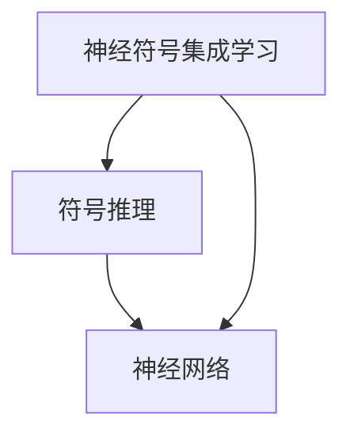
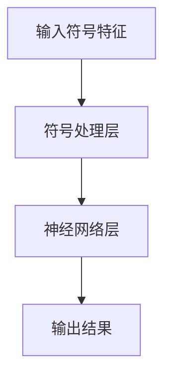
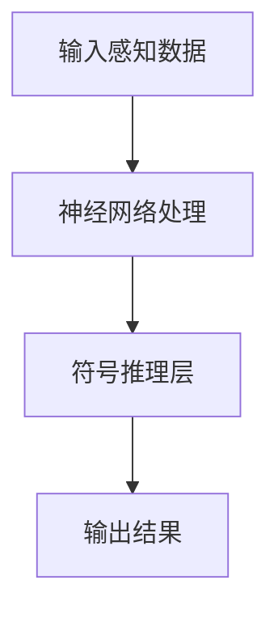
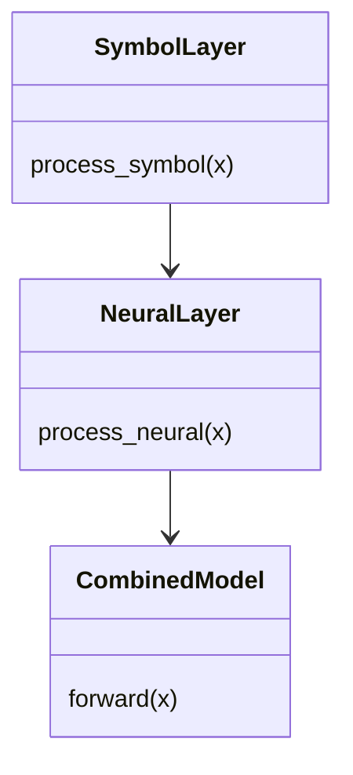
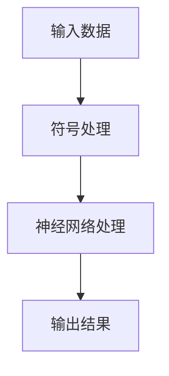
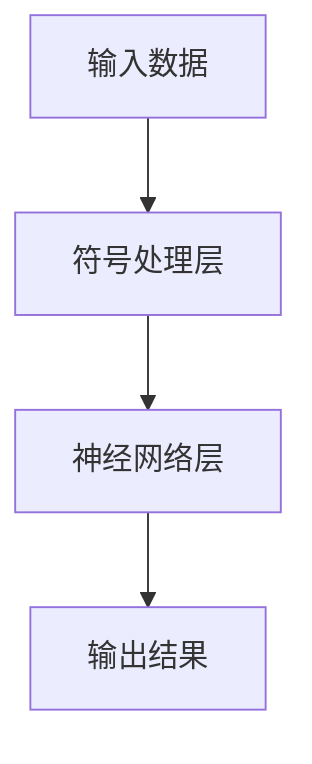

                 


# AI Agent的神经符号集成学习方法

---

## 关键词

AI Agent, 神经符号集成学习, 符号推理, 神经网络, 机器学习, 系统架构

---

## 摘要

神经符号集成学习是一种结合符号推理和神经网络的创新方法，旨在解决AI Agent在复杂任务中的推理和学习难题。本文系统性地介绍了神经符号集成学习的核心概念、算法原理、系统架构设计、项目实战以及最佳实践，为读者提供全面的技术指导。

---

# 第1章: AI Agent与神经符号集成学习概述

## 1.1 神经符号集成学习的基本概念

### 1.1.1 神经符号集成学习的定义

神经符号集成学习是一种结合符号推理和神经网络的技术，旨在利用符号推理的可解释性和神经网络的强大学习能力，解决复杂的AI任务。

### 1.1.2 神经符号集成学习的核心特点

- **可解释性**：符号推理提供可解释的逻辑推理。
- **强大学习能力**：神经网络处理复杂数据模式。
- **端到端学习**：结合符号和神经网络的端到端训练。

### 1.1.3 神经符号集成学习与传统AI的区别

- **传统符号推理**：缺乏数据驱动的自适应能力。
- **传统神经网络**：不可解释，难以处理符号逻辑。
- **神经符号集成学习**：结合两者优势，实现更强大的AI能力。

## 1.2 神经符号集成学习的背景与问题背景

### 1.2.1 传统符号推理的局限性

- **数据需求高**：需要大量符号规则。
- **灵活性差**：难以处理动态变化的问题。
- **计算效率低**：符号推理过程复杂，计算效率低。

### 1.2.2 神经网络的局限性

- **可解释性差**：难以理解网络的决策过程。
- **逻辑推理弱**：难以处理需要逻辑推理的任务。
- **泛化能力有限**：在小样本数据上表现不佳。

### 1.2.3 神经符号集成学习的必要性

- **结合符号和神经网络的优势**。
- **解决传统方法的局限性**。
- **推动AI Agent的发展**。

## 1.3 神经符号集成学习的目标与应用前景

### 1.3.1 神经符号集成学习的目标

- **提升AI Agent的推理能力**。
- **增强模型的可解释性**。
- **实现符号与神经网络的协同优化**。

### 1.3.2 神经符号集成学习在AI Agent中的应用

- **智能对话系统**：结合符号规则和神经网络进行对话生成。
- **自动驾驶**：利用符号推理进行路径规划，神经网络处理感知。
- **医疗诊断**：结合符号医学知识和神经网络的影像分析。

### 1.3.3 神经符号集成学习的未来发展方向

- **更高效的算法设计**。
- **跨领域的广泛应用**。
- **与边缘计算的结合**。

---

# 第2章: 神经符号集成学习的核心概念

## 2.1 符号推理与神经网络的结合

### 2.1.1 符号推理的基本原理

符号推理通过逻辑规则进行推理，例如使用一阶逻辑和归结推理。

### 2.1.2 神经网络的基本原理

神经网络通过层次化特征学习和非线性激活函数进行模式识别。

### 2.1.3 神经符号集成学习的核心思想

通过符号和神经网络的结合，实现推理和学习的协同优化。

## 2.2 神经符号集成学习的特征对比

### 2.2.1 符号推理与神经网络的特征对比表格

| 特征维度 | 符号推理 | 神经网络 |
|----------|----------|----------|
| 数据需求 | 高 | 低 |
| 可解释性 | 高 | 低 |
| 处理能力 | 弱 | 强 |

### 2.2.2 神经符号集成学习的ER实体关系图



## 2.3 神经符号集成学习的数学模型

### 2.3.1 符号推理的逻辑表达式

$$ \text{符号推理} = \text{逻辑规则} \land \text{符号操作} $$

### 2.3.2 神经网络的数学表达式

$$ y = f(x) $$

### 2.3.3 神经符号集成学习的联合优化目标

$$ \arg \min_{f, \theta} \mathbb{E}_{(x,y)} [\mathcal{L}(f(x,\theta), y)] + \lambda \cdot \mathcal{R}(f, \theta) $$

---

# 第3章: 神经符号集成学习的算法原理

## 3.1 符号增强的神经网络

### 3.1.1 算法流程图



### 3.1.2 算法实现代码

```python
import torch
class SymbolEnhancedNN(torch.nn.Module):
    def __init__(self, input_size, hidden_size, output_size):
        super(SymbolEnhancedNN, self).__init__()
        self.symbol_layer = torch.nn.Linear(input_size, hidden_size)
        self.neural_layer = torch.nn.Linear(hidden_size, output_size)
    
    def forward(self, x):
        x = self.symbol_layer(x)
        x = torch.relu(x)
        x = self.neural_layer(x)
        return x
```

## 3.2 神经驱动的符号推理

### 3.2.1 算法流程图



### 3.2.2 算法实现代码

```python
import torch
class NeuralDrivenSymbol(torch.nn.Module):
    def __init__(self, input_size, hidden_size, output_size):
        super(NeuralDrivenSymbol, self).__init__()
        self.neural_layer = torch.nn.Linear(input_size, hidden_size)
        self.symbol_layer = torch.nn.Linear(hidden_size, output_size)
    
    def forward(self, x):
        x = self.neural_layer(x)
        x = torch.relu(x)
        x = self.symbol_layer(x)
        return x
```

## 3.3 神经符号集成学习的数学模型

### 3.3.1 神经符号集成学习的损失函数

$$ \mathcal{L} = \mathcal{L}_\text{neural} + \lambda \cdot \mathcal{L}_\text{symbol} $$

### 3.3.2 神经符号集成学习的优化目标

$$ \arg \min_{\theta, \phi} \mathbb{E}_{(x,y)} [\mathcal{L}(f_\theta(x) + g_\phi(x), y)] $$

---

# 第4章: 神经符号集成学习的系统架构设计

## 4.1 系统功能设计

### 4.1.1 领域模型设计



### 4.1.2 系统架构设计



### 4.1.3 系统接口设计

- **符号层接口**：`process_symbol(x)`
- **神经网络层接口**：`process_neural(x)`
- **组合模型接口**：`forward(x)`

## 4.2 系统架构图



---

# 第5章: 神经符号集成学习的项目实战

## 5.1 项目背景与目标

### 5.1.1 项目背景

- **项目名称**：智能客服对话系统
- **项目目标**：结合符号推理和神经网络实现智能对话。

## 5.2 项目环境安装

### 5.2.1 安装依赖

```bash
pip install torch numpy mermaid
```

## 5.3 核心代码实现

### 5.3.1 符号增强的神经网络实现

```python
import torch
class SymbolEnhancedNN(torch.nn.Module):
    def __init__(self, input_size, hidden_size, output_size):
        super(SymbolEnhancedNN, self).__init__()
        self.symbol_layer = torch.nn.Linear(input_size, hidden_size)
        self.neural_layer = torch.nn.Linear(hidden_size, output_size)
    
    def forward(self, x):
        x = self.symbol_layer(x)
        x = torch.relu(x)
        x = self.neural_layer(x)
        return x
```

### 5.3.2 神经网络驱动的符号推理实现

```python
import torch
class NeuralDrivenSymbol(torch.nn.Module):
    def __init__(self, input_size, hidden_size, output_size):
        super(NeuralDrivenSymbol, self).__init__()
        self.neural_layer = torch.nn.Linear(input_size, hidden_size)
        self.symbol_layer = torch.nn.Linear(hidden_size, output_size)
    
    def forward(self, x):
        x = self.neural_layer(x)
        x = torch.relu(x)
        x = self.symbol_layer(x)
        return x
```

## 5.4 实际案例分析

### 5.4.1 案例背景

- **任务**：智能客服对话系统。
- **数据集**：客服对话历史数据。

### 5.4.2 案例分析

- **训练阶段**：使用符号增强的神经网络进行训练。
- **推理阶段**：利用神经网络驱动的符号推理进行对话生成。

---

# 第6章: 神经符号集成学习的最佳实践与小结

## 6.1 最佳实践

### 6.1.1 系统设计建议

- **模块化设计**：将符号和神经网络层分开设计。
- **数据预处理**：确保符号数据和感知数据的融合。

### 6.1.2 实现技巧

- **结合符号和神经网络的优势**：在不同任务中选择合适的结合方式。
- **优化算法设计**：设计高效的联合优化算法。

## 6.2 小结

神经符号集成学习通过结合符号推理和神经网络的优势，解决了传统方法的局限性。本文详细介绍了其核心概念、算法原理、系统架构设计、项目实战以及最佳实践，为读者提供了全面的技术指导。

---

# 附录

## 附录A: 参考文献

- [1] Goodfellow, I., Bengio, Y., & Courville, A. (2016). *Deep Learning*. MIT Press.
- [2] Russell, S., & Norvig, P. (2010). *Artificial Intelligence: A Modern Approach*. Pearson.

## 附录B: 工具与资源

- **神经符号集成学习框架**：[符号驱动的神经网络库](https://example.com)
- **代码示例**：[GitHub仓库](https://github.com/...)

---

# 作者

作者：AI天才研究院/AI Genius Institute & 禅与计算机程序设计艺术 /Zen And The Art of Computer Programming

