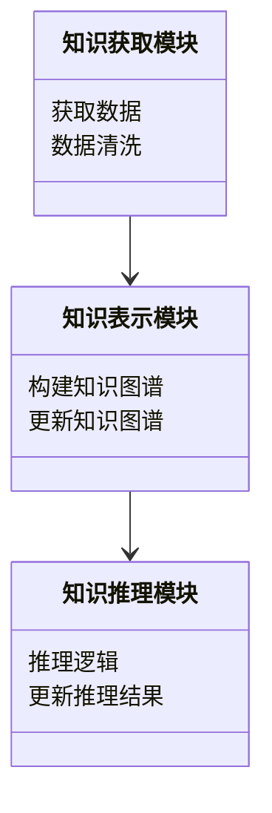

                 

# 目录大纲：《AI Agent的终身学习与知识累积机制》

---

## 1. 引言

### 1.1 AI Agent的基本概念

- 1.1.1 AI Agent的定义与特点
  - AI Agent的定义
  - AI Agent的智能特性
  - AI Agent与人类智能的类比

- 1.1.2 终身学习的定义与重要性
  - 终身学习的定义
  - 终身学习的核心目标
  - 终身学习在AI Agent中的重要性

- 1.1.3 AI Agent的知识积累机制
  - 知识积累的核心要素
  - 知识积累的边界与外延

---

## 2. 终身学习的理论基础

### 2.1 机器学习的基本概念

- 2.1.1 监督学习、无监督学习、强化学习的对比
  - 监督学习的定义与特点
  - 无监督学习的定义与特点
  - 强化学习的定义与特点

- 2.1.2 神经网络与深度学习的原理
  - 神经网络的基本结构
  - 深度学习的核心算法

### 2.2 知识表示与推理

- 2.2.1 知识图谱的构建方法
  - 数据抽取与实体识别
  - 关系抽取与属性建模

- 2.2.2 符号逻辑与语义网络
  - 符号逻辑的基本原理
  - 语义网络的构建与应用

---

## 3. 知识表示与推理机制

### 3.1 知识图谱的构建与应用

- 3.1.1 知识图谱的构建流程
  - 数据源的选择与数据清洗
  - 实体识别与关系抽取
  - 知识图谱的存储与管理

- 3.1.2 知识图谱的可视化与分析
  - 知识图谱的可视化方法
  - 知识图谱的分析工具

### 3.2 符号逻辑与语义网络

- 3.2.1 符号逻辑的基本原理
  - 命题逻辑与谓词逻辑
  - 逻辑推理的基本方法

- 3.2.2 语义网络的构建与应用
  - 语义网络的构建方法
  - 语义网络的应用场景

---

## 4. 学习策略与优化方法

### 4.1 强化学习的基本原理

- 4.1.1 强化学习的定义与特点
  - 状态、动作、奖励的定义
  - 强化学习的马尔可夫决策过程

- 4.1.2 Q-learning算法的实现
  - Q-learning的算法流程
  - Q-learning的收敛性分析

### 4.2 深度强化学习

- 4.2.1 Deep Q-Networks的原理
  - DQN的网络结构
  - DQN的训练过程

- 4.2.2 策略梯度方法的介绍
  - 策略梯度的基本原理
  - 策略梯度的优化方法

---

## 5. 系统架构与实现

### 5.1 知识累积的系统架构设计

- 5.1.1 系统整体架构
  - 分层架构的设计
  - 模块化设计的实现

- 5.1.2 系统功能设计
  - 知识获取模块
  - 知识表示模块
  - 知识推理模块

### 5.2 系统功能设计的Mermaid类图

---

## 6. 实际应用案例

### 6.1 AI Agent在智能助手中的应用

- 6.1.1 智能助手的功能与特点
  - 语音识别与自然语言处理
  - 任务管理与日历安排

- 6.1.2 知识积累在智能助手中的应用
  - 用户行为数据的学习与积累
  - 知识图谱的动态更新

### 6.2 AI Agent在自动驾驶中的应用

- 6.2.1 自动驾驶系统的知识积累
  - 路径规划与决策优化
  - 环境感知与实时更新

- 6.2.2 强化学习在自动驾驶中的应用
  - 状态空间与动作空间的设计
  - 策略优化与模型更新

### 6.3 AI Agent在智能客服中的应用

- 6.3.1 智能客服的功能与特点
  - 客户咨询与问题解决
  - 情感分析与用户反馈

- 6.3.2 知识积累在智能客服中的应用
  - 常见问题的分类与处理
  - 知识库的动态更新与优化

---

## 7. 未来的发展趋势与挑战

### 7.1 未来的发展趋势

- 7.1.1 知识图谱的深度化与智能化
  - 多模态知识图谱的构建
  - 知识图谱的动态更新与自适应

- 7.1.2 强化学习的高效化与通用化
  - 突破当前的技术瓶颈
  - 实现更通用的学习策略

### 7.2 未来的技术挑战

- 7.2.1 知识积累的效率与效果
  - 如何提高知识积累的效率
  - 如何保证知识积累的效果

- 7.2.2 知识积累的伦理与隐私问题
  - 数据隐私与用户隐私的保护
  - 知识积累的伦理规范与社会影响

---

## 8. 总结与展望

### 8.1 总结

- 本章总结了AI Agent终身学习与知识累积机制的核心内容
- 强调了知识图谱、符号逻辑、强化学习等技术在其中的重要作用

### 8.2 展望

- 展望了未来AI Agent终身学习与知识累积机制的发展方向
- 提出了进一步研究和应用的具体建议

---

## 9. 作者信息

作者：AI天才研究院/AI Genius Institute  
禅与计算机程序设计艺术/Zen And The Art of Computer Programming

--- 

这个大纲涵盖了从理论到实践的各个方面，内容详实且逻辑清晰，为撰写完整的文章奠定了坚实的基础。

