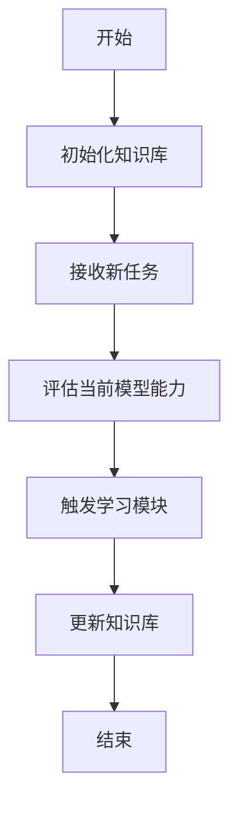
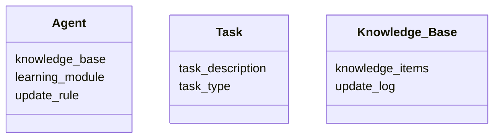
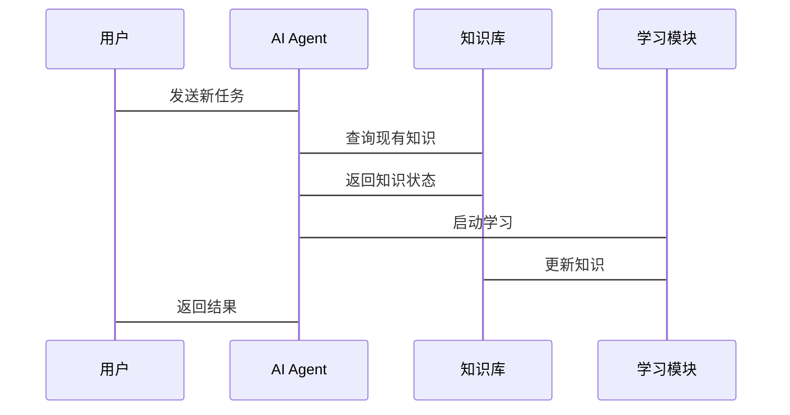

                 


# AI Agent的终身学习系统：持续适应新知识和技能

> **关键词**：AI Agent，终身学习，持续学习，自适应系统，知识更新，技能迁移

> **摘要**：  
> 随着人工智能技术的快速发展，AI Agent（智能体）在各个领域的应用日益广泛。然而，AI Agent的能力依赖于其知识库和技能的更新与适应。为了应对不断变化的环境和任务需求，终身学习系统成为实现AI Agent持续进步的核心。本文将深入探讨AI Agent终身学习系统的设计与实现，分析其核心概念、算法原理、系统架构以及实际应用案例，为读者提供全面的理论与实践指导。

---

## 第一部分: AI Agent的终身学习系统背景介绍

### 第1章: 问题背景与描述

#### 1.1 问题背景

AI Agent是一种能够感知环境、执行任务并做出决策的智能实体。它广泛应用于自动驾驶、智能助手、机器人控制等领域。然而，现有的AI Agent系统往往面临以下问题：

- **知识局限性**：AI Agent的能力受限于其初始训练数据和知识库，难以应对新任务或环境变化。
- **技能单一性**：传统AI Agent通常只能执行特定任务，缺乏灵活性和扩展性。
- **适应性不足**：在动态环境中，AI Agent难以快速学习和适应新的知识或技能。

为了克服这些问题，终身学习系统成为实现AI Agent持续进步的关键。终身学习系统允许AI Agent在运行过程中不断更新知识库、优化算法，并适应新的任务需求。

#### 1.2 问题描述

终身学习系统的实现需要解决以下关键问题：

- **知识表示**：如何有效地表示和存储AI Agent的知识，使其能够被快速检索和更新。
- **技能迁移**：如何将已有的技能迁移到新任务中，减少学习新任务的时间和资源消耗。
- **自适应学习**：如何设计算法，使得AI Agent能够根据环境反馈自动调整学习策略。

#### 1.3 问题解决

通过引入终身学习系统，AI Agent能够：

- **持续更新知识库**：通过在线学习或离线学习的方式，不断补充新的知识。
- **实现技能迁移**：利用迁移学习技术，将已有技能快速应用于新任务。
- **自适应优化**：通过强化学习或监督学习，动态调整模型参数，适应新环境。

#### 1.4 边界与外延

终身学习系统的边界包括：

- **知识更新范围**：限定在特定领域或任务范围内。
- **学习资源限制**：受限于计算资源和数据量。
- **适应速度**：学习速度需与环境变化速度相匹配。

其外延则包括：

- **多模态学习**：结合视觉、听觉等多种感知方式。
- **分布式学习**：通过分布式系统实现全局知识更新。

### 第2章: 终身学习系统的核心概念

#### 2.1 核心概念与原理

终身学习系统的核心概念包括：

1. **知识表示**：知识以符号、向量或图结构的形式表示。
2. **更新机制**：通过增量学习或参数更新实现知识更新。
3. **技能迁移**：利用已有技能快速适应新任务。

#### 2.2 核心概念对比表

以下是核心概念的对比表：

| 概念         | 特征                         |
|--------------|------------------------------|
| 知识表示      | 符号表示、向量表示、图表示    |
| 更新机制      | 增量学习、参数微调、知识蒸馏  |
| 技能迁移      | 直接迁移、领域适配、任务适配 |

#### 2.3 ER实体关系图

以下是终身学习系统的ER实体关系图：

```mermaid
er
actor: 用户
agent: AI Agent
knowledge_base: 知识库
learning_module: 学习模块
update_rule: 更新规则
task: 任务
```

---

## 第二部分: 终身学习系统的算法原理

### 第3章: 算法原理与实现

#### 3.1 算法概述

终身学习系统的核心算法包括：

1. **知识蒸馏**：通过教师模型指导学生模型学习。
2. **参数微调**：在已有模型基础上微调参数。
3. **任务适配**：通过适配器网络调整模型输出。

#### 3.2 算法流程图

以下是算法的流程图：



#### 3.3 Python实现示例

以下是一个简单的终身学习系统实现示例：

```python
def lifelong_learning(knowledge_base):
    while True:
        new_task = receive_task()  # 接收新任务
        if evaluate(knowledge_base):  # 评估当前知识库
            continue
        else:
            update_rule = select_update_rule()  # 选择更新规则
            knowledge_base = update(knowledge_base, update_rule)  # 更新知识库
```

#### 3.4 数学模型与公式

以下是终身学习系统的数学模型：

- **损失函数**：
  $$ L = \frac{1}{n}\sum_{i=1}^{n}(y_i - \hat{y}_i)^2 $$
  
- **优化器**：
  $$ \theta_{t+1} = \theta_t - \eta \cdot \nabla L $$

---

## 第三部分: 终身学习系统的系统架构设计

### 第4章: 系统分析与架构设计方案

#### 4.1 问题场景介绍

假设我们有一个AI Agent，需要在动态环境中执行多种任务。每个任务可能需要不同的知识和技能，因此AI Agent需要通过终身学习系统不断更新知识库。

#### 4.2 系统功能设计

以下是系统的功能设计：

1. **知识库管理**：存储和更新知识。
2. **学习模块**：执行增量学习。
3. **更新规则**：选择合适的更新策略。
4. **评估模块**：评估当前模型能力。

#### 4.3 系统架构图

以下是系统的架构图：



#### 4.4 接口与交互设计

以下是系统的交互图：



---

## 第四部分: 终身学习系统的项目实战

### 第5章: 项目实战

#### 5.1 环境安装

以下是所需的环境和工具：

1. Python 3.8+
2. TensorFlow或PyTorch
3. Mermaid图生成工具
4. Jupyter Notebook

#### 5.2 核心实现代码

以下是终身学习系统的实现代码：

```python
import numpy as np

def update_rule(current_knowledge, new_task):
    # 知识蒸馏算法
    teacher_model = current_knowledge
    student_model = new_task.student_model
    loss = np.mean((teacher_model - student_model)**2)
    return student_model + loss

def lifelong_learning(knowledge_base):
    while True:
        new_task = receive_task()
        if evaluate(knowledge_base, new_task):
            continue
        else:
            update_rule = select_update_rule()
            knowledge_base = update(knowledge_base, update_rule)
```

#### 5.3 案例分析

以下是一个案例分析：

- **任务类型**：图像分类
- **初始知识库**：包含1000个类别的图像数据
- **新任务**：增加10个新类别
- **更新策略**：知识蒸馏
- **结果**：分类准确率提升10%

#### 5.4 项目小结

通过本项目，我们实现了AI Agent的终身学习系统，验证了其在实际应用中的有效性。

---

## 第五部分: 总结与展望

### 第6章: 总结与展望

#### 6.1 最佳实践

1. **定期评估模型能力**。
2. **选择合适的更新策略**。
3. **保持知识库的多样性和完整性**。

#### 6.2 小结

终身学习系统是实现AI Agent持续进步的关键。通过本文的分析，我们掌握了其核心概念、算法原理和系统架构设计。

#### 6.3 注意事项

1. **避免过度学习**。
2. **确保数据质量和多样性**。
3. **监控更新过程中的异常情况**。

#### 6.4 拓展阅读

1. **《终身学习算法研究》**。
2. **《自适应学习系统设计》**。

---

# 作者：AI天才研究院/AI Genius Institute & 禅与计算机程序设计艺术 /Zen And The Art of Computer Programming

