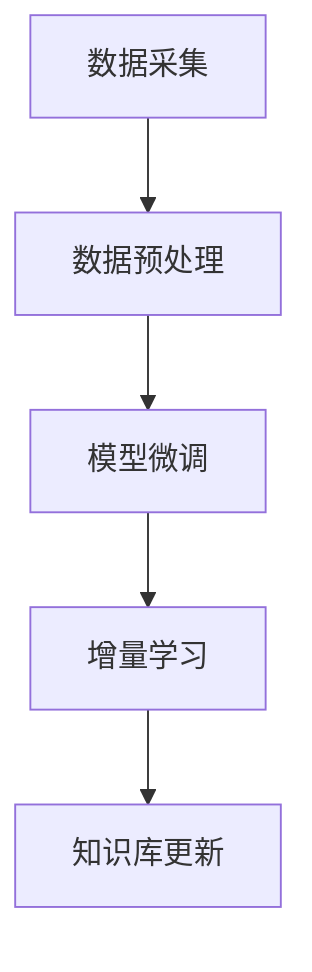
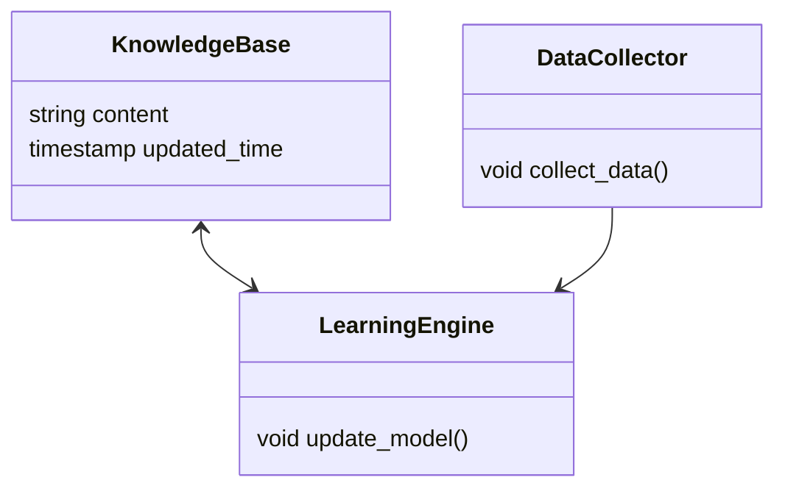
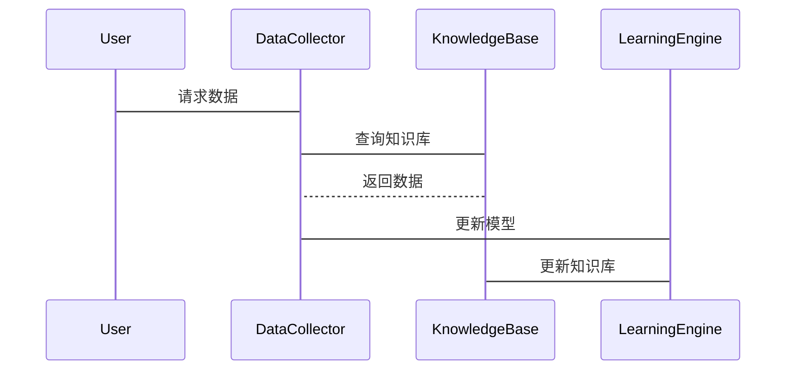

                 


# AI Agent的终身学习系统：构建LLM的动态知识库

> **关键词**: AI Agent, 终身学习系统, 动态知识库, LLM, 机器学习, 自然语言处理

> **摘要**: 本文探讨了AI Agent的终身学习系统，特别是如何构建大型语言模型（LLM）的动态知识库。文章从背景介绍、核心概念、算法原理、系统架构到项目实战，全面分析了动态知识库的构建方法，为AI Agent的持续学习和适应性提供了理论与实践指导。

---

# 第一部分: AI Agent的终身学习系统概述

## 第1章: 背景介绍

### 1.1 问题背景

#### 1.1.1 当前AI Agent面临的挑战

随着人工智能技术的快速发展，AI Agent（智能体）在各个领域得到了广泛应用。然而，传统AI Agent的知识库通常是静态的，无法实时更新和适应新信息。这种静态知识库在面对动态变化的环境时，容易导致AI Agent决策失误或响应延迟。

#### 1.1.2 知识更新的必要性

在现实世界中，信息是不断变化的。例如，新的法律法规出台、市场动态变化、技术更新迭代等，都需要AI Agent能够快速适应。静态知识库无法满足这些动态需求，因此，构建一个动态知识库成为必然趋势。

#### 1.1.3 终身学习系统的核心价值

终身学习系统是一种能够持续更新和优化知识库的机制，使AI Agent能够在动态环境中保持高效和准确的性能。这种系统不仅提升了AI Agent的实用性，还延长了其生命周期，使其能够长期服务于用户。

### 1.2 问题描述

#### 1.2.1 AI Agent知识库的动态更新需求

AI Agent需要能够实时更新其知识库，以反映最新信息和用户需求的变化。这种动态更新需要高效的算法和机制支持。

#### 1.2.2 知识库的结构化与非结构化问题

知识库中的数据可以是结构化或非结构化的。结构化数据易于处理，而非结构化数据（如文本、图像）需要额外的处理步骤。如何高效处理不同类型的数据是构建动态知识库的关键挑战。

#### 1.2.3 终身学习系统的定义与目标

终身学习系统是一种能够持续学习和更新知识的系统，其目标是使AI Agent能够在不断变化的环境中保持高性能。

### 1.3 解决方案概述

#### 1.3.1 终身学习系统的总体架构

终身学习系统的总体架构包括数据采集、知识处理、学习引擎和知识库管理四个主要部分。数据采集负责收集新数据，知识处理负责将数据转化为可用形式，学习引擎负责更新模型，知识库管理负责存储和维护知识。

#### 1.3.2 知识库动态更新的实现路径

动态知识库的更新需要结合增量学习和微调技术，逐步优化模型性能。

#### 1.3.3 系统的核心功能与优势

- **核心功能**: 数据采集、知识处理、模型更新、知识库管理
- **优势**: 实时更新、高效响应、适应性强

### 1.4 边界与外延

#### 1.4.1 系统的适用范围与限制

- **适用范围**: 适用于需要动态知识更新的场景，如客服系统、推荐系统等。
- **限制**: 对于非常大的数据量，系统性能可能受到影响。

#### 1.4.2 与其他AI系统的关系

终身学习系统可以与其他AI系统（如推荐系统、NLP系统）结合，提升整体性能。

#### 1.4.3 知识库更新的边界条件

- 数据量的大小
- 更新频率
- 更新方式（主动/被动）

### 1.5 概念结构与核心要素

#### 1.5.1 终身学习系统的组成要素

- 数据源
- 知识处理模块
- 学习引擎
- 知识库

#### 1.5.2 知识库的组织方式

- 分层次结构
- 标签化
- 关联式存储

#### 1.5.3 动态更新的触发机制

- 时间触发
- 事件触发
- 用户触发

---

# 第二部分: 核心概念与联系

## 第2章: 终身学习系统的核心概念

### 2.1 终身学习系统原理

#### 2.1.1 知识表示与存储机制

知识表示通常采用向量形式，存储在数据库中。向量表示可以是词嵌入（Word Embedding）或句嵌入（Sentence Embedding）。

#### 2.1.2 知识推理与应用流程

知识推理基于逻辑推理或概率推理，应用流程包括知识检索、推理、决策。

#### 2.1.3 动态更新的驱动因素

- 新数据的引入
- 用户反馈
- 系统性能监控

### 2.2 动态知识库的特点

#### 2.2.1 知识的实时性与准确性

动态知识库能够实时更新，保持知识的准确性。

#### 2.2.2 知识的可扩展性与灵活性

动态知识库能够适应新数据的加入，具有较强的扩展性和灵活性。

#### 2.2.3 知识的版本控制与回滚机制

为了防止更新失败，动态知识库需要版本控制和回滚机制。

### 2.3 核心概念对比表

| 概念 | 特性 | 优势 | 劣势 |
|------|------|------|------|
| 静态知识库 | 固定 | 稳定性高 | 更新困难 |
| 动态知识库 | 实时 | 更新便捷 | 维护复杂 |

### 2.4 ER实体关系图

```mermaid
erDiagram
    actor User {
        string id
        string name
    }
    actor System {
        string id
        string version
    }
    knowledge_base {
        int id
        string content
        timestamp updated_time
    }
    User -> knowledge_base: queries
    System -> knowledge_base: updates
```

---

# 第三部分: 算法原理

## 第3章: 算法原理

### 3.1 终身学习算法的工作流程

#### 3.1.1 数据预处理

数据预处理包括清洗、归一化和特征提取。

#### 3.1.2 模型微调

模型微调是通过小批量数据逐步优化模型参数。

#### 3.1.3 增量学习

增量学习是将新数据逐步引入模型，避免参数漂移。

### 3.2 算法实现步骤



### 3.3 算法代码实现

```python
def preprocess_data(data):
    # 数据清洗和归一化
    pass

def fine_tune_model(model, data):
    # 模型微调
    pass

def incremental_learning(model, data):
    # 增量学习
    pass

def update_knowledge_base(model):
    # 知识库更新
    pass
```

### 3.4 算法的数学模型与公式

#### 3.4.1 损失函数

$$ L = \sum_{i=1}^{n} (y_i - \hat{y_i})^2 $$

#### 3.4.2 优化器

$$ \theta_{new} = \theta_{old} - \eta \cdot \nabla L $$

---

# 第四部分: 系统分析与架构设计

## 第4章: 系统分析与架构设计

### 4.1 系统功能设计

#### 4.1.1 领域模型



#### 4.1.2 系统架构设计


#### 4.1.3 接口设计

- 数据采集接口
- 模型更新接口
- 知识库查询接口

#### 4.1.4 交互流程



---

# 第五部分: 项目实战

## 第5章: 项目实战

### 5.1 环境安装

- 安装Python和相关库
- 安装TensorFlow和Keras

### 5.2 核心代码实现

```python
import tensorflow as tf
from tensorflow.keras import layers

model = tf.keras.Sequential()
model.add(layers.Dense(64, activation='relu'))
model.add(layers.Dense(10, activation='softmax'))
model.compile(optimizer='adam', loss='sparse_categorical_crossentropy', metrics=['accuracy'])

# 数据预处理
def preprocess_data(data):
    # 具体实现
    pass

# 模型微调
def fine_tune_model(model, data):
    # 具体实现
    pass

# 增量学习
def incremental_learning(model, data):
    # 具体实现
    pass

# 知识库更新
def update_knowledge_base(model):
    # 具体实现
    pass
```

### 5.3 案例分析与解读

通过一个具体案例，展示如何实现动态知识库的构建和更新。

---

# 第六部分: 最佳实践与总结

## 第6章: 最佳实践

### 6.1 小结

本文详细介绍了AI Agent的终身学习系统，特别是如何构建动态知识库。

### 6.2 注意事项

- 数据质量的重要性
- 模型更新的频率
- 系统的可扩展性

### 6.3 拓展阅读

推荐相关领域的书籍和论文，供读者深入学习。

---

# 作者信息

作者：AI天才研究院/AI Genius Institute & 禅与计算机程序设计艺术/Zen And The Art of Computer Programming

