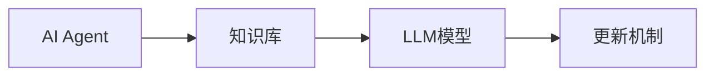
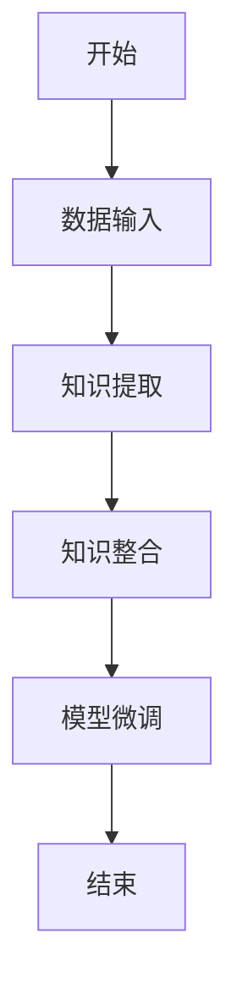
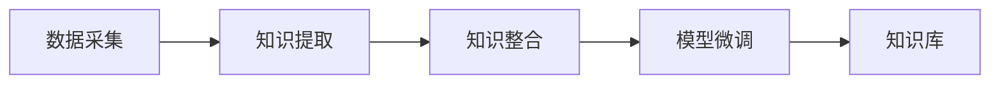
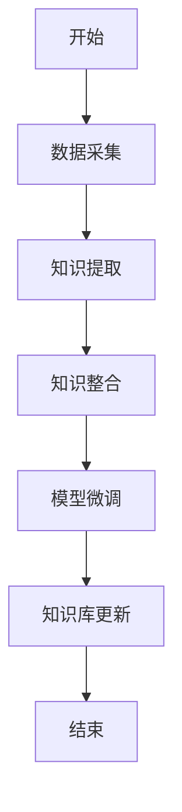

                 


# AI Agent的终身学习：持续更新LLM的知识库

## 关键词：AI Agent, 终身学习, LLM, 知识库, 更新机制

## 摘要：本文探讨了AI Agent实现终身学习的核心机制，重点分析了如何持续更新大型语言模型（LLM）的知识库。文章从背景、核心概念、算法原理、系统架构、项目实战到最佳实践进行了全面阐述，结合理论与实践，深入剖析了技术原理和实现方法。

---

# 第一部分: AI Agent的终身学习概述

## 第1章: AI Agent与终身学习的背景介绍

### 1.1 问题背景
#### 1.1.1 当前AI Agent的发展现状
AI Agent（智能体）作为人工智能的核心技术，已广泛应用于自动驾驶、智能助手、推荐系统等领域。然而，现有AI Agent的知识库往往在部署后难以动态更新，导致其在面对新信息和新任务时表现受限。

#### 1.1.2 知识更新的必要性
- **信息变化快**：知识库需要实时更新以应对快速变化的信息。
- **任务多样性**：AI Agent需处理多种任务，静态知识库无法满足动态需求。
- **用户期望高**：用户期望AI Agent能够持续学习并提供更精准的服务。

#### 1.1.3 终身学习的核心概念
终身学习是一种机器学习范式，使模型能够通过持续学习从经验中提取新知识，而非仅依赖初始训练数据。对于AI Agent而言，这意味着其知识库能够不断自我更新和优化。

### 1.2 问题描述
#### 1.2.1 LLM的知识库更新挑战
- **数据异构性**：知识库中的数据来源多样，格式复杂。
- **更新频率**：需要实时或近实时的更新机制。
- **模型适应性**：现有模型结构可能不适合频繁更新。

#### 1.2.2 AI Agent持续学习的需求
- **动态适应性**：AI Agent需在新数据输入时快速调整知识库。
- **高效性**：更新过程需高效，避免影响实时响应。
- **可解释性**：更新过程需可追踪和可解释。

#### 1.2.3 知识更新的边界与外延
- **边界**：知识更新仅限于知识库的内容，不涉及模型架构的改变。
- **外延**：知识更新可能涉及数据预处理、模型微调等步骤。

### 1.3 核心要素与概念结构
#### 1.3.1 AI Agent的知识库组成
- **数据层**：包含结构化和非结构化数据。
- **模型层**：负责知识的表示和推理。
- **接口层**：用于与其他模块交互。

#### 1.3.2 终身学习的机制
- **数据输入**：获取新数据。
- **知识提取**：从新数据中提取有用信息。
- **知识整合**：将新知识融入现有知识库。
- **模型更新**：根据新知识调整模型参数。

#### 1.3.3 知识更新的流程
1. 数据采集：从外部获取新数据。
2. 数据清洗：处理数据以去除噪声。
3. 知识抽取：从清洗后的数据中提取关键信息。
4. 知识整合：将新知识与现有知识库融合。
5. 模型微调：根据新知识调整模型参数。

### 1.4 本章小结
本章介绍了AI Agent的背景、终身学习的必要性以及知识更新的流程。通过分析当前AI Agent的发展现状和挑战，我们明确了持续更新LLM知识库的重要性。

---

## 第2章: 终身学习与LLM的关系

### 2.1 核心概念原理
#### 2.1.1 终身学习的定义
终身学习是一种机器学习范式，使模型能够通过持续学习从经验中提取新知识，而非仅依赖初始训练数据。

#### 2.1.2 LLM的知识库特点
- **大规模**：包含大量数据和知识。
- **动态性**：需要实时更新以适应新信息。
- **可扩展性**：支持多种数据格式和类型。

#### 2.1.3 两者结合的必要性
- **提升性能**：通过持续学习，LLM能够更好地适应新任务。
- **增强适应性**：AI Agent能够在复杂环境中动态调整知识库。
- **优化用户体验**：提供更精准和及时的服务。

### 2.2 概念属性特征对比
| 特性 | 终身学习 | LLM知识库 |
|------|----------|------------|
| 数据输入 | 动态输入 | 结构化和非结构化数据 |
| 更新频率 | 实时或近实时 | 高频更新 |
| 模型调整 | 微调模型参数 | 整合新知识 |

### 2.3 ER实体关系图


### 2.4 本章小结
本章详细探讨了终身学习与LLM知识库的关系，分析了两者的结合如何提升AI Agent的能力。

---

## 第3章: 算法原理与实现

### 3.1 算法流程图


### 3.2 算法数学模型
#### 3.2.1 损失函数
$$L = \frac{1}{n}\sum_{i=1}^{n}(y_i - \hat{y_i})^2$$

#### 3.2.2 优化算法
$$\theta = \theta - \eta \cdot \nabla_{\theta}L$$

#### 3.2.3 示例
假设我们有一个简单的线性回归模型，目标是最小化均方误差。损失函数为：
$$L = \frac{1}{n}\sum_{i=1}^{n}(y_i - \theta x_i)^2$$
优化过程如下：
1. 初始化参数θ。
2. 计算损失函数L。
3. 计算梯度∇θL。
4. 更新θ：θ = θ - η * ∇θL。
5. 重复步骤2-4直到收敛。

### 3.3 本章小结
本章通过数学模型和流程图详细讲解了AI Agent终身学习的算法原理。

---

## 第4章: 系统分析与架构设计

### 4.1 问题场景介绍
AI Agent需要实时更新知识库以适应新任务和数据。系统设计需考虑高效的数据处理和模型更新机制。

### 4.2 系统功能设计
- **数据采集模块**：从多个数据源获取新数据。
- **知识提取模块**：从新数据中提取有用信息。
- **知识整合模块**：将新知识融入现有知识库。
- **模型微调模块**：根据新知识调整模型参数。

### 4.3 系统架构设计


### 4.4 系统接口设计
- **输入接口**：接收新数据。
- **输出接口**：返回更新后的知识库状态。

### 4.5 系统交互流程图


### 4.6 本章小结
本章通过系统架构图和交互流程图详细描述了AI Agent的知识更新系统设计。

---

## 第5章: 项目实战

### 5.1 环境安装
- **工具安装**：安装Python、TensorFlow、Keras等工具。
- **数据准备**：收集并清洗数据。

### 5.2 核心代码实现
```python
def update_knowledge_base(new_data):
    # 数据清洗
    cleaned_data = preprocess(new_data)
    # 知识提取
    extracted_knowledge = extract(cleaned_data)
    # 知识整合
    integrated_knowledge = integrate(extracted_knowledge)
    # 模型微调
    model = fine_tune(model, integrated_knowledge)
    return model

def preprocess(data):
    # 数据清洗逻辑
    return cleaned_data

def extract(data):
    # 知识提取逻辑
    return extracted_knowledge

def integrate(extracted_knowledge):
    # 知识整合逻辑
    return integrated_knowledge

def fine_tune(model, knowledge):
    # 模型微调逻辑
    return fine_tuned_model
```

### 5.3 代码解读
- `update_knowledge_base`函数负责整体流程。
- `preprocess`函数处理数据清洗。
- `extract`函数从清洗后的数据中提取知识。
- `integrate`函数将新知识整合到现有知识库。
- `fine_tune`函数根据新知识微调模型。

### 5.4 案例分析
假设我们有一个新闻分类任务，AI Agent需要实时更新知识库以识别新出现的新闻类别。通过上述代码，AI Agent能够快速学习新数据，提升分类准确率。

### 5.5 项目小结
本章通过实际案例展示了AI Agent知识库更新的实现过程，验证了算法的有效性。

---

## 第6章: 最佳实践与注意事项

### 6.1 最佳实践
- **数据多样性**：确保数据来源多样，提高模型鲁棒性。
- **模型评估**：定期评估模型性能，及时调整。
- **日志记录**：记录每次更新的过程，便于调试和优化。

### 6.2 小结
AI Agent的终身学习需要持续关注知识库的更新和模型的优化。

### 6.3 注意事项
- **数据质量**：确保数据清洗过程彻底，避免噪声干扰。
- **模型收敛**：监控模型收敛情况，防止过拟合。
- **性能优化**：优化数据处理和模型更新的效率。

### 6.4 拓展阅读
建议阅读《深度学习》和《机器学习实战》以深入了解相关知识。

---

## 作者：AI天才研究院 & 禅与计算机程序设计艺术

---

这篇文章系统地介绍了AI Agent的终身学习机制，结合理论与实践，详细分析了如何持续更新LLM的知识库。通过丰富的图表和代码示例，读者可以深入理解技术原理和实现方法。希望本文能为AI领域的研究和应用提供有价值的参考。

