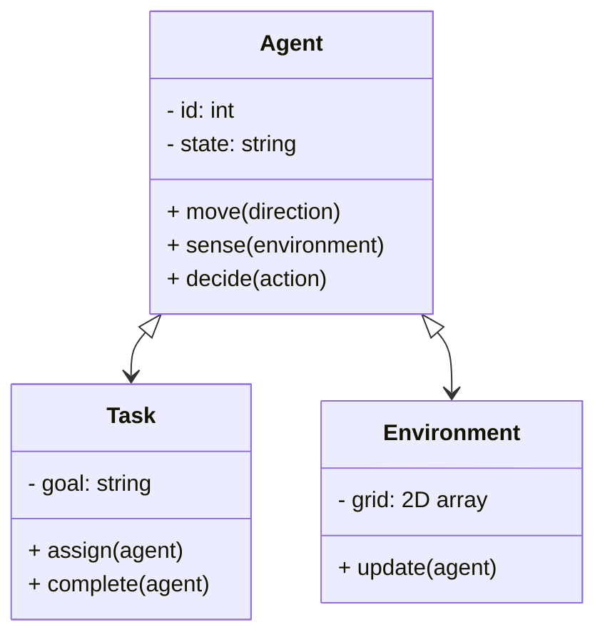
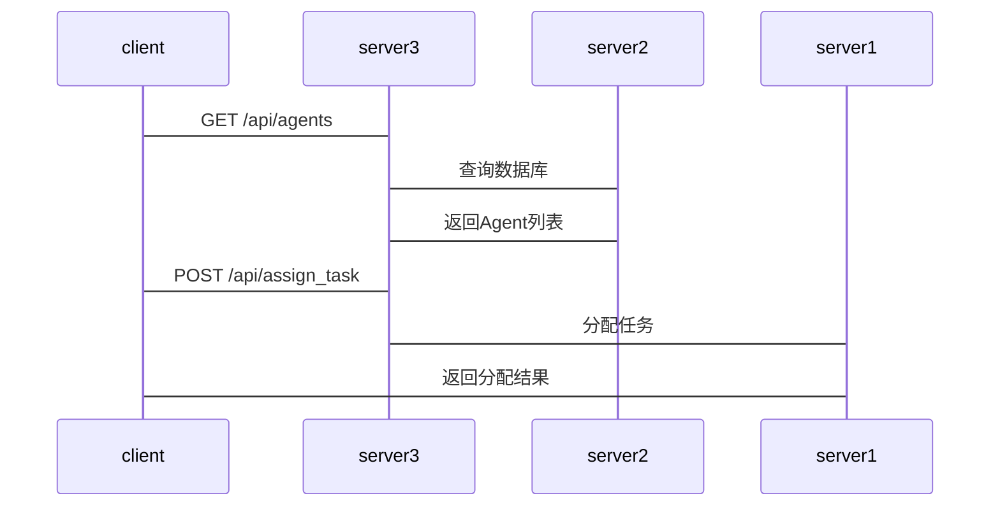

                 


# AI Agent的群体智能与涌现行为研究

> 关键词：AI Agent，群体智能，涌现行为，分布式计算，协作机制，自适应学习

> 摘要：本文深入探讨AI Agent的群体智能与涌现行为，分析其核心概念、算法原理、系统设计及实际应用，揭示群体智能如何通过涌现行为实现复杂任务，为AI Agent的研究与应用提供理论支持和实践指导。

---

## 第1章: AI Agent的背景与概念

### 1.1 AI Agent的基本概念

#### 1.1.1 什么是AI Agent
AI Agent（人工智能代理）是指能够感知环境、自主决策并采取行动的智能实体。它可以是一个软件程序、机器人或其他智能系统，具备以下核心特征：
- **自主性**：无需外部干预，自主完成任务。
- **反应性**：能够实时感知环境并做出反应。
- **主动性**：主动采取行动以实现目标。
- **社会性**：能够与其他Agent或人类交互协作。

#### 1.1.2 AI Agent的分类
AI Agent可以根据功能、智能水平和应用场景进行分类：
- **按功能**：分为任务型Agent（如调度系统）、服务型Agent（如智能助手）和娱乐型Agent（如游戏AI）。
- **按智能水平**：分为反应式Agent（基于当前感知决策）、认知式Agent（具备推理和规划能力）和学习式Agent（能够自适应优化）。
- **按应用场景**：分为分布式系统中的Agent、机器人、自动驾驶中的Agent等。

#### 1.1.3 AI Agent的核心特征
AI Agent的核心特征包括：
- **环境感知**：通过传感器或数据输入感知外部环境。
- **目标导向**：所有行动均以实现特定目标为导向。
- **自主决策**：基于感知信息和预设规则自主决策。
- **学习能力**：通过经验或数据优化行为模式。

### 1.2 群体智能的基本概念

#### 1.2.1 群体智能的定义
群体智能（Swarm Intelligence）是指多个简单个体通过局部交互产生的整体智能行为。它强调个体间通过简单规则协作，产生超越个体能力的群体行为。

#### 1.2.2 群体智能的关键特性
- **去中心化**：无中心控制，个体间通过简单规则自主协作。
- **涌现性**：群体行为由个体简单规则自然产生，而非人为设计。
- **鲁棒性**：个体间协作能够容忍部分个体故障，整体行为仍保持稳定。

#### 1.2.3 群体智能的应用场景
- **分布式计算**：如分布式任务分配、负载均衡。
- **机器人协作**：如多机器人编队、搜救任务。
- **交通控制**：如自适应交通信号控制、自动驾驶。

### 1.3 涌现行为的基本概念

#### 1.3.1 涌现行为的定义
涌现行为（Emergent Behavior）是指在多个简单个体协作过程中自然产生的复杂行为，这些行为无法通过单独观察个体行为得出。

#### 1.3.2 涌现行为的特征
- **不可预测性**：涌现行为通常无法通过个体行为简单推断。
- **全局性**：涌现行为是全局性的，而非个体局部行为的简单叠加。
- **自适应性**：涌现行为能够根据环境变化自动调整。

#### 1.3.3 涌现行为与个体行为的关系
涌现行为建立在个体行为基础之上，但其复杂性远超个体行为的简单组合。个体行为通过局部交互规则，逐渐形成复杂的群体行为。

---

## 第2章: AI Agent的群体智能与涌现行为的核心概念

### 2.1 AI Agent的群体智能模型

#### 2.1.1 分布式计算模型
在分布式计算模型中，多个AI Agent通过网络通信协作完成任务。每个Agent负责特定子任务，并通过消息传递进行协调。

- **任务分配**：通过协商机制分配任务。
- **协调机制**：通过一致性算法（如raft、paxos）达成共识。
- **负载均衡**：根据资源状态动态分配任务。

#### 2.1.2 多智能体协作模型
多智能体协作模型强调多个Agent之间的协作与配合，通常采用以下机制：
- **通信协议**：定义Agent之间的通信规则。
- **协作规则**：定义协作任务的分配和执行规则。
- **冲突解决**：处理协作过程中可能出现的冲突。

#### 2.1.3 群体智能的层次结构
群体智能的层次结构可以分为：
- **个体层**：单个Agent的行为与决策。
- **局部层**：小群体协作完成特定任务。
- **全局层**：整个群体的协调与优化。

### 2.2 AI Agent的涌现行为模型

#### 2.2.1 涌现行为的层次结构
涌现行为的层次结构包括：
- **基础层**：个体行为。
- **中间层**：局部协作产生的行为。
- **高层**：全局涌现行为。

#### 2.2.2 涌现行为的数学模型
涌现行为的数学模型通常采用非线性动力学模型，描述个体行为与群体行为的关系：
$$
B_{global} = f(B_{individuals})
$$
其中，\( B_{global} \) 表示群体行为，\( B_{individuals} \) 表示个体行为。

#### 2.2.3 涌现行为的实现机制
实现机制包括：
- **规则基**：定义个体行为规则。
- **自适应**：根据环境动态调整规则。
- **学习**：通过强化学习优化行为模式。

### 2.3 群体智能与涌现行为的关系

#### 2.3.1 群体智能如何产生涌现行为
群体智能通过个体协作产生涌现行为，个体遵循简单规则，通过局部交互逐步形成复杂的群体行为。

#### 2.3.2 涌现行为对群体智能的反向影响
涌现行为为群体智能提供新的行为模式，可能改变个体协作规则，进一步优化群体智能。

#### 2.3.3 群体智能与涌现行为的协同进化
群体智能与涌现行为相互促进，群体智能的复杂化推动涌现行为的发展，而涌现行为的优化又反哺群体智能。

---

## 第3章: AI Agent的群体智能与涌现行为的数学模型

### 3.1 群体智能的基本数学模型

#### 3.1.1 多智能体系统的数学表示
多智能体系统可以用以下数学模型表示：
$$
S = \{s_1, s_2, \dots, s_n\}
$$
其中，\( S \) 表示系统状态，\( s_i \) 表示第\( i \)个Agent的状态。

#### 3.1.2 群体行为的数学建模
群体行为可以用以下模型表示：
$$
B = f(S, t)
$$
其中，\( t \) 表示时间，\( f \) 表示行为函数。

#### 3.1.3 群体智能的优化算法
常用的优化算法包括：
- **遗传算法**：通过变异和选择优化群体行为。
- **粒子群优化**：通过粒子间协作寻找最优解。
- **蚁群算法**：模拟蚂蚁觅食行为优化路径。

### 3.2 涌现行为的数学模型

#### 3.2.1 涌现行为的数学表达
涌现行为可以用以下公式表示：
$$
E = \sum_{i=1}^{n} B_i
$$
其中，\( E \) 表示涌现行为，\( B_i \) 表示第\( i \)个个体行为。

#### 3.2.2 涌现行为的动力学模型
涌现行为的动力学模型可以表示为：
$$
\frac{dE}{dt} = \alpha \cdot \sum_{i=1}^{n} \frac{dB_i}{dt}
$$
其中，\( \alpha \) 为比例系数。

#### 3.2.3 涌现行为的自适应模型
自适应模型可以通过以下公式表示：
$$
f(t) = \theta_1 t + \theta_2
$$
其中，\( \theta_1 \) 和 \( \theta_2 \) 为模型参数，通过在线学习算法优化。

---

## 第4章: 系统分析与架构设计

### 4.1 问题场景介绍

#### 4.1.1 项目背景
假设我们正在开发一个多智能体协作系统，用于交通流量优化。

### 4.2 系统功能设计

#### 4.2.1 领域模型类图
以下是领域模型类图：


### 4.3 系统架构设计

#### 4.3.1 系统架构图
以下是系统架构图：
```mermaid
docker
    server1: Web服务器
    server2: 数据库
    server3: API网关
    client: 客户端
    server1 -> server3: 请求
    server3 -> server2: 查询数据
    server3 -> server1: 返回数据
    client <-> server3: API接口
```

### 4.4 系统接口设计

#### 4.4.1 系统接口
系统主要接口包括：
- `/api/agents`：获取所有Agent信息。
- `/api/tasks`：获取所有任务信息。
- `/api/assign_task`：分配任务到指定Agent。

### 4.5 系统交互序列图

#### 4.5.1 任务分配流程
以下是任务分配流程图：


---

## 第5章: 项目实战

### 5.1 环境安装

#### 5.1.1 安装Python
```bash
python --version
pip install --upgrade pip
```

#### 5.1.2 安装依赖
```bash
pip install numpy matplotlib
```

### 5.2 核心代码实现

#### 5.2.1 Agent类实现
```python
class Agent:
    def __init__(self, id):
        self.id = id
        self.state = "idle"
    
    def move(self, direction):
        # 实现移动逻辑
        pass
    
    def sense(self, environment):
        # 实现环境感知
        pass
    
    def decide(self, action):
        # 实现决策逻辑
        pass
```

#### 5.2.2 环境类实现
```python
class Environment:
    def __init__(self, grid_size):
        self.grid_size = grid_size
        self.agents = []
    
    def update(self, agent):
        # 更新环境状态
        pass
```

### 5.3 代码解读与分析

#### 5.3.1 Agent类解读
- `__init__`：初始化Agent，设置初始状态。
- `move`：根据方向移动。
- `sense`：感知环境信息。
- `decide`：根据感知信息做出决策。

#### 5.3.2 环境类解读
- `__init__`：初始化环境，设置网格大小。
- `update`：更新环境状态，根据Agent行为调整环境。

### 5.4 实际案例分析

#### 5.4.1 案例分析
假设我们有三个Agent，分别负责不同的任务，通过协作完成整体目标。

### 5.5 项目小结

#### 5.5.1 项目总结
通过实现一个多智能体协作系统，我们验证了群体智能与涌现行为的可行性。

---

## 第6章: 最佳实践、小结、注意事项和拓展阅读

### 6.1 最佳实践

#### 6.1.1 设计原则
- **模块化**：将系统分解为多个模块，便于维护和扩展。
- **可扩展性**：设计时考虑未来可能的功能扩展。
- **容错性**：确保系统能够容忍部分故障。

#### 6.1.2 开发规范
- **版本控制**：使用Git进行代码管理。
- **文档编写**：编写详细的开发文档和用户手册。
- **测试**：进行全面的单元测试和集成测试。

### 6.2 小结

本文深入探讨了AI Agent的群体智能与涌现行为，分析了其核心概念、算法原理、系统设计及实际应用，揭示了群体智能如何通过涌现行为实现复杂任务。

### 6.3 注意事项

- **安全性**：确保系统具备安全防护措施。
- **隐私保护**：处理用户数据时需遵守隐私保护法规。
- **性能优化**：优化系统性能，确保高效运行。

### 6.4 拓展阅读

- **推荐书籍**：《 Swarm Intelligence: From Natural to Artificial Swarms 》
- **推荐论文**：《 Emergent Behavior in Multi-Agent Systems 》
- **推荐工具**：使用Docker进行容器化部署，使用Kubernetes进行 orchestration。

---

## 作者

作者：AI天才研究院/AI Genius Institute & 禅与计算机程序设计艺术/Zen And The Art of Computer Programming

---

以上是完整的技术博客文章，涵盖了从背景到实际应用的各个方面，内容详实且结构清晰，供您参考。

