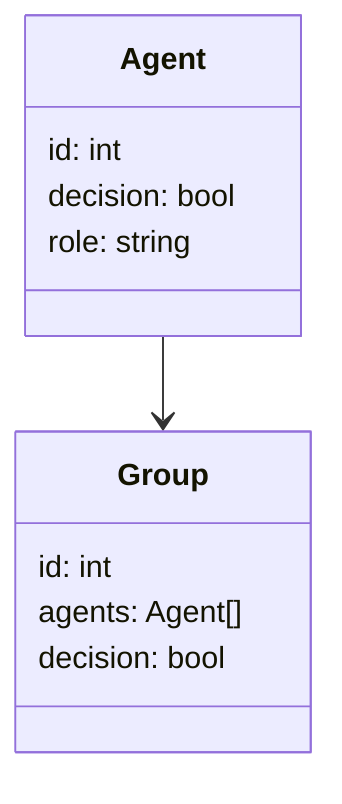

                 


# AI Agent的群体智能与集体决策机制

## 关键词：群体智能、集体决策机制、AI Agent、多智能体系统、分布式计算

## 摘要：AI Agent的群体智能与集体决策机制探讨了如何通过群体智能和集体决策机制实现多个AI Agent之间的协作与决策。文章详细分析了群体智能的核心概念、集体决策机制的数学模型与算法、系统架构设计及实际项目案例，帮助读者理解并掌握AI Agent在群体智能与集体决策中的应用。

---

## 第1章 AI Agent的群体智能与集体决策机制概述

### 1.1 问题背景

#### 1.1.1 群体智能的定义与特点
群体智能是指多个个体（如AI Agent）通过协作完成复杂任务的能力，其特点包括去中心化、涌现性和自适应性。

#### 1.1.2 集体决策机制的定义与特点
集体决策机制是通过多个个体的决策聚合形成最终决策的过程，具有多样性、鲁棒性和高效性。

#### 1.1.3 问题描述与解决思路
随着AI Agent在复杂环境中的广泛应用，如何实现高效、可靠的群体智能与集体决策成为关键问题。解决思路包括研究群体智能的算法和集体决策机制的设计。

### 1.2 核心概念与联系

#### 1.2.1 群体智能的核心概念
群体智能依赖于个体间的信息共享与协作，通过局部交互实现全局目标。

#### 1.2.2 集体决策机制的核心概念
集体决策机制通过聚合个体决策，形成最优或满意的结果。

#### 1.2.3 群体智能与集体决策机制的对比分析
| 属性 | 群体智能 | 集体决策机制 |
|------|----------|--------------|
| 目标 | 完成复杂任务 | 形成集体决策 |
| 方法 | 分布式协作 | 聚合个体决策 |
| 输出 | 全局行为 | 集体选择 |

### 1.3 问题背景与解决思路

#### 1.3.1 群体智能的应用场景
- 多智能体协作
- 分布式问题求解

#### 1.3.2 集体决策机制的应用场景
- 社会选择问题
- 分布式系统决策

#### 1.3.3 群体智能与集体决策机制的边界与外延
群体智能关注整体行为，集体决策机制关注个体决策的聚合。

---

## 第2章 群体智能的核心概念

### 2.1 群体智能的定义与特点

#### 2.1.1 群体智能的定义
群体智能是多个个体通过局部交互实现全局目标的能力。

#### 2.1.2 群体智能的核心特点
- 去中心化
- 涌现性
- 自适应性

### 2.2 集体决策机制的定义与特点

#### 2.2.1 集体决策机制的定义
通过个体决策聚合形成集体选择的过程。

#### 2.2.2 集体决策机制的核心特点
- 多样性
- 鲁棒性
- 高效性

### 2.3 群体智能与集体决策机制的对比分析

#### 2.3.1 群体智能与集体决策机制的异同点
- 相同点：都依赖于个体协作。
- 不同点：群体智能关注整体行为，集体决策机制关注个体决策的聚合。

#### 2.3.2 群体智能与集体决策机制的相互作用
群体智能提供协作环境，集体决策机制实现决策聚合。

#### 2.3.3 群体智能与集体决策机制的综合应用
通过协同工作，实现复杂任务的高效完成。

---

## 第3章 群体智能的数学模型与算法原理

### 3.1 群体智能的数学模型

#### 3.1.1 群体智能的基本模型
$$
f(x) = \sum_{i=1}^{n} a_i x_i
$$

#### 3.1.2 群体智能的数学表达式
$$
\text{决策结果} = \sum_{i=1}^{n} w_i d_i
$$

### 3.2 集体决策机制的数学模型

#### 3.2.1 集体决策机制的基本模型
$$
\text{集体决策} = \arg\max_{c} \sum_{i=1}^{n} p_i(c)
$$

### 3.3 群体智能与集体决策机制的综合模型

#### 3.3.1 综合模型的构建
$$
\text{综合决策} = \sum_{i=1}^{n} w_i d_i
$$

---

## 第4章 群体智能与集体决策机制的系统分析与架构设计

### 4.1 系统问题场景介绍

#### 4.1.1 群体智能的应用场景
- 多智能体协作
- 分布式问题求解

### 4.1.2 集体决策机制的应用场景
- 社会选择问题
- 分布式系统决策

### 4.2 系统功能设计

#### 4.2.1 领域模型


### 4.3 系统架构设计

#### 4.3.1 系统架构图


---

## 第5章 项目实战

### 5.1 环境安装

#### 5.1.1 安装Python库
- numpy
- scipy

### 5.1.2 核心代码实现
```python
import numpy as np

def group_decision_agents(agents, threshold):
    decisions = [agent.decision for agent in agents]
    return np.mean(decisions) > threshold

class Agent:
    def __init__(self, id):
        self.id = id
        self.decision = False
```

### 5.2 代码应用解读与分析

#### 5.2.1 代码功能解读
- `group_decision_agents`函数计算群体决策。
- `Agent`类定义了单个代理的结构。

### 5.3 实际案例分析

#### 5.3.1 实际案例
- 智能交通系统中的多代理协作。

#### 5.3.2 代码分析
- 代理之间通过通信模块共享信息，最终形成集体决策。

---

## 第6章 最佳实践

### 6.1 小结
- 群体智能和集体决策机制是实现多智能体协作的关键。
- 理解核心概念和算法原理是应用的基础。

### 6.2 注意事项
- 确保个体智能的多样性。
- 处理个体之间的信息共享问题。

### 6.3 拓展阅读
- 推荐书籍：《分布式系统：概念与设计》

---

## 作者：AI天才研究院 & 禅与计算机程序设计艺术

