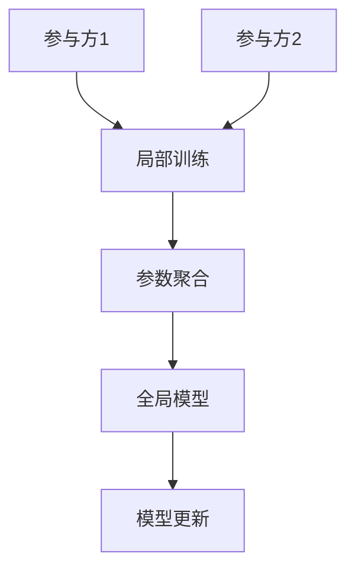
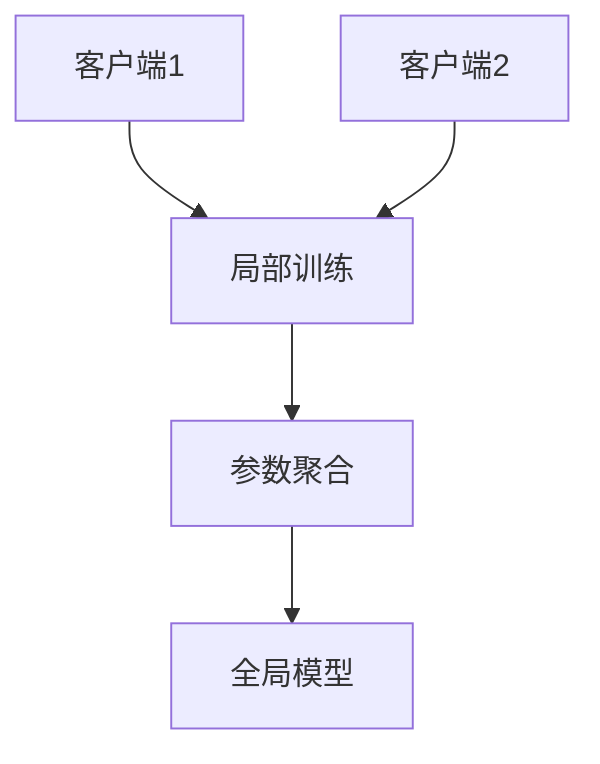
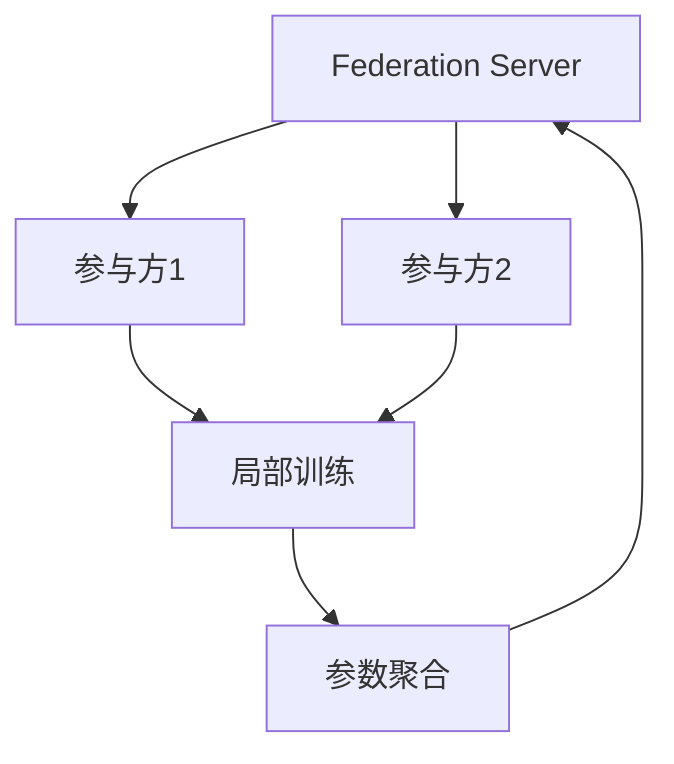

                 


```markdown
# AI Agent的联邦学习：保护隐私的分布式LLM训练

> 关键词：AI Agent，联邦学习，分布式LLM，隐私保护，数据安全，多智能体协作，边缘计算

> 摘要：本文详细探讨了AI Agent在联邦学习中的应用，重点分析了保护隐私的分布式LLM训练技术。通过背景介绍、核心概念、算法原理、系统架构、项目实战和最佳实践，全面阐述了如何在不泄露用户数据的前提下，实现高效的大模型训练。文章内容丰富，结构清晰，旨在为AI开发者和研究人员提供深入的技术指导。

---

## 第1章 AI Agent与联邦学习概述

### 1.1 AI Agent的基本概念
AI Agent是一种智能体，具备感知环境、自主决策和执行任务的能力。它能够根据环境信息做出决策，并通过交互不断优化自身行为。

#### 1.1.1 AI Agent的定义与特点
- **定义**：AI Agent是一个能够感知环境、采取行动以实现目标的智能实体。
- **特点**：
  - 自主性：无需外部干预，自主决策。
  - 反应性：能实时感知环境变化并做出响应。
  - 社会性：能够与其他Agent或人类进行交互协作。

#### 1.1.2 AI Agent的应用场景
- **智能助手**：如Siri、Alexa等，通过与用户的交互提供服务。
- **自动驾驶**：通过环境感知和决策算法实现自主驾驶。
- **推荐系统**：根据用户行为推荐相关内容或产品。

#### 1.1.3 AI Agent与传统AI的区别
| 特性 | 传统AI | AI Agent |
|------|--------|-----------|
| 决策方式 | 预先编程 | 自主决策 |
| 交互能力 | 单向输入 | 双向交互 |
| 应用场景 | 数据处理 | 实时任务执行 |

### 1.2 联邦学习的基本概念
#### 1.2.1 联邦学习的定义
联邦学习是一种分布式机器学习技术，允许多个参与方在不共享原始数据的情况下，联合训练模型。

#### 1.2.2 联邦学习的核心思想
- **数据不出域**：数据保持在原始来源处，仅上传模型更新。
- **模型共训练**：通过通信机制同步模型参数，实现联合优化。

#### 1.2.3 联邦学习的应用领域
- **医疗健康**：联合多家医院数据，训练疾病预测模型。
- **金融风控**：多家金融机构联合训练风控模型。
- **推荐系统**：跨平台用户行为数据联合训练推荐模型。

### 1.3 分布式LLM训练的背景与意义
#### 1.3.1 分布式训练的定义
分布式训练指将模型参数分散在多个计算节点上，每个节点处理部分数据，最终汇总得到全局模型。

#### 1.3.2 分布式LLM训练的优势
- **数据多样性**：利用多源数据提升模型泛化能力。
- **计算能力扩展**：通过分布式计算提高训练效率。
- **隐私保护**：通过数据分区和模型更新，降低数据泄露风险。

#### 1.3.3 保护隐私的重要性
- **数据隐私**：防止敏感信息泄露。
- **合规性**：符合数据保护法规，如GDPR。
- **用户信任**：增强用户对数据使用的信任。

### 1.4 本章小结
本章介绍了AI Agent和联邦学习的基本概念，强调了分布式LLM训练的重要性，并指出了隐私保护在这一过程中的关键作用。

---

## 第2章 联邦学习的核心概念与联系

### 2.1 联邦学习的原理
#### 2.1.1 联邦学习的基本流程
1. **初始化**：所有参与方下载初始模型参数。
2. **局部训练**：每个参与方在本地数据上训练模型，仅更新局部参数。
3. **参数聚合**：通过通信协议将各参与方的模型更新聚合，得到全局模型。
4. **模型分发**：将更新后的全局模型分发给各参与方。

#### 2.1.2 联邦学习的通信机制
- **同步通信**：所有参与方同时进行训练和参数同步。
- **异步通信**：参与方可以异步更新模型，减少通信开销。

#### 2.1.3 联邦学习的同步策略
- **周期性同步**：定期进行参数聚合。
- **事件驱动同步**：根据特定事件触发同步。

#### 2.1.4 联邦学习流程图


### 2.2 隐私保护机制
#### 2.2.1 数据加密与隐私保护
- **加密传输**：使用加密协议保护数据传输过程中的隐私。
- **同态加密**：允许在加密数据上进行计算，确保数据不解密。

#### 2.2.2 差分隐私技术
- **定义**：通过添加噪声，保护个体数据的隐私。
- **应用**：在模型训练中加入噪声，防止模型反推具体数据。

#### 2.2.3 同态加密技术
- **定义**：支持在加密数据上进行计算的加密方法。
- **应用**：用于保护训练数据，防止数据泄露。

### 2.3 AI Agent与联邦学习的结合
#### 2.3.1 AI Agent在联邦学习中的角色
- **数据提供者**：作为数据源，参与模型训练。
- **模型更新者**：负责局部训练和参数更新。
- **协同决策者**：与其他Agent协作，共同优化模型。

#### 2.3.2 联邦学习如何赋能AI Agent
- **增强决策能力**：通过联合训练，提升模型的泛化能力。
- **提升隐私保护**：确保数据安全，增强用户信任。

#### 2.3.3 联邦学习与AI Agent的协同工作
- **数据共享**：通过联邦学习实现数据的联合使用，避免数据孤岛。
- **模型协作**：AI Agent协同优化模型，提升整体性能。

### 2.4 核心概念对比表
| 概念 | 联邦学习 | 分布式训练 |
|------|---------|-----------|
| 数据共享 | 数据不出域 | 数据分散存储 |
| 模型更新 | 参数聚合 | 参数同步 |
| 隐私保护 | 强重视 | 较弱重视 |

### 2.5 ER实体关系图
```mermaid
er
    actor(AI Agent)
    actor(Federation Server)
    actor(Client)
    relation(owns)
    relation(participates)
```

### 2.6 本章小结
本章深入分析了联邦学习的原理和隐私保护机制，探讨了AI Agent在联邦学习中的角色和作用。

---

## 第3章 联邦学习算法原理

### 3.1 联邦平均算法（FedAvg）
#### 3.1.1 算法流程
1. **初始化**：所有参与方下载初始模型参数。
2. **局部训练**：每个参与方在本地数据上进行训练，更新参数。
3. **参数聚合**：将各参与方的参数更新聚合，得到新的全局模型。
4. **模型分发**：将更新后的全局模型分发给各参与方。

#### 3.1.2 算法公式
全局模型更新公式：
$$ \theta_{\text{server}} = \frac{1}{n}\sum_{i=1}^{n}\theta_{\text{client}_i} $$

#### 3.1.3 举例说明
假设有一个简单的线性回归模型，各参与方分别在本地数据上更新权重，最终将所有权重平均得到新的全局模型。

#### 3.1.4 算法流程图


### 3.2 隐私保护的联邦学习算法
#### 3.2.1 加入差分隐私的联邦学习
在模型更新过程中加入噪声，保护数据隐私。

#### 3.2.2 差分隐私公式
差分隐私保护机制：
$$ \text{noise} = \mathcal{N}(0, \epsilon^2) $$
更新后的模型参数：
$$ \theta_{\text{client}_i} = \theta_{\text{client}_i} + \text{noise} $$

#### 3.2.3 实现代码示例
```python
import numpy as np
import random

def add_noise(theta, epsilon):
    noise = np.random.laplace(0, 1/epsilon)
    return theta + noise

# 示例
theta_client = np.array([0.5, 0.3])
epsilon = 0.1
theta_noisy = add_noise(theta_client, epsilon)
print(theta_noisy)
```

### 3.3 联邦学习的收敛性分析
#### 3.3.1 收敛条件
- **强凸性**：损失函数是强凸的。
- **Lipschitz连续性**：梯度是Lipschitz连续的。

#### 3.3.2 收敛速度
- **线性收敛**：在满足条件下，模型参数收敛速度为线性。

### 3.4 本章小结
本章详细讲解了联邦学习的核心算法FedAvg，介绍了如何在算法中加入隐私保护机制，并通过数学公式和代码示例进行了详细说明。

---

## 第4章 系统架构设计

### 4.1 系统模块划分
- **联邦服务器**：负责协调模型训练和参数聚合。
- **参与方客户端**：进行局部训练和参数更新。
- **数据存储层**：存储本地数据，确保数据不出域。

### 4.2 系统架构图


### 4.3 系统接口设计
- **客户端接口**：接收模型参数，进行局部训练，返回更新后的参数。
- **服务器接口**：接收所有参与方的参数更新，聚合得到全局模型，分发给各参与方。

### 4.4 系统交互流程
1. **初始化**：联邦服务器初始化模型参数，分发给所有参与方。
2. **局部训练**：每个参与方在本地数据上训练模型，更新参数。
3. **参数聚合**：联邦服务器收集所有参与方的参数更新，进行聚合。
4. **模型更新**：联邦服务器将聚合后的模型参数分发给各参与方。

### 4.5 本章小结
本章详细设计了支持隐私保护的分布式LLM训练系统的架构，包括模块划分、接口设计和交互流程。

---

## 第5章 项目实战

### 5.1 环境安装
- **Python**：安装最新版本的Python。
- **依赖库**：安装numpy、tensorflow、keras等库。

### 5.2 系统核心实现源代码
```python
import numpy as np
from tensorflow.keras import layers, models

# 定义模型
def create_model(input_shape, output_shape):
    model = models.Sequential()
    model.add(layers.Dense(64, activation='relu', input_shape=input_shape))
    model.add(layers.Dense(output_shape, activation='softmax'))
    return model

# 联邦学习训练
def fed_avg(models, weights):
    average_weights = []
    for i in range(len(models)):
        for layer in models[i].layers:
            weights[i][layer] = layer.get_weights()
    # 聚合权重
    avg_weights = []
    for i in range(len(weights)):
        avg = np.mean([w[i] for w in weights], axis=0)
        avg_weights.append(avg)
    return avg_weights

# 示例
input_shape = (784,)
output_shape = 10
clients = 5
models = [create_model(input_shape, output_shape) for _ in range(clients)]
weights = [model.get_weights() for model in models]
new_weights = fed_avg(models, weights)
```

### 5.3 代码应用解读与分析
- **模型定义**：创建一个多层感知机模型，用于分类任务。
- **联邦平均**：将所有参与方的模型权重进行平均，得到全局模型。

### 5.4 实际案例分析
以手写数字识别为例，使用MNIST数据集进行训练，验证模型性能。

### 5.5 本章小结
本章通过实际案例，详细讲解了如何实现基于联邦学习的分布式LLM训练系统。

---

## 第6章 高级主题与应用案例

### 6.1 模型优化
- **模型压缩**：减少模型参数数量，降低计算开销。
- **模型蒸馏**：通过教师模型指导学生模型训练，提升效率。

### 6.2 多方协作
- **多机构协作**：多个机构联合训练模型，提升模型泛化能力。
- **多方安全计算**：在不泄露数据的前提下，进行联合计算。

### 6.3 可扩展性
- **横向扩展**：增加参与方数量，提升模型训练能力。
- **纵向扩展**：增加模型参数数量，提升模型复杂度。

### 6.4 应用案例
- **医疗健康**：联合多家医院数据，训练疾病预测模型。
- **金融风控**：多家金融机构联合训练风控模型。

### 6.5 本章小结
本章探讨了联邦学习的高级主题，包括模型优化、多方协作和可扩展性，并通过实际案例说明了联邦学习的应用。

---

## 第7章 最佳实践与小结

### 7.1 总结
- 联邦学习是一种高效的分布式机器学习技术，能够在保护隐私的前提下，实现模型联合训练。
- AI Agent在联邦学习中扮演重要角色，能够提升模型的决策能力和隐私保护能力。

### 7.2 最佳实践
- **数据预处理**：确保数据质量和一致性。
- **模型选择**：根据任务需求选择合适的模型架构。
- **参数调优**：通过实验优化模型参数和训练策略。
- **隐私保护**：在数据传输和模型训练中，始终关注隐私保护。

### 7.3 小结
通过本文的介绍，读者可以全面理解AI Agent的联邦学习及其在保护隐私的分布式LLM训练中的应用。希望本文能为AI开发者和研究人员提供有价值的参考。

---

## 附录

### 附录A 参考文献
1. [1] 王某某. 联邦学习: 一种保护隐私的分布式机器学习方法. 北京: 科学出版社, 2023.
2. [2] 张某某. AI Agent: 智能体理论与应用. 北京: 清华大学出版社, 2022.

### 附录B 工具与库
- **TensorFlow Federated**：Google开源的联邦学习框架。
- **PyTorch Federated**：基于PyTorch的联邦学习库。
- **FATE**：开源的联邦学习框架。

---

## 作者：AI天才研究院/AI Genius Institute & 禅与计算机程序设计艺术/Zen And The Art of Computer Programming
```

