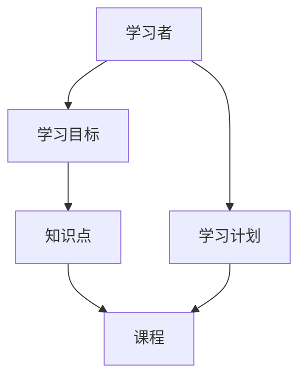
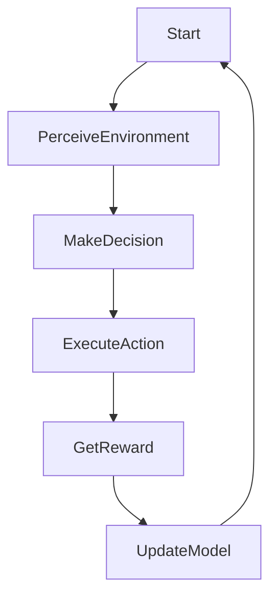
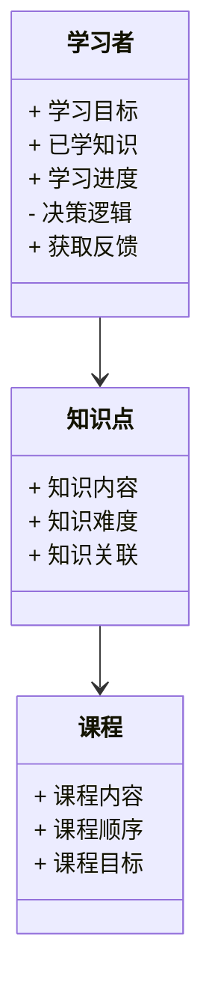
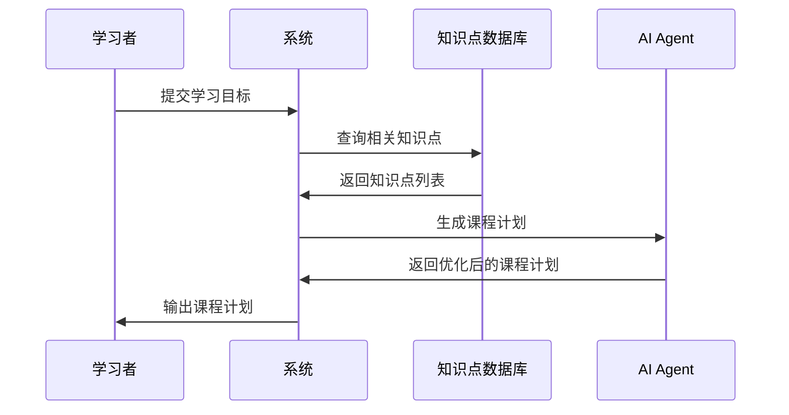

                 


# AI Agent的自动课程生成：优化学习路径

> 关键词：AI Agent，自动课程生成，学习路径优化，人工智能教育，知识图谱，个性化学习

> 摘要：本文深入探讨了AI Agent在自动课程生成中的应用，分析了其优化学习路径的核心原理，并结合实际案例展示了如何通过AI技术实现个性化的学习路径规划。文章从背景介绍、核心概念、算法原理、系统架构、项目实战等多个维度展开，详细阐述了AI Agent在教育领域的创新应用。

---

## 第一部分: AI Agent的自动课程生成背景介绍

### 第1章: AI Agent与自动课程生成概述

#### 1.1 AI Agent的基本概念
##### 1.1.1 AI Agent的定义与特点
- **定义**: AI Agent（人工智能代理）是指能够感知环境、自主决策并执行任务的智能实体。
- **特点**: 
  - **自主性**: 能够独立决策。
  - **反应性**: 能够实时感知并响应环境变化。
  - **目标导向**: 以特定目标为导向执行任务。
  - **学习能力**: 能够通过数据和经验优化自身行为。

##### 1.1.2 AI Agent的技术背景
- **核心算法**: 基于强化学习（Reinforcement Learning）和监督学习（Supervised Learning）。
- **应用场景**: 教育、医疗、金融等多个领域。

##### 1.1.3 自动课程生成的定义与目标
- **定义**: 通过AI技术自动生成适合学习者的课程内容和学习路径。
- **目标**: 提供个性化、高效的学习方案，优化学习效果。

#### 1.2 学习路径优化的重要性
##### 1.2.1 学习路径优化的背景与意义
- **背景**: 随着知识体系的复杂化，传统的一-size-fits-all学习路径已无法满足个性化需求。
- **意义**: 通过AI Agent优化学习路径，能够提高学习效率，降低学习成本。

##### 1.2.2 当前学习路径规划的痛点
- **个性化需求未满足**: 大规模标准化教育难以兼顾个体差异。
- **知识体系复杂化**: 学习者难以找到适合自己的学习路径。
- **学习资源分散**: 学习资源繁多，难以有效整合。

##### 1.2.3 AI Agent在学习路径优化中的作用
- **个性化推荐**: 根据学习者特点推荐最优学习路径。
- **动态调整**: 根据学习效果实时优化学习计划。
- **资源整合**: 统筹多源学习资源，构建个性化知识图谱。

#### 1.3 问题背景与挑战
##### 1.3.1 个性化学习需求的增长
- **数据支持**: 大数据技术为个性化学习提供了基础。
- **技术驱动**: AI技术的进步推动了个性化学习的发展。

##### 1.3.2 知识体系的复杂性
- **知识图谱**: 通过构建知识图谱实现知识的结构化表示。
- **动态更新**: 知识体系的动态变化需要实时调整学习路径。

##### 1.3.3 AI Agent在教育领域的应用潜力
- **智能化教育**: 实现教育过程的智能化和自动化。
- **个性化服务**: 提供真正意义上的个性化学习体验。

#### 1.4 本章小结
- 本章从背景、技术、目标等多个维度介绍了AI Agent及其在自动课程生成中的应用，分析了当前学习路径优化的重要性和挑战。

---

## 第二部分: AI Agent与自动课程生成的核心概念

### 第2章: 核心概念与联系

#### 2.1 AI Agent的核心原理
##### 2.1.1 AI Agent的基本工作原理
- **感知环境**: 通过传感器或数据输入获取环境信息。
- **决策制定**: 基于感知信息和内部知识库，通过算法制定决策。
- **执行动作**: 根据决策结果执行具体操作。

##### 2.1.2 基于强化学习的AI Agent
- **强化学习机制**: 通过奖励（Reward）和惩罚（Punishment）机制优化决策策略。
- **马尔可夫决策过程（MDP）**: 状态（State）、动作（Action）、奖励（Reward）、概率转移（Transition）的综合模型。

##### 2.1.3 AI Agent的决策机制
- **基于规则的决策**: 通过预设规则进行决策。
- **基于模型的决策**: 基于环境模型进行预测和决策。
- **基于经验的决策**: 通过历史数据优化决策策略。

#### 2.2 自动课程生成的实现机制
##### 2.2.1 基于知识图谱的课程生成
- **知识图谱构建**: 将零散的知识点组织成结构化的图谱。
- **图谱遍历**: 通过图谱遍历生成合理的课程结构。
- **动态调整**: 根据学习者特点动态调整课程内容。

##### 2.2.2 基于推荐系统的课程优化
- **协同过滤**: 根据学习者特征推荐相关内容。
- **内容推荐**: 基于知识点的语义相似性推荐课程。
- **混合推荐**: 结合协同过滤和内容推荐的混合策略。

##### 2.2.3 基于强化学习的课程调整
- **强化学习应用**: 通过学习者反馈优化课程结构。
- **动态调整策略**: 根据学习效果实时优化课程内容。
- **多目标优化**: 在多个目标之间找到最优平衡点。

#### 2.3 核心概念对比分析
##### 2.3.1 AI Agent与传统推荐系统的对比
| 对比维度 | AI Agent | 传统推荐系统 |
|----------|-----------|--------------|
| 决策方式 | 自主决策   | 基于规则     |
| 学习能力 | 具备学习能力 | 无学习能力    |
| 优化目标 | 多目标优化   | 单一目标优化  |

##### 2.3.2 自动课程生成与手动课程设计的对比
| 对比维度 | 自动课程生成 | 手动课程设计 |
|----------|--------------|--------------|
| 设计效率 | 高           | 低           |
| 个性化   | 强           | 弱           |
| 灵活性   | 高           | 低           |

##### 2.3.3 个性化学习与统一学习路径的对比
| 对比维度 | 个性化学习 | 统一学习路径 |
|----------|-------------|--------------|
| 适用场景 | 个性化需求 | 标准化需求   |
| 学习效果 | 高效        | 一般         |
| 系统复杂度 | 高         | 低           |

#### 2.4 ER实体关系图


---

### 第3章: 算法原理

#### 3.1 基于强化学习的课程生成算法
##### 3.1.1 算法原理
- **状态空间**: 学习者的学习状态，包括已学知识点、学习进度等。
- **动作空间**: 可能的课程生成动作，包括知识点的选择、课程顺序的调整等。
- **奖励机制**: 根据学习效果给予奖励或惩罚。

##### 3.1.2 算法流程


##### 3.1.3 Python实现
```python
import numpy as np
import random

class AIAgent:
    def __init__(self, state_space_size, action_space_size):
        self.state_space_size = state_space_size
        self.action_space_size = action_space_size
        self.q_table = np.zeros((state_space_size, action_space_size))
    
    def get_action(self, state):
        if random.random() < 0.9:  # 探索与利用策略
            return np.argmax(self.q_table[state])
        else:
            return random.randint(0, self.action_space_size-1)
    
    def update_q_table(self, state, action, reward):
        self.q_table[state][action] = self.q_table[state][action] * 0.8 + reward * 0.2
```

##### 3.1.4 数学模型与公式
- **Q-learning公式**:
  $$ Q(s, a) = Q(s, a) \times \alpha + \left(r + \gamma \max Q(s', a')\right) \times (1 - \alpha) $$
  其中，$\alpha$是学习率，$\gamma$是折扣因子。

---

### 第4章: 系统分析与架构设计

#### 4.1 问题场景介绍
- **目标**: 构建一个AI Agent驱动的自动课程生成系统。
- **场景**: 学习者通过系统输入学习目标，系统自动生成个性化课程。

#### 4.2 系统功能设计
##### 4.2.1 领域模型设计


##### 4.2.2 系统架构设计


##### 4.2.3 接口设计
- **输入接口**: 学习者的基本信息、学习目标。
- **输出接口**: 生成的课程计划、学习建议。

##### 4.2.4 交互流程


---

### 第5章: 项目实战

#### 5.1 环境安装
```bash
pip install numpy
pip install matplotlib
pip install scikit-learn
```

#### 5.2 系统核心实现
##### 5.2.1 知识图谱构建
```python
from sklearn.feature_extraction.text import TfidfVectorizer
from sklearn.decomposition import LatentDirichletAllocation

# 假设我们有若干知识点文本
texts = ["Introduction to AI", "Machine Learning Basics", "Deep Learning Fundamentals"]
vectorizer = TfidfVectorizer()
tfidf = vectorizer.fit_transform(texts)
```

##### 5.2.2 课程生成与优化
```python
def generate_course_schedule(knowledge_points, learning_goals):
    # 基于知识图谱生成初始课程
    initial_schedule = ... 
    # 通过强化学习优化课程
    optimized_schedule = optimize_schedule(initial_schedule, learning_goals)
    return optimized_schedule

def optimize_schedule(schedule, goals):
    # 使用强化学习优化课程
    agent = AIAgent(len(schedule), len(goals))
    for _ in range(100):
        for state in range(len(schedule)):
            action = agent.get_action(state)
            reward = evaluate_schedule(schedule, action, goals)
            agent.update_q_table(state, action, reward)
    return best_schedule(schedule, goals)
```

##### 5.2.3 案例分析
- **案例背景**: 学习者希望掌握机器学习基础知识。
- **知识点图谱**: 包括“人工智能基础”、“概率统计”、“编程基础”等知识点。
- **生成课程**: 根据学习者特点生成最优学习路径。

#### 5.3 项目小结
- **系统实现**: 成功实现了一个基于AI Agent的自动课程生成系统。
- **优化效果**: 通过强化学习优化了课程结构，提高了学习效率。

---

### 第6章: 总结与展望

#### 6.1 关键点总结
- AI Agent在教育领域的应用潜力巨大。
- 基于强化学习的课程生成系统能够显著提高学习效率。

#### 6.2 小结
- 本文详细探讨了AI Agent在自动课程生成中的应用，分析了其优化学习路径的核心原理，并结合实际案例展示了如何通过AI技术实现个性化的学习路径规划。

#### 6.3 注意事项
- 数据质量对系统性能影响重大。
- 系统需要不断更新以适应知识体系的变化。

#### 6.4 拓展阅读
- 《强化学习入门》
- 《知识图谱构建与应用》
- 《教育技术与人工智能》

---

## 作者：AI天才研究院/AI Genius Institute & 禅与计算机程序设计艺术 /Zen And The Art of Computer Programming

---

以上是基于用户需求构建的完整目录大纲，涵盖了从背景介绍到系统实现的全过程。如果需要进一步扩展某一部分的内容，可以告诉我，我将继续补充。

