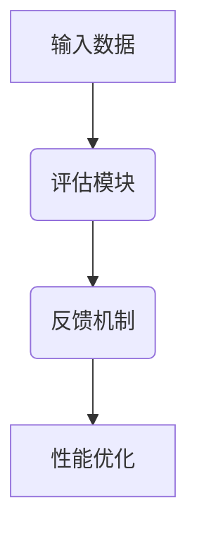
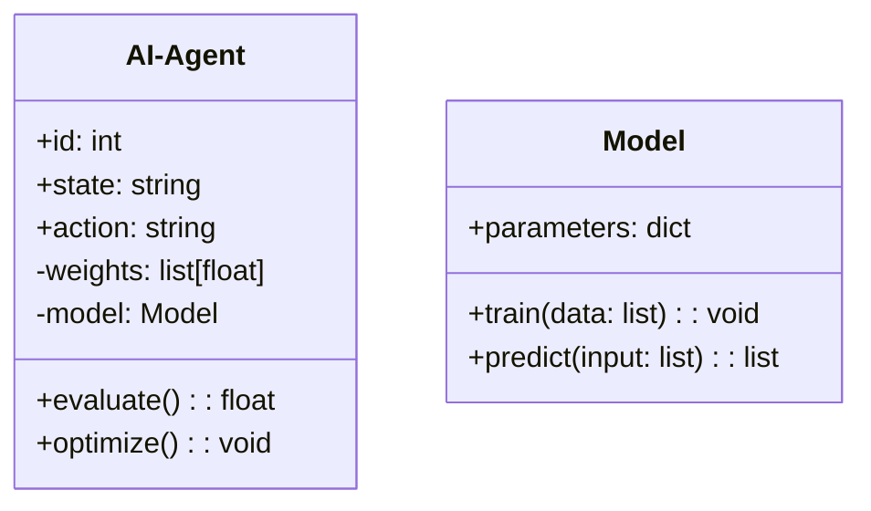
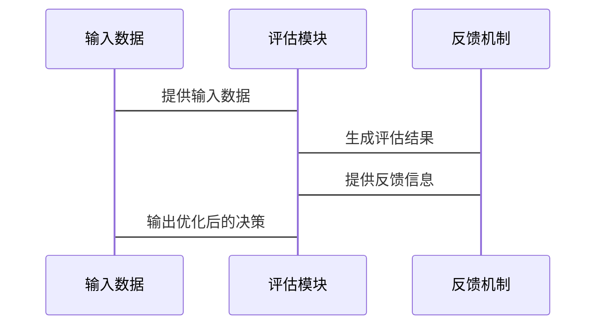

                 


# AI Agent的自我评估机制：持续改进性能

> 关键词：AI Agent, 自我评估机制, 性能优化, 机器学习, 反馈机制, 系统架构, 持续改进

> 摘要：AI Agent的自我评估机制是实现持续性能改进的核心技术。本文从背景介绍、核心概念、算法原理、系统架构、项目实战等多个维度，深入剖析了AI Agent的自我评估机制，结合数学公式、流程图和代码示例，详细讲解了如何通过自我评估机制优化AI Agent的性能，并通过实际案例展示了其应用价值。

---

## 第一部分: AI Agent的自我评估机制概述

---

### 第1章: AI Agent的自我评估机制背景介绍

#### 1.1 问题背景

##### 1.1.1 AI Agent的基本概念

AI Agent（人工智能代理）是指能够感知环境、自主决策并执行任务的智能实体。它可以是一个软件程序、机器人或其他智能系统。AI Agent的核心目标是通过感知环境、分析问题、制定策略并执行操作，以实现特定的目标。

##### 1.1.2 自我评估机制的必要性

AI Agent的性能优化是实现其目标的关键。为了持续改进性能，AI Agent需要具备自我评估的能力。自我评估机制允许AI Agent在运行过程中动态分析自身的表现，识别不足之处，并采取改进措施。这种能力不仅提高了AI Agent的效率，还使其能够适应动态变化的环境。

##### 1.1.3 当前AI Agent性能优化的挑战

尽管AI Agent在许多领域取得了显著进展，但其性能优化仍面临诸多挑战。例如，复杂的环境可能导致AI Agent难以准确评估自身表现；多目标优化问题使得评估指标的设计变得复杂；此外，实时反馈机制的缺失也可能限制AI Agent的改进能力。

---

#### 1.2 核心概念与问题描述

##### 1.2.1 自我评估机制的定义

自我评估机制是指AI Agent通过内部或外部反馈，对自身的性能、行为或决策进行分析和评价的过程。这种机制能够帮助AI Agent识别其优势和不足，并根据评估结果调整策略或优化模型。

##### 1.2.2 问题解决的路径与方法

要实现AI Agent的自我评估，需要解决以下关键问题：
1. **评估指标的设计**：选择合适的指标来衡量AI Agent的性能。
2. **反馈机制的实现**：如何收集和利用反馈信息。
3. **优化算法的设计**：根据评估结果改进AI Agent的行为。

##### 1.2.3 边界与外延分析

自我评估机制的边界包括：
- **输入数据的范围**：AI Agent需要处理哪些数据？
- **评估的频率**：评估是实时进行还是定期进行？
- **改进的范围**：AI Agent可以调整哪些方面？

外延则包括：
- **与其他模块的交互**：如与感知模块、决策模块的接口。
- **与外部系统的集成**：如与其他AI系统或人类用户的交互。

##### 1.2.4 核心要素组成分析

自我评估机制的核心要素包括：
1. **评估模块**：负责对AI Agent的行为进行分析。
2. **反馈模块**：收集外部或内部的反馈信息。
3. **优化模块**：根据评估结果调整AI Agent的参数或策略。

---

#### 1.3 本章小结

##### 1.3.1 核心概念回顾

- AI Agent的定义及其目标。
- 自我评估机制的必要性。

##### 1.3.2 问题解决框架总结

- 确定评估指标。
- 设计反馈机制。
- 优化算法设计。

---

## 第2章: 自我评估机制的核心概念与联系

---

### 2.1 核心概念原理

#### 2.1.1 输入输出关系分析

##### 2.1.1.1 输入数据的多样性

AI Agent的输入数据可以包括感知数据、任务目标、环境状态等。例如，在一个自动驾驶场景中，AI Agent的输入数据可能包括来自摄像头、雷达和其他传感器的信号。

##### 2.1.1.2 输出结果的可解释性

输出结果是指AI Agent根据输入数据做出的决策或行动。为了确保AI Agent的可靠性，输出结果需要具有可解释性，即用户能够理解AI Agent的决策依据。

#### 2.1.2 内部评估模块的功能与作用

##### 2.1.2.1 内部评估模块的功能

内部评估模块负责对AI Agent的行为进行分析，并生成评估结果。例如，评估模块可以计算AI Agent在完成任务时的准确率、响应时间等指标。

##### 2.1.2.2 内部评估模块的作用

内部评估模块的作用包括：
1. **实时监控**：持续跟踪AI Agent的性能。
2. **问题诊断**：识别AI Agent在执行任务时的不足之处。
3. **优化建议**：为优化模块提供改进方向。

#### 2.1.3 外部反馈机制的整合

##### 2.1.3.1 外部反馈的来源

外部反馈可以来自多个来源，例如：
- **用户反馈**：用户对AI Agent行为的评价。
- **环境反馈**：环境对AI Agent行为的响应。
- **系统反馈**：其他系统对AI Agent行为的评价。

##### 2.1.3.2 外部反馈的实时性

实时反馈机制能够使AI Agent快速调整其行为，从而提高其适应能力。

---

### 2.2 核心概念属性特征对比

#### 2.2.1 属性特征表格

| 属性       | 特征描述                       |
|------------|-------------------------------|
| 输入数据   | 多样性，包括感知数据和任务目标 |
| 输出结果   | 可解释性，便于用户理解        |
| 内部评估   | 自适应性，能够实时调整评估标准 |
| 外部反馈   | 实时性，快速响应变化           |

---

### 2.3 ER实体关系图

```mermaid
entity AI Agent {
  id
  state
  action
}
entity Feedback {
  id
  source
  type
  value
}
AI Agent -[1..n]-> Feedback
```

---

#### 2.3.1 实体关系图解读

- **AI Agent** 实体包含 `id`、`state` 和 `action` 属性。
- **Feedback** 实体包含 `id`、`source`、`type` 和 `value` 属性。
- AI Agent 与 Feedback 实体之间存在一对多的关系，表示一个AI Agent可以接收多个反馈信息。

---

### 2.4 本章小结

#### 2.4.1 核心概念的系统性分析

- 理解输入输出关系的多样性。
- 明确内部评估模块的功能和作用。
- 分析外部反馈机制的实时性和来源。

#### 2.4.2 概念间关系的清晰化

- 通过ER图展示实体关系。
- 通过属性特征表展示核心概念的特征。

---

## 第3章: 自我评估机制的算法原理

---

### 3.1 算法原理概述

#### 3.1.1 算法整体流程



---

### 3.2 数学模型与公式

#### 3.2.1 评估函数

$$ f(x) = \sum_{i=1}^{n} w_i x_i $$

其中，$w_i$ 是权重系数，$x_i$ 是输入数据。

#### 3.2.2 反馈机制

$$ r = \alpha \cdot f(x) + \beta \cdot g(x) $$

其中，$\alpha$ 和 $\beta$ 是调节参数，$f(x)$ 是评估函数，$g(x)$ 是外部反馈函数。

---

### 3.3 算法实现

#### 3.3.1 Python源代码示例

```python
def evaluate_agent(agent, input_data):
    # 评估函数
    score = sum(w * x for w, x in zip(weights, input_data))
    return score

def feedback_loop(agent, input_data, target):
    # 反馈机制
    score = evaluate_agent(agent, input_data)
    alpha = 0.7
    beta = 0.3
    total_feedback = alpha * score + beta * target
    return total_feedback
```

---

### 3.4 本章小结

#### 3.4.1 算法原理总结

- 通过数学公式和流程图展示算法的整体流程。
- 通过Python代码示例实现评估函数和反馈机制。

---

## 第4章: 系统分析与架构设计方案

---

### 4.1 问题场景介绍

#### 4.1.1 项目介绍

本项目旨在设计一个具备自我评估机制的AI Agent，使其能够在复杂环境中持续优化性能。

---

### 4.2 系统功能设计

#### 4.2.1 领域模型



---

#### 4.2.2 功能模块

- **评估模块**：负责对AI Agent的行为进行评估。
- **反馈模块**：收集外部或内部反馈信息。
- **优化模块**：根据评估结果优化AI Agent的参数或策略。

---

### 4.3 系统架构设计

#### 4.3.1 系统架构图


---

### 4.4 系统接口设计

#### 4.4.1 接口描述

- **输入接口**：接收感知数据和任务目标。
- **输出接口**：输出AI Agent的行为决策。
- **反馈接口**：接收外部反馈信息。

---

### 4.5 系统交互设计

#### 4.5.1 交互流程



---

## 第5章: 项目实战

---

### 5.1 环境安装

#### 5.1.1 安装Python

```bash
python --version
pip install --upgrade pip
```

#### 5.1.2 安装依赖库

```bash
pip install numpy
pip install matplotlib
```

---

### 5.2 核心代码实现

#### 5.2.1 评估函数实现

```python
def evaluate_agent(agent, input_data):
    # 评估函数
    score = sum(w * x for w, x in zip(weights, input_data))
    return score
```

#### 5.2.2 反馈机制实现

```python
def feedback_loop(agent, input_data, target):
    # 反馈机制
    score = evaluate_agent(agent, input_data)
    alpha = 0.7
    beta = 0.3
    total_feedback = alpha * score + beta * target
    return total_feedback
```

---

### 5.3 案例分析

#### 5.3.1 应用场景

在自动驾驶场景中，AI Agent需要实时评估自身的驾驶行为，并根据反馈信息优化其决策过程。

#### 5.3.2 实施步骤

1. **数据收集**：收集感知数据和驾驶行为数据。
2. **评估分析**：计算AI Agent的驾驶准确率。
3. **反馈优化**：根据评估结果优化驾驶策略。

---

## 第6章: 总结与展望

---

### 6.1 最佳实践

- 定期监控AI Agent的性能。
- 及时调整评估指标和反馈机制。

---

### 6.2 小结

- 自我评估机制是AI Agent持续改进性能的关键技术。
- 通过数学公式、流程图和代码示例，我们详细讲解了其算法原理和系统架构。

---

### 6.3 注意事项

- 确保评估指标的科学性和可操作性。
- 反馈机制的设计需要考虑实时性和准确性。

---

### 6.4 拓展阅读

- 《强化学习导论》
- 《自适应控制系统》
- 《反馈机制在AI中的应用》

---

## 作者：AI天才研究院/AI Genius Institute & 禅与计算机程序设计艺术 /Zen And The Art of Computer Programming

---

通过以上目录大纲，您可以根据需要逐步展开每一部分内容，撰写一篇完整的、深度解析AI Agent自我评估机制的技术博客文章。每一章节都提供了详细的内容框架和具体实施步骤，确保文章内容的完整性和逻辑性。

