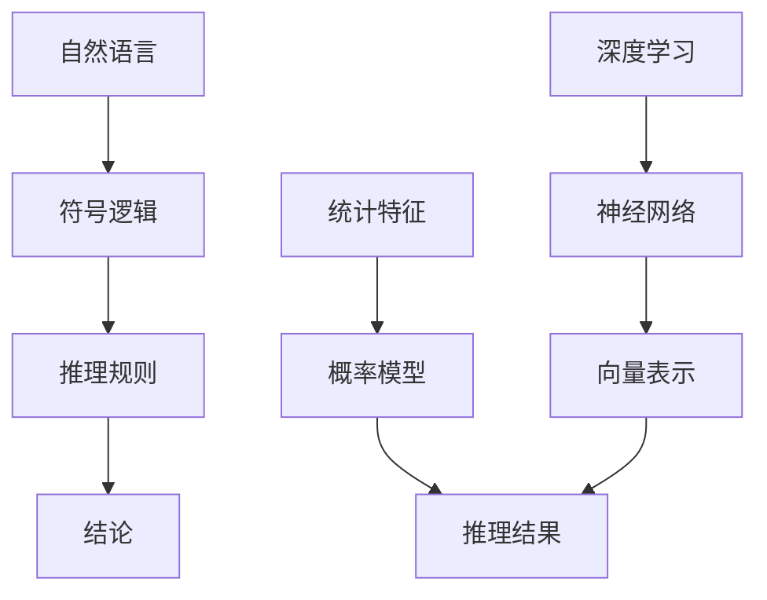
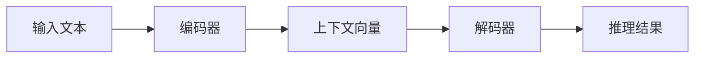
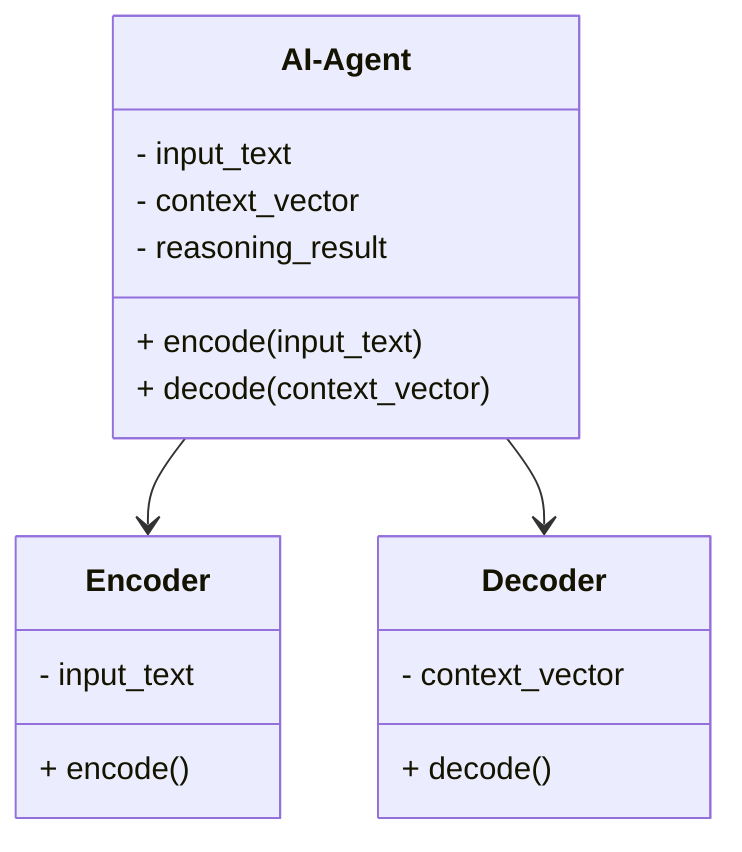
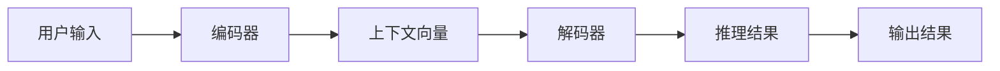
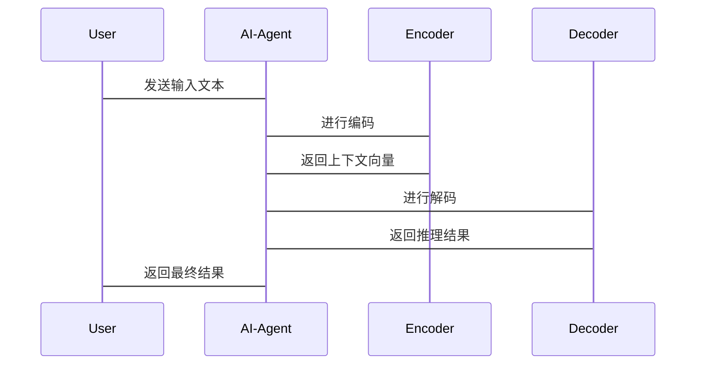

                 


# AI Agent的自然语言推理能力增强

> 关键词：自然语言推理，AI Agent，增强能力，算法模型，系统架构

> 摘要：本文探讨了如何增强AI Agent的自然语言推理能力，通过分析问题背景、核心概念、算法原理、系统设计、项目实战等多方面，结合具体案例和数学公式，详细阐述了提升AI Agent推理能力的方法和实现方案。

---

# 第1章: AI Agent与自然语言推理概述

## 1.1 问题背景

### 1.1.1 自然语言处理的发展历程
自然语言处理（NLP）经历了从规则驱动到数据驱动的转变，近年来随着深度学习的兴起，取得了显著进展。然而，现有技术在复杂语义理解方面仍有不足。

### 1.1.2 AI Agent的定义与特点
AI Agent是一种能够感知环境、自主决策并执行任务的智能体。其特点包括自主性、反应性、目标导向性和社会能力。

### 1.1.3 自然语言推理能力的重要性
自然语言推理是AI Agent理解人类语言、做出合理推断的核心能力，直接影响其与人类的交互效果。

## 1.2 问题描述

### 1.2.1 当前AI Agent的局限性
现有的AI Agent在处理复杂语境和多义信息时表现不佳，难以进行深层次的推理。

### 1.2.2 自然语言推理能力的缺失
缺乏对上下文的深度理解，导致推理结果的准确性和相关性不足。

### 1.2.3 增强推理能力的必要性
增强推理能力可以提升AI Agent在智能交互、决策支持等领域的应用效果。

## 1.3 问题解决

### 1.3.1 增强推理能力的方法
通过引入上下文感知模型和多模态数据融合，提升推理的准确性和相关性。

### 1.3.2 基于上下文的推理模型
利用上下文信息构建动态知识图谱，增强推理能力。

### 1.3.3 多模态数据的融合
将文本、图像、语音等多种模态数据进行融合，提升推理的全面性。

## 1.4 边界与外延

### 1.4.1 推理能力的边界
推理能力的边界在于数据质量和模型能力，过大的数据量可能导致计算复杂度增加。

### 1.4.2 外延与相关技术
推理能力的外延包括知识图谱构建、语义理解、对话系统等。

### 1.4.3 与其它AI能力的关系
推理能力是AI Agent实现智能交互、决策支持等能力的基础。

## 1.5 核心概念组成

### 1.5.1 自然语言推理的基本要素
包括输入文本、上下文信息、推理规则和推理结果。

### 1.5.2 AI Agent的推理机制
基于符号逻辑、统计学习和深度学习的推理机制。

### 1.5.3 增强推理能力的核心模块
包括上下文感知模块、动态知识图谱构建模块和多模态数据融合模块。

---

# 第2章: 自然语言推理的原理与模型

## 2.1 核心概念原理

### 2.1.1 基于符号逻辑的推理
符号逻辑推理通过规则和逻辑推理得出结论，具有可解释性高但数据依赖性低的特点。

### 2.1.2 基于统计学习的推理
统计学习推理通过统计特征和概率模型进行推理，具有数据驱动但需要大量数据的特点。

### 2.1.3 基于深度学习的推理
深度学习推理通过神经网络和连续向量进行推理，表达能力强但可解释性低。

## 2.2 属性特征对比表格

| 特性 | 符号逻辑推理 | 统计学习推理 | 深度学习推理 |
|------|--------------|--------------|--------------|
| 输入 | 符号化表达    | 统计特征     | 连续向量     |
| 输出 | 符号化结论    | 概率值       | 向量表示     |
| 优势 | 可解释性高    | 数据驱动     | 表达能力强   |
| 局限 | 数据依赖性低  | 需大量数据   | 可解释性低   |

## 2.3 ER实体关系图



---

# 第3章: 基于上下文的推理模型

## 3.1 算法原理讲解

### 3.1.1 模型工作流程



### 3.1.2 核心代码实现

```python
class ContextualReasoningModel:
    def __init__(self):
        self.encoder = Encoder()
        self.decoder = Decoder()

    def forward(self, input_text):
        context_vector = self.encoder(input_text)
        result = self.decoder(context_vector)
        return result
```

### 3.1.3 数学模型和公式

$$
\text{ContextVector} = \text{Encoder}(\text{InputText})
$$

$$
\text{ReasoningResult} = \text{Decoder}(\text{ContextVector})
$$

---

# 第4章: 系统分析与架构设计方案

## 4.1 项目场景介绍

### 4.1.1 项目背景
本项目旨在提升AI Agent在复杂语境下的推理能力，增强其与人类交互的智能性。

### 4.1.2 项目介绍
通过构建动态知识图谱和多模态数据融合，提升AI Agent的自然语言推理能力。

## 4.2 系统功能设计

### 4.2.1 领域模型



### 4.2.2 系统架构设计



### 4.2.3 接口设计
AI Agent通过RESTful API接收输入，返回推理结果。

### 4.2.4 交互设计



---

# 第5章: 项目实战

## 5.1 环境安装

### 5.1.1 安装Python和相关库
安装Python 3.8及以上版本，并安装TensorFlow、Keras、NLTK等库。

## 5.2 系统核心实现源代码

```python
import tensorflow as tf
from tensorflow.keras import layers

class Encoder(tf.keras.Model):
    def __init__(self, input_dim, hidden_dim):
        super(Encoder, self).__init__()
        self.embedding = layers.Embedding(input_dim, hidden_dim)
        self.lstm = layers.LSTM(hidden_dim)
    
    def call(self, inputs):
        embedded = self.embedding(inputs)
        output, state = self.lstm(embedded)
        return output, state

class Decoder(tf.keras.Model):
    def __init__(self, hidden_dim, output_dim):
        super(Decoder, self).__init__()
        self.lstm = layers.LSTM(hidden_dim)
        self.dense = layers.Dense(output_dim, activation='softmax')
    
    def call(self, inputs, state):
        output, state = self.lstm(inputs, initial_state=state)
        output = self.dense(output)
        return output, state

class AI-Agent:
    def __init__(self):
        self.encoder = Encoder(...)
        self.decoder = Decoder(...)
    
    def process_input(self, input_text):
        # 编码
        encoded_output, encoded_state = self.encoder(input_text)
        # 解码
        decoded_output, _ = self.decoder(encoded_output, encoded_state)
        return decoded_output
```

## 5.3 案例分析

### 5.3.1 应用场景
在智能客服系统中，AI Agent通过上下文理解用户需求，提供精准的解决方案。

### 5.3.2 案例实现
实现一个简单的对话系统，展示AI Agent如何通过推理模型理解并回应用户输入。

### 5.3.3 结果分析
分析推理结果的准确性和相关性，评估模型的性能。

## 5.4 项目小结
总结项目实现的关键点，讨论可能的优化方向。

---

# 第6章: 总结与展望

## 6.1 最佳实践 tips
- 数据预处理和特征提取是提升推理能力的关键。
- 模型的可解释性和计算效率需要重点关注。

## 6.2 小结
本文详细探讨了如何增强AI Agent的自然语言推理能力，通过理论分析和实践案例，展示了实现方法和优化策略。

## 6.3 注意事项
- 数据质量和多样性直接影响推理效果。
- 模型的复杂度和计算资源需要平衡。

## 6.4 拓展阅读
推荐阅读相关领域的最新研究论文和技术创新，进一步提升AI Agent的推理能力。

---

作者：AI天才研究院

