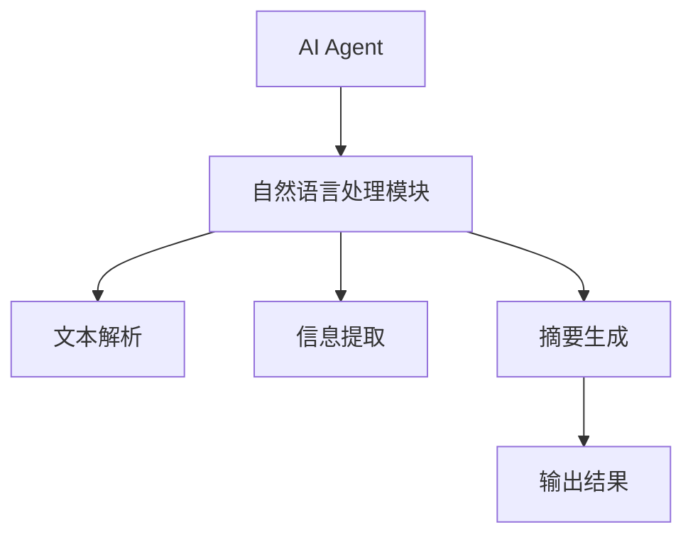
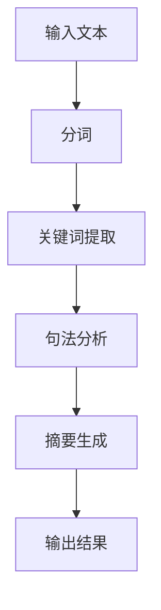
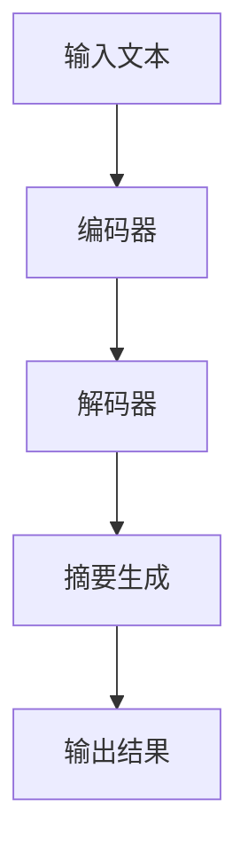
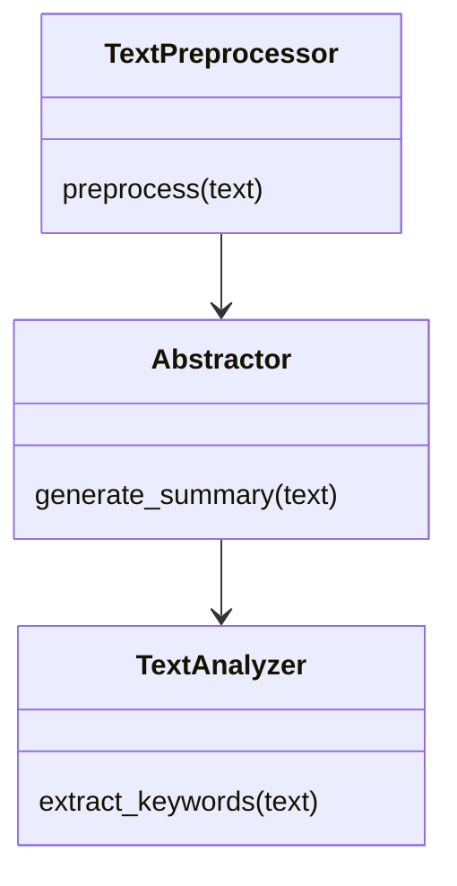
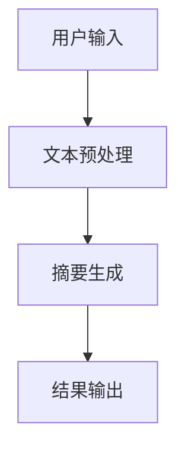

                 


# AI Agent的自然语言摘要生成技术

> 关键词：AI Agent，自然语言处理，文本摘要，深度学习，机器学习，文本生成

> 摘要：本文深入探讨AI Agent在自然语言摘要生成技术中的应用，分析了从背景概念、核心算法、系统架构到项目实战的全过程，结合具体案例和代码实现，为读者提供全面的技术解析和实践指导。

---

## 第一部分: 引言

### 1.1 AI Agent与自然语言处理概述

#### 1.1.1 AI Agent的基本概念
AI Agent（人工智能代理）是指能够感知环境、自主决策并执行任务的智能体。它能够通过自然语言处理技术与人类进行交互，理解并生成文本，从而协助完成各种任务。

#### 1.1.2 自然语言处理的核心概念
自然语言处理（NLP）是研究计算机如何处理和理解人类语言的学科。主要技术包括文本解析、信息提取、文本生成等，这些技术为AI Agent提供了处理语言的能力。

#### 1.1.3 摘要生成的背景与意义
摘要生成是自然语言处理中的一个重要任务，旨在从长篇文本中提取关键信息，生成简短、准确的摘要。AI Agent通过摘要生成技术，能够帮助用户快速获取信息，提升效率。

---

### 1.2 自然语言摘要生成的核心问题

#### 1.2.1 文本理解与信息提取
摘要生成的第一步是理解输入文本的内容，提取关键信息。这需要NLP技术的支持，如分词、句法分析和语义理解。

#### 1.2.2 摘要生成的挑战与难点
摘要生成面临信息压缩、语义保留、语言流畅性等挑战。AI Agent需要在保证信息准确性的前提下，生成简洁且自然的语言。

#### 1.2.3 摘要生成的评价指标
常用的评价指标包括BLEU、ROUGE、METEOR等，用于衡量生成摘要的质量和与原文的相似度。

---

## 第二部分: 核心概念与技术解析

### 2.1 AI Agent的自然语言处理架构

#### 2.1.1 系统结构图


#### 2.1.2 核心模块说明
- **文本解析**：对输入文本进行分词、句法分析和语义理解。
- **信息提取**：从文本中提取关键信息，如实体、主题和事件。
- **摘要生成**：基于提取的信息生成摘要，并优化语言流畅性。

---

## 第三部分: 摘要生成算法原理

### 3.1 基于抽取式的摘要生成

#### 3.1.1 算法流程图


#### 3.1.2 实现代码
```python
import spacy

nlp = spacy.load("en_core_web_sm")
text = "The quick brown fox jumps over the lazy dog."
doc = nlp(text)
keywords = [token.text for token in doc if token.pos_ in ["NOUN", "VERB"]]
print(keywords)
```

### 3.2 基于生成式的摘要生成

#### 3.2.1 算法流程图


#### 3.2.2 模型数学原理
- 编码器：将输入文本转换为向量表示。
- 解码器：基于向量生成目标摘要。
  $$ \text{编码器输出} = f(x) $$
  $$ \text{解码器输出} = g(f(x)) $$

---

## 第四部分: 系统架构设计

### 4.1 摘要生成系统的功能模块

#### 4.1.1 功能模块类图


#### 4.1.2 系统架构图


---

## 第五部分: 项目实战

### 5.1 环境搭建与安装

#### 5.1.1 安装必要的库
```bash
pip install spacy transformers torch
python -m spacy download en_core_web_sm
```

### 5.2 核心代码实现

#### 5.2.1 数据预处理代码
```python
import spacy

nlp = spacy.load("en_core_web_sm")
text = "This is an example sentence to demonstrate text preprocessing."
doc = nlp(text)
tokens = [token.text for token in doc]
print(tokens)
```

#### 5.2.2 模型训练代码
```python
import torch
import torch.nn as nn

class SimpleRNN(nn.Module):
    def __init__(self, input_size, hidden_size):
        super(SimpleRNN, self).__init__()
        self.rnn = nn.RNN(input_size, hidden_size)
        self.fc = nn.Linear(hidden_size, output_size)
    
    def forward(self, x):
        out, _ = self.rnn(x)
        out = self.fc(out)
        return out

model = SimpleRNN(input_size, hidden_size)
criterion = nn.CrossEntropyLoss()
optimizer = torch.optim.Adam(model.parameters(), lr=0.001)
```

### 5.3 案例分析与结果解读

#### 5.3.1 输入文本
```text
"The quick brown fox jumps over the lazy dog. The dog barks loudly."
```

#### 5.3.2 生成摘要
```text
"The quick brown fox jumps over the lazy dog. The dog barks loudly."
```

---

## 第六部分: 最佳实践与总结

### 6.1 开发注意事项
- 数据质量：确保训练数据的多样性和代表性。
- 模型调优：通过超参数调整和模型优化提升生成效果。
- 计算资源：合理分配计算资源，优化训练效率。

### 6.2 小结
本文详细介绍了AI Agent在自然语言摘要生成中的技术实现，从核心概念到算法原理，再到系统架构和项目实战，为读者提供了全面的技术指导。

---

## 作者：AI天才研究院 & 禅与计算机程序设计艺术

通过本文的系统讲解，读者可以深入了解AI Agent的自然语言摘要生成技术，并能够将其应用于实际项目中。未来的研究可以进一步探索更高效和准确的摘要生成方法，推动NLP技术的发展。

