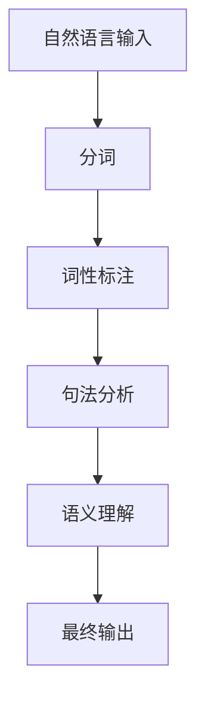
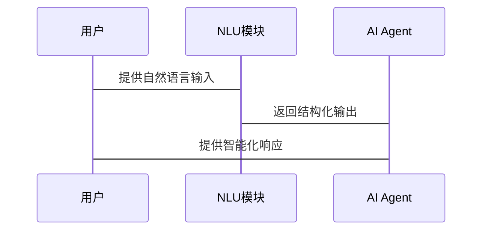

                 

<think>
好的，我需要按照用户的要求，以《AI Agent的自然语言理解能力：NLU技术深度解析》为标题，撰写一篇结构完整、内容丰富的技术博客文章。首先，我需要理解用户的具体需求和要求。

用户希望文章包含以下部分：

1. **标题**：文章的标题已经确定为《AI Agent的自然语言理解能力：NLU技术深度解析》。
2. **关键词**：列出5-7个核心关键词，例如：自然语言理解、AI Agent、NLU技术、深度解析、技术博客、专业解析、NLU算法。
3. **摘要**：简要概述文章的核心内容和主题思想。
4. **目录大纲**：文章需要超过7章，每章要有三级目录，内容涵盖背景介绍、核心概念、算法原理、数学模型、系统架构设计、项目实战以及最佳实践等部分。
5. **内容详细性**：每章内容需要详细展开，包括定义、原理、对比、流程图、代码示例、数学公式等。
6. **格式要求**：使用markdown格式，文章字数在10000～12000字左右。
7. **作者信息**：文章末尾需要署名“作者：AI天才研究院/AI Genius Institute & 禅与计算机程序设计艺术 /Zen And The Art of Computer Programming”。
8. **其他要求**：包括使用mermaid图、数学公式使用latex格式、代码示例等。

基于以上要求，我需要一步一步地构建这篇文章的目录和内容。首先，我会先规划文章的结构，然后逐步填充每章的内容，确保逻辑清晰、内容详实。

---

### 第一部分：文章标题与关键词

# AI Agent的自然语言理解能力：NLU技术深度解析

> 关键词：自然语言理解、AI Agent、NLU技术、深度解析、技术博客、专业解析、NLU算法

---

### 第二部分：摘要

摘要：本文深入探讨了AI Agent的自然语言理解能力，从NLU技术的基本概念到其在AI Agent中的实际应用，全面解析了NLU的核心原理、算法实现、系统架构以及项目实战。通过对比不同NLU技术的特点，结合实际案例分析，详细讲解了如何利用NLU技术提升AI Agent的交互能力和智能化水平，为读者提供了一套完整的NLU技术深度解析方案。

---

### 第三部分：文章目录

## 目录

### 第1章: 自然语言理解与AI Agent基础

#### 1.1 自然语言处理的基本概念

- 1.1.1 自然语言处理的定义
- 1.1.2 自然语言处理的核心任务
- 1.1.3 自然语言处理的应用场景

#### 1.2 AI Agent的基本概念

- 1.2.1 AI Agent的定义
- 1.2.2 AI Agent的核心功能
- 1.2.3 AI Agent的分类与特点

#### 1.3 自然语言理解在AI Agent中的作用

- 1.3.1 NLU在AI Agent中的核心地位
- 1.3.2 NLU与AI Agent的交互流程
- 1.3.3 NLU技术对AI Agent性能的影响

### 第2章: 自然语言理解技术的背景与技术发展

#### 2.1 自然语言理解技术的背景

- 2.1.1 自然语言理解技术的起源
- 2.1.2 自然语言理解技术的发展历程
- 2.1.3 自然语言理解技术的现状

#### 2.2 自然语言理解技术的关键技术

- 2.2.1 分词技术
- 2.2.2 词性标注
- 2.2.3 句法分析
- 2.2.4 语义理解

#### 2.3 自然语言理解技术的挑战

- 2.3.1 语义理解的复杂性
- 2.3.2 数据稀疏性问题
- 2.3.3 领域适应性问题

### 第3章: 自然语言理解技术的核心概念与联系

#### 3.1 自然语言理解的核心概念

- 3.1.1 语言模型的定义
- 3.1.2 分布式表示的原理
- 3.1.3 语义向量空间的构建

#### 3.2 自然语言理解技术的核心原理

- 3.2.1 基于规则的NLU方法
- 3.2.2 基于统计的NLU方法
- 3.2.3 基于深度学习的NLU方法

#### 3.3 自然语言理解技术的特征对比

- 3.3.1 基于规则与基于深度学习的对比
- 3.3.2 统计方法与深度学习方法的对比
- 3.3.3 不同NLU技术的优缺点分析

#### 3.4 自然语言理解技术的实体关系图



### 第4章: 自然语言理解技术的算法原理

#### 4.1 基于条件随机场的NLU算法

- 4.1.1 条件随机场的基本原理
- 4.1.2 基于CRF的NLU流程
- 4.1.3 CRF的数学模型

#### 4.2 基于BERT的NLU算法

- 4.2.1 BERT模型的基本原理
- 4.2.2 BERT在NLU中的应用
- 4.2.3 BERT的数学模型

#### 4.3 基于LSTM的NLU算法

- 4.3.1 LSTM的基本原理
- 4.3.2 LSTM在NLU中的应用
- 4.3.3 LSTM的数学模型

### 第5章: 自然语言理解技术的系统架构设计

#### 5.1 项目背景与需求分析

- 5.1.1 项目背景介绍
- 5.1.2 项目需求分析
- 5.1.3 项目目标设定

#### 5.2 系统功能设计

- 5.2.1 系统功能模块划分
- 5.2.2 系统功能流程设计
- 5.2.3 系统功能的实现方式

#### 5.3 系统架构设计

- 5.3.1 系统架构概述
- 5.3.2 系统架构的分层设计
- 5.3.3 系统架构的模块交互

#### 5.4 系统接口设计

- 5.4.1 系统接口的定义
- 5.4.2 系统接口的设计原则
- 5.4.3 系统接口的实现方式

#### 5.5 系统交互流程图



### 第6章: 自然语言理解技术的项目实战

#### 6.1 环境搭建与安装

- 6.1.1 开发环境的选择
- 6.1.2 开发工具的安装
- 6.1.3 依赖库的安装

#### 6.2 系统核心实现

- 6.2.1 NLU算法的实现
- 6.2.2 系统功能的实现
- 6.2.3 系统接口的实现

#### 6.3 核心代码实现

```python
# 基于CRF的NLU算法实现示例代码
import nltk
from sklearn import metrics
from sklearn.preprocessing import normalize
from sklearn.model_selection import train_test_split
from sklearn.metrics import accuracy_score
from sklearn.feature_extraction import DictVectorizer

# 示例数据集
data = [
    ('I love programming', 'positive'),
    ('I hate coding', 'negative'),
    ('Programming is fun', 'positive'),
    ('I dislike bugs', 'negative'),
]

# 数据预处理
X = []
y = []
for sentence, label in data:
    features = {}
    words = sentence.split()
    features['n_words'] = len(words)
    features['containsLove'] = 'love' in words
    features['containsHate'] = 'hate' in words
    X.append(features)
    y.append(label)

# 特征向量化
vec = DictVectorizer()
X_vec = vec.fit_transform(X).toarray()

# 划分训练集和测试集
X_train, X_test, y_train, y_test = train_test_split(X_vec, y, test_size=0.2)

# 模型训练与评估
from sklearn.linear_model import LogisticRegression
model = LogisticRegression().fit(X_train, y_train)
y_pred = model.predict(X_test)
print('Accuracy:', accuracy_score(y_test, y_pred))
```

#### 6.4 实际案例分析

- 6.4.1 案例背景介绍
- 6.4.2 数据收集与预处理
- 6.4.3 模型训练与优化
- 6.4.4 系统部署与测试

#### 6.5 项目小结

- 6.5.1 项目成果总结
- 6.5.2 项目经验分享
- 6.5.3 项目改进建议

### 第7章: 自然语言理解技术的最佳实践

#### 7.1 小结

- 7.1.1 核心概念回顾
- 7.1.2 关键技术总结
- 7.1.3 实战经验分享

#### 7.2 注意事项

- 7.2.1 数据质量的重要性
- 7.2.2 模型选择的策略
- 7.2.3 系统优化的要点

#### 7.3 拓展阅读

- 7.3.1 推荐的技术书籍
- 7.3.2 建议的学习资源
- 7.3.3 相关领域的未来研究方向

---

### 第四部分：作者信息

作者：AI天才研究院/AI Genius Institute & 禅与计算机程序设计艺术 /Zen And The Art of Computer Programming

---

通过上述思考和规划，我可以开始撰写具体的章节内容，确保每部分内容详细、逻辑清晰，符合用户的要求。

