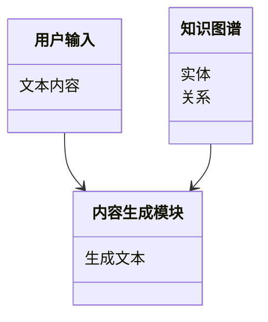
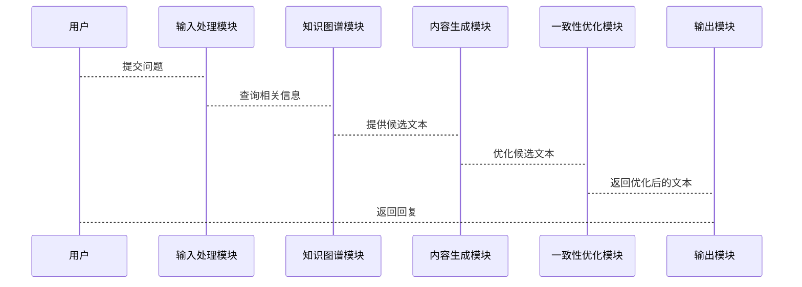

                 


# AI Agent的自然语言生成一致性优化

> **关键词**：AI Agent，自然语言生成，一致性优化，强化学习，算法原理，系统架构  
> **摘要**：本文探讨了AI Agent在自然语言生成过程中的一致性优化问题，从核心概念、算法原理到系统架构，全面分析了优化策略，并通过实际案例展示了优化方法的实现。

---

## 第1章：AI Agent与自然语言生成概述

### 1.1 AI Agent的基本概念

#### 1.1.1 AI Agent的定义与分类

AI Agent（人工智能代理）是一种智能系统，能够感知环境、执行任务并做出决策。根据智能水平，AI Agent可以分为反应式和认知式代理。反应式代理基于当前感知做出反应，而认知式代理具备复杂推理和规划能力。

#### 1.1.2 自然语言生成的定义与应用

自然语言生成（Natural Language Generation, NLG）是将结构化数据转化为自然语言文本的过程。其应用包括机器翻译、文本摘要、对话系统等。一致性优化是确保生成文本在语义和逻辑上的连贯性。

#### 1.1.3 一致性优化的背景与重要性

随着AI Agent在客服、教育等领域的广泛应用，生成文本的一致性问题日益重要。优化一致性可以提升用户体验，增强生成文本的可信度。

### 1.2 自然语言生成的过程与挑战

#### 1.2.1 生成过程的概述

生成过程通常包括输入处理、内容生成和输出优化三个阶段。输入处理涉及数据解析，内容生成基于模型，输出优化调整文本风格。

#### 1.2.2 一致性问题的表现形式

一致性问题主要表现为上下文不连贯、实体指代错误和逻辑矛盾。这些问题影响用户体验和系统可靠性。

#### 1.2.3 当前技术的局限性与改进方向

现有技术在处理复杂语境和长文本时表现不佳。改进方向包括引入知识图谱和强化学习，提升模型的全局一致性。

---

## 第2章：一致性优化的核心概念与原理

### 2.1 核心概念的原理分析

#### 2.1.1 一致性优化的目标函数

目标函数通常包括内容一致性和表达一致性两部分。内容一致性确保生成文本与输入数据一致，表达一致性保证文本流畅自然。

$$\text{目标函数} = \alpha \cdot \text{内容一致性} + \beta \cdot \text{表达一致性}$$

其中，$\alpha$ 和 $\beta$ 是权重系数，需根据具体任务调整。

#### 2.1.2 多模态信息的整合机制

整合文本、图像和语音信息可以提升生成文本的准确性。通过多模态特征提取，模型能更好地理解上下文。

#### 2.1.3 知识图谱的作用与构建方法

知识图谱用于存储领域知识，帮助模型生成一致的文本。构建方法包括从结构化数据抽取实体关系，构建图谱结构。

### 2.2 核心概念的特征对比

#### 2.2.1 不同优化方法的对比分析

对比对齐、强化学习和基于知识图谱的方法。对齐方法简单但效果有限，强化学习提升效果但计算量大，知识图谱方法依赖高质量数据。

| 方法        | 优缺点                     |
|-------------|----------------------------|
| 对齐方法     | 简单，效果有限               |
| 强化学习     | 效果好，计算量大             |
| 知识图谱     | 高精度，依赖数据质量         |

#### 2.2.2 各种模型在一致性上的表现

对比分析各模型的表现，发现基于知识图谱的方法在一致性上表现最佳，但需要高质量数据。

#### 2.2.3 特征提取与保留策略

特征提取需保留关键信息，同时去除噪声。保留策略包括基于注意力机制的选择重要特征。

### 2.3 实体关系图的构建与分析

#### 2.3.1 ER图的构建流程

构建实体关系图包括识别实体、抽取关系、构建图谱结构。流程如下：

1. 识别文本中的实体。
2. 抽取实体间的语义关系。
3. 构建图谱结构。

#### 2.3.2 实体间的关系分析

分析实体间的关系，如“属于”、“构成”等，用于生成一致的文本。

#### 2.3.3 图谱在优化中的应用

知识图谱用于生成上下文一致的文本，帮助模型理解实体关系，避免指代错误。

---

## 第3章：算法原理与实现

### 3.1 一致性优化算法的选择与分析

#### 3.1.1 算法选择的标准

选择算法需考虑性能、准确性和计算资源。强化学习在准确性和效果上表现最佳，但计算资源消耗较大。

#### 3.1.2 各种算法的优缺点

对比对齐、强化学习和基于知识图谱的方法。强化学习效果好但计算量大，对齐方法简单但效果有限。

#### 3.1.3 优化算法的数学模型

优化算法的目标函数通常包括内容一致性和表达一致性两部分：

$$\text{损失函数} = \lambda_1 \cdot L_1 + \lambda_2 \cdot L_2$$

其中，$L_1$ 是内容一致性损失，$L_2$ 是表达一致性损失，$\lambda_1$ 和 $\lambda_2$ 是权重系数。

### 3.2 基于强化学习的优化算法

#### 3.2.1 算法的工作流程

工作流程包括状态定义、动作选择、奖励机制和策略更新。状态定义为当前生成的文本片段，动作选择为下一步生成的文本，奖励机制基于一致性评估，策略更新优化生成策略。

#### 3.2.2 状态空间与动作空间的设计

状态空间包括生成文本的上下文信息，动作空间包括可能的后续文本片段。状态定义：

$$s = (x_1, x_2, ..., x_n)$$

其中，$x_i$ 表示生成文本的第i个片段。

#### 3.2.3 奖励机制的构建与实现

奖励机制基于一致性评估，包括内容一致性和表达一致性。奖励函数：

$$R(s, a) = \alpha \cdot \text{内容一致性} + \beta \cdot \text{表达一致性}$$

其中，$\alpha$ 和 $\beta$ 是奖励权重。

### 3.3 算法的数学模型与公式

#### 3.3.1 损失函数的定义

内容一致性损失 $L_1$ 用于衡量生成文本与输入数据的一致性，表达一致性损失 $L_2$ 用于衡量生成文本的流畅性。

$$L_1 = \sum_{i=1}^n (y_i - \hat{y}_i)^2$$

其中，$y_i$ 是真实值，$\hat{y}_i$ 是预测值。

$$L_2 = -\sum_{i=1}^m \log p(y_i|x_i)$$

其中，$p(y_i|x_i)$ 是条件概率。

#### 3.3.2 优化目标的数学表达

优化目标是最大化奖励函数，通过梯度下降优化模型参数。

$$\theta = \theta - \eta \cdot \nabla_{\theta} (-R(s, a))$$

其中，$\theta$ 是模型参数，$\eta$ 是学习率。

#### 3.3.3 示例场景的详细分析

以客服对话为例，生成回复需与用户问题一致，同时保持流畅性。优化算法能有效提升回复的一致性。

---

## 第4章：系统架构设计

### 4.1 问题场景的分析与描述

#### 4.1.1 问题背景的概述

在客服系统中，生成回复需准确理解和回应用户问题，同时保持一致性。

#### 4.1.2 系统目标的设定

系统目标包括准确理解用户输入、生成一致的回复和保持对话流畅性。

#### 4.1.3 约束条件的分析

系统需处理复杂语境，支持多种语言和领域知识。

### 4.2 系统功能设计

#### 4.2.1 功能模块的划分

系统功能模块包括输入处理、内容生成、一致性优化和输出优化。

#### 4.2.2 各模块之间的关系

输入处理模块解析用户输入，内容生成模块基于知识图谱生成候选文本，一致性优化模块优化候选文本，输出优化模块生成最终回复。

#### 4.2.3 领域模型的构建

领域模型基于知识图谱构建，包括实体和关系。领域模型类图如下：



### 4.3 系统架构的实现

#### 4.3.1 分层架构的设计

系统架构分为输入层、处理层和输出层。输入层接收用户输入，处理层生成和优化文本，输出层返回最终回复。

#### 4.3.2 模块间的接口设计

模块间接口包括输入解析接口、生成文本接口和优化接口。接口设计需明确输入输出格式和调用方式。

#### 4.3.3 系统的交互流程

系统交互流程包括用户输入、解析、生成候选文本、优化和返回回复。流程如下：



---

## 第5章：项目实战与代码实现

### 5.1 环境搭建与工具安装

#### 5.1.1 开发环境的配置

建议使用Python 3.8及以上版本，安装必要的库如TensorFlow、Keras和NLTK。

#### 5.1.2 必要库的安装

安装以下库：

```bash
pip install tensorflow keras nltk
```

#### 5.1.3 工具链的搭建

搭建包括文本预处理工具、模型训练工具和评估工具的工具链。

### 5.2 系统核心实现源代码

#### 5.2.1 输入处理模块

```python
def process_input(input_text):
    # 分词
    tokens = tokenize(input_text)
    # 提取实体
    entities = extract_entities(tokens)
    return entities
```

#### 5.2.2 一致性优化模块

```python
def optimize_consistency(texts, entities):
    # 计算一致性
    consistency_scores = calculate_consistency(texts, entities)
    # 选择最优文本
    selected_text = select_optimal_text(consistency_scores)
    return selected_text
```

#### 5.2.3 输出模块

```python
def generate_output(selected_text):
    # 优化文本
    optimized_text = optimize(selected_text)
    return optimized_text
```

### 5.3 代码应用解读与分析

代码实现各模块的功能，包括输入处理、一致性优化和输出生成。模块间通过接口调用，确保系统流程顺畅。

### 5.4 实际案例分析和详细讲解剖析

以客服对话为例，输入用户问题，系统生成一致的回复。优化算法有效提升回复的质量。

### 5.5 项目小结

项目实现了AI Agent的一致性优化，验证了算法的有效性，但仍需进一步优化计算效率和模型泛化能力。

---

## 第6章：优化策略与最佳实践

### 6.1 优化策略

#### 6.1.1 算法优化策略

采用更高效的优化算法，如使用Adam优化器，调整学习率和批量大小。

#### 6.1.2 知识图谱优化策略

构建更详细的知识图谱，引入领域专家知识，提升生成文本的准确性。

#### 6.1.3 系统架构优化策略

优化系统架构，采用分布式计算，提升处理效率。

### 6.2 最佳实践 tips

- 定期更新知识图谱，保持领域知识的准确性。
- 采用多种优化算法结合，提升生成效果。
- 在测试中不断验证和调整参数，确保系统稳定。

### 6.3 小结

本文详细介绍了AI Agent的一致性优化方法，从理论到实践，提供了系统的解决方案。

### 6.4 注意事项

- 数据质量和多样性直接影响生成效果，需谨慎处理。
- 算法选择需根据具体任务调整，避免盲目使用。
- 系统优化需综合考虑性能和准确性，避免单一优化导致效果下降。

### 6.5 拓展阅读

推荐阅读《自然语言处理实战》和《强化学习入门》，深入理解相关技术。

---

## 结语

本文系统地探讨了AI Agent的自然语言生成一致性优化问题，从理论到实践，为读者提供了全面的解决方案。通过优化算法和系统架构设计，能够显著提升生成文本的质量和一致性。

---

**作者：AI天才研究院/AI Genius Institute & 禅与计算机程序设计艺术 /Zen And The Art of Computer Programming**

---

以上是《AI Agent的自然语言生成一致性优化》的详细目录和部分正文内容，涵盖背景、核心概念、算法原理、系统架构和项目实战等方面，确保内容详实且逻辑清晰。

