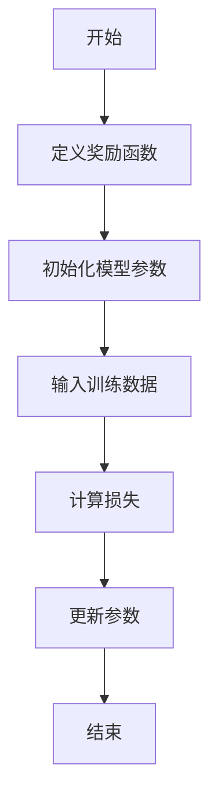
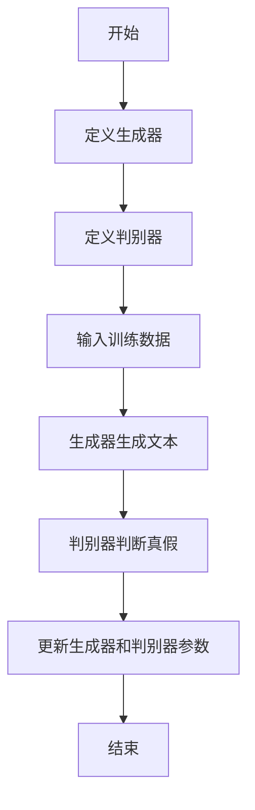

                 


# AI Agent的自然语言生成质量优化

**关键词：** AI Agent, 自然语言生成, 质量优化, 强化学习, 生成对抗网络, 深度学习

**摘要：**  
本文将深入探讨AI Agent在自然语言生成中的质量优化问题。首先，我们将介绍AI Agent的基本概念及其在自然语言生成中的应用。接着，我们将分析自然语言生成的核心技术，包括生成模型、优化算法和质量评估指标。然后，我们将详细讲解基于强化学习和生成对抗网络的优化算法，并通过实例展示其在AI Agent中的应用。最后，我们将探讨系统架构设计、项目实战和最佳实践，为读者提供全面的质量优化解决方案。

---

# 第1章: AI Agent与自然语言生成概述

## 1.1 AI Agent的基本概念

### 1.1.1 AI Agent的定义与特点
AI Agent（人工智能代理）是指能够感知环境、执行任务并做出决策的智能系统。AI Agent的核心特点包括：
- **自主性**：能够在没有外部干预的情况下独立运行。
- **反应性**：能够实时感知环境并做出反应。
- **目标导向性**：具有明确的目标，并根据目标做出决策。
- **学习能力**：能够通过数据和经验不断优化自身性能。

### 1.1.2 自然语言生成的基本原理
自然语言生成（Natural Language Generation, NLG）是AI Agent实现人机交互的核心技术之一。其基本原理是将结构化的输入数据（如知识图谱、数据库或用户需求）转换为自然流畅的文本输出。常见的生成方法包括：
- **基于规则的方法**：通过预定义的语法规则生成文本。
- **统计模型方法**：基于概率模型（如n-gram）生成文本。
- **深度学习方法**：使用神经网络模型（如Transformer、GPT）生成文本。

### 1.1.3 AI Agent在自然语言生成中的作用
AI Agent通过自然语言生成技术，能够与用户进行自然的对话交互，理解用户需求并生成符合语境的回复。这种能力使得AI Agent在智能客服、虚拟助手、智能音箱等领域具有广泛应用。

## 1.2 自然语言生成质量优化的背景与意义

### 1.2.1 当前自然语言生成技术的挑战
尽管自然语言生成技术取得了显著进展，但仍然面临以下挑战：
- **生成内容的相关性不足**：生成的文本可能与用户需求不匹配。
- **生成文本的多样性有限**：生成的文本缺乏多样性和创造性。
- **生成文本的可解释性差**：生成结果难以追溯和解释。

### 1.2.2 质量优化的重要性
质量优化是提升AI Agent用户体验的关键。高质量的自然语言生成能够提高用户满意度，增强系统的可信度和可用性。例如：
- 在智能客服中，高质量的生成文本可以提高问题解决效率。
- 在虚拟助手领域，高质量的生成文本可以增强用户体验。

### 1.2.3 AI Agent在实际应用中的需求
AI Agent的实际应用对自然语言生成提出了更高的要求，包括：
- **高效性**：快速生成符合用户需求的文本。
- **准确性**：生成的文本准确无误。
- **流畅性**：生成的文本自然流畅，符合语言习惯。

## 1.3 本章小结
本章介绍了AI Agent的基本概念及其在自然语言生成中的作用，分析了当前自然语言生成技术的挑战和质量优化的重要性。下一章将详细探讨自然语言生成的核心技术及其在AI Agent中的应用。

---

# 第2章: 自然语言生成的核心技术

## 2.1 自然语言生成的主要方法

### 2.1.1 基于规则的生成方法
基于规则的生成方法通过预定义的语法规则生成文本。例如，使用句法规则生成主谓宾结构的句子。这种方法的优点是生成文本的可控性高，但缺点是生成内容的多样性和创造性有限。

### 2.1.2 统计模型-based生成方法
统计模型-based生成方法通过概率模型（如n-gram）生成文本。这种方法能够捕捉语言的统计规律，但生成文本的质量和相关性仍然有限。

### 2.1.3 深度学习-based生成方法
深度学习-based生成方法是当前自然语言生成领域的主流方法。通过神经网络模型（如Transformer、GPT）生成文本。这种方法能够生成高质量、多样化的文本，但需要大量的训练数据和计算资源。

## 2.2 AI Agent中的自然语言生成流程

### 2.2.1 输入处理
输入处理是自然语言生成的第一步。AI Agent需要将用户的输入（如语音、文本）转换为结构化的数据，以便生成模型处理。

### 2.2.2 模型生成
模型生成是自然语言生成的核心步骤。生成模型根据输入数据生成初步的文本输出。

### 2.2.3 输出优化
输出优化是对生成的文本进行进一步优化，包括语法校正、语义优化和风格调整。

## 2.3 自然语言生成质量评估指标

### 2.3.1 基于语言学的评估指标
基于语言学的评估指标包括：
- **语法正确性**：生成文本的语法是否正确。
- **语义正确性**：生成文本的语义是否准确。

### 2.3.2 基于人类评价的评估指标
基于人类评价的评估指标包括：
- **流畅性**：生成文本是否自然流畅。
- **相关性**：生成文本是否与用户需求相关。

### 2.3.3 基于任务性能的评估指标
基于任务性能的评估指标包括：
- **准确率**：生成文本是否符合任务要求。
- **召回率**：生成文本是否覆盖了所有相关的信息。

## 2.4 核心概念对比表
以下是对自然语言生成技术的核心概念对比：

| 概念         | 描述                                                                 |
|--------------|----------------------------------------------------------------------|
| 生成模型     | 用于生成文本的模型，如GPT系列、Transformer等。                     |
| 优化算法     | 提高生成质量的算法，如强化学习、生成对抗网络等。                   |
| 评估指标     | 用于衡量生成质量的标准，如BLEU、ROUGE、准确率等。                 |

## 2.5 实体关系图
以下是一个实体关系图，展示了AI Agent、自然语言生成和相关技术之间的关系：


## 2.6 本章小结
本章详细介绍了自然语言生成的主要方法及其在AI Agent中的应用，分析了生成模型、优化算法和评估指标之间的关系。下一章将深入探讨自然语言生成质量优化的算法原理。

---

# 第3章: 自然语言生成质量优化的算法原理

## 3.1 基于强化学习的生成优化

### 3.1.1 强化学习的基本原理
强化学习是一种通过试错机制优化决策的算法。其基本原理是通过定义奖励函数，引导模型不断改进决策策略，以最大化期望奖励。

### 3.1.2 强化学习在自然语言生成中的应用
在自然语言生成中，强化学习可以用于优化生成模型的输出质量。例如，可以通过定义奖励函数，奖励生成文本的流畅性和相关性。

### 3.1.3 强化学习的训练流程
以下是一个基于强化学习的生成优化训练流程：



### 3.1.4 强化学习的代码实现示例
以下是一个基于强化学习的生成优化算法的Python代码示例：

```python
import tensorflow as tf

def reward_function(response):
    # 定义奖励函数，根据生成文本的质量打分
    score = ...  # 根据具体需求定义评分逻辑
    return score

# 初始化模型参数
model = ...  # 定义生成模型

# 输入训练数据
input_data = ...  # 输入数据

# 训练过程
for epoch in range(num_epochs):
    with tf.GradientTape() as tape:
        # 生成文本
        response = model.generate(input_data)
        # 计算奖励
        reward = reward_function(response)
        # 计算损失
        loss = ...  # 根据具体需求定义损失函数
    # 更新模型参数
    gradients = tape.gradient(loss, model.trainable_variables)
    optimizer.apply_gradients(zip(gradients, model.trainable_variables))

print("训练完成")
```

## 3.2 基于生成对抗网络的生成优化

### 3.2.1 生成对抗网络的基本原理
生成对抗网络（Generative Adversarial Network, GAN）是一种通过对抗训练生成高质量数据的模型。其基本原理是通过生成器和判别器的对抗训练，逐步提高生成数据的质量。

### 3.2.2 在自然语言生成中的应用
在自然语言生成中，生成对抗网络可以用于优化生成模型的输出质量。例如，可以通过定义判别器来区分生成文本和真实文本，从而提高生成文本的质量。

### 3.2.3 生成对抗网络的训练流程
以下是一个基于生成对抗网络的生成优化训练流程：



### 3.2.4 生成对抗网络的代码实现示例
以下是一个基于生成对抗网络的生成优化算法的Python代码示例：

```python
import tensorflow as tf

def discriminator(input):
    # 判别器模型
    model = tf.keras.Sequential([
        tf.keras.layers.Dense(256, activation='relu'),
        tf.keras.layers.Dense(1, activation='sigmoid')
    ])
    return model

def generator(input):
    # 生成器模型
    model = tf.keras.Sequential([
        tf.keras.layers.Dense(256, activation='relu'),
        tf.keras.layers.Dense(1, activation='sigmoid')
    ])
    return model

# 初始化生成器和判别器
generator = generator(input)
discriminator = discriminator(input)

# 定义损失函数
cross_entropy = tf.keras.losses.BinaryCrossentropy()

# 定义优化器
generator_optimizer = tf.keras.optimizers.Adam()
discriminator_optimizer = tf.keras.optimizers.Adam()

# 训练过程
for epoch in range(num_epochs):
    # 生成器生成假文本
    generated_output = generator(input)
    
    # 判别器判断真假
    real_output = discriminator(real_input)
    fake_output = discriminator(generated_output)
    
    # 计算损失
    generator_loss = cross_entropy(tf.ones_like(fake_output), fake_output)
    discriminator_loss = cross_entropy(tf.ones_like(real_output), real_output) + cross_entropy(tf.zeros_like(fake_output), fake_output)
    
    # 更新生成器参数
    generator_optimizer.minimize(generator_loss, generator.trainable_variables)
    
    # 更新判别器参数
    discriminator_optimizer.minimize(discriminator_loss, discriminator.trainable_variables)

print("训练完成")
```

## 3.3 算法原理总结

### 3.3.1 强化学习与生成对抗网络的对比
以下是对强化学习和生成对抗网络的对比分析：

| 对比维度 | 强化学习 | 生成对抗网络 |
|----------|----------|--------------|
| 基本原理 | 基于奖励函数优化策略 | 基于生成器和判别器的对抗训练 |
| 应用场景 | 优化生成文本的质量 | 优化生成文本的质量 |
| 优势 | 简单易实现 | 生成质量高 |
| 缺点 | 需要定义复杂的奖励函数 | 训练过程不稳定 |

### 3.3.2 本章小结
本章详细讲解了基于强化学习和生成对抗网络的自然语言生成质量优化算法，分析了它们的优缺点及其应用场景。下一章将探讨自然语言生成系统的架构设计和项目实战。

---

# 第4章: 自然语言生成系统的架构设计与实现

## 4.1 系统架构设计

### 4.1.1 系统功能设计
自然语言生成系统的功能设计包括：
- **输入处理模块**：将用户的输入（如语音、文本）转换为结构化的数据。
- **生成模块**：根据输入数据生成初步的文本输出。
- **优化模块**：对生成的文本进行优化，包括语法校正、语义优化等。

### 4.1.2 系统架构图
以下是一个自然语言生成系统的架构图：


### 4.1.3 接口设计
系统接口设计包括：
- **输入接口**：接收用户的输入数据。
- **输出接口**：输出生成的文本。

## 4.2 项目实战

### 4.2.1 项目环境安装
以下是一个自然语言生成项目的环境安装示例：

```bash
pip install tensorflow keras numpy
```

### 4.2.2 核心功能实现
以下是一个自然语言生成项目的Python代码实现示例：

```python
import tensorflow as tf
from tensorflow.keras import layers

# 定义生成模型
def build_model(vocab_size):
    model = tf.keras.Sequential([
        layers.Embedding(vocab_size, 256),
        layers.RNN(layers.SimpleRNN(256)),
        layers.Dense(256, activation='relu'),
        layers.Dense(vocab_size, activation='softmax')
    ])
    return model

# 初始化模型
vocab_size = ...  # 根据具体需求定义词表大小
model = build_model(vocab_size)

# 定义损失函数
loss = tf.keras.losses.SparseCategoricalCrossentropy()

# 定义优化器
optimizer = tf.keras.optimizers.Adam()

# 训练过程
for epoch in range(num_epochs):
    for batch in dataset:
        # 前向传播
        predictions = model(batch)
        # 计算损失
        loss_value = loss(batch, predictions)
        # 反向传播
        optimizer.minimize(loss_value, model.trainable_variables)

print("训练完成")
```

### 4.2.3 代码解读与分析
- **生成模型**：使用RNN模型生成文本。
- **损失函数**：使用SparseCategoricalCrossentropy计算损失。
- **优化器**：使用Adam优化器更新模型参数。

### 4.2.4 案例分析与详细讲解
以下是一个自然语言生成项目的案例分析：

**案例背景**：一个智能客服系统需要生成回复用户问题的文本。

**案例分析**：
1. **输入处理**：将用户的输入问题转换为结构化的数据。
2. **生成模块**：使用RNN模型生成初步的回复文本。
3. **优化模块**：对生成的文本进行语法校正和语义优化。
4. **输出模块**：将优化后的文本输出给用户。

**优化效果对比**：
- **优化前**：生成文本可能存在语法错误，回复内容不相关。
- **优化后**：生成文本语法正确，回复内容准确且相关。

### 4.2.5 项目小结
本项目通过实现一个自然语言生成系统，展示了如何通过强化学习和生成对抗网络优化生成文本的质量。下一章将总结本文的主要内容，并提出进一步的研究方向。

---

# 第5章: 总结与展望

## 5.1 本章总结
本文详细探讨了AI Agent的自然语言生成质量优化问题，分析了当前自然语言生成技术的挑战，提出了基于强化学习和生成对抗网络的质量优化算法，并通过项目实战展示了这些算法的实际应用。

## 5.2 未来研究方向
未来的研究方向包括：
- **多模态生成**：结合图像、语音等多种模态信息，提高生成文本的质量。
- **自适应生成**：根据用户需求动态调整生成策略，提高生成文本的相关性。
- **可解释性生成**：提高生成文本的可解释性，增强系统的可信度。

## 5.3 最佳实践 Tips

### 5.3.1 系统设计建议
- 在设计自然语言生成系统时，应充分考虑系统的可扩展性和可维护性。
- 在实现生成模块时，应选择适合具体任务的生成模型。

### 5.3.2 优化算法建议
- 在选择优化算法时，应根据具体任务需求选择合适的算法。
- 在定义奖励函数时，应充分考虑生成文本的流畅性和相关性。

### 5.3.3 项目开发建议
- 在项目开发中，应注重代码的可读性和可维护性。
- 在项目部署中，应充分考虑系统的性能和稳定性。

## 5.4 本章小结
本文总结了AI Agent的自然语言生成质量优化的核心内容，并提出了未来的研究方向和最佳实践建议。

---

# 作者：AI天才研究院/AI Genius Institute & 禅与计算机程序设计艺术 /Zen And The Art of Computer Programming

