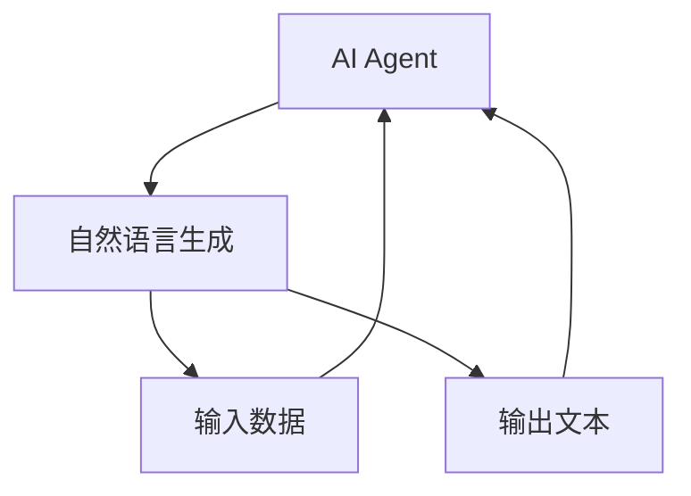
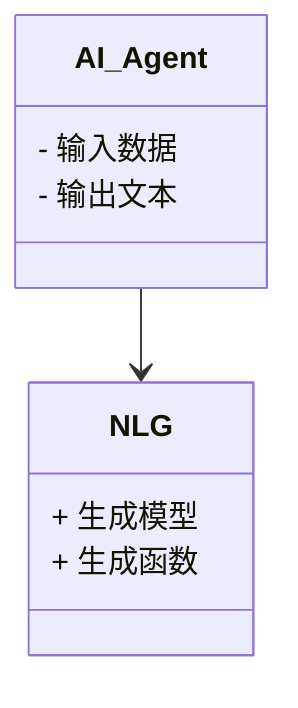
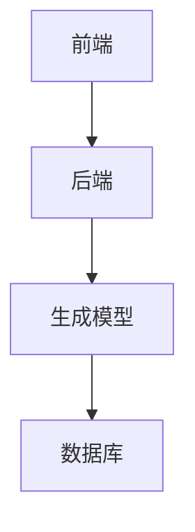
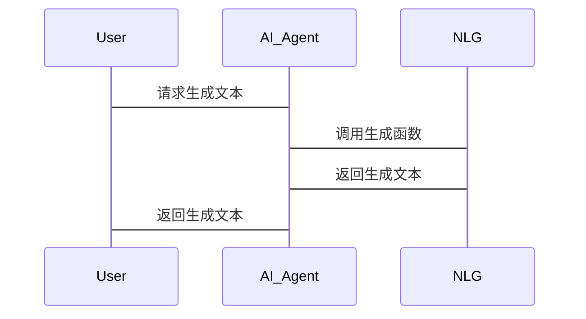

                 


# AI Agent的自然语言生成（NLG）技术应用

## 关键词
- AI Agent
- 自然语言生成（NLG）
- 生成式模型
- Transformer
- GPT

## 摘要
AI Agent的自然语言生成（NLG）技术应用是人工智能领域的重要研究方向，旨在通过AI代理生成高质量的自然语言文本。本文将从背景、核心概念、算法原理、系统架构、项目实战到最佳实践，全面解析NLG技术在AI Agent中的应用，帮助读者深入理解并掌握相关技术。

---

# 第1章: AI Agent与自然语言生成（NLG）概述

## 1.1 问题背景与问题描述
### 1.1.1 自然语言生成（NLG）技术的定义
自然语言生成（NLG）是人工智能中的一个子领域，旨在将结构化数据（如数据库中的信息、知识图谱或逻辑推理结果）转换为自然语言文本。NLG技术广泛应用于智能客服、自动报告生成、对话系统等领域。

### 1.1.2 AI Agent在NLG中的作用
AI Agent是一种能够感知环境、执行任务并做出决策的智能实体。在NLG中，AI Agent负责接收输入数据、调用生成模型，并将生成的文本返回给用户。

### 1.1.3 问题解决与边界外延
通过NLG技术，AI Agent能够以自然语言形式与用户交互，解决信息查询、任务执行等问题。其边界包括数据输入格式、生成文本长度和语言风格。

## 1.2 核心概念与联系
### 1.2.1 AI Agent与NLG的关系
AI Agent需要NLG技术来生成自然语言输出，而NLG技术依赖AI Agent来实现上下文理解和任务执行。

### 1.2.2 核心概念原理
NLG技术的核心是将结构化数据转化为自然语言，AI Agent的核心是感知与执行任务。

### 1.2.3 ER实体关系图架构


---

# 第2章: 自然语言生成（NLG）技术的核心算法原理

## 2.1 生成式模型概述
### 2.1.1 Transformer模型
Transformer模型通过自注意力机制捕捉文本中的语义关系，广泛应用于NLG任务。

### 2.1.2 GPT系列模型
GPT系列模型（如GPT-2、GPT-3）采用自回归方式生成文本，具有强大的语言建模能力。

### 2.1.3 Seq2Seq模型
Seq2Seq模型通过编码器-解码器结构将输入序列映射为输出序列。

## 2.2 算法原理与数学模型
### 2.2.1 Transformer的注意力机制
注意力机制通过计算输入序列中每个词的重要性，生成位置编码。

### 2.2.2 编码器-解码器结构
编码器将输入序列转换为上下文向量，解码器基于这些向量生成输出序列。

### 2.2.3 概率生成模型
$$P(y|x) = \prod_{i=1}^n P(y_i|x_{i-1})$$

## 2.3 算法实现与代码示例
### 2.3.1 Python代码实现
```python
def generate_text(model, tokenizer, input_text):
    inputs = tokenizer(input_text, return_tensors='np')
    outputs = model.generate(inputs.input_ids, max_length=50)
    return tokenizer.decode(outputs[0], skip_special_tokens=True)
```

---

# 第3章: 系统分析与架构设计方案

## 3.1 问题场景与项目介绍
### 3.1.1 AI Agent NLG应用场景
AI Agent通过NLG技术生成自然语言文本，应用于智能客服、自动报告生成等场景。

## 3.2 系统功能设计
### 3.2.1 领域模型设计


## 3.3 系统架构设计
### 3.3.1 系统架构


## 3.4 系统接口设计
### 3.4.1 接口设计
AI Agent通过API调用NLG模块生成文本。

## 3.5 系统交互设计
### 3.5.1 交互流程


---

# 第4章: 项目实战

## 4.1 环境安装
### 4.1.1 安装Python
```bash
python --version
```

## 4.2 系统核心实现
### 4.2.1 核心代码实现
```python
import torch
from torch import nn
class NLG_Model(nn.Module):
    def __init__(self, vocab_size):
        super().__init__()
        self.embedding = nn.Embedding(vocab_size, 64)
        self.decoder = nn.Linear(64, vocab_size)
    def forward(self, input):
        embedding = self.embedding(input)
        output = self.decoder(embedding)
        return output
```

## 4.3 代码解读与分析
### 4.3.1 代码解读
上述代码定义了一个简单的NLG模型，包括嵌入层和解码层。

## 4.4 实际案例分析
### 4.4.1 案例分析
通过训练数据生成特定风格的文本，如正式报告或对话回复。

## 4.5 项目小结
项目展示了AI Agent与NLG技术的结合，通过实际案例分析，总结了模型调优和生成效果提升的方法。

---

# 第5章: 最佳实践与总结

## 5.1 小结
通过本文的介绍，读者可以系统地了解AI Agent的NLG技术应用。

## 5.2 注意事项
数据隐私、模型调优、生成结果评估是实际应用中需要注意的问题。

## 5.3 拓展阅读
推荐相关书籍和论文，深入学习NLG技术。

---

作者：AI天才研究院/AI Genius Institute & 禅与计算机程序设计艺术 /Zen And The Art of Computer Programming

