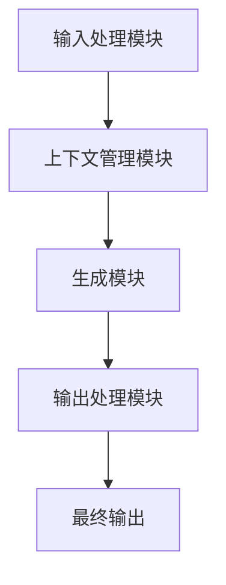
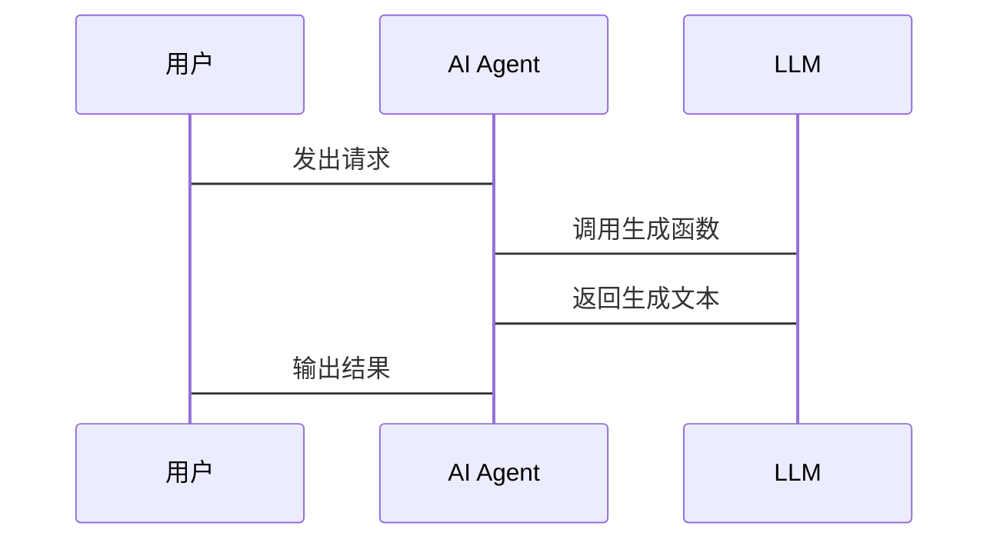

                 


# AI Agent的自然语言生成：提升LLM的文本连贯性

## 关键词
AI Agent, 自然语言生成, 大语言模型, 文本连贯性, LLM优化

## 摘要
本文探讨AI Agent在自然语言生成中的作用，特别是如何通过AI Agent提升大语言模型（LLM）的文本连贯性。文章从背景、核心概念、算法原理、系统设计、项目实战到最佳实践，全面分析提升LLM文本连贯性的方法，并提供具体实现方案和案例分析，为研究人员和开发者提供参考。

---

# 第一部分：AI Agent与自然语言生成概述

## 第1章：AI Agent的基本概念

### 1.1 AI Agent的定义
AI Agent（智能代理）是能够感知环境、采取行动以实现目标的实体。AI Agent可以是软件程序，用于执行特定任务，如推荐系统、聊天机器人等。

### 1.2 AI Agent的核心特征
- **自主性**：无需外部干预，自主决策。
- **反应性**：能感知环境变化并实时调整行动。
- **目标导向**：所有行为都围绕实现特定目标。
- **社交能力**：能与其他系统或人类交互协作。

### 1.3 AI Agent与传统程序的区别
- **自主性**：传统程序按预设规则运行，AI Agent具备自主决策能力。
- **学习能力**：AI Agent能通过数据学习和优化，传统程序无法。
- **适应性**：AI Agent能适应环境变化，传统程序则固定不变。

## 第2章：自然语言生成的定义与特点

### 2.1 自然语言生成的定义
自然语言生成（NLG）是将结构化数据转化为自然语言文本的过程，涉及语言学、计算机科学等多个领域。

### 2.2 自然语言生成的核心技术
- **文本规划**：确定生成内容的结构和信息。
- **句法生成**：生成语法正确的句子。
- **语义生成**：确保生成文本语义通顺。
- **文本优化**：优化生成文本的流畅性和可读性。

### 2.3 自然语言生成的应用场景
- **聊天机器人**：提供流畅的对话体验。
- **自动摘要**：将长文本压缩成简洁摘要。
- **机器翻译**：实现不同语言之间的转换。

## 第3章：大语言模型（LLM）概述

### 3.1 大语言模型的定义
大语言模型是指经过大量数据训练的深度学习模型，如GPT系列，具备处理复杂语言任务的能力。

### 3.2 LLM的主要特点
- **大规模数据**：训练数据量庞大，覆盖多种语言和领域。
- **深度学习架构**：通常采用Transformer架构，具备强大的上下文处理能力。
- **多任务能力**：经过多任务训练，能处理多种语言任务。

### 3.3 AI Agent与LLM的关系
AI Agent作为中介，帮助LLM优化生成内容，提升文本连贯性和相关性。AI Agent能够理解上下文，并根据需求调整生成策略。

---

# 第二部分：提升LLM文本连贯性的关键问题

## 第4章：LLM在文本生成中的挑战

### 4.1 文本连贯性问题
- **定义**：文本连贯性指生成文本在语义和语法上的连贯性，确保前后逻辑一致。
- **常见问题**：生成文本逻辑跳跃、信息重复、语义不通顺。
- **解决方法**：引入上下文记忆机制、优化生成模型的损失函数。

### 4.2 AI Agent在提升连贯性中的作用
- **上下文管理**：AI Agent能够维护上下文信息，确保生成文本连贯。
- **生成策略优化**：根据上下文调整生成策略，避免逻辑断裂。
- **多模态交互**：结合视觉、听觉等信息，提升生成文本的相关性。

---

# 第三部分：AI Agent提升LLM连贯性的实现方法

## 第5章：基于上下文的记忆机制

### 5.1 上下文记忆机制的原理
- **短期记忆**：记录当前对话内容。
- **长期记忆**：存储历史对话信息。
- **记忆更新**：根据新输入更新记忆内容。

### 5.2 基于Transformer的上下文处理
- **自注意力机制**：捕捉文本中的长距离依赖关系。
- **位置编码**：处理序列信息，保持文本顺序。

## 第6章：优化生成模型的损失函数

### 6.1 基于交叉熵的损失函数
交叉熵损失函数衡量生成概率与真实标签的差异，公式为：
$$
H(y, p) = -\sum_{i=1}^{n} y_i \log p_i
$$

### 6.2 引入连贯性惩罚项
通过惩罚项优化生成结果的连贯性，例如：
$$
\text{Loss} = H(y, p) + \lambda \cdot \text{Coherence}(y, p)
$$
其中，$\lambda$为惩罚系数，$\text{Coherence}$为连贯性评估指标。

---

# 第四部分：系统设计与实现

## 第7章：系统架构设计

### 7.1 系统模块划分
- **输入处理模块**：接收用户输入，解析需求。
- **上下文管理模块**：维护对话历史，处理上下文信息。
- **生成模块**：调用LLM生成文本，确保连贯性。
- **输出处理模块**：优化生成结果，返回最终文本。

### 7.2 系统架构图


## 第8章：接口设计与交互流程

### 8.1 系统接口设计
- **输入接口**：接收用户输入的文本或语音信号。
- **输出接口**：输出生成的自然语言文本或语音信号。

### 8.2 交互流程图


---

# 第五部分：项目实战与优化

## 第9章：项目实战

### 9.1 环境安装
- **Python**：3.8+
- **TensorFlow**或**PyTorch**：用于模型训练。
- **Hugging Face**库：用于加载预训练模型。

### 9.2 核心代码实现
```python
# 导入库
import torch
from transformers import AutoTokenizer, AutoModelForCausalLM

# 加载模型和分词器
model_name = "gpt2"
tokenizer = AutoTokenizer.from_pretrained(model_name)
model = AutoModelForCausalLM.from_pretrained(model_name)

# 定义生成函数
def generate_text(prompt, max_length=50):
    inputs = tokenizer.encode(prompt, return_tensors="pt")
    outputs = model.generate(inputs, max_length=max_length, do_sample=True)
    return tokenizer.decode(outputs[0], skip_special_tokens=True)

# 示例
print(generate_text("今天天气很好，"))
```

### 9.3 案例分析
通过实际案例分析，展示AI Agent如何优化生成结果。例如，在客服对话中，AI Agent能够根据上下文调整生成的回复，确保对话连贯。

---

# 第六部分：最佳实践与总结

## 第10章：最佳实践

### 10.1 连贯性优化的注意事项
- **数据质量**：确保训练数据多样化，涵盖不同场景。
- **模型选择**：根据具体任务选择合适的模型。
- **持续优化**：定期更新模型，适应新数据和场景。

### 10.2 小结
本文详细探讨了AI Agent在提升LLM文本连贯性中的作用，从理论到实践，提供了完整的解决方案。通过优化上下文处理和生成策略，AI Agent能够显著提升生成文本的质量。

---

# 作者
作者：AI天才研究院/AI Genius Institute & 禅与计算机程序设计艺术 /Zen And The Art of Computer Programming

