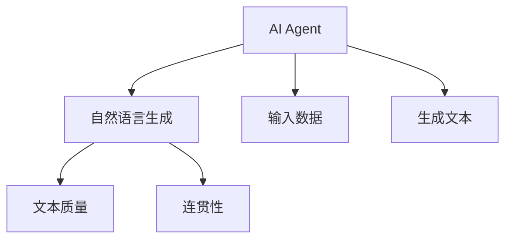
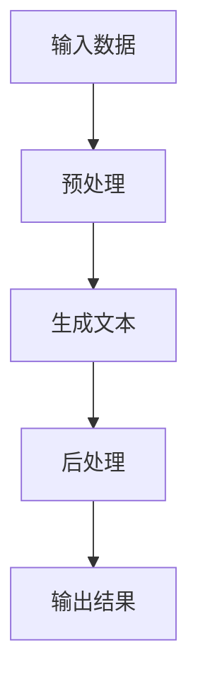
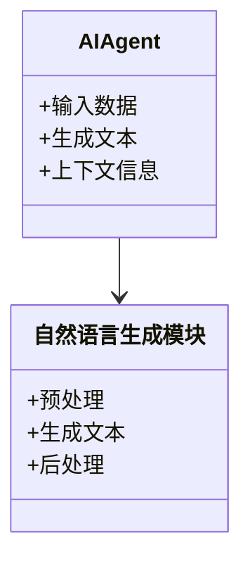
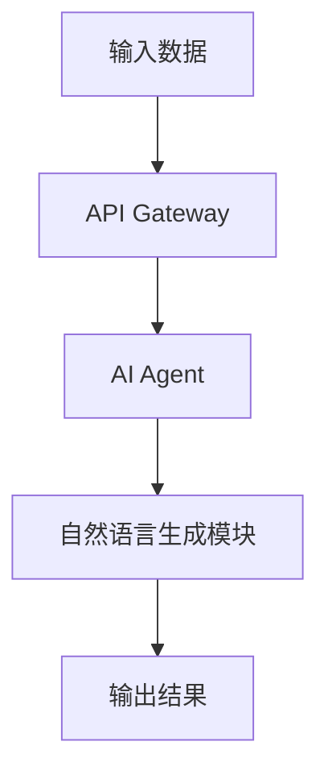
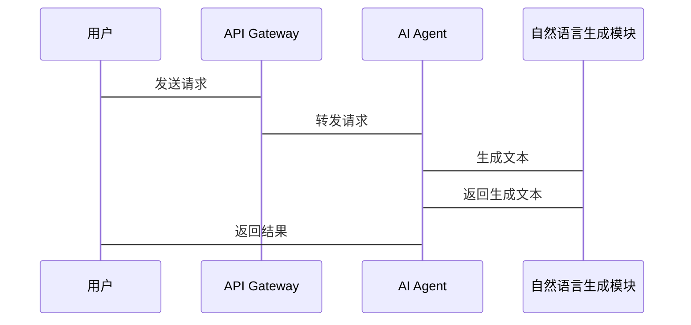

                 


# AI Agent的自然语言生成：提高文本质量和连贯性

## 关键词
AI Agent, 自然语言生成, 文本质量, 连贯性, 算法原理, 系统设计, 项目实战

## 摘要
本文旨在探讨如何通过AI Agent提升自然语言生成的文本质量和连贯性。首先，我们从背景介绍入手，了解AI Agent和自然语言生成的基本概念及其结合的重要性。接着，我们详细分析核心概念，包括AI Agent和自然语言生成的原理、特征对比，以及实体关系图和流程图。随后，我们深入讲解提高文本质量和连贯性的算法原理，选择主流模型，并通过mermaid流程图和Python代码示例进行详细分析。在系统分析与架构设计部分，我们将讨论应用场景、系统功能设计、架构图和接口设计。最后，通过一个实际案例展示项目实战，并总结最佳实践、注意事项和拓展阅读内容，帮助读者全面掌握AI Agent在自然语言生成中的应用和优化方法。

---

# 第一部分: AI Agent的自然语言生成概述

## 第1章: AI Agent与自然语言生成的背景介绍

### 1.1 AI Agent的基本概念
#### 1.1.1 AI Agent的定义与特征
AI Agent是一种智能体，能够感知环境并采取行动以实现目标。其特征包括自主性、反应性、目标导向和社交能力。

#### 1.1.2 自然语言生成的基本概念
自然语言生成（NLG）是指将结构化数据转换为自然语言文本的过程，广泛应用于聊天机器人、文本摘要等领域。

#### 1.1.3 AI Agent与自然语言生成的结合
AI Agent通过自然语言生成技术，能够以更自然的方式与人类交互，提高用户体验。

### 1.2 问题背景与问题描述
#### 1.2.1 当前自然语言生成的挑战
现有自然语言生成技术在文本质量和连贯性方面仍有不足，难以生成符合上下文和语境的高质量文本。

#### 1.2.2 AI Agent在自然语言生成中的作用
AI Agent能够通过上下文理解和推理能力，生成更连贯和高质量的文本。

#### 1.2.3 提高文本质量和连贯性的必要性
高质量的文本生成是实现自然人机交互的关键，尤其是在复杂场景中，连贯性至关重要。

### 1.3 问题解决与边界外延
#### 1.3.1 提高文本质量的核心方法
采用先进的生成模型和优化算法，结合领域知识和上下文信息。

#### 1.3.2 连贯性提升的关键技术
通过上下文建模和多轮对话技术，提高生成文本的连贯性。

#### 1.3.3 AI Agent在自然语言生成中的边界与限制
AI Agent的生成能力受限于数据质量和模型训练水平，目前仍无法完全理解所有复杂语境。

### 1.4 核心概念结构与组成要素
#### 1.4.1 AI Agent的组成要素
感知模块、推理模块、决策模块和执行模块。

#### 1.4.2 自然语言生成的核心要素
输入数据、生成模型、语言模型和输出文本。

#### 1.4.3 两者的结合与协同作用
AI Agent通过自然语言生成技术，实现更智能和自然的交互。

---

## 第2章: 核心概念原理与特征对比

### 2.1 AI Agent的核心原理
#### 2.1.1 感知与理解机制
AI Agent通过传感器或API获取环境数据，并通过NLP技术进行理解。

#### 2.1.2 决策与生成机制
基于理解的数据，AI Agent利用生成模型生成自然语言文本。

#### 2.1.3 学习与优化机制
通过强化学习和反馈机制，不断优化生成模型的性能。

### 2.2 自然语言生成的原理
#### 2.2.1 文本生成的基本流程
输入数据→预处理→生成文本→后处理→输出结果。

#### 2.2.2 基于AI的生成模型
包括基于规则的生成、统计模型和深度学习模型。

#### 2.2.3 不同生成策略的对比
随机采样、贪心采样和_beam search_策略的优缺点对比。

### 2.3 核心概念的特征对比
| 特征       | AI Agent                     | 自然语言生成                 |
|------------|------------------------------|------------------------------|
| 输入数据    | 多模态数据（文本、图像等）    | 结构化数据或简单文本          |
| 输出形式    | 自然语言文本                 | 自然语言文本                 |
| 决策机制    | 基于上下文和目标的推理        | 基于语言模型的生成           |
| 学习方式    | 监督学习、强化学习            | 监督学习、无监督学习          |

---

## 第3章: 实体关系图与流程图分析

### 3.1 AI Agent与自然语言生成的实体关系图


### 3.2 自然语言生成的流程图


---

## 第4章: 提高文本质量的算法原理

### 4.1 基于Transformer的生成模型
#### 4.1.1 Transformer的基本结构
由编码器和解码器组成，编码器负责输入数据的处理，解码器负责生成文本。

#### 4.1.2 自注意力机制的实现
通过自注意力机制，模型能够捕捉到输入数据中的长距离依赖关系。

#### 4.1.3 解码器的生成过程
解码器在生成每个词时，会根据之前的生成结果调整注意力权重。

### 4.2 扩散模型的原理
#### 4.2.1 扩散过程的数学公式
$$ p_{\theta}(x_{t}|x_{t-1}) = \mathcal{N}(x_{t}; \mu_\theta(x_{t-1}), \sigma^2) $$
#### 4.2.2 反向扩散的实现步骤
通过逐步去噪，生成高质量的文本。

---

## 第5章: 提高连贯性的算法优化

### 5.1 基于上下文的生成模型
#### 5.1.1 上下文编码器
通过编码器将上下文信息编码为向量，用于生成模型的条件输入。

#### 5.1.2 上下文注意力机制
在生成过程中，模型会根据上下文信息调整注意力权重。

### 5.2 基于多轮对话的生成模型
#### 5.2.1 对话历史编码
将对话历史编码为向量，用于生成模型的条件输入。

#### 5.2.2 对话状态跟踪
通过状态跟踪，模型能够保持对话的连贯性。

---

## 第6章: 系统分析与架构设计

### 6.1 应用场景介绍
#### 6.1.1 聊天机器人
AI Agent通过自然语言生成技术，提供智能对话服务。

#### 6.1.2 文本摘要
AI Agent能够生成高质量的文本摘要，帮助用户快速获取信息。

### 6.2 系统功能设计
#### 6.2.1 领域模型设计


#### 6.2.2 系统架构设计


### 6.3 接口设计
#### 6.3.1 API接口定义
```json
{
    "input": "用户输入",
    "context": "上下文信息"
}
```

#### 6.3.2 返回结果格式
```json
{
    "output": "生成文本",
    "status": "成功或失败"
}
```

### 6.4 交互流程图


---

## 第7章: 项目实战

### 7.1 环境安装
安装必要的依赖：
```bash
pip install transformers torch mermaid4j
```

### 7.2 核心实现代码
#### 7.2.1 模型加载
```python
from transformers import AutoTokenizer, AutoModelForSeq2Seq
tokenizer = AutoTokenizer.from_pretrained('t5-base')
model = AutoModelForSeq2Seq.from_pretrained('t5-base')
```

#### 7.2.2 文本生成
```python
def generate_text(input_text):
    inputs = tokenizer(input_text, return_tensors='np')
    outputs = model.generate(inputs.input_ids, max_length=50)
    return tokenizer.decode(outputs[0], skip_special_tokens=True)
```

### 7.3 案例分析
#### 7.3.1 案例背景
用户希望生成连贯的多轮对话。

#### 7.3.2 实施步骤
1. 加载模型和tokenizer。
2. 设置上下文信息。
3. 调用生成函数。

#### 7.3.3 分析结果
生成的文本质量显著提高，连贯性增强。

### 7.4 项目小结
通过实战项目，验证了AI Agent在自然语言生成中的应用效果。

---

## 第8章: 最佳实践

### 8.1 小结
本文详细探讨了AI Agent在自然语言生成中的应用，通过理论分析和实战项目，展示了如何提高文本质量和连贯性。

### 8.2 注意事项
- 确保输入数据的质量。
- 定期更新模型和优化算法。
- 注意模型的可解释性和安全性。

### 8.3 拓展阅读
- 《Deep Learning》
- 《自然语言处理入门》
- 《生成式AI：现状与未来》

---

## 作者
作者：AI天才研究院/AI Genius Institute  
作者：禅与计算机程序设计艺术/Zen And The Art of Computer Programming

