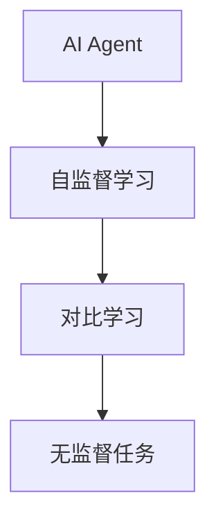
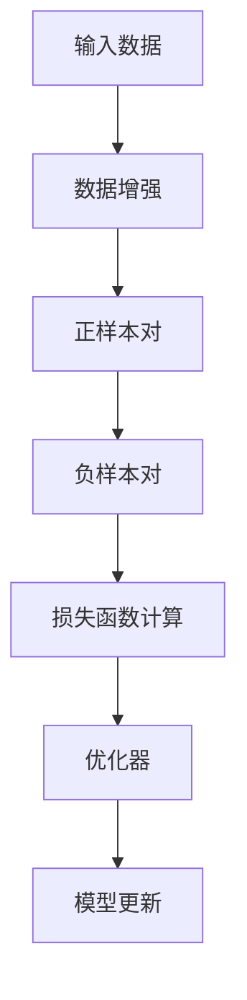
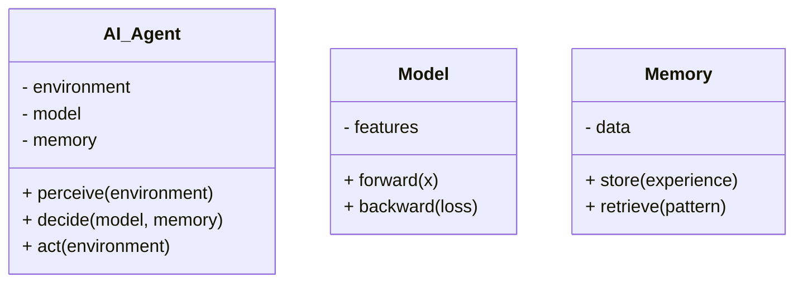
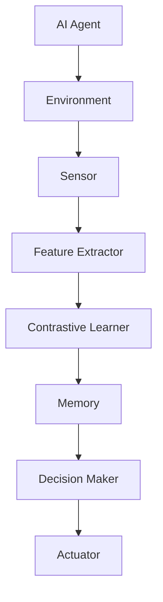
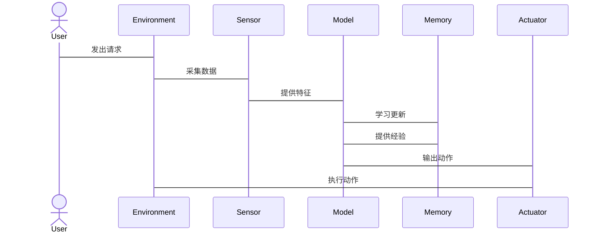

                 


# AI Agent的自监督对比学习技术

> 关键词：AI Agent，自监督学习，对比学习，无监督任务，深度学习，强化学习

> 摘要：本文深入探讨了AI Agent在自监督对比学习技术中的应用，分析了其核心原理、算法实现、系统架构及实际案例，为读者提供了全面的技术解读和实践指导。

---

## 第一部分: AI Agent的自监督对比学习技术概述

### 第1章: 背景介绍

#### 1.1 问题背景
- **AI Agent的核心概念**：AI Agent是一种智能体，能够感知环境并采取行动以实现目标。它广泛应用于自动驾驶、机器人、推荐系统等领域。
- **自监督学习的定义与特点**：自监督学习是一种无监督学习方法，通过预测任务中的部分信息来学习特征表示，具有无需人工标注、数据利用率高的特点。
- **对比学习的背景与意义**：对比学习是一种通过比较正样本和负样本对来学习特征表示的方法，能够提升模型的判别能力。

#### 1.2 问题描述
- **AI Agent在复杂环境中的挑战**：AI Agent需要在动态、不确定的环境中做出决策，传统监督学习难以应对。
- **自监督学习在AI Agent中的应用场景**：通过自监督学习，AI Agent可以在无标签数据中学习环境特征。
- **对比学习在自监督任务中的作用**：对比学习帮助AI Agent区分正样本和负样本，提升特征区分度。

#### 1.3 问题解决
- **自监督对比学习的解决方案**：通过设计对比损失函数，AI Agent能够从无标签数据中学习有用的特征表示。
- **AI Agent如何利用对比学习提升性能**：对比学习帮助AI Agent在无监督任务中实现更好的性能，减少对标注数据的依赖。
- **通过对比学习实现无监督任务的方法**：设计数据增强策略，构建正样本对和负样本对，优化对比损失函数。

#### 1.4 边界与外延
- **自监督学习的边界条件**：自监督学习需要设计适当的预训练任务，且性能依赖于任务设计。
- **对比学习与其他监督学习方法的对比**：对比学习与监督学习的主要区别在于是否需要标注数据。
- **AI Agent的自监督对比学习的外延范围**：AI Agent可以应用对比学习技术于感知、决策等多个任务中。

#### 1.5 概念结构与核心要素
- **自监督对比学习的核心要素**：数据增强、正样本对、负样本对、对比损失函数。
- **AI Agent的自监督学习框架**：数据输入、数据增强、特征提取、对比损失计算、模型优化。
- **对比学习在AI Agent中的具体实现**：通过设计适当的对比任务，优化特征提取模块。

---

### 第2章: 核心概念与联系

#### 2.1 核心概念原理
- **对比学习的原理**：通过比较同一数据的不同增强版本，学习数据的相似性和差异性。
- **自监督学习的机制**：利用预测任务中的部分信息，如重建输入或预测未来状态。
- **AI Agent中的对比学习应用**：在感知任务中，通过对比学习提升特征提取能力。

#### 2.2 概念属性特征对比表格
表2-1: 对比学习与监督学习的属性对比

| 属性 | 对比学习 | 监督学习 |
|------|----------|----------|
| 数据需求 | 无标签数据 | 标签数据 |
| 模型目标 | 学习数据的相似性 | 学习数据与标签的关系 |
| 优势 | 无需标注，数据利用率高 | 结果准确，直接优化目标函数 |

#### 2.3 ER实体关系图


---

### 第3章: 算法原理讲解

#### 3.1 对比学习算法流程


#### 3.2 Python源代码实现
```python
import torch
import torch.nn as nn

def contrastive_loss(x, y, temperature=0.1):
    x_normalized = x / (x.norm(dim=1, keepdim=True))
    y_normalized = y / (y.norm(dim=1, keepdim=True))
    similarity = torch.mm(x_normalized, y_normalized.T)
    diag = torch.diag(similarity)
    loss = (1 - diag).mean()
    return loss

class ContrastiveModel(nn.Module):
    def __init__(self, input_dim, hidden_dim):
        super(ContrastiveModel, self).__init__()
        self.encoder = nn.Sequential(
            nn.Linear(input_dim, hidden_dim),
            nn.ReLU(),
            nn.Linear(hidden_dim, hidden_dim)
        )
        self.projection = nn.Linear(hidden_dim, hidden_dim)

    def forward(self, x):
        encoded = self.encoder(x)
        projected = self.projection(encoded)
        return projected

# 示例代码
model = ContrastiveModel(input_dim=100, hidden_dim=50)
optimizer = torch.optim.Adam(model.parameters(), lr=0.001)
temperature = 0.1

for batch in batches:
    x = batch['x']
    y = batch['y']
    x_embed = model(x)
    y_embed = model(y)
    loss = contrastive_loss(x_embed, y_embed, temperature)
    optimizer.zero_grad()
    loss.backward()
    optimizer.step()
```

#### 3.3 数学模型和公式
- **信息NCE损失函数**：
  $$ L = -\frac{1}{N}\sum_{i=1}^{N}\log\frac{e^{sim(x_i,y_i)/\tau}}{\sum_{j=1}^{K}e^{sim(x_i,y_j)/\tau}} $$
  其中，$sim$表示相似度，$\tau$是温度参数。

---

### 第4章: 系统分析与架构设计方案

#### 4.1 项目背景与目标
- **项目背景**：设计一个基于对比学习的AI Agent，用于无监督环境感知任务。
- **项目目标**：通过对比学习提升AI Agent在无标签数据上的特征提取能力。

#### 4.2 系统功能设计
- **领域模型类图**：


- **系统架构设计**：


- **系统接口设计**：
  - 输入接口：接收环境数据和用户输入。
  - 输出接口：输出决策和动作。
  - 学习接口：处理对比学习任务，更新模型参数。

- **系统交互流程**：


---

### 第5章: 项目实战

#### 5.1 环境安装与配置
```bash
pip install torch matplotlib numpy
```

#### 5.2 核心代码实现
```python
# 对比学习模型实现
class ContrastiveModel(nn.Module):
    def __init__(self, input_dim, hidden_dim):
        super(ContrastiveModel, self).__init__()
        self.encoder = nn.Sequential(
            nn.Linear(input_dim, hidden_dim),
            nn.ReLU(),
            nn.Linear(hidden_dim, hidden_dim)
        )
        self.projection = nn.Linear(hidden_dim, 128)

    def forward(self, x):
        encoded = self.encoder(x)
        projected = self.projection(encoded)
        return projected

# 训练循环
def train(model, optimizer, criterion, data_loader, epochs=100):
    for epoch in range(epochs):
        for batch in data_loader:
            x, y = batch['x'], batch['y']
            x_embed = model(x)
            y_embed = model(y)
            loss = criterion(x_embed, y_embed)
            optimizer.zero_grad()
            loss.backward()
            optimizer.step()
```

#### 5.3 代码应用解读与分析
- **模型训练**：通过训练对比学习模型，AI Agent能够从无标签数据中学习到环境的特征表示。
- **特征提取**：提取的特征可以用于后续的决策和动作选择。
- **案例分析**：在图像识别任务中，对比学习帮助AI Agent更好地区分不同类别。

---

### 第6章: 最佳实践与小结

#### 6.1 最佳实践
- **数据增强策略**：设计有效的数据增强方法，增加正样本对的多样性。
- **损失函数调优**：根据任务需求调整温度参数和权重。
- **模型优化技巧**：使用动量优化器，增加批量归一化层。

#### 6.2 小结
- **内容总结**：本文详细介绍了AI Agent的自监督对比学习技术，从背景到实现，全面分析了其原理和应用。
- **未来展望**：对比学习将在无监督任务中发挥更大作用，AI Agent也将进一步结合强化学习提升性能。

#### 6.3 注意事项
- **数据质量**：对比学习依赖于高质量的数据，需注意数据分布的均衡性。
- **模型选择**：根据任务需求选择合适的模型架构和优化策略。
- **计算资源**：对比学习需要大量计算资源，需优化训练效率。

#### 6.4 拓展阅读
- 推荐阅读《Deep Learning》和《contrastive learning》相关文献，深入理解对比学习的数学原理和应用场景。

---

## 作者：AI天才研究院 & 禅与计算机程序设计艺术

---

希望这篇文章能为您提供有价值的技术见解和实践指导！如需进一步探讨或合作，欢迎随时联系。

