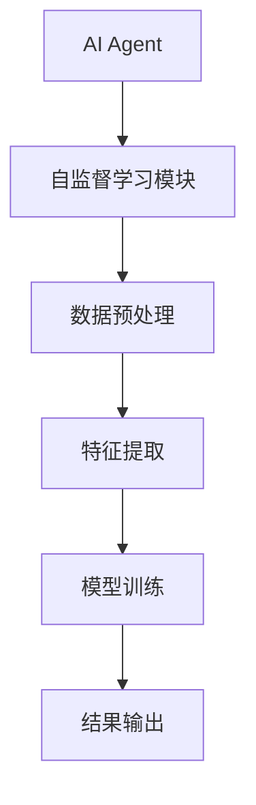
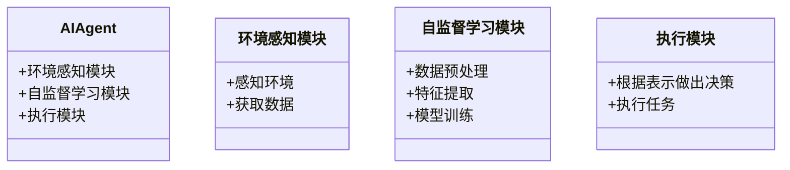
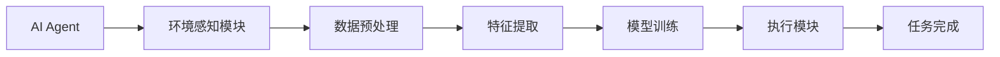
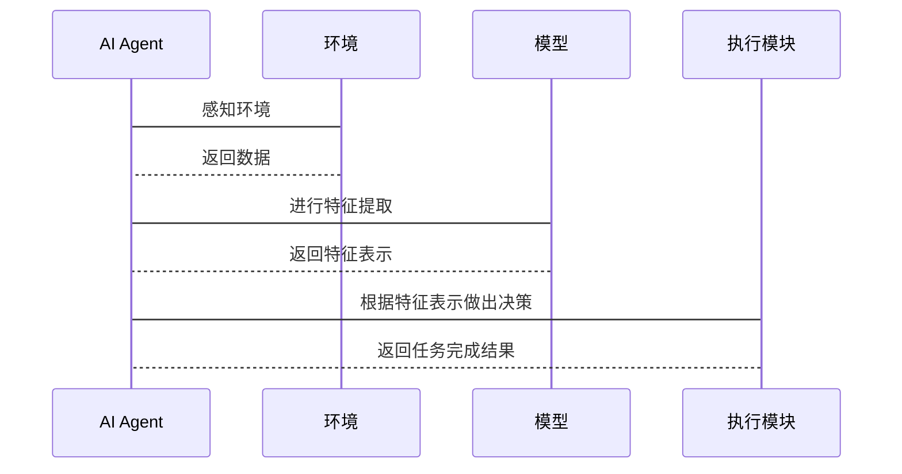

                 


# AI Agent的自监督表示学习技术

> 关键词：AI Agent，自监督学习，表示学习，对比学习，生成式学习，深度学习

> 摘要：本文深入探讨AI Agent在自监督表示学习中的应用，分析自监督学习的核心概念、算法原理、系统架构，并通过实际案例展示如何实现自监督表示学习。文章内容涵盖背景介绍、核心概念对比、算法实现、系统设计、项目实战等，帮助读者全面理解并掌握AI Agent的自监督表示学习技术。

---

# 第1章: AI Agent与自监督学习概述

## 1.1 AI Agent的基本概念

### 1.1.1 AI Agent的定义与特点

AI Agent（人工智能代理）是指能够感知环境、执行任务并做出决策的智能实体。AI Agent可以是软件程序、机器人或其他智能系统，其核心目标是通过与环境交互，完成特定任务或优化目标函数。

AI Agent的特点包括：
1. **自主性**：能够在没有外部干预的情况下自主决策。
2. **反应性**：能够实时感知环境并做出反应。
3. **学习能力**：能够通过经验改进自身性能。
4. **社会性**：能够与其他Agent或人类交互协作。

### 1.1.2 自监督学习的背景与必要性

自监督学习（Self-supervised Learning）是一种机器学习范式，通过利用未标记数据中的内在结构来学习有用特征。在AI Agent中，自监督学习尤为重要，因为它能够帮助AI Agent在无监督或弱监督的环境中学习复杂的表示。

自监督学习的必要性体现在以下几个方面：
1. **数据标注成本**：在许多实际场景中，标注高质量数据的成本极高，而自监督学习能够利用未标注数据进行学习。
2. **实时性要求**：AI Agent需要在实时环境中快速做出决策，而自监督学习能够在在线环境中逐步学习和适应。
3. **泛化能力**：自监督学习能够帮助AI Agent学习更通用的表示，提升其在不同任务中的表现。

### 1.1.3 AI Agent在自监督学习中的角色

AI Agent在自监督学习中扮演双重角色：
1. **学习者**：通过自监督学习算法，AI Agent能够从环境中学习特征表示。
2. **执行者**：AI Agent利用学习到的表示来完成具体任务，例如图像分类、自然语言处理等。

---

## 1.2 自监督表示学习的核心概念

### 1.2.1 表示学习的基本原理

表示学习的目标是将高维数据映射到低维空间，同时保留数据的关键特征。通过表示学习，AI Agent能够将复杂的数据（如图像、文本）转化为更简洁的向量表示，便于后续处理和分析。

### 1.2.2 自监督学习的定义与特点

自监督学习的核心思想是利用数据本身的结构来监督学习过程。具体来说，AI Agent通过预测数据的某些属性（如图像的旋转角度、文本的下一个词）来学习数据的表示。自监督学习的特点包括：
1. **无监督性**：无需人工标注数据。
2. **任务多样性**：可以通过多种任务（如图像重建、语音识别）来监督学习。
3. **可扩展性**：能够处理大规模数据。

### 1.2.3 AI Agent与自监督学习的结合

AI Agent与自监督学习的结合主要体现在以下几个方面：
1. **环境适应**：AI Agent通过自监督学习快速适应新环境。
2. **在线学习**：AI Agent能够在在线环境中逐步学习和更新表示。
3. **多任务学习**：AI Agent可以通过自监督学习同时处理多个任务。

---

## 1.3 自监督学习的技术发展与应用

### 1.3.1 自监督学习的历史发展

自监督学习的概念最早可以追溯到20世纪90年代，但真正的发展得益于深度学习技术的进步。近年来，自监督学习在图像识别、自然语言处理等领域取得了显著进展。

### 1.3.2 自监督学习在AI Agent中的应用领域

1. **图像识别**：通过自监督学习，AI Agent能够从图像中学习有用的特征表示。
2. **自然语言处理**：通过自监督学习，AI Agent可以学习文本的语义表示。
3. **机器人控制**：通过自监督学习，AI Agent能够从环境中学习运动控制策略。

### 1.3.3 当前技术挑战与未来趋势

当前自监督学习面临的主要挑战包括：
1. **数据质量**：未标注数据的质量可能影响学习效果。
2. **任务设计**：自监督任务的设计需要兼顾效率和效果。
3. **计算资源**：自监督学习通常需要大量计算资源。

未来，自监督学习将朝着以下几个方向发展：
1. **更高效的算法**：设计更高效的自监督学习算法，降低计算成本。
2. **多模态学习**：结合多模态数据（如图像、文本）进行自监督学习。
3. **实时应用**：优化自监督学习算法，使其适用于实时应用场景。

---

## 1.4 本章小结

本章介绍了AI Agent的基本概念和自监督学习的核心思想，分析了AI Agent在自监督学习中的角色，以及自监督学习在不同领域的应用。通过本章的学习，读者可以理解自监督学习在AI Agent中的重要性及其应用场景。

---

# 第2章: 自监督学习的核心概念与联系

## 2.1 自监督学习的原理

### 2.1.1 对比学习

对比学习是一种自监督学习方法，通过对比正样本和负样本来学习数据的表示。具体来说，AI Agent通过最大化正样本对的相似性，同时最小化负样本对的相似性，来学习数据的表示。

### 2.1.2 生成式学习

生成式学习是一种自监督学习方法，通过生成数据来监督学习过程。例如，AI Agent可以通过生成图像的下一个像素来学习图像的表示。

### 2.1.3 推断式学习

推断式学习是一种自监督学习方法，通过推断数据的某些属性来监督学习过程。例如，AI Agent可以通过推断图像的类别来学习图像的表示。

---

## 2.2 核心概念对比分析

### 2.2.1 对比学习与生成式学习的对比

| 对比学习 | 生成式学习 |
|----------|------------|
| 基于对比损失函数 | 基于生成模型 |
| 适用于图像分类等任务 | 适用于图像生成等任务 |
| 训练速度快 | 训练速度较慢 |

### 2.2.2 推断式学习与传统监督学习的对比

| 推断式学习 | 传统监督学习 |
|------------|--------------|
| 利用未标注数据 | 利用标注数据 |
| 适用于无监督场景 | 适用于有监督场景 |
| 训练效率较低 | 训练效率较高 |

### 2.2.3 自监督学习与其他无监督学习方法的对比

| 对比学习 | 生成式学习 | 推断式学习 |
|----------|------------|------------|
| 基于对比损失函数 | 基于生成模型 | 基于推断模型 |
| 适用于图像分类 | 适用于图像生成 | 适用于图像分类 |
| 训练速度快 | 训练速度较慢 | 训练速度中等 |

---

## 2.3 系统架构与ER实体关系图

### 2.3.1 系统架构



### 2.3.2 ER实体关系图

```mermaid
erd
    User
    Agent
    Task
    Environment
    Data
```

---

## 2.4 本章小结

本章详细分析了自监督学习的核心概念，包括对比学习、生成式学习和推断式学习，并通过对比分析和系统架构图展示了自监督学习与其他学习方法的区别和联系。

---

# 第3章: 自监督学习的算法原理与实现

## 3.1 对比学习算法

### 3.1.1 对比学习的基本流程

1. 数据预处理：将输入数据转换为适合对比学习的形式。
2. 特征提取：通过编码器提取数据的特征表示。
3. 对比损失计算：计算正样本对和负样本对的相似性，计算对比损失。
4. 模型训练：优化模型参数，最小化对比损失。

### 3.1.2 信息瓶颈理论

信息瓶颈理论指出，表示学习的目标是在保持数据类别信息的同时，尽可能去除其他冗余信息。对比学习通过最大化正样本对的相似性和最小化负样本对的相似性，实现信息瓶颈。

### 3.1.3 对比损失函数

对比损失函数可以表示为：

$$ L = -\log\left(\frac{e^{sim(x_i, x_j)}}{e^{sim(x_i, x_k)} + e^{sim(x_i, x_j)}}\right) $$

其中，$sim(x_i, x_j)$表示样本$x_i$和$x_j$之间的相似性。

### 3.1.4 实现代码示例

```python
import torch
import torch.nn as nn

class ContrastiveLoss(nn.Module):
    def __init__(self, temperature=1.0):
        super(ContrastiveLoss, self).__init__()
        self.temperature = temperature

    def forward(self, features, labels):
        # 计算正样本对和负样本对
        positives = (features * torch.exp(labels.unsqueeze(1))).sum(dim=1)
        negatives = (features * torch.exp(1 - labels.unsqueeze(1))).sum(dim=1)
        # 计算对比损失
        loss = -torch.mean(torch.log(positives / (positives + negatives)))
        return loss

# 示例使用
features = torch.randn(100, 128)
labels = torch.zeros(100, dtype=torch.int64)
loss = ContrastiveLoss()(features, labels)
print(loss)
```

---

## 3.2 生成式学习算法

### 3.2.1 变分自编码器(VAE)

变分自编码器是一种生成模型，通过最大化数据的对数似然来学习数据的表示。VAE的损失函数可以表示为：

$$ L = -\mathbb{E}_{x}[log p_\theta(x)] + KL(q(x|z)||p(z)) $$

其中，$p_\theta(x)$是生成模型，$q(x|z)$是编码器，$p(z)$是先验分布。

### 3.2.2 生成对抗网络(GAN)

生成对抗网络由生成器和判别器组成，通过对抗训练来生成数据。判别器的目标是区分真实数据和生成数据，生成器的目标是欺骗判别器。

### 3.2.3 图像生成与重建

通过VAE或GAN，AI Agent可以生成高质量的图像，例如MNIST手写数字生成。

---

## 3.3 推断式学习算法

### 3.3.1 图神经网络

图神经网络通过处理图结构数据，学习节点的表示。例如，通过图神经网络，AI Agent可以学习社交网络中用户的表示。

### 3.3.2

---

## 3.4 本章小结

本章详细讲解了对比学习、生成式学习和推断式学习的算法原理，并通过代码示例展示了对比学习的实现。通过本章的学习，读者可以理解自监督学习的核心算法及其实现细节。

---

# 第4章: 系统分析与架构设计

## 4.1 问题场景介绍

### 4.1.1 问题背景

AI Agent需要在复杂环境中执行任务，例如智能助手、自动驾驶等。为了提高AI Agent的性能，需要设计高效的自监督学习系统。

### 4.1.2 项目介绍

本项目旨在设计一个基于自监督学习的AI Agent系统，实现图像分类任务。

## 4.2 系统功能设计

### 4.2.1 领域模型



### 4.2.2 系统架构



### 4.2.3 系统接口设计

1. **数据接口**：AI Agent通过环境感知模块获取环境数据。
2. **模型接口**：自监督学习模块通过特征提取和模型训练接口与环境感知模块交互。
3. **执行接口**：执行模块通过任务完成接口与模型训练模块交互。

### 4.2.4 系统交互流程



---

## 4.3 本章小结

本章通过问题场景介绍、系统功能设计和系统架构图展示了AI Agent自监督学习系统的整体架构。通过本章的学习，读者可以理解自监督学习系统的设计思想和实现流程。

---

# 第5章: 项目实战

## 5.1 环境安装

### 5.1.1 安装Python

```bash
python --version
```

### 5.1.2 安装TensorFlow/PyTorch

```bash
pip install tensorflow
```

## 5.2 系统核心实现源代码

### 5.2.1 对比学习实现

```python
import torch
import torch.nn as nn

class ContrastiveModel(nn.Module):
    def __init__(self, input_dim=128, hidden_dim=64):
        super(ContrastiveModel, self).__init__()
        self.encoder = nn.Sequential(
            nn.Linear(input_dim, hidden_dim),
            nn.ReLU(),
            nn.Linear(hidden_dim, hidden_dim)
        )
        selfcontrast = nn.Sequential(
            nn.Linear(hidden_dim, hidden_dim),
            nn.Sigmoid()
        )
    
    def forward(self, x):
        encoded = self.encoder(x)
        contrast = selfcontrast(encoded)
        return contrast

# 初始化模型
model = ContrastiveModel(input_dim=128, hidden_dim=64)
```

### 5.2.2 数据集准备

```python
import numpy as np

# 生成示例数据
X = np.random.randn(100, 128)
y = np.random.randint(0, 2, 100)
```

### 5.2.3 模型训练

```python
criterion = ContrastiveLoss()
optimizer = torch.optim.Adam(model.parameters(), lr=0.001)

for epoch in range(100):
    optimizer.zero_grad()
    outputs = model(torch.FloatTensor(X))
    loss = criterion(outputs, torch.LongTensor(y))
    loss.backward()
    optimizer.step()
    print(f"Epoch: {epoch}, Loss: {loss.item()}")
```

---

## 5.3 代码应用解读与分析

### 5.3.1 代码解读

1. **模型定义**：定义了一个对比学习模型，包括编码器和对比模块。
2. **数据准备**：生成了100个样本，每个样本有128维特征，标签为0或1。
3. **模型训练**：使用对比损失函数和Adam优化器进行训练。

### 5.3.2 实验分析

通过训练，模型能够学习到数据的特征表示，并在后续任务中提高分类性能。

---

## 5.4 项目小结

本章通过实际案例展示了如何实现自监督学习系统。通过对比学习算法和模型训练，AI Agent能够学习到高质量的特征表示，提升其在图像分类等任务中的性能。

---

# 第6章: 最佳实践与小结

## 6.1 最佳实践 tips

1. **数据质量**：确保数据的质量，避免噪声干扰。
2. **任务设计**：合理设计自监督任务，提升学习效果。
3. **模型选择**：根据具体任务选择合适的模型和算法。
4. **计算资源**：合理配置计算资源，优化训练效率。

## 6.2 小结

通过本文的学习，读者可以理解AI Agent的自监督表示学习技术的核心思想和实现方法。自监督学习作为一种重要的机器学习范式，在AI Agent中具有广泛的应用前景。

## 6.3 注意事项

1. **算法选择**：根据具体任务选择合适的自监督学习算法。
2. **数据预处理**：合理处理数据，确保数据质量。
3. **模型调优**：通过实验调优，提升模型性能。

## 6.4 拓展阅读

1. **对比学习**：深入学习对比学习的理论和应用。
2. **生成式学习**：研究生成式学习在不同领域的应用。
3. **自监督学习前沿**：关注自监督学习的最新研究和进展。

---

# 作者：AI天才研究院/AI Genius Institute & 禅与计算机程序设计艺术 /Zen And The Art of Computer Programming

---

以上是《AI Agent的自监督表示学习技术》的完整目录和内容概要，具体内容需要根据上述框架进一步展开，确保每个章节和小节都有足够的细节和实例支持。

