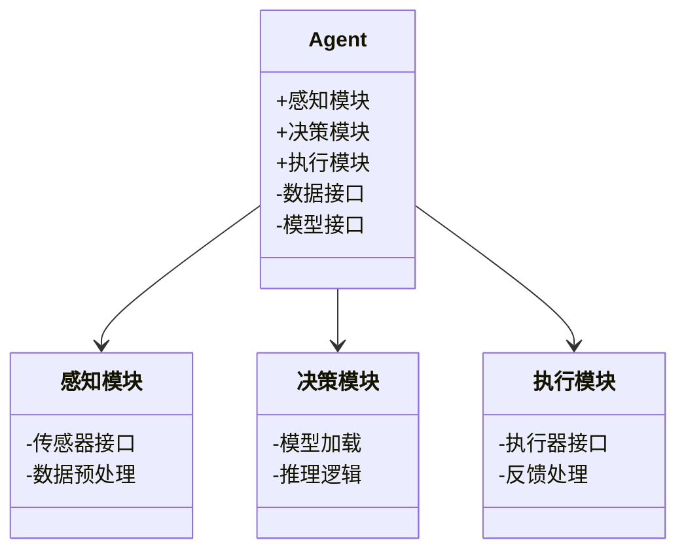
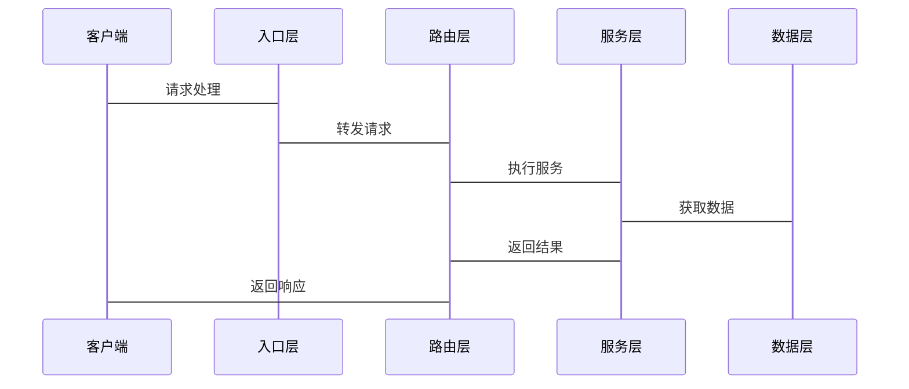

                 


# AI Agent的自监督预训练与微调策略

> 关键词：AI Agent，自监督学习，微调策略，预训练模型，深度学习，自然语言处理

> 摘要：本文系统地探讨了AI Agent的自监督预训练与微调策略，从基本概念到算法原理，再到系统架构和项目实战，全面解析了如何通过自监督预训练构建强大的AI Agent，并通过微调策略进一步优化其性能。本文适合对AI Agent和深度学习感兴趣的读者，旨在提供理论与实践相结合的深度解析。

---

## 第1章 AI Agent的基本概念与应用背景

### 1.1 AI Agent的定义与分类

AI Agent（人工智能代理）是指能够感知环境、自主决策并执行任务的智能实体。AI Agent可以是软件程序、机器人或其他智能系统，其核心目标是通过学习和推理来实现特定任务。

#### 1.1.1 AI Agent的定义
AI Agent具备以下核心特征：
- **自主性**：能够自主决策，无需外部干预。
- **反应性**：能够感知环境并实时响应。
- **学习能力**：通过数据和经验提升性能。
- **目标导向**：所有行为都围绕特定目标展开。

#### 1.1.2 AI Agent的主要分类
AI Agent可以根据任务类型和应用场景分为以下几类：
1. **简单反射型Agent**：基于当前输入做出简单反应，如基于规则的聊天机器人。
2. **基于模型的反射型Agent**：维护环境状态模型，用于决策，如游戏AI。
3. **目标驱动型Agent**：具备明确目标，如自动驾驶汽车。
4. **效用驱动型Agent**：通过最大化效用函数实现目标，如经济决策模型。
5. **学习增强型Agent**：结合强化学习或深度学习技术，如AlphaGo。

#### 1.1.3 AI Agent的核心特征
- **感知能力**：通过传感器或数据输入感知环境。
- **决策能力**：基于感知信息做出决策。
- **执行能力**：通过执行器或输出模块执行决策。

### 1.2 自监督学习的基本原理

自监督学习是一种无需人工标注数据的机器学习方法，通过预测任务（Predictive Task）构建数据间的关联关系。

#### 1.2.1 自监督学习的定义
自监督学习通过构建预测任务，利用未标注数据学习特征表示。例如，在图像领域，可以通过旋转预测任务来学习图像特征。

#### 1.2.2 自监督学习的关键技术
1. **对比学习（Contrastive Learning）**：通过最大化正样本对的相似性和最小化负样本对的相似性来学习特征表示。
2. **Masked Language Model（遮蔽语言模型）**：在文本中随机遮蔽部分词，通过上下文预测遮蔽词。
3. **Video Swapping（视频交换）**：通过交换视频中的部分帧，学习视频表示。

#### 1.2.3 自监督学习与监督学习的区别
| 特性 | 自监督学习 | 监督学习 |
|------|------------|----------|
| 数据需求 | 无需标注 | 需要标注 |
| 训练目标 | 学习数据特征 | 学习标签映射 |
| 适用场景 | 大量未标注数据 | 少量标注数据 |

### 1.3 微调策略的定义与作用

微调策略是在预训练模型的基础上，针对特定任务进行进一步优化的过程。

#### 1.3.1 微调策略的定义
微调策略通过对预训练模型的输出层或特定层进行微调，使其适应特定任务的需求。

#### 1.3.2 微调策略的核心作用
1. **任务适配**：使模型适应特定任务的数据分布。
2. **性能提升**：通过任务相关的微调，提升模型在特定任务上的表现。
3. **资源优化**：相比从头训练，微调需要较少的数据和计算资源。

#### 1.3.3 微调策略的应用场景
1. **自然语言处理**：如BERT模型的下游任务微调。
2. **图像识别**：如ImageNet预训练模型在特定任务上的微调。
3. **语音识别**：如从大规模语音数据预训练模型微调特定任务。

### 1.4 本章小结

本章介绍了AI Agent的基本概念、分类及其核心特征，重点阐述了自监督学习的原理和关键技术，最后分析了微调策略的定义、作用及应用场景。这些内容为后续章节的深入探讨奠定了基础。

---

## 第2章 自监督预训练的核心机制

### 2.1 自监督预训练的基本流程

自监督预训练通过构建预测任务，利用未标注数据学习特征表示。

#### 2.1.1 数据处理与特征提取
- 数据预处理：包括数据清洗、归一化等。
- 特征提取：通过模型提取高维特征表示。

#### 2.1.2 预测任务的设计
- **旋转预测任务**：图像旋转角度预测。
- **Masked预测任务**：文本中随机遮蔽词预测。

#### 2.1.3 损失函数的优化
- 使用对比学习损失函数，优化特征表示。

#### 2.1.4 模型训练
- 使用预训练数据进行模型训练。
- 定期调整学习率和优化器参数。

### 2.2 常见的自监督预训练方法

#### 2.2.1 算法对比与选择
| 方法 | 对比学习 | 图像分割 | 文本处理 |
|------|----------|----------|----------|
| MoCo | ✔️        |          |          |
| SimCLR | ✔️        |          |          |
| MaskedLM |          |          | ✔️        |

#### 2.2.2 图像领域中的应用
- 使用旋转预测任务进行图像预训练。

#### 2.2.3 文本领域中的应用
- 使用MaskedLM进行文本预训练。

### 2.3 自监督预训练的挑战与解决方案

#### 2.3.1 数据分布偏移问题
- 解决方案：使用分布平衡技术，如数据增强。

#### 2.3.2 计算资源需求问题
- 解决方案：使用分布式训练和优化算法。

#### 2.3.3 模型泛化能力的提升
- 解决方案：引入数据多样性，增加模型鲁棒性。

### 2.4 自监督预训练的数学模型

自监督预训练的核心是对比学习，其损失函数如下：

$$ L = -\frac{1}{N}\sum_{i=1}^{N} [\log(\frac{e^{f(x_i,y_i)}}{e^{f(x_i,y_i)}+e^{f(x_i,y_j)}}))] $$

其中，$f(x,y)$是对比相似度函数，$y_i$是正样本，$y_j$是负样本。

### 2.5 本章小结

本章详细阐述了自监督预训练的核心机制，包括基本流程、常见方法及其挑战与解决方案。通过对比学习和预测任务的设计，AI Agent能够从大量未标注数据中学习到有用的特征表示。

---

## 第3章 微调策略的实现与优化

### 3.1 微调策略的实施步骤

#### 3.1.1 数据准备与清洗
- 收集特定任务的数据。
- 对数据进行清洗和预处理。

#### 3.1.2 模型选择与加载
- 选择适合任务的预训练模型。
- 加载预训练模型的权重。

#### 3.1.3 参数微调与优化
- 对特定层或全模型进行微调。
- 使用优化器和学习率调整策略。

### 3.2 微调策略的优化方法

#### 3.2.1 学习率调整策略
- **逐步衰减**：随训练轮数减小学习率。
- **余弦衰减**：使用余弦函数动态调整学习率。

#### 3.2.2 正则化技术的应用
- **L2正则化**：在损失函数中添加L2范数惩罚项。
- **Dropout**：在训练过程中随机屏蔽部分神经元。

#### 3.2.3 早停机制的引入
- 监测验证集损失，防止过拟合。

### 3.3 微调策略的评估与对比

#### 3.3.1 评估指标的选择
- **准确率**：分类任务常用指标。
- **F1分数**：综合考虑精确率和召回率。

#### 3.3.2 不同微调策略的对比分析
- 对比全模型微调和仅微调输出层的效果。

#### 3.3.3 实验结果与分析
- 通过实验验证不同微调策略的有效性。

### 3.4 本章小结

本章详细讲解了微调策略的实施步骤、优化方法及评估指标，通过实验对比不同微调策略的效果，为实际应用提供了参考。

---

## 第4章 自监督预训练与微调策略的结合

### 4.1 预训练与微调的协同关系

#### 4.1.1 预训练阶段的作用
- 提供通用特征表示。
- 减少对标注数据的依赖。

#### 4.1.2 微调阶段的作用
- 适应特定任务需求。
- 提升任务相关性能。

#### 4.1.3 两者结合的优势
- 利用预训练模型的通用性。
- 通过微调提升任务适应性。

### 4.2 预训练模型的适用场景

#### 4.2.1 大规模数据场景
- 利用未标注数据进行预训练。

#### 4.2.2 资源有限场景
- 通过微调节省计算资源。

#### 4.2.3 实时响应场景
- 通过预训练和微调提升响应速度。

### 4.3 结合策略的优化

#### 4.3.1 分阶段微调
- 预训练后分阶段进行微调。

#### 4.3.2 任务相关性调整
- 根据任务需求调整微调参数。

### 4.4 本章小结

本章分析了自监督预训练与微调策略的协同关系，探讨了预训练模型的适用场景，并提出了结合策略的优化方法。

---

## 第5章 算法原理讲解

### 5.1 自监督预训练算法

#### 5.1.1 MoCo算法
MoCo通过引入动量编码器和生成对抗网络，优化特征表示。

#### 5.1.2 SimCLR算法
SimCLR通过对比学习，最大化正样本对的相似性。

### 5.2 微调策略的数学模型

#### 5.2.1 分类任务的损失函数
$$ L_{\text{cls}} = -\frac{1}{N}\sum_{i=1}^{N} \log p(y_i|x_i) $$

其中，$p(y_i|x_i)$是模型对样本$x_i$的预测概率。

#### 5.2.2 回归任务的损失函数
$$ L_{\text{reg}} = \frac{1}{N}\sum_{i=1}^{N} (y_i - \hat{y}_i)^2 $$

其中，$y_i$是真实值，$\hat{y}_i$是模型预测值。

### 5.3 代码实现

#### 5.3.1 预训练代码示例
```python
import torch
import torch.nn as nn

class MoCo(nn.Module):
    def __init__(self, base_encoder, dim=256):
        super().__init__()
        self.encoder = base_encoder
        self.dim = dim
        self.register_buffer('center', torch.zeros(dim))

    def forward(self, x):
        x_encode = self.encoder(x)
        x_predict = x_encode
        return x_predict

    def update_center(self, x_predict):
        with torch.no_grad():
            self.center = self.center * 0.99 + torch.mean(x_predict, dim=0)
```

#### 5.3.2 微调代码示例
```python
def fine_tune(model, optimizer, train_loader, val_loader, epochs=10):
    for epoch in range(epochs):
        model.train()
        for batch in train_loader:
            x, y = batch
            outputs = model(x)
            loss = criterion(outputs, y)
            optimizer.zero_grad()
            loss.backward()
            optimizer.step()
```

### 5.4 本章小结

本章通过数学模型和代码示例，详细讲解了自监督预训练和微调策略的算法原理，为后续章节的系统设计和项目实战奠定了基础。

---

## 第6章 系统架构设计

### 6.1 问题场景介绍

AI Agent系统需要具备感知、决策和执行能力，支持多种任务类型。

### 6.2 系统功能设计

#### 6.2.1 功能模块设计
- **感知模块**：数据采集和处理。
- **决策模块**：模型推理和决策。
- **执行模块**：任务执行和反馈。

#### 6.2.2 领域模型（Mermaid类图）


### 6.3 系统架构设计

#### 6.3.1 系统架构图（Mermaid架构图）


### 6.4 系统接口设计

#### 6.4.1 接口定义
- **感知接口**：数据采集和预处理。
- **决策接口**：模型加载和推理。
- **执行接口**：任务执行和反馈。

### 6.5 系统交互设计（Mermaid序列图）


### 6.6 本章小结

本章通过系统架构设计，详细描述了AI Agent系统的功能模块、接口设计和交互流程，为项目的实际开发提供了指导。

---

## 第7章 项目实战

### 7.1 环境安装

安装必要的依赖：
```bash
pip install torch torchvision numpy
```

### 7.2 核心实现

#### 7.2.1 数据处理代码
```python
import torch
import torchvision

def preprocess_data(root):
    transform = torchvision.transforms.Compose([
        torchvision.transforms.Resize(224),
        torchvision.transforms.ToTensor(),
    ])
    dataset = torchvision.datasets.ImageFolder(root=root, transform=transform)
    return dataset
```

#### 7.2.2 模型加载与微调
```python
def load_model(pretrained=True):
    model = torchvision.models.resnet50(pretrained=pretrained)
    if not pretrained:
        model.load_state_dict(torch.load('pretrained.pth'))
    return model
```

### 7.3 代码解读与分析

#### 7.3.1 预训练代码解读
```python
def pretrain_model(model, optimizer, train_loader, epochs=10):
    for epoch in range(epochs):
        for batch in train_loader:
            x, _ = batch
            x_encode = model(x)
            loss = contrastive_loss(x_encode)
            optimizer.zero_grad()
            loss.backward()
            optimizer.step()
```

#### 7.3.2 微调代码解读
```python
def fine_tune(model, optimizer, train_loader, val_loader, epochs=5):
    for epoch in range(epochs):
        model.train()
        for batch in train_loader:
            x, y = batch
            outputs = model(x)
            loss = criterion(outputs, y)
            optimizer.zero_grad()
            loss.backward()
            optimizer.step()
```

### 7.4 实际案例分析

#### 7.4.1 图像分类任务
- 使用ImageNet预训练模型，微调在特定数据集上。

#### 7.4.2 文本分类任务
- 使用BERT模型，微调在特定任务上。

### 7.5 本章小结

本章通过项目实战，详细讲解了AI Agent系统的环境搭建、核心实现和代码解读，为读者提供了从理论到实践的指导。

---

## 第8章 最佳实践与未来展望

### 8.1 最佳实践

#### 8.1.1 数据处理
- 使用数据增强技术提升模型鲁棒性。

#### 8.1.2 模型选择
- 根据任务需求选择合适的预训练模型。

#### 8.1.3 优化策略
- 合理调整学习率和正则化参数。

### 8.2 小结

本章总结了AI Agent的自监督预训练与微调策略的最佳实践，并展望了未来的发展方向。

### 8.3 未来展望

- **更强大的预训练模型**：如视觉-语言模型的联合预训练。
- **更高效的微调方法**：如局部微调和动态微调。
- **更广泛的应用场景**：如自动驾驶、智能客服等。

### 8.4 作者信息

作者：AI天才研究院/AI Genius Institute & 禅与计算机程序设计艺术 /Zen And The Art of Computer Programming

---

# 本文结束

