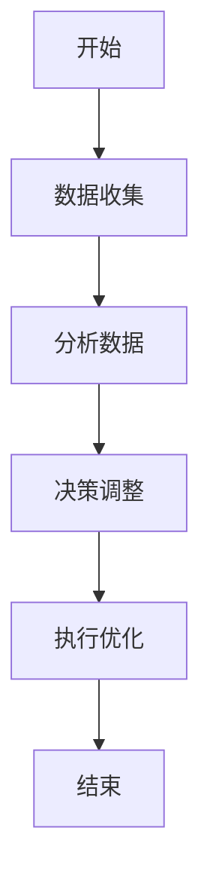
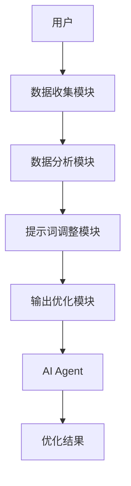
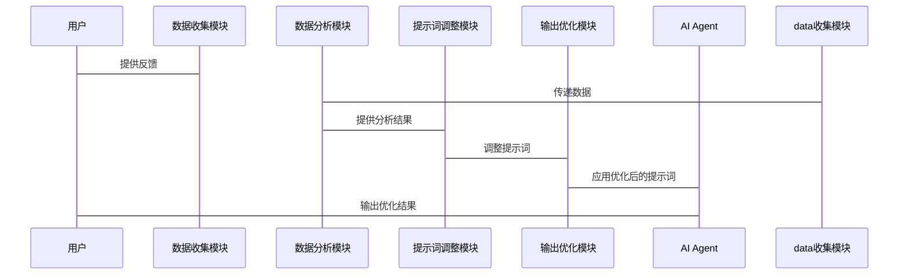

                 


# AI Agent的自适应prompt优化策略

## 关键词：AI Agent，自适应prompt，优化策略，自然语言处理，机器学习，性能提升，系统架构

## 摘要：  
随着人工智能技术的快速发展，AI Agent在各个领域的应用越来越广泛。然而，AI Agent的性能很大程度上依赖于输入的提示词（prompt）。为了提高AI Agent的效果和效率，自适应prompt优化策略变得至关重要。本文将从理论到实践，详细探讨自适应优化策略的实现方法，包括算法原理、系统架构设计和项目实战。通过本文的学习，读者能够全面理解并掌握AI Agent的自适应prompt优化策略的核心思想和实现技巧。

---

## 第一部分：背景介绍

### 第1章：AI Agent与自适应prompt优化策略的背景

#### 1.1 问题背景
- **1.1.1 AI Agent的定义与特点**  
  AI Agent（人工智能代理）是指能够感知环境并采取行动以实现目标的智能实体。AI Agent可以是软件程序、机器人或其他智能系统，其核心能力包括感知、推理、决策和执行。

- **1.1.2 自然语言处理中的prompt优化问题**  
  在自然语言处理（NLP）任务中，AI Agent的表现高度依赖于输入的提示词（prompt）。然而，传统的提示词设计往往静态且固定，无法根据上下文或任务需求进行动态调整，这限制了AI Agent的性能和灵活性。

- **1.1.3 当前AI Agent在实际应用中的挑战**  
  在实际应用中，AI Agent面临诸多挑战，例如如何适应不同的用户需求、如何处理复杂多变的环境、如何提高决策的准确性和效率等。这些问题的解决需要更加动态和智能的优化策略。

#### 1.2 问题描述
- **1.2.1 自适应prompt优化的核心问题**  
  自适应prompt优化的核心问题是如何根据当前的输入、上下文和目标，动态调整提示词，以提高AI Agent的性能和效果。

- **1.2.2 传统prompt优化方法的局限性**  
  传统的方法通常依赖于固定的提示模板或预定义规则，难以应对复杂多变的场景。此外，传统优化方法往往缺乏对上下文的深度理解和动态调整的能力。

- **1.2.3 自适应优化的必要性与目标**  
  自适应优化的必要性在于其能够根据实时反馈和动态变化的环境，自动调整提示词，从而提高AI Agent的适应性和智能化水平。其目标是实现动态、高效、智能的提示词优化。

#### 1.3 问题解决
- **1.3.1 自适应prompt优化的解决方案概述**  
  自适应优化的核心思想是通过实时收集和分析反馈数据，动态调整提示词，以优化AI Agent的输出结果。

- **1.3.2 自适应优化的核心思想与实现路径**  
  自适应优化的核心思想是基于反馈的动态调整。其实现路径包括数据收集、分析、决策和执行四个阶段。

- **1.3.3 自适应优化的实际应用场景**  
  自适应优化在智能客服、智能助手、智能推荐系统等领域有广泛的应用场景。例如，在智能客服中，AI Agent可以根据用户的实时反馈动态调整对话策略。

#### 1.4 边界与外延
- **1.4.1 自适应优化的边界条件**  
  自适应优化的边界条件包括数据的实时性、反馈的准确性、计算资源的限制等。

- **1.4.2 自适应优化与其他优化方法的区别**  
  自适应优化与传统优化方法的区别在于其动态性和智能化。传统优化方法通常基于静态数据和固定规则，而自适应优化则能够实时调整策略。

- **1.4.3 自适应优化的外延与未来发展**  
  自适应优化的外延包括与其他优化方法的结合、与其他AI技术的融合等。未来，随着AI技术的进一步发展，自适应优化将更加智能化和个性化。

#### 1.5 核心要素与概念结构
- **1.5.1 自适应优化的核心要素**  
  自适应优化的核心要素包括实时数据流、反馈机制、动态调整策略等。

- **1.5.2 概念结构的层次分解**  
  自适应优化的概念结构可以分为输入、处理、输出三个层次。输入包括原始数据和反馈，处理包括分析和调整，输出包括优化后的提示词和执行结果。

- **1.5.3 核心要素之间的关系**  
  核心要素之间的关系是相互依赖和相互作用的。实时数据流和反馈机制为动态调整策略提供依据，而动态调整策略又反过来影响输入和输出。

---

## 第二部分：核心概念与联系

### 第2章：AI Agent与自适应prompt优化的核心概念

#### 2.1 AI Agent的核心原理
- **2.1.1 AI Agent的基本原理**  
  AI Agent的基本原理包括感知、推理、决策和执行四个步骤。感知是通过传感器或数据源获取信息，推理是通过算法分析信息，决策是基于推理结果做出选择，执行是将决策转化为实际操作。

- **2.1.2 自然语言处理在AI Agent中的作用**  
  自然语言处理在AI Agent中主要用于理解和生成人类语言。通过NLP技术，AI Agent可以理解用户的输入并生成相应的输出。

- **2.1.3 prompt在AI Agent中的重要性**  
  prompt是AI Agent与用户交互的核心媒介。通过优化prompt，可以提高AI Agent的理解能力和生成能力。

#### 2.2 自适应prompt优化的原理
- **2.2.1 自适应优化的基本原理**  
  自适应优化的基本原理是通过实时收集和分析反馈数据，动态调整提示词，以优化AI Agent的输出结果。

- **2.2.2 prompt优化的核心思想**  
  prompt优化的核心思想是通过调整提示词的结构和内容，使AI Agent能够更好地理解和生成语言。

- **2.2.3 自适应优化的实现机制**  
  自适应优化的实现机制包括数据收集、分析、决策和执行四个阶段。数据收集阶段通过实时获取用户反馈和环境数据，分析阶段通过机器学习模型对数据进行处理，决策阶段根据分析结果调整提示词，执行阶段将优化后的提示词应用于AI Agent。

#### 2.3 核心概念的属性特征对比
- **2.3.1 AI Agent与传统AI的对比**  
  AI Agent与传统AI的对比主要体现在自主性、适应性和交互性上。AI Agent具有更强的自主性和适应性，能够与环境和用户进行实时交互。

- **2.3.2 自适应优化与传统优化的对比**  
  自适应优化与传统优化的对比主要体现在动态性和智能化上。自适应优化能够实时调整策略，而传统优化通常基于静态数据。

- **2.3.3 prompt优化与其他优化方法的对比**  
  prompt优化与其他优化方法的对比主要体现在优化目标和实现方式上。prompt优化的目标是优化语言生成，而其他优化方法通常针对计算效率或资源分配。

#### 2.4 ER实体关系图
- **2.4.1 实体关系图的构建**  
  实体关系图的构建需要明确各个实体之间的关系。例如，用户、AI Agent、提示词、反馈数据之间的关系。

- **2.4.2 实体关系图的分析与解释**  
  实体关系图的分析与解释需要明确每个实体的属性和它们之间的关联方式。例如，用户可以通过反馈数据影响AI Agent的提示词优化。

- **2.4.3 实体关系图的应用场景**  
  实体关系图的应用场景包括系统设计、数据建模和交互设计等。例如，在设计AI Agent的交互系统时，实体关系图可以帮助明确各组件之间的关系。

---

## 第三部分：算法

### 第3章：自适应优化的算法原理

#### 3.1 算法原理概述
- **3.1.1 自适应优化的算法框架**  
  自适应优化的算法框架通常包括数据流、反馈机制和优化模块三个部分。数据流负责收集实时数据，反馈机制负责处理数据并提供反馈，优化模块负责根据反馈调整提示词。

- **3.1.2 算法的核心思想**  
  算法的核心思想是通过实时反馈动态调整提示词，以优化AI Agent的输出结果。

- **3.1.3 算法的实现步骤**  
  算法的实现步骤包括数据收集、分析、决策和执行四个阶段。

#### 3.2 算法流程图


#### 3.3 算法的数学模型
- **3.3.1 损失函数的优化**  
  损失函数用于衡量AI Agent输出结果与预期结果之间的差异。通过优化损失函数，可以提高AI Agent的性能。例如，交叉熵损失函数：
  $$ L = -\sum_{i=1}^{n} y_i \log p_i + (1 - y_i) \log (1 - p_i) $$
  其中，\( y_i \) 是真实标签，\( p_i \) 是预测概率。

- **3.3.2 提示词的调整策略**  
  提示词的调整策略可以通过梯度下降等优化算法实现。例如，使用Adam优化器调整提示词参数：
  $$ \theta_{t+1} = \theta_t - \eta \nabla L(\theta_t) $$
  其中，\( \theta \) 是参数，\( \eta \) 是学习率，\( \nabla L \) 是损失函数的梯度。

#### 3.4 算法的代码实现
```python
def adaptive_prompt_optimization(data, model):
    # 数据收集
    feedback = collect_feedback(data)
    # 数据分析
    analysis = analyze_data(feedback)
    # 决策调整
    adjusted_prompt = adjust_prompt(analysis)
    # 执行优化
    optimized_output = model.generate(adjusted_prompt)
    return optimized_output
```

---

## 第四部分：系统分析与架构设计

### 第4章：系统分析与架构设计

#### 4.1 问题场景介绍
- **4.1.1 问题场景的描述**  
  在智能客服系统中，AI Agent需要根据用户的实时反馈动态调整对话策略，以提高用户体验。

- **4.1.2 系统需求分析**  
  系统需要支持实时数据流的处理、反馈机制的实现、提示词的动态调整和输出结果的优化。

#### 4.2 系统功能设计
- **4.2.1 功能模块的划分**  
  功能模块包括数据收集模块、数据分析模块、提示词调整模块和输出优化模块。

- **4.2.2 功能模块的交互流程**  
  数据收集模块收集用户反馈，数据分析模块处理反馈数据，提示词调整模块根据分析结果调整提示词，输出优化模块将优化后的提示词应用于AI Agent。

#### 4.3 系统架构设计


#### 4.4 系统接口设计
- **4.4.1 接口定义**  
  接口定义需要明确各个模块之间的交互方式。例如，数据收集模块需要与用户交互，获取反馈数据。

- **4.4.2 接口的实现细节**  
  接口的实现细节需要考虑数据格式、通信协议和安全性等问题。

#### 4.5 系统交互流程


---

## 第五部分：项目实战

### 第5章：项目实战

#### 5.1 环境安装
- **5.1.1 开发环境的搭建**  
  开发环境需要安装Python、机器学习库（如TensorFlow、PyTorch）和自然语言处理库（如NLTK、spaCy）。

- **5.1.2 依赖库的安装**  
  依赖库的安装可以通过pip命令完成。例如：
  ```bash
  pip install numpy pandas scikit-learn transformers
  ```

#### 5.2 系统核心实现
- **5.2.1 提示词调整算法的实现**  
  提示词调整算法的实现需要基于机器学习模型，例如使用BERT模型进行文本生成。

- **5.2.2 优化模块的实现**  
  优化模块的实现需要结合反馈机制，动态调整提示词。

#### 5.3 代码实现与应用解读
```python
import transformers

def adjust_prompt(feedback):
    # 使用预训练的BERT模型进行文本生成
    model = transformers.AutoModelForMaskedLM.from_pretrained('bert-base')
    tokenizer = transformers.AutoTokenizer.from_pretrained('bert-base')
    # 根据反馈调整提示词
    adjusted_prompt = model.generate(...)
    return adjusted_prompt
```

#### 5.4 实际案例分析
- **5.4.1 案例背景**  
  在智能客服系统中，用户与AI Agent的对话需要动态调整提示词，以提高用户体验。

- **5.4.2 案例分析与解读**  
  通过分析用户反馈，AI Agent可以动态调整提示词，例如从“您需要帮助吗？”调整为“您需要什么帮助？”

#### 5.5 项目小结
- **5.5.1 项目实现的关键点**  
  项目实现的关键点包括实时数据流的处理、反馈机制的实现、提示词的动态调整和输出结果的优化。

- **5.5.2 项目经验总结**  
  项目经验总结包括算法的优化、系统的稳定性、用户体验的提升等方面。

---

## 第六部分：最佳实践

### 第6章：最佳实践

#### 6.1 小结
- **6.1.1 核心思想总结**  
  自适应prompt优化的核心思想是通过实时反馈动态调整提示词，以优化AI Agent的输出结果。

- **6.1.2 关键技术总结**  
  关键技术包括实时数据处理、反馈机制、动态调整策略和输出优化。

#### 6.2 注意事项
- **6.2.1 开发中的注意事项**  
  开发中需要注意数据的实时性、反馈的准确性、系统的稳定性等问题。

- **6.2.2 实际应用中的注意事项**  
  实际应用中需要注意用户体验、系统的可扩展性、数据的安全性等问题。

#### 6.3 拓展阅读
- **6.3.1 相关领域的最新研究**  
  相关领域的最新研究包括动态提示词优化、多模态交互、强化学习等。

- **6.3.2 未来的发展方向**  
  未来的发展方向包括与其他AI技术的融合、更智能化的优化策略、更广泛的应用场景等。

---

## 作者：AI天才研究院/AI Genius Institute & 禅与计算机程序设计艺术/Zen And The Art of Computer Programming

---

以上是《AI Agent的自适应prompt优化策略》的技术博客文章的完整目录大纲和内容。

