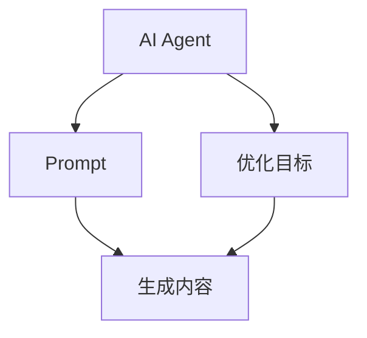
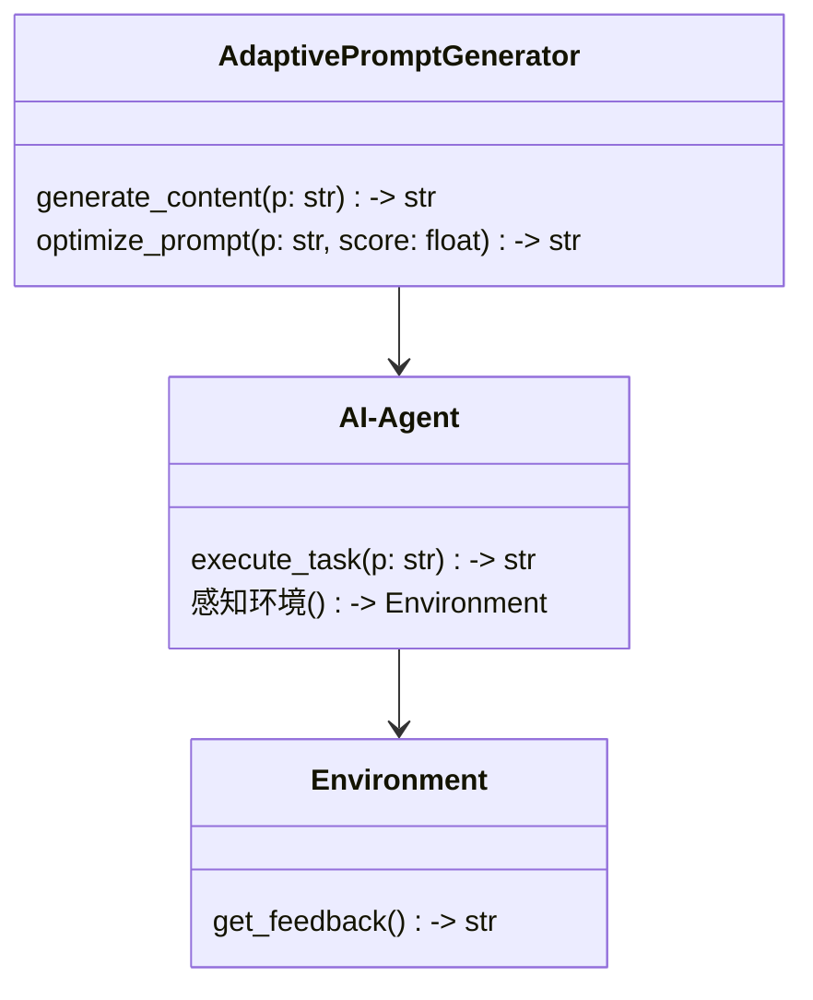
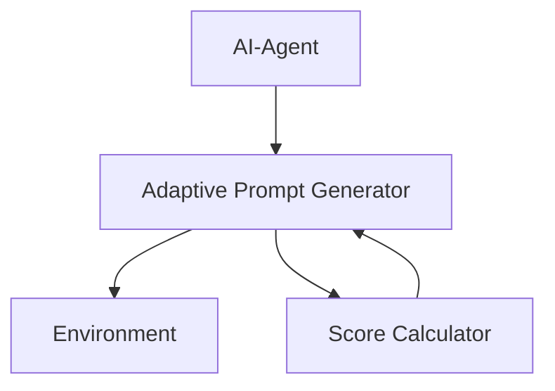
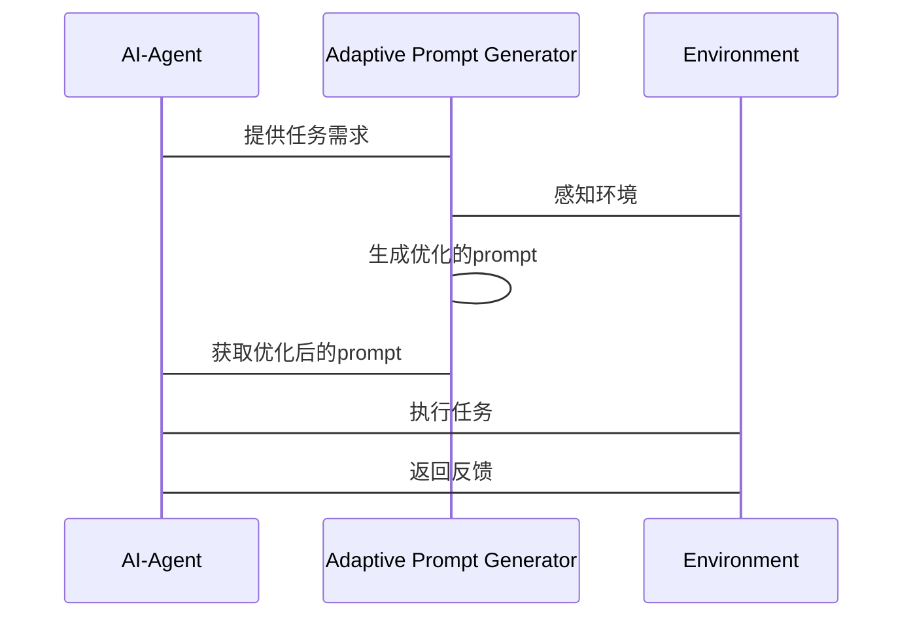

                 


# AI Agent的自适应prompt工程与优化

> 关键词：AI Agent，自适应prompt，生成式AI，优化算法，系统架构

> 摘要：本文深入探讨了AI Agent的自适应prompt工程与优化，从背景介绍到系统架构设计，结合实际案例分析，详细阐述了自适应prompt的核心概念、算法原理及实现方法。通过系统化的分析与实践，为读者提供了一套完整的解决方案和优化策略。

---

## 第一部分: AI Agent的自适应prompt工程与优化背景介绍

### 第1章: AI Agent与自适应prompt工程概述

#### 1.1 AI Agent的基本概念

##### 1.1.1 AI Agent的定义与分类

AI Agent（人工智能代理）是指能够感知环境、自主决策并执行任务的智能体。根据功能和应用场景的不同，AI Agent可以分为以下几类：

- **反应式AI Agent**：基于当前感知做出实时反应，适用于实时性要求高的场景，如自动驾驶。
- **认知式AI Agent**：具备推理、规划和学习能力，能够解决复杂问题，如智能助手。
- **协作式AI Agent**：能够与其他Agent或人类协同工作，完成分布式任务，如多智能体系统。

##### 1.1.2 自适应prompt工程的背景与意义

自适应prompt工程是指根据动态变化的环境和任务需求，实时生成和优化提示词（prompt）的过程。随着AI技术的快速发展，AI Agent的应用场景日益广泛，但其性能高度依赖于输入的提示词。传统的静态prompt难以应对复杂多变的环境，因此，自适应prompt工程应运而生，成为提升AI Agent智能性和效率的关键技术。

##### 1.1.3 问题背景与目标

在实际应用中，AI Agent面临以下问题：

- **需求多样性**：不同场景下的任务目标和输入数据差异显著。
- **环境动态性**：环境条件的变化可能导致固定prompt失效。
- **效率与效果平衡**：如何在保证效果的前提下提升效率是一个挑战。

自适应prompt工程的目标是通过动态生成和优化prompt，使AI Agent能够更好地适应环境变化，提高任务执行的效率和质量。

#### 1.2 自适应prompt工程的核心要素

##### 1.2.1 自适应prompt的定义与特点

自适应prompt是指能够根据任务需求和环境变化自动调整的提示词。其特点包括：

- **动态性**：能够实时感知环境变化并调整prompt内容。
- **智能化**：基于上下文和历史数据，生成最优的提示词。
- **可解释性**：生成的prompt需具备可解释性，便于调试和优化。

##### 1.2.2 自适应prompt与AI Agent的关系

自适应prompt是AI Agent的核心驱动力，通过优化提示词，AI Agent能够更高效地完成任务。两者的关系可以总结为：

1. AI Agent通过感知环境生成需求，触发自适应prompt生成。
2. 自适应prompt优化算法根据需求生成最优提示词，驱动AI Agent执行任务。
3. 执行结果反馈至自适应prompt优化算法，形成闭环。

##### 1.2.3 自适应prompt的边界与外延

自适应prompt的边界主要集中在prompt生成和优化算法的设计与实现，而其外延则涉及AI Agent的感知、决策和执行能力。通过不断优化prompt，可以提升AI Agent的智能性和适应性。

---

### 第2章: 自适应prompt工程的核心概念与联系

#### 2.1 核心概念原理

##### 2.1.1 自适应prompt的生成机制

自适应prompt的生成机制包括以下步骤：

1. **需求分析**：根据任务目标和环境数据，生成初步的prompt候选。
2. **优化迭代**：通过评估候选prompt的效果，不断优化生成的prompt。
3. **动态调整**：实时根据反馈调整prompt，确保其适应环境变化。

##### 2.1.2 自适应prompt与AI Agent的协同工作原理

自适应prompt与AI Agent的协同工作流程如下：

1. AI Agent感知环境并生成任务需求。
2. 自适应prompt生成模块根据需求生成初始prompt。
3. 通过评估模块优化prompt，确保其高效性。
4. AI Agent执行任务并返回结果。
5. 根据反馈优化prompt，形成闭环。

##### 2.1.3 自适应prompt与生成式AI模型的关系

自适应prompt是生成式AI模型的输入，通过优化prompt，可以显著提升生成结果的质量和效率。生成式AI模型负责生成内容，而自适应prompt则负责引导生成过程。

#### 2.2 核心概念属性特征对比表格

| 概念      | 属性              | 特征                                                         |
|-----------|-------------------|--------------------------------------------------------------|
| 自适应prompt | 输入方式          | 动态调整，根据任务需求和环境变化实时生成或调整prompt。 |
|            | 输出结果          | 高效准确，能够显著提升生成式AI模型的性能。                   |
| AI Agent   | 行为模式          | 自主决策，能够根据环境变化调整行为。                         |
|            | 学习能力          | 持续优化，通过反馈提升任务执行效率。                         |

#### 2.3 ER实体关系图架构



---

## 第二部分: 自适应prompt工程的算法原理

### 第3章: 自适应prompt生成算法

#### 3.1 生成式AI模型原理

##### 3.1.1 生成式AI模型的基本原理

生成式AI模型（如GPT系列）通过概率分布生成文本或其他形式的内容。其核心思想是基于训练数据学习语言模型，并根据输入的prompt生成符合上下文的输出。

##### 3.1.2 生成式AI模型的数学模型

生成式AI模型的数学模型通常基于变分自编码器（VAE）或生成对抗网络（GAN）。以下是一个简单的生成式模型的数学表达式：

$$ P(y|x) = \text{softmax}(Wx + b) $$

其中，$x$ 是输入，$y$ 是输出，$W$ 和 $b$ 是模型参数。

#### 3.2 自适应prompt优化算法

##### 3.2.1 自适应prompt优化算法的步骤

自适应prompt优化算法的步骤如下：

1. **初始化**：设置初始prompt。
2. **生成内容**：使用生成式AI模型生成内容。
3. **评估效果**：根据评估指标（如BLEU、ROUGE）评估生成内容的质量。
4. **优化prompt**：调整prompt参数，优化生成效果。
5. **迭代优化**：重复生成、评估和优化过程，直到满足目标。

##### 3.2.2 自适应prompt优化算法的数学模型

自适应prompt优化算法可以通过梯度下降优化。以下是一个简单的优化算法示例：

$$ p_{t+1} = p_t - \eta \cdot \frac{\partial L}{\partial p} $$

其中，$p_t$ 是当前prompt参数，$\eta$ 是学习率，$L$ 是损失函数。

#### 3.3 自适应prompt生成算法的实现代码

以下是一个简单的自适应prompt生成算法的Python代码示例：

```python
def adaptive_prompt_generator(initial_prompt, iterations=10):
    prompt = initial_prompt
    for _ in range(iterations):
        # 生成内容
        generated_content = generate_content(prompt)
        # 评估效果
        score = evaluate(generated_content)
        # 优化prompt
        prompt = optimize_prompt(prompt, score)
    return prompt
```

---

## 第三部分: 系统分析与架构设计

### 第4章: 系统功能设计与架构

#### 4.1 系统功能设计

##### 4.1.1 领域模型

以下是领域模型的Mermaid类图：



##### 4.1.2 系统架构

以下是系统架构的Mermaid图：



#### 4.2 系统交互设计

以下是系统交互的Mermaid序列图：



---

## 第四部分: 项目实战

### 第5章: 项目实现与案例分析

#### 5.1 项目安装与环境配置

```bash
pip install numpy pandas transformers
```

#### 5.2 核心实现代码

```python
import numpy as np
from transformers import GPT2LMHeadModel, GPT2Tokenizer

class AdaptivePromptGenerator:
    def __init__(self, model_name):
        self.model = GPT2LMHeadModel.from_pretrained(model_name)
        self.tokenizer = GPT2Tokenizer.from_pretrained(model_name)
    
    def generate_content(self, prompt):
        inputs = self.tokenizer(prompt, return_tensors='np')
        outputs = self.model.generate(inputs.input_ids, max_length=50)
        return self.tokenizer.decode(outputs[0], skip_special_tokens=True)
    
    def optimize_prompt(self, prompt, score):
        # 简单的优化策略：在prompt后添加更多信息
        return prompt + f"，评分：{score}"
```

#### 5.3 案例分析

以下是一个实际案例分析：

```python
# 初始化自适应prompt生成器
generator = AdaptivePromptGenerator("gpt2")

# 初始prompt
initial_prompt = "写一篇关于AI的博客文章"

# 生成优化后的prompt
optimized_prompt = generator.adaptive_prompt_generator(initial_prompt, 5)

# 生成内容
print(generator.generate_content(optimized_prompt))
```

---

## 第五部分: 最佳实践与总结

### 第6章: 最佳实践与小结

#### 6.1 最佳实践

- **持续优化**：定期评估和优化prompt生成策略。
- **数据质量**：确保训练数据的质量和多样性。
- **反馈机制**：建立有效的反馈机制，提升优化效果。

#### 6.2 小结

自适应prompt工程是提升AI Agent性能和效率的关键技术。通过动态生成和优化prompt，AI Agent能够更好地适应复杂多变的环境，实现高效的任务执行。

---

作者：AI天才研究院/AI Genius Institute & 禅与计算机程序设计艺术 /Zen And The Art of Computer Programming

