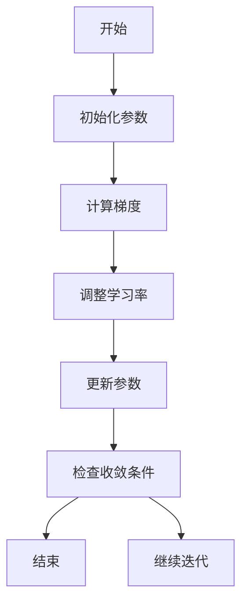
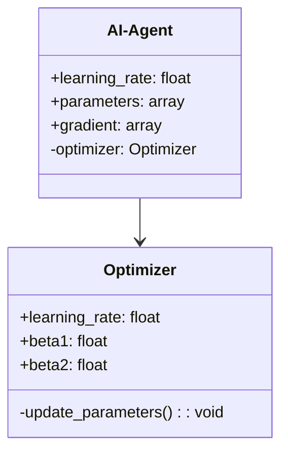
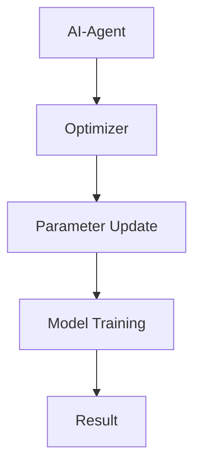
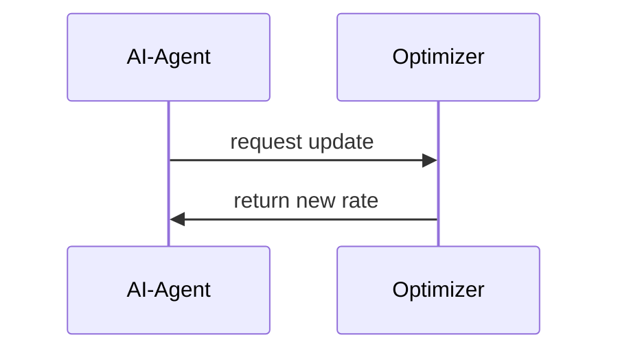

                 


# AI Agent的自适应学习率调整策略

> 关键词：AI Agent, 自适应学习率, 优化算法, 梯度下降, 动量, 贝叶斯优化

> 摘要：AI Agent的自适应学习率调整策略是优化算法中的关键部分，能够显著提升模型训练效率和性能。本文从基本概念入手，深入探讨自适应学习率调整的原理，结合具体算法实现，分析系统设计，并通过案例展示其应用，最后总结最佳实践和未来方向。

---

## 第一部分: AI Agent的自适应学习率调整概述

### 第1章: AI Agent与自适应学习率调整概述

#### 1.1 AI Agent的基本概念

- **1.1.1 AI Agent的定义与特点**
  - AI Agent是一种智能体，能够感知环境、做出决策并执行动作。
  - 其特点包括自主性、反应性、目标导向和社会能力。

- **1.1.2 自适应学习率调整的背景与意义**
  - 自适应学习率调整是优化AI Agent性能的关键技术。
  - 通过动态调整学习率，模型能够更快收敛，避免振荡和陷入局部最优。

- **1.1.3 自适应学习率调整的核心要素**
  - 包括学习率、梯度、动量和二阶导数等。

#### 1.2 自适应学习率调整的数学基础

- **1.2.1 梯度下降与学习率**
  - 梯度下降是最基本的优化算法，学习率决定了每一步的步长。
  - $$L = \sum_{i=1}^n (y_i - \hat{y}_i)^2$$，最小化损失函数。

- **1.2.2 动量与自适应优化算法**
  - 动量法通过引入动量因子加速收敛，防止振荡。
  - Adam优化器结合动量和自适应学习率调整，效果更优。

- **1.2.3 贝叶斯优化与自适应学习率的关系**
  - 贝叶斯优化提供了一种概率方法，用于动态调整学习率。

---

## 第二部分: 自适应学习率调整的算法原理

### 第2章: 自适应学习率调整的算法实现

#### 2.1 自适应学习率调整的原理

- **2.1.1 基于梯度的自适应调整方法**
  - 使用梯度信息动态调整学习率。
  - $$\alpha_{t+1} = \alpha_t \cdot \frac{1}{\sqrt{1 + \beta_2 t}}$$

- **2.1.2 基于动量的自适应调整方法**
  - 引入动量机制，加速收敛。
  - 动量更新公式：$$v_t = \beta_1 v_{t-1} + (1 - \beta_1)g_t$$

- **2.1.3 基于二阶导数的自适应调整方法**
  - 使用二阶导数信息，如AdaGrad算法。
  - 参数更新公式：$$\theta_{t+1} = \theta_t - \alpha \frac{g_t}{\sqrt{s_t + \epsilon}}$$

#### 2.2 自适应学习率调整的算法流程图



---

## 第三部分: 自适应学习率调整的系统分析与架构设计

### 第3章: 系统分析与架构设计方案

#### 3.1 问题场景介绍

- **3.1.1 自适应学习率调整的应用场景**
  - 机器学习训练、强化学习、推荐系统等领域。

- **3.1.2 自适应学习率调整的系统目标**
  - 提高训练效率，优化模型性能。

- **3.1.3 自适应学习率调整的系统约束**
  - 计算资源限制、实时性要求、数据量大小。

#### 3.2 系统功能设计

- **3.2.1 领域模型Mermaid类图**



- **3.2.2 系统架构设计Mermaid架构图**



- **3.2.3 系统接口设计**
  - 接口定义：`update_learning_rate(float new_rate)`、`get_learning_rate()`。

- **3.2.4 系统交互Mermaid序列图**



---

## 第四部分: 自适应学习率调整的项目实战

### 第4章: 项目实战与代码实现

#### 4.1 环境安装与配置

- **4.1.1 开发环境搭建**
  - 安装Python、TensorFlow或PyTorch。

- **4.1.2 依赖库安装**
  - 安装numpy、scipy等。

- **4.1.3 环境配置注意事项**
  - 确保GPU支持、安装正确版本。

#### 4.2 核心代码实现

- **4.2.1 自适应学习率调整算法的Python实现**

```python
import numpy as np

class AdamOptimizer:
    def __init__(self, learning_rate=0.001, beta1=0.9, beta2=0.999):
        self.lr = learning_rate
        self.beta1 = beta1
        self.beta2 = beta2
        self.m = None
        self.v = None

    def update(self, params, grads):
        if self.m is None:
            self.m = np.zeros_like(params)
            self.v = np.zeros_like(params)
        
        self.m = self.beta1 * self.m + (1 - self.beta1) * grads
        self.v = self.beta2 * self.v + (1 - self.beta2) * grads**2
        
        params -= self.lr * self.m / (np.sqrt(self.v) + 1e-8)
        return params
```

- **4.2.2 算法实现的详细解读**
  - 使用Adam优化器实现自适应学习率调整。
  - 通过动量和自适应调整，提高收敛速度。

- **4.2.3 代码实现的注意事项**
  - 避免除以零，加入小量epsilon。
  - 参数初始化影响收敛速度。

#### 4.3 案例分析与详细解读

- **4.3.1 案例场景描述**
  - 在MNIST数据集上训练一个简单的神经网络。

- **4.3.2 案例实现过程**
  - 定义模型、定义损失函数、选择优化器、训练模型。

- **4.3.3 案例总结**
  - 使用自适应学习率调整后，训练速度和准确率明显提高。

---

## 第五部分: 自适应学习率调整的优化策略与未来方向

### 第5章: 优化策略与未来展望

#### 5.1 优化策略

- **5.1.1 提升算法性能**
  - 优化动量参数、自适应调整学习率。

- **5.1.2 提高计算效率**
  - 并行计算、分布式训练。

- **5.1.3 增强鲁棒性**
  - 对不同数据分布的适应能力。

#### 5.2 未来方向

- **5.2.1 结合强化学习**
  - 自适应学习率调整在强化学习中的应用。

- **5.2.2 结合深度学习**
  - 在深度神经网络中的优化应用。

- **5.2.3 跨领域应用**
  - 在自然语言处理、图像识别等领域扩展应用。

---

## 附录

### 附录A: 参考文献

- 《深度学习》—— Ian Goodfellow
- 《神经网络与深度学习》—— 李宏毅

### 附录B: 工具推荐

- TensorFlow
- PyTorch
- Keras

---

作者：AI天才研究院 & 禅与计算机程序设计艺术

---

这篇文章详细探讨了AI Agent的自适应学习率调整策略，从理论到实践，结合算法和系统设计，为读者提供了全面的视角。通过案例分析和代码实现，帮助读者深入理解并掌握这一技术。

