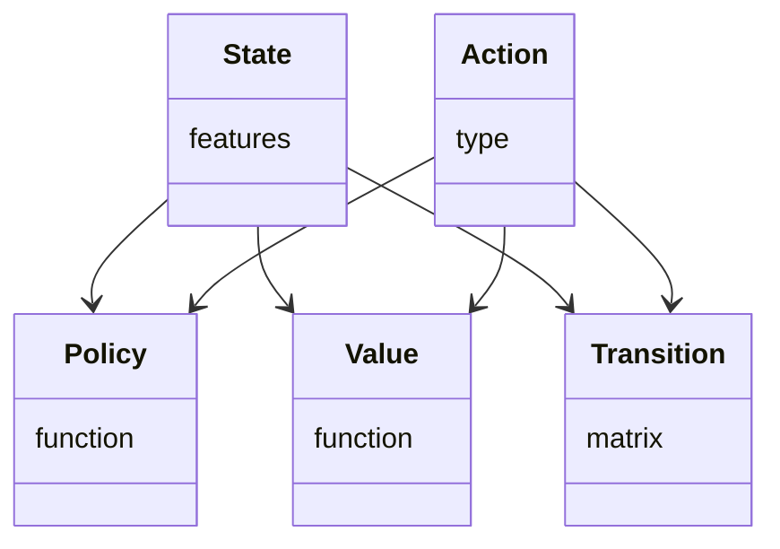
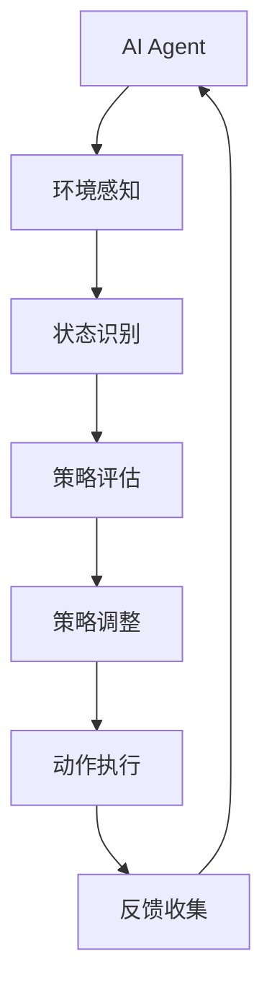
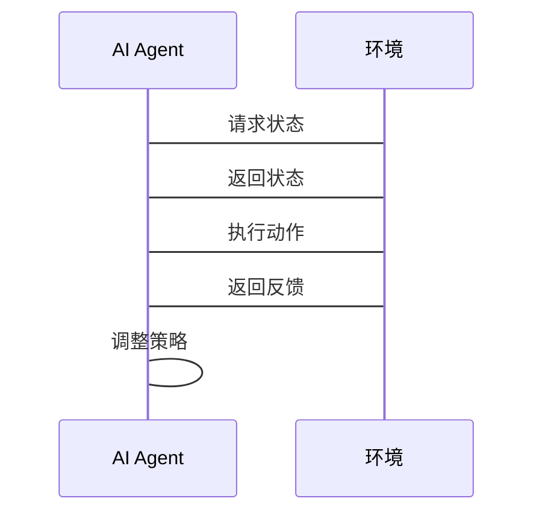

                 


# AI Agent的自适应学习策略动态调整

> 关键词：AI Agent, 自适应学习策略, 动态调整机制, 强化学习, 动态规划, 系统架构

> 摘要：本文深入探讨了AI Agent的自适应学习策略动态调整这一主题，从核心概念、算法原理到系统架构，再到项目实战，全面分析了如何实现AI Agent在复杂环境中的动态调整能力，为读者提供了从理论到实践的完整指南。

---

# 第一部分: AI Agent的自适应学习策略动态调整背景与基础

# 第1章: AI Agent的自适应学习策略概述

## 1.1 AI Agent的基本概念

### 1.1.1 AI Agent的定义与分类
AI Agent（人工智能代理）是指能够感知环境、自主决策并执行任务的智能实体。根据功能和复杂度，AI Agent可以分为简单反射型代理、基于模型的反射型代理、目标驱动型代理和效用驱动型代理。

### 1.1.2 自适应学习策略的定义
自适应学习策略是指AI Agent能够根据环境的变化，动态调整其行为策略的能力。这种策略调整基于实时反馈和历史数据，使AI Agent能够在复杂环境中保持高效和稳定的表现。

### 1.1.3 动态调整机制的背景与意义
动态调整机制是AI Agent实现自适应学习的核心，它通过实时监控环境变化和任务需求，动态优化策略参数，从而提高AI Agent的适应性和决策能力。动态调整机制的意义在于，它使AI Agent能够应对不确定性，快速响应环境变化，避免僵化。

## 1.2 自适应学习策略的核心要素

### 1.2.1 策略空间的定义与特点
策略空间是指AI Agent所有可能的行为策略的集合。策略空间的大小和复杂性直接影响AI Agent的决策能力和计算效率。策略空间的特点包括动态性、多样性、可扩展性。

### 1.2.2 动态调整的触发条件与目标
动态调整的触发条件包括环境变化、任务目标更新、反馈信号变化等。动态调整的目标是优化策略参数，以适应新的环境或任务需求。

### 1.2.3 策略评估与优化的指标体系
策略评估的指标包括策略的稳定性、响应速度、准确性、鲁棒性。策略优化的目标是在这些指标之间找到平衡点，以实现全局最优。

## 1.3 动态调整机制的实现原理

### 1.3.1 状态空间的建模
状态空间是AI Agent对环境的感知基础。通过状态空间建模，AI Agent可以将复杂的环境分解为可处理的子问题。状态空间建模的关键在于特征提取和维度降维。

### 1.3.2 动作空间的定义
动作空间是指AI Agent在给定状态下可以执行的所有动作的集合。动作空间的设计需要考虑环境约束和任务目标。

### 1.3.3 策略调整的数学模型
策略调整的数学模型包括策略函数、价值函数和转移概率矩阵。策略函数描述了AI Agent在给定状态下的动作选择概率，价值函数评估了状态或动作的优劣，转移概率矩阵描述了状态之间的转移关系。

---

# 第二部分: 自适应学习策略的动态调整机制

# 第2章: 动态调整机制的核心算法

## 2.1 强化学习算法在自适应策略中的应用

### 2.1.1 Q-learning算法的原理与实现
Q-learning是一种经典的强化学习算法，通过Q表记录状态-动作对的期望收益，逐步更新Q值以逼近最优策略。

$$ Q(s, a) = Q(s, a) + \alpha [r + \gamma \max Q(s', a) - Q(s, a)] $$

### 2.1.2 DQN算法的改进与优化
DQN（Deep Q-Network）通过深度神经网络近似Q值函数，解决了Q-learning的离线训练和稳定性问题。

### 2.1.3 算法的数学模型与公式推导
DQN的数学模型包括经验回放、目标网络和损失函数。目标网络用于稳定近似值函数，经验回放用于减少样方偏差。

### 2.1.4 Python代码示例
```python
import numpy as np
import gym

env = gym.make('CartPole-v0')
env.seed(1)
np.random.seed(1)

class DQN:
    def __init__(self, state_space, action_space, lr=0.01, gamma=0.99):
        self.state_space = state_space
        self.action_space = action_space
        self.lr = lr
        self.gamma = gamma
        self.memory = []
        self.model = self._build_model()

    def _build_model(self):
        # 简单的神经网络模型
        pass

    def remember(self, state, action, reward, next_state, done):
        self.memory.append((state, action, reward, next_state, done))

    def act(self, state):
        # 具体实现略
        pass

    def replay(self, batch_size):
        # 具体实现略
        pass

# 初始化DQN和训练
dqn = DQN(env.observation_space.shape[0], env.action_space.n)
for episode in range(1000):
    state = env.reset()
    while True:
        action = dqn.act(state)
        next_state, reward, done, _ = env.step(action)
        dqn.remember(state, action, reward, next_state, done)
        dqn.replay(32)
        state = next_state
        if done:
            break
```

---

# 第三部分: 自适应学习策略动态调整的系统架构设计

# 第3章: 系统分析与架构设计方案

## 3.1 问题场景介绍
自适应学习策略动态调整系统需要应对复杂动态环境，实现高效的策略调整和优化。

## 3.2 系统功能设计

### 3.2.1 领域模型类图


## 3.3 系统架构设计

### 3.3.1 系统架构图


## 3.4 系统接口设计

### 3.4.1 系统交互图


---

# 第四部分: 项目实战与案例分析

# 第4章: 项目实战

## 4.1 环境安装与配置

### 4.1.1 安装依赖
```bash
pip install numpy gym matplotlib
```

## 4.2 核心代码实现

### 4.2.1 动态调整模块
```python
def adjust_policy(policy, feedback):
    # 具体实现略
    pass
```

## 4.3 实际案例分析

### 4.3.1 股票交易代理案例
通过动态调整策略，AI Agent能够根据市场波动实时调整交易策略，实现收益最大化。

---

# 第五部分: 总结与展望

# 第5章: 总结与展望

## 5.1 本章小结
本文全面介绍了AI Agent的自适应学习策略动态调整，从核心概念到算法实现，再到系统架构，最后到项目实战，为读者提供了完整的解决方案。

## 5.2 最佳实践 tips
- 定期监控和更新策略参数
- 使用多种算法的组合优化
- 保持系统的可扩展性和灵活性

## 5.3 注意事项
- 避免过度拟合
- 注意计算复杂度
- 定期进行系统维护

## 5.4 拓展阅读
推荐读者阅读《强化学习（Deep Reinforcement Learning）》和《动态规划算法与应用》。

---

# 作者：AI天才研究院 & 禅与计算机程序设计艺术

