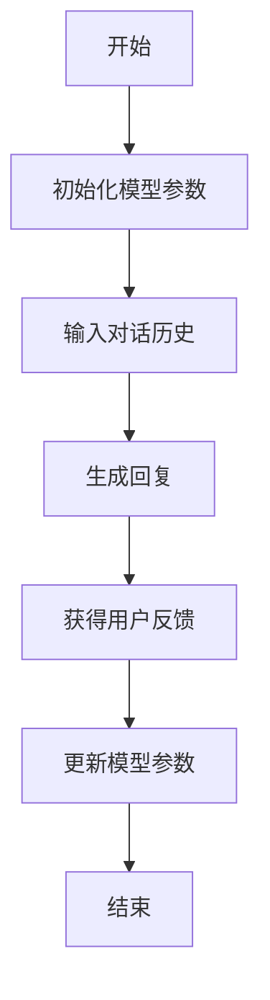
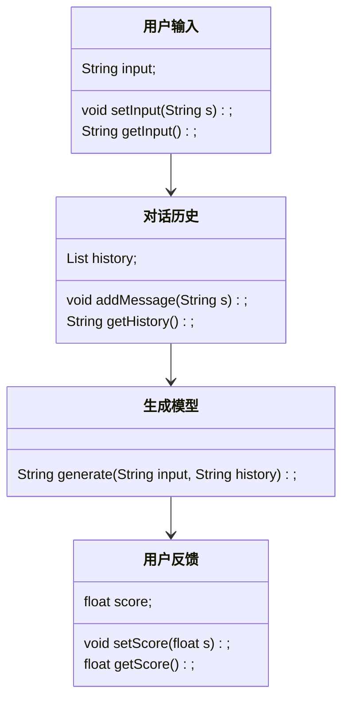
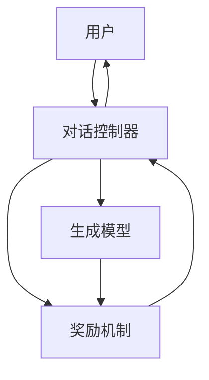
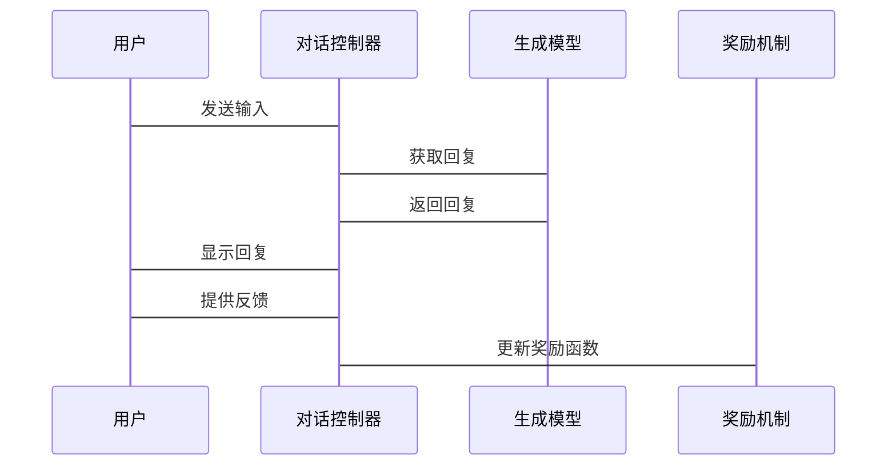

                 


# AI Agent的自适应对话生成系统

> 关键词：AI Agent，自适应对话生成，自然语言处理，生成式模型，强化学习

> 摘要：本文深入探讨AI Agent在自适应对话生成系统中的应用，分析其核心概念、算法原理、系统架构及项目实现，结合实际案例，为读者提供全面的理论与实践指导。

---

# 目录

## 第一章: 背景介绍

### 1.1 问题背景
- 1.1.1 对话生成系统的现状与挑战
- 1.1.2 自适应对话生成的需求与意义
- 1.1.3 AI Agent在对话生成中的作用

### 1.2 问题描述
- 1.2.1 对话生成系统的定义与目标
- 1.2.2 自适应对话生成的核心问题
- 1.2.3 AI Agent在对话生成中的具体应用场景

## 第二章: 核心概念与结构

### 2.1 核心概念
- 2.1.1 自适应对话生成系统的定义
- 2.1.2 AI Agent在对话生成中的角色
- 2.1.3 对话生成系统的输入输出关系

### 2.2 核心要素组成
- 2.2.1 生成式模型
- 2.2.2 强化学习优化
- 2.2.3 多模态输入处理

---

## 第三章: 核心原理与联系

### 3.1 核心原理
- 3.1.1 生成式模型的工作原理
- 3.1.2 强化学习在对话生成中的应用
- 3.1.3 多模态输入的处理机制

### 3.2 概念属性对比表
#### 表3.1: 生成式模型与检索式模型的对比
| 特性        | 生成式模型              | 检索式模型              |
|-------------|-------------------------|-------------------------|
| 数据需求     | 需要大量训练数据         | 依赖预存数据             |
| 灵活性       | 高，支持创新表达         | 低，依赖已有数据         |
| 计算复杂度   | 高，尤其是复杂模型       | 较低                   |

#### 表3.2: 强化学习与监督学习的对比
| 特性        | 强化学习                | 监督学习                |
|-------------|-------------------------|-------------------------|
| 激励机制     | 通过奖励函数            | 通过标签数据            |
| 数据需求     | 需要环境反馈             | 需要标注数据             |
| 应用场景     | 对话生成优化            | 分类、回归等任务         |

---

## 第四章: 算法原理讲解

### 4.1 生成式模型
#### 4.1.1 Transformer模型
- **编码器-解码器结构**
  - 编码器将输入序列编码为上下文表示。
  - 解码器根据上下文生成输出序列。
- **自注意力机制**
  - 允许模型关注输入中的重要部分。

#### 4.1.2 GPT模型
- **自回归生成**
  - 每一步生成下一个词，依赖于之前的生成结果。

#### 4.1.3 BERT模型
- **预训练目标**
  - � másked语言模型：随机遮蔽部分词，预测其值。
  - 下文理解任务：预测句子关系。

### 4.2 强化学习
#### 4.2.1 强化学习框架
- **状态（State）**：对话历史和当前上下文。
- **动作（Action）**：生成的回复。
- **奖励（Reward）**：用户反馈，如满意度评分。

#### 4.2.2 基于策略梯度的对话生成
- **策略梯度算法**
  - 使用策略网络直接优化生成策略。
  - 通过采样生成多种可能的回复，根据奖励更新策略。

### 4.3 算法流程


#### 4.3.1 数学模型
- **策略网络**：$P(a|s) = \text{softmax}(W_s s + b)$
  - $s$ 是状态向量，$a$ 是动作。
- **奖励函数**：$R(s, a) = r \in [0,1]$

---

## 第五章: 系统分析与架构设计

### 5.1 问题场景
- **用户需求**：多样化的对话主题和风格。
- **系统目标**：实现自适应、个性化、高准确率的对话生成。

### 5.2 项目介绍
- **项目名称**：AI Agent自适应对话生成系统
- **开发团队**：AI天才研究院
- **技术选型**：基于Transformer的生成模型，结合强化学习优化。

### 5.3 系统功能设计
#### 5.3.1 领域模型


#### 5.3.2 系统架构


### 5.4 系统接口设计
- **输入接口**：接收用户输入和对话历史。
- **输出接口**：生成回复并返回给用户。
- **反馈接口**：收集用户反馈并更新模型参数。

### 5.5 系统交互


---

## 第六章: 项目实战

### 6.1 环境安装
- **Python版本**：3.8+
- **依赖库**：TensorFlow、Keras、Hugging Face的Transformers库

### 6.2 系统核心实现

#### 6.2.1 生成模型实现
```python
from transformers import AutoModelWithLMHead, AutoTokenizer

class Generator:
    def __init__(self, model_name):
        self.model = AutoModelWithLMHead.from_pretrained(model_name)
        self.tokenizer = AutoTokenizer.from_pretrained(model_name)
    
    def generate(self, input_ids, max_length=50):
        outputs = self.model.generate(input_ids, max_length=max_length)
        return self.tokenizer.decode(outputs[0], skip_special_tokens=True)
```

#### 6.2.2 强化学习优化
```python
import torch
import torch.nn as nn

class Policy(nn.Module):
    def __init__(self, input_dim, output_dim):
        super(Policy, self).__init__()
        self.fc = nn.Linear(input_dim, output_dim)
    
    def forward(self, x):
        return torch.softmax(self.fc(x), dim=-1)
```

#### 6.2.3 对话控制器实现
```python
class DialogController:
    def __init__(self, generator, policy):
        self.generator = generator
        self.policy = policy
        self.history = []
    
    def process_input(self, input_str):
        input_ids = self.tokenizer.encode(input_str, return_tensors='pt')
        response = self.generator.generate(input_ids)
        self.history.append(response)
        return response
```

### 6.3 实际案例分析
- **案例**：用户输入“今天天气不错”，生成模型回复“是的，今天天气很好！”。
- **分析**：模型根据上下文生成相关回复，并通过用户反馈不断优化回复质量。

---

## 第七章: 总结与展望

### 7.1 最佳实践
- **小结**：AI Agent的自适应对话生成系统通过结合生成式模型和强化学习，显著提高了对话生成的灵活性和准确性。
- **注意事项**：确保数据多样性和模型鲁棒性，避免生成不适当内容。
- **拓展阅读**：探索多模态对话生成，结合图像、语音等信息提升对话质量。

---

作者：AI天才研究院 & 禅与计算机程序设计艺术

