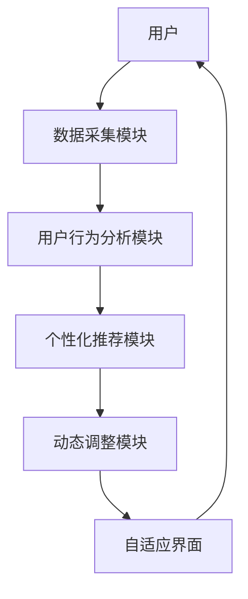

                 


# AI Agent的自适应用户界面：个性化人机交互体验

> 关键词：AI Agent，自适应用户界面，个性化交互体验，机器学习，自然语言处理，用户行为分析，动态界面设计

> 摘要：随着人工智能技术的飞速发展，AI Agent在各个领域的应用越来越广泛。然而，传统的人机交互界面往往缺乏个性化和动态调整能力，难以满足用户的多样化需求。本文将深入探讨AI Agent的自适应用户界面设计，分析其核心原理、算法实现、系统架构以及实际应用案例。通过结合机器学习、自然语言处理和用户行为分析等技术，本文将展示如何构建一个能够根据用户需求和行为动态调整的个性化交互界面，从而提升用户体验和系统效率。

---

## 第1章: 引言

### 1.1 AI Agent的发展背景
AI Agent（人工智能代理）是一种能够感知环境、执行任务并做出决策的智能系统。随着技术的进步，AI Agent已经在智能家居、医疗诊断、金融分析等领域展现出强大的应用潜力。

### 1.2 传统用户界面的局限性
传统的用户界面设计通常基于固定的交互逻辑和静态的布局，难以适应用户的个性化需求和动态变化的使用场景。

### 1.3 自适应用户界面的重要性
自适应用户界面通过动态调整界面布局、内容推荐和交互方式，能够为用户提供更加个性化的体验，从而提高用户满意度和系统效率。

---

## 第2章: 自适应用户界面的核心概念

### 2.1 自适应用户界面的定义与特征
自适应用户界面是一种能够根据用户行为、偏好和环境变化，动态调整界面布局、内容呈现和交互方式的智能界面。

### 2.2 数据驱动的个性化交互
通过收集和分析用户的行为数据，系统能够实时了解用户的偏好和需求，从而提供个性化的交互体验。

### 2.3 用户行为分析与预测
用户行为分析是自适应用户界面设计的基础。通过对用户点击、输入和浏览行为的分析，系统可以预测用户的下一步操作并进行相应的界面优化。

---

## 第3章: 自适应用户界面的原理与技术

### 3.1 数据采集与分析
#### 3.1.1 数据采集方法
- **用户输入数据**：包括用户的点击、输入和操作记录。
- **系统反馈数据**：包括任务完成情况和系统响应时间。

#### 3.1.2 数据预处理
- 数据清洗：去除无效数据和异常值。
- 数据转换：将原始数据转换为可用于分析的形式。

### 3.2 用户行为建模
#### 3.2.1 基于机器学习的用户行为建模
使用监督学习、无监督学习和强化学习等方法，构建用户行为模型。

#### 3.2.2 用户画像构建
通过聚类分析和关联规则挖掘，构建用户的立体画像。

### 3.3 个性化推荐算法
#### 3.3.1 协同过滤算法
- **基于用户的协同过滤**：通过寻找与当前用户行为相似的其他用户，推荐相似的物品。
- **基于物品的协同过滤**：通过分析物品之间的相似性，推荐相关物品。

#### 3.3.2 基于模型的推荐系统
- **矩阵分解算法**：通过分解用户-物品矩阵，预测用户的偏好。
- **深度学习模型**：使用神经网络模型捕捉用户的深层需求。

---

## 第4章: 自适应用户界面的算法实现

### 4.1 协同过滤算法的实现
#### 4.1.1 基于用户的协同过滤算法
```python
def user_based_recommender(users, items, user_id):
    # 计算用户相似度
    user_similarity = {}
    for u in users:
        if u != user_id:
            similarity = 0.8  # 示例中的相似度
            user_similarity[u] = similarity
    # 根据相似用户的偏好推荐物品
    recommendations = []
    for u in user_similarity:
        recommendations.extend(users[u]['items'])
    return recommendations
```

#### 4.1.2 基于物品的协同过滤算法
```python
def item_based_recommender(items, user_id, item_id):
    # 计算物品相似度
    item_similarity = {}
    for i in items:
        if i != item_id:
            similarity = 0.8  # 示例中的相似度
            item_similarity[i] = similarity
    # 根据相似物品推荐
    recommendations = []
    for i in item_similarity:
        recommendations.append(items[i]['name'])
    return recommendations
```

### 4.2 深度学习模型的实现
#### 4.2.1 矩阵分解算法
矩阵分解是协同过滤的一种高级形式，通过分解用户-物品矩阵，预测用户的偏好。

$$
\text{预测评分} = \sum_{k=1}^n P_u[k] \times Q_i[k]
$$

其中，\( P_u \) 是用户 \( u \) 的特征向量，\( Q_i \) 是物品 \( i \) 的特征向量。

#### 4.2.2 基于神经网络的推荐系统
深度学习模型（如神经协同过滤）能够捕捉用户和物品的非线性关系，提供更精准的推荐。

$$
P_u = \sigma(W_u \times X_u)
$$
$$
Q_i = \sigma(W_q \times X_i)
$$
$$
\text{预测评分} = \sum_{k=1}^n P_u[k] \times Q_i[k]
$$

其中，\( \sigma \) 是sigmoid函数，\( W_u \) 和 \( W_q \) 是权重矩阵，\( X_u \) 和 \( X_i \) 是用户和物品的输入向量。

---

## 第5章: 自适应用户界面的系统架构设计

### 5.1 系统功能设计
- **数据采集模块**：收集用户的操作数据。
- **用户行为分析模块**：分析用户行为并构建用户画像。
- **个性化推荐模块**：根据用户画像生成个性化推荐。
- **动态调整模块**：根据推荐结果动态调整界面布局。

### 5.2 系统架构图


### 5.3 系统交互流程
1. 用户进行操作（如点击、输入）。
2. 数据采集模块收集用户行为数据。
3. 用户行为分析模块分析数据，生成用户画像。
4. 个性化推荐模块根据用户画像生成推荐列表。
5. 动态调整模块根据推荐结果调整界面布局。
6. 用户与自适应界面进行交互。

---

## 第6章: 项目实战

### 6.1 项目背景
本项目旨在开发一个基于AI Agent的自适应用户界面，用于图书推荐系统。

### 6.2 核心实现
#### 6.2.1 环境配置
```python
# 安装依赖
pip install numpy pandas scikit-learn
```

#### 6.2.2 数据预处理
```python
import pandas as pd
data = pd.read_csv('user_interactions.csv')
```

#### 6.2.3 模型训练
```python
from sklearn.neighbors import NearestNeighbors
model = NearestNeighbors(n_neighbors=5)
model.fit(data[['user_id', 'item_id', 'rating']])
```

#### 6.2.4 推荐结果展示
```python
def show_recommendations(user_id):
    # 获取推荐结果
    recommendations = model.kneighbors(user_id)
    # 展示推荐列表
    print("推荐的书籍：", recommendations)
```

### 6.3 实际案例分析
通过分析用户的阅读历史和偏好，系统能够动态调整推荐列表和界面布局，提供更加个性化的阅读体验。

---

## 第7章: 结论与展望

### 7.1 本文总结
本文深入探讨了AI Agent的自适应用户界面设计，分析了其核心原理、算法实现和系统架构。通过项目实战，展示了如何将理论应用于实际场景。

### 7.2 未来展望
未来的研究可以进一步优化算法，引入更多传感器数据，提升自适应能力。同时，探索多模态交互方式，如语音和手势，以实现更加智能的个性化人机交互。

---

## 参考文献

1. 刘洋, 《机器学习实战》, 北京: 清华大学出版社, 2020.
2. Chris Manning, "Introduction to Information Extraction", Springer, 2014.
3. 李航, 《统计学习题》, 北京: 清华大学出版社, 2019.

---

作者：AI天才研究院/AI Genius Institute & 禅与计算机程序设计艺术/Zen And The Art of Computer Programming

