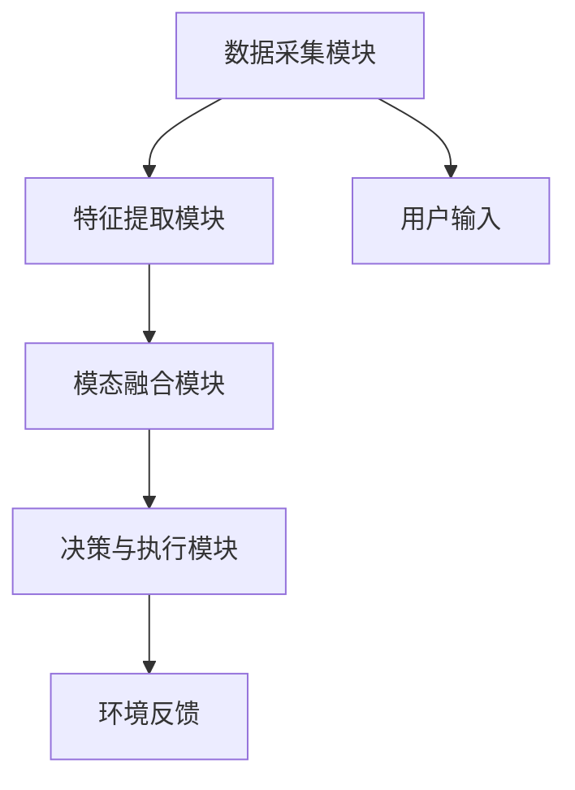

                 

# AI Agent的视觉-触觉-语言多模态学习

---

## 关键词

- AI Agent
- 多模态学习
- 视觉模态
- 触觉模态
- 语言模态
- 跨模态融合
- 多模态感知

---

## 摘要

AI Agent的视觉-触觉-语言多模态学习是人工智能领域的前沿研究方向，旨在通过整合视觉、触觉和语言三种模态的信息，提升AI Agent的感知能力和智能水平。本文将从多模态学习的基本概念出发，详细探讨视觉、触觉和语言模态的特点及其在多模态学习中的作用，分析多模态数据的融合方法，结合实际应用场景，展示如何通过算法和系统设计实现跨模态信息的高效处理与应用。通过本文的讲解，读者将能够全面理解AI Agent多模态学习的核心思想，并掌握相关技术的实现方法。

---

## 第一部分：AI Agent与多模态学习背景

### 第1章：AI Agent的基本概念

#### 1.1 AI Agent的定义与特点

AI Agent（人工智能代理）是指能够感知环境、做出决策并执行任务的智能实体。与传统的程序不同，AI Agent具备以下特点：

- **自主性**：能够在没有外部干预的情况下独立运行。
- **反应性**：能够实时感知环境并做出响应。
- **目标导向性**：具备明确的目标，并能采取行动以实现目标。
- **学习能力**：能够通过经验改进自身的性能。

#### 1.2 多模态学习的定义与重要性

多模态学习是指AI Agent能够同时处理和理解多种不同形式的数据（如图像、文本、语音、触觉信号等），并通过这些数据的协同作用来提升学习效果和智能水平。多模态学习的重要性体现在以下几个方面：

- **信息互补性**：不同模态的数据能够提供互补的信息，从而提升AI Agent对环境的理解能力。
- **鲁棒性增强**：通过多模态数据的融合，AI Agent能够在单一模态数据不足或噪声较大的情况下，依然保持较高的感知精度。
- **任务灵活性**：多模态学习能够支持AI Agent在多种任务中灵活切换，适应复杂多变的环境需求。

---

### 第2章：视觉、触觉、语言模态的概述

#### 2.1 视觉模态：图像与视觉感知

视觉模态是AI Agent感知环境的重要方式之一，主要通过摄像头等设备采集图像数据，并利用计算机视觉技术对图像进行处理和分析。

- **图像特征提取**：通过卷积神经网络（CNN）等深度学习模型，提取图像中的高层次特征。
- **目标检测与识别**：基于视觉模态数据，实现对物体、场景的检测与识别。
- **视觉注意力机制**：通过注意力机制，聚焦于图像中对任务最重要的区域。

#### 2.2 触觉模态：力反馈与触感感知

触觉模态是AI Agent与物理环境交互的重要方式，主要通过力传感器等设备采集触觉信号，并利用触觉感知技术进行分析。

- **触觉信号处理**：将触觉信号转化为数字形式，并进行特征提取。
- **触觉反馈控制**：基于触觉信号，调整机械臂或 gripper 的动作，实现精细操作。
- **触觉与视觉的协同**：将触觉信号与视觉信号结合，提升物体识别和操作的准确性。

#### 2.3 语言模态：自然语言处理与生成

语言模态是AI Agent与人类进行交互的重要方式，主要通过自然语言处理（NLP）技术实现文本的理解与生成。

- **文本特征提取**：通过词嵌入（如Word2Vec、BERT）等技术，将文本数据转化为向量形式。
- **语言模型训练**：基于大规模文本数据，训练语言模型，实现文本的理解与生成。
- **对话系统**：通过语言模态实现与人类的对话交互，提升用户体验。

---

## 第二部分：多模态学习的核心算法与实现

### 第3章：多模态数据的表示与融合

#### 3.1 多模态数据的表示方法

在多模态学习中，不同模态的数据需要以统一的形式表示，以便进行融合与处理。常见的表示方法包括：

- **模态对齐**：将不同模态的数据对齐到同一个语义空间，例如通过跨模态注意力机制实现对齐。
- **模态嵌入**：将每种模态的数据映射到一个低维嵌入空间，例如使用模态嵌入层（Modality Embedding Layer）。
- **模态融合**：将不同模态的特征进行融合，例如通过加权融合（Weighted Fusion）或注意力融合（Attention-based Fusion）。

#### 3.2 跨模态信息融合的算法实现

跨模态信息融合是多模态学习的核心步骤，常用的算法包括：

- **多模态注意力机制**：通过注意力机制，对不同模态的信息进行加权融合，例如多模态Transformer模型。
- **模态对齐网络**：通过网络结构对齐不同模态的数据，例如使用对比学习（Contrastive Learning）实现模态对齐。
- **多任务学习**：在多个任务上联合训练，通过共享特征提取器实现跨模态信息的融合。

---

### 第4章：多模态学习的数学模型与公式

#### 4.1 多模态数据的特征表示

假设我们有三种模态的数据：视觉模态$V$、触觉模态$T$和语言模态$L$。每种模态的数据可以通过特征提取器转化为向量形式：

$$
v = f_v(V), \quad t = f_t(T), \quad l = f_l(L)
$$

其中，$f_v$、$f_t$、$f_l$分别是针对视觉、触觉和语言模态的特征提取函数。

#### 4.2 跨模态注意力机制

跨模态注意力机制用于对不同模态的特征进行加权融合，例如：

$$
a_v = \text{softmax}(\frac{v \cdot t + v \cdot l}{\|v\| \|t\|})
$$

$$
a_t = \text{softmax}(\frac{t \cdot v + t \cdot l}{\|t\| \|v\|})
$$

$$
a_l = \text{softmax}(\frac{l \cdot v + l \cdot t}{\|l\| \|v\|})
$$

其中，$a_v$、$a_t$、$a_l$分别是视觉、触觉和语言模态的注意力权重。

---

### 第5章：多模态学习的系统架构设计

#### 5.1 系统功能设计

AI Agent的多模态学习系统通常包括以下几个功能模块：

- **数据采集模块**：负责采集视觉、触觉和语言模态的数据。
- **特征提取模块**：对采集到的数据进行特征提取，生成对应的特征向量。
- **模态融合模块**：对不同模态的特征进行融合，生成融合后的特征向量。
- **决策与执行模块**：基于融合后的特征向量，做出决策并执行相应的动作。

---

#### 5.2 系统架构设计

以下是多模态学习系统的架构设计图：

---

### 第6章：项目实战与案例分析

#### 6.1 项目背景与目标

以一个智能机器人项目为例，目标是通过视觉、触觉和语言模态的多模态学习，实现机器人对物体的识别、抓取和对话交互。

#### 6.2 项目实现步骤

1. **环境安装**：
   - 安装必要的库：OpenCV、ROS、TensorFlow、PyTorch等。
2. **数据采集**：
   - 使用摄像头采集图像数据。
   - 使用力传感器采集触觉数据。
   - 使用麦克风采集语音数据。
3. **特征提取**：
   - 使用CNN提取图像特征。
   - 使用触觉传感器的数据进行特征提取。
   - 使用NLP模型提取文本特征。
4. **模态融合**：
   - 使用注意力机制对视觉、触觉和语言模态的特征进行融合。
5. **模型训练与优化**：
   - 在训练数据上训练多模态融合模型。
   - 使用验证集进行模型调优。
6. **系统集成与测试**：
   - 将模型集成到机器人系统中，进行功能测试。
   - 收集用户反馈，进一步优化模型。

---

## 第三部分：总结与展望

### 第7章：总结与最佳实践

- **总结**：本文详细介绍了AI Agent的视觉-触觉-语言多模态学习的核心概念、算法实现和系统设计，并通过项目实战展示了多模态学习技术的应用。
- **最佳实践**：
  - 在实际项目中，建议优先选择性能稳定的特征提取模型。
  - 注意数据的均衡性，避免某一模态的数据过于占优。
  - 在模型训练过程中，建议使用早停（Early Stopping）等技术防止过拟合。

---

### 第8章：未来研究方向

- **多模态学习的可解释性**：如何提升多模态学习的可解释性，以便更好地理解和优化模型。
- **多模态学习的实时性**：如何在实时性要求较高的场景中，实现高效的多模态数据处理。
- **多模态学习的泛化能力**：如何提升多模态学习模型的泛化能力，使其能够适应更多样化的应用场景。

---

## 作者

作者：AI天才研究院/AI Genius Institute & 禅与计算机程序设计艺术 /Zen And The Art of Computer Programming

