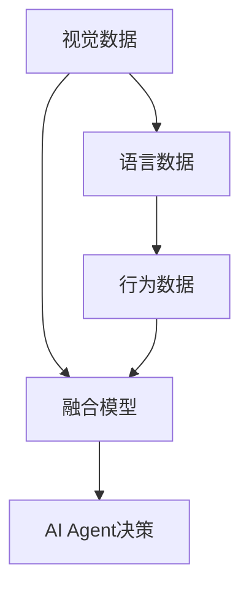
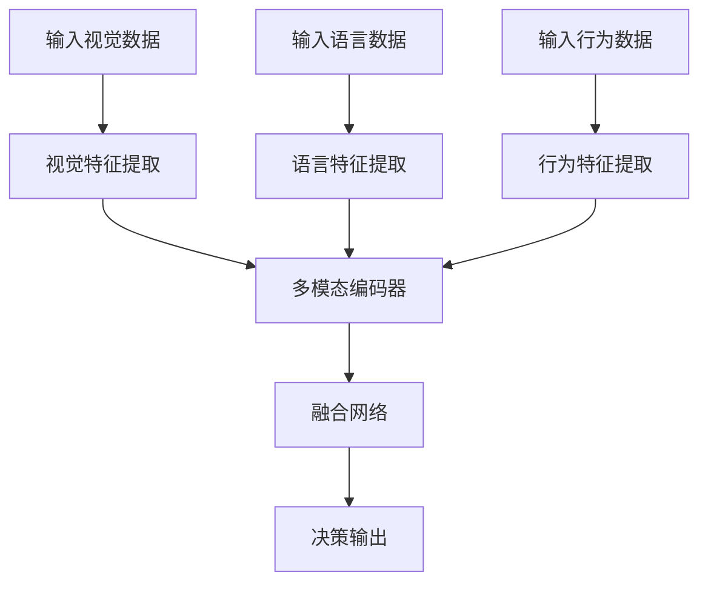
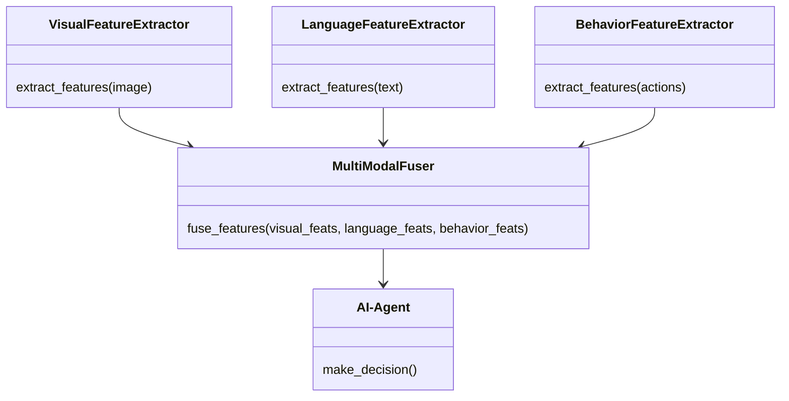
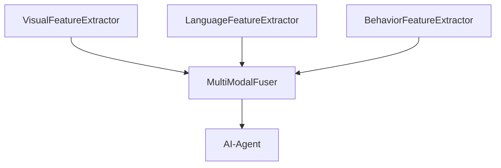
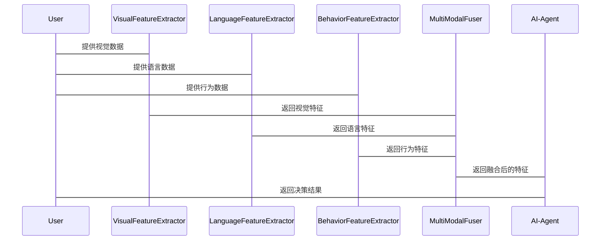

                 


# AI Agent的视觉-语言-行为三模态融合

> 关键词：AI Agent，视觉模态，语言模态，行为模态，多模态融合，深度学习

> 摘要：本文将详细探讨AI Agent在视觉-语言-行为三模态数据融合领域的最新进展和核心技术。通过逐步分析，我们将了解多模态数据融合的必要性、核心概念、算法原理、系统架构设计、项目实战以及最佳实践。文章旨在帮助读者全面掌握AI Agent三模态融合的技术要点，并通过实际案例分析，深入理解其在现实场景中的应用。

---

# 第1章: 背景介绍

## 1.1 问题背景
### 1.1.1 多模态数据融合的必要性
AI Agent需要处理复杂的现实场景，单一模态的数据往往不足以完成任务。例如，一个智能助手可能需要结合视觉信息（如图像识别）、语言信息（如语音指令）和行为信息（如用户的动作）来准确理解用户意图并做出反应。

### 1.1.2 AI Agent在现实场景中的应用需求
AI Agent广泛应用于自动驾驶、智能客服、机器人助手等领域。这些场景中，AI Agent需要同时处理视觉、语言和行为数据，以实现更智能、更自然的交互。

### 1.1.3 三模态数据融合的核心问题
三模态数据融合的核心问题是如何将不同类型的模态数据有效地结合起来，提取有用的特征，并生成适用于特定任务的决策输出。这一过程需要解决数据异构性、特征对齐以及融合策略优化等问题。

## 1.2 问题描述
### 1.2.1 视觉、语言、行为模态的特征
- 视觉模态：基于图像或视频的像素信息，提取空间和语义特征。
- 语言模态：基于文本或语音数据，提取词义和语义特征。
- 行为模态：基于动作或交互数据，提取行为模式和意图特征。

### 1.2.2 数据融合的目标与挑战
数据融合的目标是通过多模态数据的协同作用，提升AI Agent的理解能力和决策能力。挑战包括数据异构性、特征维度差异以及如何设计高效的融合模型。

### 1.2.3 当前研究现状与技术瓶颈
当前研究主要集中在如何设计有效的多模态编码器和融合网络。技术瓶颈包括如何处理不同模态数据之间的关联性，以及如何在实际应用中实现高效的计算和推理。

## 1.3 问题解决
### 1.3.1 多模态数据融合的解决方案
采用多模态编码器和融合网络，结合注意力机制，实现不同模态数据的有效融合。

### 1.3.2 AI Agent三模态融合的技术路线
1. 分别提取视觉、语言和行为模态的特征。
2. 设计多模态编码器，将不同模态的特征映射到统一的表示空间。
3. 使用融合网络整合多模态特征，生成适用于特定任务的决策输出。

### 1.3.3 实际应用场景中的问题解决案例
例如，在智能客服中，AI Agent可以通过视觉数据（用户界面点击行为）、语言数据（用户输入的文本）和行为数据（用户的操作记录）来更准确地理解用户需求。

## 1.4 边界与外延
### 1.4.1 多模态数据融合的边界条件
AI Agent的能力受到硬件性能、数据质量和模型复杂度的限制。

### 1.4.2 AI Agent能力的局限性
目前，AI Agent在处理复杂场景时，可能会受到数据不足、模型泛化能力有限等问题的影响。

### 1.4.3 相关领域的区别与联系
多模态数据融合与单模态数据处理、跨模态检索等密切相关，但其核心目标是通过结合不同模态的信息来提升模型性能。

## 1.5 概念结构与核心要素
### 1.5.1 三模态数据的构成要素
- 视觉模态：图像、视频。
- 语言模态：文本、语音。
- 行为模态：动作、交互记录。

### 1.5.2 数据融合的层次结构
从低层次到高层次，包括特征提取、特征融合、决策生成。

### 1.5.3 AI Agent能力的评估指标
包括准确率、响应时间、用户体验等。

## 1.6 本章小结
通过本章的介绍，读者可以了解AI Agent三模态数据融合的背景、核心问题、解决方案以及实际应用场景。

---

# 第2章: 核心概念与联系

## 2.1 核心概念原理
### 2.1.1 视觉模态处理原理
基于深度学习的视觉模型（如CNN）提取图像特征。

### 2.1.2 语言模态处理原理
基于 Transformer 的语言模型（如BERT）提取文本特征。

### 2.1.3 行为模态处理原理
基于RNN或Transformer的行为模型提取动作序列特征。

## 2.2 模型属性特征对比
### 2.2.1 视觉、语言、行为模态的特征对比表格
```markdown
| 模态类型 | 特征维度 | 描述 |
|----------|----------|------|
| 视觉     | 二维图像 | 基于像素的特征提取 |
| 语言     | 文本向量 | 基于词嵌入的特征表示 |
| 行为     | 动作序列 | 基于动作序列的特征提取 |
```

## 2.3 ER实体关系图


## 2.4 本章小结
通过对比分析和实体关系图，读者可以清晰地理解三模态数据之间的关系及其在AI Agent中的作用。

---

# 第3章: 算法原理讲解

## 3.1 多模态融合算法概述
### 3.1.1 多模态编码器
将不同模态的特征映射到统一的表示空间。

### 3.1.2 跨模态注意力机制
通过注意力机制，增强相关模态的信息权重。

### 3.1.3 融合网络结构
设计高效的融合网络，整合多模态特征。

## 3.2 算法流程图


## 3.3 算法实现代码
```python
import torch
import torch.nn as nn

class MultiModalEncoder(nn.Module):
    def __init__(self, visual_dim, language_dim, behavior_dim, hidden_dim):
        super(MultiModalEncoder, self).__init__()
        self.visual_linear = nn.Linear(visual_dim, hidden_dim)
        self.language_linear = nn.Linear(language_dim, hidden_dim)
        self.behavior_linear = nn.Linear(behavior_dim, hidden_dim)
    
    def forward(self, visual_features, language_features, behavior_features):
        visual_embed = self.visual_linear(visual_features)
        language_embed = self.language_linear(language_features)
        behavior_embed = self.behavior_linear(behavior_features)
        return visual_embed, language_embed, behavior_embed

class FusionNetwork(nn.Module):
    def __init__(self, hidden_dim, output_dim):
        super(FusionNetwork, self).__init__()
        self.attention = nn.MultiheadAttention(hidden_dim, 1)
        self.fc = nn.Linear(hidden_dim, output_dim)
    
    def forward(self, visual_embed, language_embed, behavior_embed):
        embeds = [visual_embed, language_embed, behavior_embed]
        embeds = torch.stack(embeds, dim=0)
        attn_output = self.attention(embeds, embeds, embeds)[0]
        output = self.fc(attn_output.mean(dim=0))
        return output
```

## 3.4 本章小结
通过本章的讲解，读者可以理解多模态融合算法的基本原理和实现方法。

---

# 第4章: 系统分析与架构设计

## 4.1 系统功能设计
### 4.1.1 领域模型


### 4.1.2 系统架构设计


### 4.1.3 系统接口设计
- 输入接口：视觉、语言、行为特征提取器的输入接口。
- 输出接口：AI Agent的决策输出接口。

### 4.1.4 系统交互流程


## 4.2 本章小结
通过系统分析与架构设计，读者可以了解AI Agent三模态融合系统的整体架构和各部分的功能。

---

# 第5章: 项目实战

## 5.1 项目环境搭建
### 5.1.1 环境需求
- Python 3.8+
- PyTorch 1.9+
- 安装必要的库和工具。

## 5.2 核心代码实现
### 5.2.1 视觉特征提取代码
```python
def extract_visual_features(image):
    # 假设使用预训练的CNN模型提取特征
    with torch.no_grad():
        features = model(image)
    return features
```

### 5.2.2 语言特征提取代码
```python
def extract_language_features(text):
    # 假设使用预训练的BERT模型提取特征
    features = bert_model.encode(text)
    return features
```

### 5.2.3 行为特征提取代码
```python
def extract_behavior_features(actions):
    # 假设行为数据是一个动作序列
    features = []
    for action in actions:
        # 提取每个动作的特征
        features.append(action_feature_extractor(action))
    return features
```

### 5.2.4 融合网络实现
```python
class MultiModalFuser:
    def __init__(self, visual_dim, language_dim, behavior_dim, hidden_dim):
        self.visual_encoder = MultiModalEncoder(visual_dim, hidden_dim)
        self.language_encoder = MultiModalEncoder(language_dim, hidden_dim)
        self.behavior_encoder = MultiModalEncoder(behavior_dim, hidden_dim)
        self.fusion_network = FusionNetwork(hidden_dim, output_dim)
    
    def fuse(self, visual_features, language_features, behavior_features):
        visual_embed = self.visual_encoder.encode(visual_features)
        language_embed = self.language_encoder.encode(language_features)
        behavior_embed = self.behavior_encoder.encode(behavior_features)
        return self.fusion_network(visual_embed, language_embed, behavior_embed)
```

## 5.3 项目小结
通过本章的项目实战，读者可以掌握AI Agent三模态融合系统的核心实现方法。

---

# 第6章: 最佳实践与小结

## 6.1 最佳实践
### 6.1.1 注意事项
- 数据预处理的重要性。
- 模型调参的技巧。
- 系统优化的建议。

### 6.1.2 注意事项
- 数据异构性处理。
- 模型的泛化能力。
- 系统的实时性要求。

## 6.2 本章小结
总结全书内容，强调三模态数据融合的重要性和应用前景。

---

# 附录

## 附录A: 数据集
- 视觉数据集：ImageNet、COCO。
- 语言数据集：BERT预训练数据。
- 行为数据集：UCI Human Activity Recognition Dataset。

## 附录B: 工具与库
- 视觉处理：OpenCV、PyTorch Vision。
- 语言处理：Hugging Face Transformers。
- 行为处理：Scikit-learn、XGBoost。

## 附录C: 参考文献
- 论文推荐：《Multi-modal Deep Learning for Visual Recognition》、《Attention Is All You Need》。

---

# 作者：AI天才研究院/AI Genius Institute & 禅与计算机程序设计艺术 /Zen And The Art of Computer Programming

