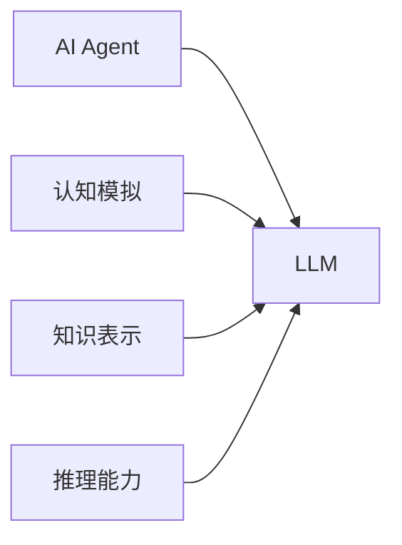
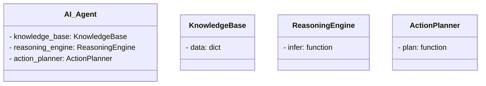
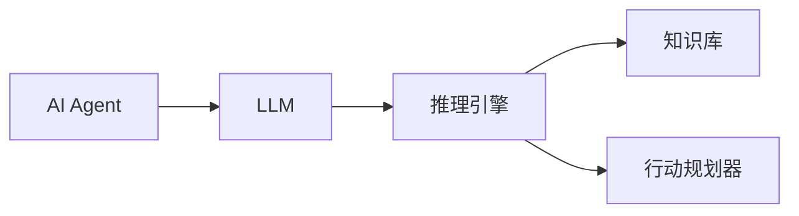
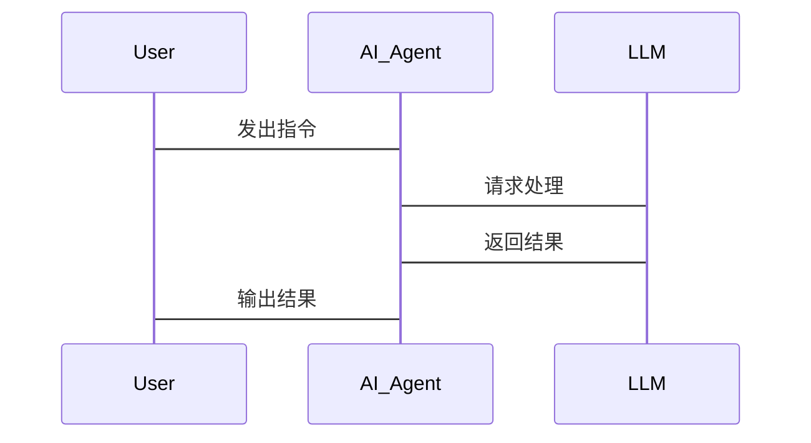

                 


# AI Agent的认知发展模拟：探索LLM的智能进化过程

## 关键词：
- AI Agent
- 大语言模型
- 认知发展模拟
- 智能进化
- LLM

## 摘要：
本文探讨了AI Agent在认知发展模拟中的应用，特别是如何利用大语言模型（LLM）推动其智能进化。文章从AI Agent和LLM的基本概念出发，分析了认知模拟的背景与意义，并深入讲解了LLM的认知模拟算法原理。通过实际案例分析，展示了如何在系统中实现AI Agent的认知发展模拟，并提出了相关的设计方案和最佳实践。文章旨在为研究人员和开发者提供理论与实践相结合的指导，以推动AI Agent在复杂认知任务中的应用。

---

# 第1章: AI Agent与LLM的概述

## 1.1 AI Agent的基本概念

### 1.1.1 AI Agent的定义
AI Agent（人工智能代理）是指能够感知环境、自主决策并执行任务的智能实体。它能够根据环境信息做出反应，具有目标导向性。

### 1.1.2 AI Agent的核心特征
- **自主性**：能够在没有外部干预的情况下独立运行。
- **反应性**：能够实时感知环境并做出反应。
- **目标导向性**：基于目标驱动行为。
- **学习能力**：能够通过经验改进自身性能。

### 1.1.3 AI Agent与传统AI的区别
| 特性 | 传统AI | AI Agent |
|------|--------|-----------|
| 行为方式 | 静态计算 | 动态交互 |
| 任务执行 | 单一任务 | 多任务并行 |
| 环境感知 | 无感知 | 高度感知 |

## 1.2 大语言模型（LLM）的基本概念

### 1.2.1 LLM的定义
大语言模型（LLM）是一种基于深度学习的自然语言处理模型，具有强大的语言理解和生成能力。

### 1.2.2 LLM的主要特点
- **大规模训练数据**：通常使用海量文本数据进行训练。
- **深度学习架构**：采用Transformer架构，具有强大的上下文理解能力。
- **多任务通用性**：能够适应多种语言处理任务，如翻译、问答、文本生成等。

### 1.2.3 LLM与AI Agent的关系
LLM作为AI Agent的核心组件，为Agent提供了强大的语言理解和生成能力，使其能够更好地与人类交互并完成复杂任务。

## 1.3 AI Agent认知发展模拟的背景与意义

### 1.3.1 认知科学与AI Agent的结合
认知科学的研究成果为AI Agent的设计提供了理论基础，特别是在知识表示、推理和学习方面。

### 1.3.2 LLM在AI Agent中的作用
LLM通过其强大的语言处理能力，为AI Agent提供了自然语言交互和复杂任务处理的能力。

### 1.3.3 认知发展模拟的现实意义
认知发展模拟能够帮助AI Agent更好地理解和适应复杂环境，推动人工智能技术在各领域的广泛应用。

## 1.4 本章小结
本章介绍了AI Agent和LLM的基本概念及其在认知发展模拟中的作用，为后续内容奠定了基础。

---

# 第2章: AI Agent认知发展的核心概念

## 2.1 认知发展的基本理论

### 2.1.1 认知发展的阶段理论
认知发展通常分为以下几个阶段：
1. **感知阶段**：通过感官获取信息。
2. **记忆阶段**：将信息存储并进行初步处理。
3. **理解阶段**：对信息进行深度理解和关联。
4. **推理阶段**：基于已有知识进行逻辑推理。
5. **决策阶段**：根据推理结果做出决策。

### 2.1.2 认知发展的关键特征
- **知识表示**：信息的结构化存储方式。
- **推理能力**：基于知识进行逻辑推理的能力。
- **学习能力**：通过经验改进自身能力的机制。

### 2.1.3 认知发展的核心要素
- **知识库**：存储 Agent 的知识储备。
- **推理引擎**：负责逻辑推理的模块。
- **学习模块**：负责更新和优化知识库。

## 2.2 AI Agent认知模拟的实现机制

### 2.2.1 知识表示与推理
知识表示通常采用图结构或向量表示。推理引擎基于知识图谱进行逻辑推理。

### 2.2.2 学习与适应
通过监督学习、强化学习或无监督学习方法，不断优化知识库和推理策略。

### 2.2.3 决策与行动
基于推理结果，生成行动计划并执行。

## 2.3 LLM在认知模拟中的应用

### 2.3.1 LLM的知识表示能力
LLM通过大规模训练数据，能够理解上下文并生成有意义的文本。

### 2.3.2 LLM的推理能力
LLM能够基于上下文进行推理，并生成合理的回答。

### 2.3.3 LLM的学习与适应能力
通过持续学习和微调，LLM能够适应不同的任务需求。

## 2.4 核心概念对比分析

### 2.4.1 AI Agent与LLM的属性对比
| 特性 | AI Agent | LLM |
|------|-----------|------|
| 核心能力 | 多任务处理 | 语言处理 |
| 知识表示 | 结构化知识库 | 分布式向量表示 |

### 2.4.2 认知模拟与传统AI的区别
| 特性 | 认知模拟 | 传统AI |
|------|----------|--------|
| 行为方式 | 目标导向，动态调整 | 单一任务，静态处理 |

### 2.4.3 实体关系图（ER图）展示



---

# 第3章: LLM的认知模拟算法原理

## 3.1 LLM的基本原理

### 3.1.1 变压器模型的结构
Transformer模型由编码器和解码器组成，每个部分包含多个层。

### 3.1.2 注意力机制
注意力机制通过计算词与词之间的相关性，确定每个词的重要性。

### 3.1.3 解码器结构
解码器通过自注意力机制生成输出序列。

## 3.2 LLM的认知模拟算法

### 3.2.1 知识表示的向量化
将知识表示为向量，便于模型处理。

### 3.2.2 推理过程的建模
基于向量表示，进行逻辑推理。

### 3.2.3 学习与适应的优化方法
通过梯度下降等优化算法，不断改进模型性能。

## 3.3 算法实现的数学模型

### 3.3.1 注意力机制的公式
$$
\text{Attention}(Q, K, V) = \text{softmax}\left(\frac{QK^T}{\sqrt{d}}\right)V
$$

### 3.3.2 变压器模型的前向传播
$$
f(x) = \text{LayerNorm}(x + \text{FFN}(x))
$$

### 3.3.3 解码器的生成策略
$$
P(y|x) = \prod_{i=1}^n P(y_i|y_{<i},x)
$$`

## 3.4 算法实现的Python代码示例

```python
def attention(q, k, v, mask):
    d_k = q.shape[-1]
    scores = (q @ k.transpose(-2, -1)) / torch.sqrt(torch.tensor(d_k))
    if mask is not None:
        scores = scores.masked_fill(mask == 0, -float('inf'))
    scores = torch.softmax(scores, dim=-1)
    output = scores
    return output
```

---

# 第4章: 系统分析与架构设计

## 4.1 问题场景介绍
本系统旨在通过AI Agent和LLM的结合，实现认知模拟的智能化。

## 4.2 系统功能设计

### 4.2.1 领域模型设计


### 4.2.2 系统架构设计


### 4.2.3 接口设计
- **输入接口**：接收用户指令或环境反馈。
- **输出接口**：生成行动计划或输出结果。

### 4.2.4 交互设计


---

# 第5章: 项目实战

## 5.1 环境安装
- 安装Python和相关库（如TensorFlow、PyTorch）。
- 安装LLM模型（如GPT-3、GPT-4）。

## 5.2 系统核心实现源代码

```python
class AI_Agent:
    def __init__(self, llm):
        self.llm = llm
        self.knowledge_base = {}

    def process_input(self, input_str):
        # 分析输入
        pass

    def generate_output(self, input_str):
        # 调用LLM生成输出
        return self.llm.generate(input_str)
```

## 5.3 代码应用解读与分析
通过代码实现AI Agent与LLM的交互，展示认知模拟的实际应用。

## 5.4 实际案例分析
以一个具体的案例（如智能客服）展示认知模拟的实际效果。

## 5.5 项目小结
总结项目实现的关键点和经验教训。

---

# 第6章: 最佳实践与小结

## 6.1 最佳实践 tips
- 定期更新知识库，保持模型的准确性。
- 优化推理算法，提高处理效率。

## 6.2 小结
本文详细探讨了AI Agent认知发展模拟的实现过程，展示了LLM在其中的重要作用。

## 6.3 注意事项
- 确保数据安全和隐私保护。
- 定期监控系统性能，及时优化。

## 6.4 拓展阅读
推荐相关领域的书籍和论文，供读者进一步学习。

---

# 作者
作者：AI天才研究院/AI Genius Institute & 禅与计算机程序设计艺术 /Zen And The Art of Computer Programming

