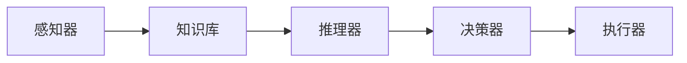
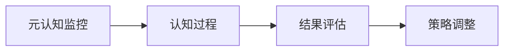
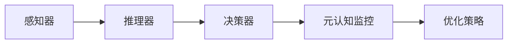

                 


---

# AI Agent的认知架构与元认知能力构建

> 关键词：AI Agent, 认知架构, 元认知能力, 符号逻辑, 神经网络, 系统设计, 项目实战

> 摘要：本文深入探讨AI Agent的认知架构与元认知能力构建，从理论基础到算法实现，从系统设计到项目实战，全面解析如何构建具备元认知能力的AI Agent。文章结合符号逻辑与神经网络，详细阐述认知架构的核心概念、元认知能力的实现机制，并通过实际案例展示如何在复杂场景中应用这些理论。通过本文，读者将掌握构建智能AI Agent的关键技术与实践方法。

---

## 第一部分: AI Agent的认知架构基础

### 第1章: AI Agent的基本概念与背景

#### 1.1 问题背景
- 1.1.1 人工智能代理的定义与特点  
  AI Agent是指在环境中能够感知并自主行动以实现目标的智能实体。其特点包括自主性、反应性、目标导向性和社交能力。  
- 1.1.2 认知架构的必要性  
  为了使AI Agent具备复杂的决策能力和适应性，需要构建一个能够处理多模态信息、进行推理和学习的认知架构。  
- 1.1.3 元认知能力的提出与意义  
  元认知能力是指对自身认知过程的认知和调控能力，是实现更高层次智能的关键。  

#### 1.2 问题描述
- 1.2.1 当前AI代理的局限性  
  当前AI Agent主要依赖规则或简单学习模型，缺乏对自身认知过程的监控和调整能力，难以应对复杂动态环境。  
- 1.2.2 元认知能力的缺失带来的问题  
  无法根据任务需求动态调整策略，导致效率低下或错误决策。  
- 1.2.3 建立认知架构与元认知能力的目标  
  实现AI Agent的自适应性、灵活性和智能性，使其能够在复杂场景中自主学习和优化。

---

### 第2章: 认知架构的核心概念与理论

#### 2.1 认知架构的定义与分类
- 2.1.1 认知架构的基本定义  
  认知架构是AI Agent内部信息处理和决策的核心框架，负责整合感知、推理、决策和行动。  
- 2.1.2 基于符号逻辑的架构  
  以符号逻辑为基础，通过规则和逻辑推理实现认知功能。  
- 2.1.3 基于神经网络的架构  
  利用深度学习模型处理非结构化数据，具有强大的模式识别能力。  

#### 2.2 元认知能力的属性特征
- 2.2.1 元认知的定义与特征  
  元认知是对认知过程的认知，具有监控、评估和调控三个主要特征。  
- 2.2.2 元认知能力的层次结构  
  包括元认知知识、元认知调控和元认知评价三个层次。  
- 2.2.3 元认知与认知的关系  
  元认知是对认知过程的高级控制，两者相互依存，共同构成智能系统的核心。  

#### 2.3 认知架构与元认知能力的联系
- 2.3.1 认知架构的实体关系图  


- 2.3.2 元认知能力的实现机制  


---

### 第3章: 认知架构与元认知能力的理论基础

#### 3.1 符号逻辑与知识表示
- 3.1.1 符号逻辑的基本原理  
  符号逻辑通过命题逻辑和谓词逻辑表示知识，适用于规则明确的场景。  
- 3.1.2 知识表示的方法  
  包括框架表示法、语义网络和逻辑表示法。  
- 3.1.3 知识库的构建与管理  
  通过知识图谱等技术整合多源知识。  

#### 3.2 神经网络与深度学习
- 3.2.1 神经网络的基本结构  
  包括输入层、隐藏层和输出层，通过非线性激活函数实现特征提取。  
- 3.2.2 深度学习的数学基础  
  矩阵运算、梯度下降和损失函数是深度学习的核心。  
- 3.2.3 深度学习在认知架构中的应用  
  用于处理非结构化数据，如图像和自然语言。  

---

## 第二部分: 元认知能力的构建与实现

### 第4章: 元认知能力的核心算法

#### 4.1 基于符号逻辑的元认知推理
- 4.1.1 基本原理  
  通过符号逻辑推理对认知过程进行监控和调整。  
- 4.1.2 算法实现  
  ```python
  def meta_reasoning(knowledge, goal):
      # 简单的符号逻辑推理实现
      pass
  ```
- 4.1.3 示例代码  
  ```python
  def meta_reasoning(knowledge, goal):
      if knowledge.contains(goal):
          return "成功"
      else:
          return "失败"
  ```

#### 4.2 基于神经网络的元学习
- 4.2.1 基本原理  
  元学习通过在多个任务间迁移学习，实现对学习过程的元认知。  
- 4.2.2 算法实现  
  ```python
  def meta_learning(meta_learner, task_learner, tasks):
      for task in tasks:
          task_learner.train(task)
          meta_learner.update(meta_learner.optimize(task_learner))
      return meta_learner
  ```
- 4.2.3 示例代码  
  ```python
  def meta_learning(meta_learner, task_learner, tasks):
      for task in tasks:
          task_learner.train(task)
          meta_learner.step(meta_learner.loss(task_learner.get_weights()))
      return meta_learner.get_weights()
  ```

---

### 第5章: 元认知能力的系统实现

#### 5.1 系统架构设计
- 5.1.1 系统功能设计  
  包括感知、推理、决策和元认知监控四个模块。  
- 5.1.2 系统架构图  


#### 5.2 系统实现
- 5.2.1 环境安装  
  安装必要的库，如TensorFlow、Keras和numpy。  
- 5.2.2 核心代码实现  
  ```python
  import numpy as np
  import tensorflow as tf

  class MetaCognitiveAgent:
      def __init__(self):
          self.knowledge_base = {}
          self.meta_learner = MetaLearner()
          self.task_learner = TaskLearner()

      def perceive(self, input_data):
          # 处理输入数据
          pass

      def reason(self, knowledge, goal):
          # 符号逻辑推理
          pass

      def decide(self, reasoning_result):
          # 基于推理结果做出决策
          pass

      def meta_monitor(self, decision):
          # 元认知监控
          pass
  ```

- 5.2.3 代码解读  
  该代码展示了元认知代理的基本结构，包括知识库、元学习器和任务学习器的交互。  

---

### 第6章: 项目实战与案例分析

#### 6.1 项目背景与目标
- 搭建一个具备元认知能力的智能助手，能够在复杂场景中自适应优化策略。  

#### 6.2 系统实现
- 6.2.1 环境安装  
  安装必要的库，如TensorFlow、Keras和numpy。  
- 6.2.2 核心代码实现  
  ```python
  import numpy as np
  import tensorflow as tf

  class MetaCognitiveAgent:
      def __init__(self):
          self.knowledge_base = {}
          self.meta_learner = MetaLearner()
          self.task_learner = TaskLearner()

      def perceive(self, input_data):
          # 处理输入数据
          pass

      def reason(self, knowledge, goal):
          # 符号逻辑推理
          pass

      def decide(self, reasoning_result):
          # 基于推理结果做出决策
          pass

      def meta_monitor(self, decision):
          # 元认知监控
          pass
  ```

- 6.2.3 代码解读  
  该代码展示了元认知代理的基本结构，包括知识库、元学习器和任务学习器的交互。  

---

### 第7章: 总结与展望

#### 7.1 最佳实践
- 结合符号逻辑和神经网络，充分利用两种方法的优势。  
- 在实际应用中，逐步优化元认知监控和调整机制。  

#### 7.2 小结
- 本文详细探讨了AI Agent的认知架构与元认知能力构建，从理论到实践，为构建更智能的AI Agent提供了参考。  

#### 7.3 注意事项
- 元认知能力的实现需要大量数据和计算资源，需注意模型的效率和可扩展性。  
- 在实际应用中，需结合具体场景调整算法参数，确保系统稳定性和鲁棒性。  

#### 7.4 拓展阅读
- 建议深入学习符号逻辑与深度学习的结合，探索更复杂的元认知模型。  

---

**作者：AI天才研究院/AI Genius Institute & 禅与计算机程序设计艺术 /Zen And The Art of Computer Programming**

