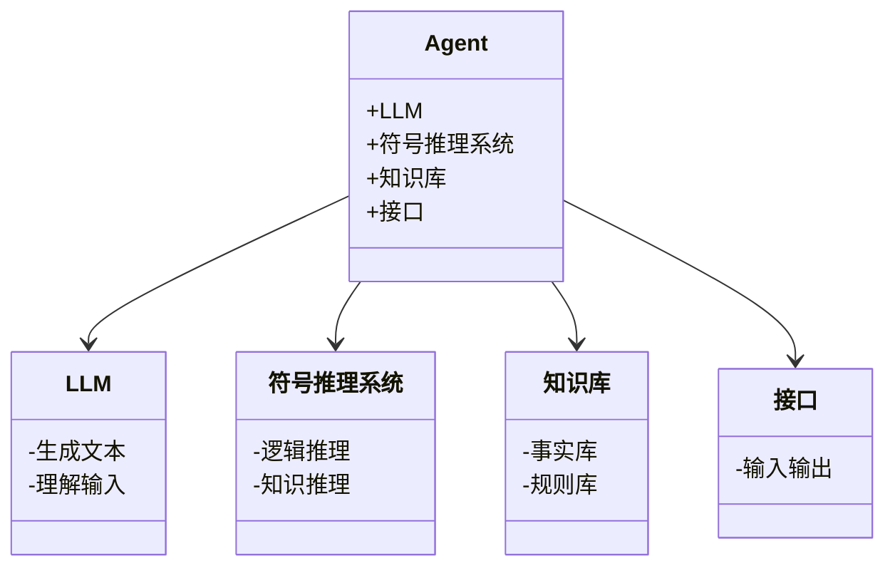
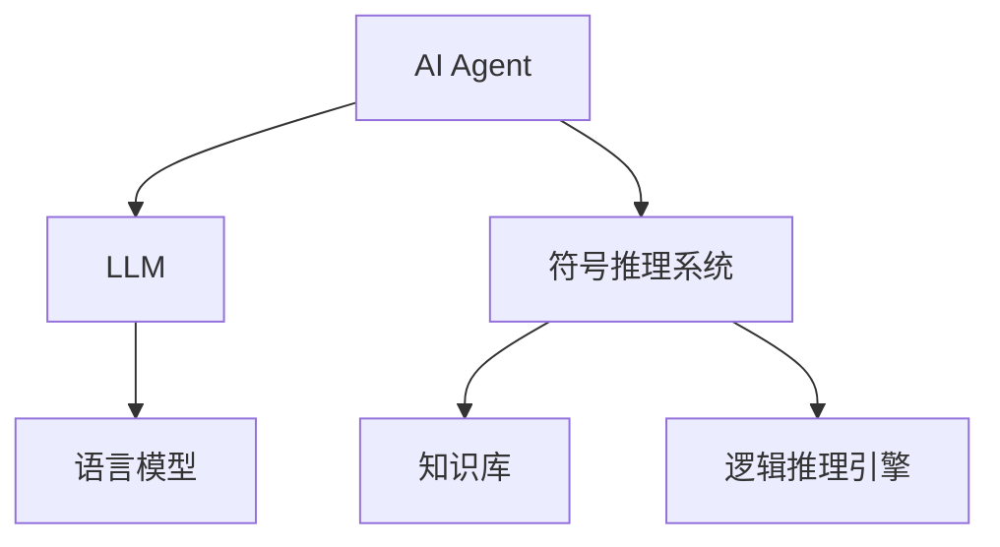
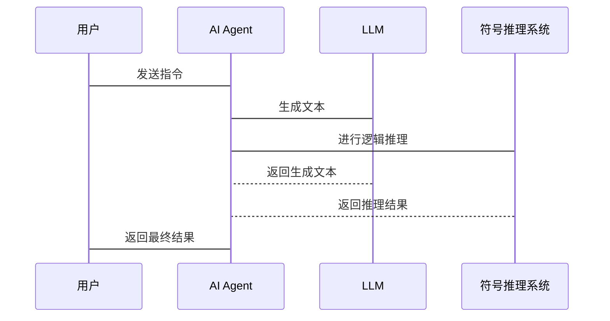

                 


# AI Agent的认知架构：整合LLM与符号推理系统

> 关键词：AI Agent, LLM, 符号推理, 认知架构, 系统整合

> 摘要：本文探讨AI Agent的认知架构，重点分析如何整合大语言模型（LLM）与符号推理系统，以构建更强大的AI代理。文章从背景介绍、核心概念、算法原理、系统架构设计、项目实战到总结，详细阐述了整合LLM与符号推理的关键步骤与实际应用。

---

## 第一部分: AI Agent的认知架构基础

### 第1章: AI Agent与认知架构概述

#### 1.1 AI Agent的基本概念

##### 1.1.1 AI Agent的定义与分类
AI Agent（人工智能代理）是指能够感知环境、执行任务并做出决策的智能实体。根据功能和复杂度，AI Agent可以分为简单反应式代理、基于模型的反射式代理、目标驱动代理和效用驱动代理。

##### 1.1.2 认知架构的核心概念
认知架构是AI Agent的“大脑”，负责处理信息、推理和决策。常见的认知架构包括BDI（信念-愿望-意图）架构、规划式架构和基于知识的架构。

##### 1.1.3 AI Agent在实际应用中的重要性
AI Agent广泛应用于自动驾驶、智能助手、机器人控制等领域。其核心价值在于能够适应动态环境并执行复杂任务。

#### 1.2 大语言模型（LLM）的基本原理

##### 1.2.1 LLM的定义与特点
LLM（Large Language Model）是基于深度学习的自然语言处理模型，具有大规模参数和强大的语言理解与生成能力。

##### 1.2.2 LLM的训练机制与应用场景
LLM通过监督学习和强化学习训练，广泛应用于文本生成、对话系统和内容理解。

##### 1.2.3 LLM在AI Agent中的潜在价值
LLM为AI Agent提供了强大的自然语言处理能力，使其能够理解和生成人类语言，增强人机交互。

#### 1.3 符号推理系统的原理与应用

##### 1.3.1 符号推理的基本概念
符号推理是一种基于符号逻辑的推理方法，通过规则和知识库进行逻辑推理。

##### 1.3.2 符号推理在AI Agent中的作用
符号推理为AI Agent提供逻辑推理能力，使其能够处理结构化知识和复杂逻辑问题。

##### 1.3.3 符号推理与LLM的结合优势
结合LLM的语言理解能力和符号推理的逻辑推理能力，AI Agent能够实现更复杂的任务。

#### 1.4 本章小结

- AI Agent的认知架构是其核心，决定了其智能水平。
- LLM和符号推理是两种互补的技术，各有优缺点。
- 两者的整合能够提升AI Agent的能力，拓宽应用场景。

---

## 第二部分: LLM与符号推理的整合原理

### 第2章: LLM与符号推理的核心概念与联系

#### 2.1 LLM的认知能力分析

##### 2.1.1 LLM的语言理解与生成能力
LLM能够理解上下文并生成连贯的文本，但缺乏逻辑推理能力。

##### 2.1.2 LLM的上下文推理能力
LLM通过大规模数据训练，能够处理复杂语境，但缺乏明确的逻辑推理机制。

##### 2.1.3 LLM的局限性与改进方向
LLM在处理复杂逻辑问题时表现不佳，需要结合符号推理等技术。

#### 2.2 符号推理系统的属性特征对比

##### 2.2.1 符号推理的逻辑推理能力
符号推理通过规则和逻辑推理解决问题，但缺乏语言理解能力。

##### 2.2.2 符号推理的可解释性优势
符号推理的推理过程清晰可解释，适合需要透明决策的任务。

##### 2.2.3 符号推理的灵活性与扩展性
符号推理系统可以根据需求灵活扩展，但需要大量规则和知识库支持。

#### 2.3 LLM与符号推理的整合模型

##### 2.3.1 整合模型的基本框架
整合模型通过结合LLM的语言理解和符号推理的逻辑推理，构建更强大的认知架构。

##### 2.3.2 模型的输入输出关系
输入：自然语言指令或问题；输出：经过逻辑推理的结构化结果。

##### 2.3.3 模型的训练与优化策略
通过混合训练策略，优化LLM与符号推理的协同性能。

#### 2.4 本章小结

- LLM与符号推理的整合能够互补其优缺点。
- 整合模型能够处理复杂语境并进行逻辑推理。
- 未来的优化方向包括混合训练和知识库的动态更新。

---

## 第三部分: LLM与符号推理的算法原理

### 第3章: LLM的算法流程与优化

#### 3.1 LLM的训练流程

##### 3.1.1 数据预处理与模型初始化
数据预处理包括清洗、分词和标注，模型初始化包括参数的随机初始化。

##### 3.1.2 模型训练的正向传播
通过编码器和解码器的正向传播，生成预测的词分布。

##### 3.1.3 模型训练的反向传播与优化
通过交叉熵损失函数计算梯度，优化模型参数。

#### 3.2 LLM的推理机制

##### 3.2.1 解码器的注意力机制
解码器通过自注意力机制关注输入中的重要部分。

##### 3.2.2 解码器的生成策略
解码器通过贪心搜索或采样生成输出序列。

##### 3.2.3 解码器的温度参数调节
温度参数控制生成的多样性和创造性。

#### 3.3 本章小结

- LLM的训练流程包括数据预处理、正向传播和反向传播。
- 解码器的注意力机制和生成策略是其核心推理机制。
- 温度参数调节能够控制生成结果的质量。

---

## 第四章: 符号推理系统的算法原理

#### 4.1 符号推理的基本算法

##### 4.1.1 基于规则的推理算法
通过预定义规则进行逻辑推理。

##### 4.1.2 基于逻辑的推理算法
通过逻辑表达式进行推理，包括一阶逻辑和谓词逻辑。

##### 4.1.3 基于知识图谱的推理算法
通过知识图谱的路径查询进行推理。

#### 4.2 符号推理的优化策略

##### 4.2.1 知识库的动态更新
通过增量学习和在线更新优化知识库。

##### 4.2.2 规则的自动生成
通过机器学习技术自动生成推理规则。

##### 4.2.3 推理性能的优化
通过并行计算和剪枝策略优化推理速度。

#### 4.3 本章小结

- 符号推理算法包括基于规则、逻辑和知识图谱的推理方法。
- 知识库的动态更新和规则的自动生成是优化方向。
- 推理性能的优化能够提升系统的实时性和响应速度。

---

## 第五部分: 系统分析与架构设计方案

### 第5章: 系统架构设计

#### 5.1 项目场景介绍
设计一个AI Agent，整合LLM和符号推理系统，实现智能问答和任务执行。

#### 5.2 系统功能设计

##### 5.2.1 领域模型设计
通过领域模型（mermaid类图）展示系统的功能模块。



#### 5.3 系统架构设计

##### 5.3.1 系统架构图（mermaid架构图）



#### 5.4 系统接口设计

##### 5.4.1 输入接口
- 文本输入：用户输入的自然语言指令。
- 数据输入：结构化数据输入，如知识库查询结果。

##### 5.4.2 输出接口
- 文本输出：生成的自然语言回答。
- 结构化输出：推理结果的结构化数据。

#### 5.5 系统交互设计（mermaid序列图）



#### 5.6 本章小结

- 系统架构设计明确了各模块的功能和交互。
- 系统接口设计确保了模块之间的数据流通。
- 系统交互设计展示了整个流程的动态过程。

---

## 第六部分: 项目实战

### 第6章: 项目实战

#### 6.1 环境安装

##### 6.1.1 安装Python
```bash
python --version
```

##### 6.1.2 安装依赖库
```bash
pip install transformers
pip install pylogics
```

#### 6.2 系统核心实现源代码

##### 6.2.1 LLM的实现
```python
from transformers import AutoModelForCausalLM, AutoTokenizer

class LLM:
    def __init__(self, model_name):
        self.tokenizer = AutoTokenizer.from_pretrained(model_name)
        self.model = AutoModelForCausalLM.from_pretrained(model_name)
```

##### 6.2.2 符号推理系统的实现
```python
from pylogics import *

class SymbolicReasoning:
    def __init__(self, knowledge_base):
        self.knowledge_base = knowledge_base
```

##### 6.2.3 整合模块
```python
class AI-Agent:
    def __init__(self, llm, symbolic_reasoning):
        self.llm = llm
        self.symbolic_reasoning = symbolic_reasoning

    def process_input(self, input_text):
        # 调用LLM进行初步理解
        response = self.llm.generate(input_text)
        # 调用符号推理系统进行逻辑推理
        result = self.symbolic_reasoning.reason(response)
        return result
```

#### 6.3 代码应用解读与分析

##### 6.3.1 LLM的实现
使用Hugging Face的transformers库加载预训练的LLM模型，实现文本生成和理解功能。

##### 6.3.2 符号推理系统的实现
基于pylogics库，实现逻辑推理功能，结合知识库进行推理。

##### 6.3.3 整合模块
将LLM和符号推理系统整合，实现输入处理和结果输出。

#### 6.4 实际案例分析

##### 6.4.1 案例一：智能问答
输入：什么是量子计算？
输出：量子计算是一种利用量子力学现象进行计算的新型计算方式。

##### 6.4.2 案例二：任务执行
输入：安排明天的会议。
输出：会议安排完成。

#### 6.5 项目小结

- 项目实现了AI Agent的核心功能模块。
- 通过代码示例展示了LLM与符号推理系统的整合过程。
- 通过实际案例展示了系统的应用场景和效果。

---

## 第七部分: 总结与展望

### 第7章: 总结与展望

#### 7.1 本章小结

- 本文详细探讨了AI Agent的认知架构。
- 描述了LLM与符号推理系统的整合原理。
- 展示了系统的实际应用场景和代码实现。

#### 7.2 最佳实践 tips

- 在实际应用中，建议根据具体需求选择合适的LLM和符号推理系统。
- 定期更新知识库和优化推理规则，以提升系统性能。

#### 7.3 未来研究方向

- 研究LLM与符号推理的混合训练策略。
- 探索符号推理系统的自动化规则生成方法。
- 开发更高效的推理算法，提升系统的实时性。

---

## 作者信息

作者：AI天才研究院/AI Genius Institute & 禅与计算机程序设计艺术 /Zen And The Art of Computer Programming

---

# 结束语

本文详细探讨了AI Agent的认知架构，分析了整合LLM与符号推理系统的原理与方法，并通过实际案例展示了系统的应用场景和实现过程。希望本文能够为相关领域的研究和实践提供有价值的参考。

