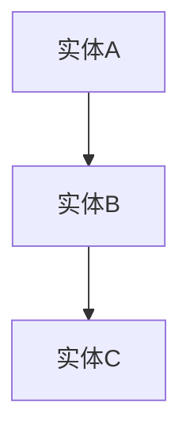

                 


# AI Agent的认知计算与心智模型构建

> 关键词：AI Agent, 认知计算, 心智模型, 人工智能, 强化学习, 注意力机制

> 摘要：本文探讨了AI Agent的认知计算与心智模型构建的核心概念、算法原理、系统架构及实际应用。文章从AI Agent的背景出发，分析了认知计算和心智模型的构建原理，详细讲解了基于强化学习、注意力机制和知识图谱的认知算法，结合系统架构设计与项目实战，为读者呈现了一个全面而深入的AI Agent认知计算体系。

---

## 正文

### 第一部分: AI Agent的认知计算与心智模型基础

#### 第1章: AI Agent的背景与概念

##### 1.1 问题背景

人工智能（AI）技术的快速发展正在改变我们的生活方式和工作方式。然而，随着AI系统的复杂性增加，如何让AI具备类似于人类的“认知能力”成为一个关键问题。AI Agent（人工智能代理）作为一种能够感知环境、自主决策并执行任务的智能实体，正在成为解决这一问题的核心技术。本文将探讨AI Agent的认知计算与心智模型构建的关键技术。

##### 1.2 AI Agent的定义与特点

AI Agent是指在计算机系统中，能够感知环境、自主决策、执行任务以实现特定目标的智能实体。与传统的基于规则的AI系统不同，AI Agent具备以下特点：

- **自主性**：AI Agent能够在没有外部干预的情况下自主运行。
- **反应性**：AI Agent能够实时感知环境并做出响应。
- **学习能力**：AI Agent能够通过经验改进自身的认知和决策能力。
- **社交能力**：AI Agent能够与其他Agent或人类进行交互和协作。

##### 1.3 AI Agent的应用领域

AI Agent技术已在多个领域得到广泛应用，包括：

- **智能助手**：如Siri、Alexa等，能够通过语音交互帮助用户完成日常任务。
- **智能决策系统**：在金融、医疗等领域，AI Agent能够帮助人类做出更高效的决策。
- **游戏AI**：在电子游戏中，AI Agent能够模拟人类玩家的行为，提升游戏体验。

---

#### 第2章: 认知计算与心智模型的核心概念

##### 2.1 认知计算的基本原理

认知计算是一种模拟人类认知过程的计算方式。与传统的基于逻辑的计算不同，认知计算强调通过感知、理解和推理来解决问题。其核心在于模拟人类的思维方式，包括记忆、学习、推理和决策。

##### 2.2 心智模型的构建原理

心智模型是指对人类认知过程的数学建模。它包括感知、记忆、推理和决策等多个模块，通过这些模块的协同工作，实现对环境的感知和问题的解决。心智模型的核心在于将人类的认知过程转化为计算机可以处理的形式。

##### 2.3 AI Agent的认知计算模型

AI Agent的认知计算模型可以分为基于符号逻辑、基于概率推理和基于神经网络三种类型。每种模型都有其优缺点，适用于不同的应用场景。

---

### 第二部分: AI Agent的认知计算与心智模型的实现

#### 第3章: AI Agent的认知计算算法

##### 3.1 基于强化学习的认知计算

强化学习是一种通过试错机制来优化决策的算法。AI Agent通过与环境交互，不断尝试不同的动作，最终找到最优策略。以下是强化学习的基本流程：

1. **环境感知**：AI Agent感知当前环境状态。
2. **动作选择**：根据当前状态选择一个动作。
3. **环境反馈**：执行动作后，环境返回奖励或惩罚。
4. **策略优化**：根据反馈调整策略，以最大化累计奖励。

##### 3.2 基于注意力机制的认知计算

注意力机制是一种模拟人类注意力的选择过程。在自然语言处理中，注意力机制可以帮助AI Agent聚焦于重要的信息，从而提高处理效率。以下是注意力机制的基本公式：

$$
\text{Attention}(Q, K, V) = \text{softmax}\left(\frac{QK^T}{\sqrt{d_k}}\right)V
$$

其中，$Q$是查询向量，$K$是键向量，$V$是值向量，$d_k$是键的维度。

##### 3.3 基于知识图谱的认知计算

知识图谱是一种结构化的知识表示方式，能够帮助AI Agent更好地理解语义和上下文。以下是知识图谱的基本结构：



---

#### 第4章: AI Agent的系统架构与设计

##### 4.1 系统架构设计

AI Agent的系统架构通常包括感知层、认知层和执行层。感知层负责环境感知，认知层负责理解和推理，执行层负责决策和执行。以下是系统的整体架构图：


##### 4.2 系统功能设计

系统的功能设计包括数据采集、数据处理、决策推理和任务执行四个模块。以下是功能设计的类图：

```mermaid
classDiagram
class AI-Agent {
    +状态
    +目标
    +策略
    -环境
    -动作
    -奖励
}
class 环境 {
    +状态
    -动作
    -奖励
}
class 数据采集 {
    -感知数据
}
class 数据处理 {
    -特征提取
}
class 决策推理 {
    -策略选择
}
class 任务执行 {
    -动作执行
}
AI-Agent o 数据采集
AI-Agent o 数据处理
AI-Agent o 决策推理
AI-Agent o 任务执行
```

---

### 第三部分: 项目实战与优化

#### 第5章: 项目实战

##### 5.1 环境安装与配置

为了实现一个简单的AI Agent，首先需要安装Python和相关库，如TensorFlow、Keras和OpenAI Gym。

##### 5.2 核心代码实现

以下是基于强化学习的AI Agent的Python代码示例：

```python
import gym
import numpy as np

env = gym.make('CartPole-v0')
env.seed(42)

class AI-Agent:
    def __init__(self, state_size, action_size, learning_rate=0.01):
        self.state_size = state_size
        self.action_size = action_size
        self.learning_rate = learning_rate
        self.theta = np.random.randn(state_size, action_size) * 0.01

    def get_action(self, state):
        return np.argmax(state.dot(self.theta))

    def update_theta(self, state, action, reward):
        target = reward
        error = target - state.dot(self.theta)[:, action]
        self.theta += self.learning_rate * error * state
        return self.theta

# 初始化
state_size = env.observation_space.shape[0]
action_size = env.action_space.n
agent = AI-Agent(state_size, action_size)

# 训练过程
for episode in range(1000):
    state = env.reset()
    total_reward = 0
    while True:
        action = agent.get_action(state)
        next_state, reward, done, _ = env.step(action)
        agent.update_theta(state, action, reward)
        total_reward += reward
        state = next_state
        if done:
            break
    print(f"Episode {episode}, Total Reward: {total_reward}")
```

##### 5.3 案例分析与优化

通过上述代码，我们可以训练一个简单的AI Agent来控制CartPole系统。通过调整学习率和网络结构，可以进一步优化性能。

---

### 第四部分: 总结与展望

#### 6.1 总结

本文详细探讨了AI Agent的认知计算与心智模型构建的关键技术，包括认知计算的基本原理、心智模型的构建方法、基于强化学习和注意力机制的算法实现，以及系统的架构设计和项目实战。

#### 6.2 未来展望

未来的研究方向包括：

1. **多智能体协作**：研究多个AI Agent之间的协作机制，提高系统的整体性能。
2. **人机协作**：探索人机协作的新模式，提升用户体验。
3. **实时决策**：优化AI Agent的实时决策能力，使其在动态环境中表现更优。

---

### 作者信息

作者：AI天才研究院/AI Genius Institute  
联系邮箱：contact@aicourse.com

---

通过以上结构，我们可以系统地学习和实践AI Agent的认知计算与心智模型构建的关键技术。希望本文能为相关领域的研究和实践者提供有价值的参考和启发。

