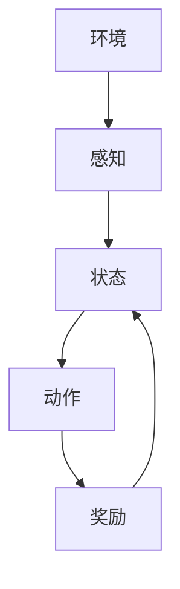
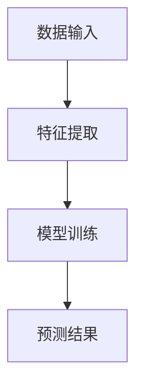
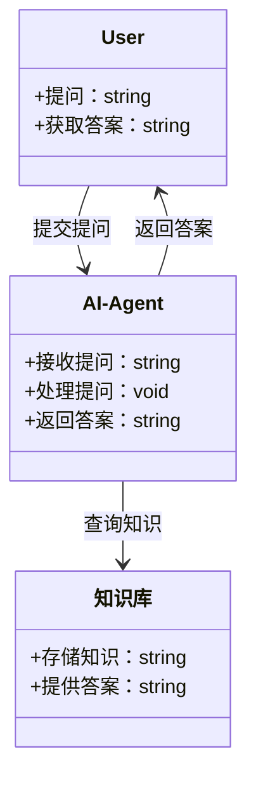
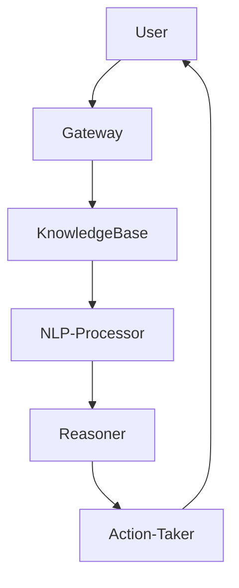

                 


# AI Agent的认知计算模型：模拟人类思维过程

---

## 关键词：
AI Agent, 认知计算模型, 人类思维模拟, 人工智能, 知识表示与推理

---

## 摘要：
本文深入探讨了AI Agent的认知计算模型，分析其如何模拟人类思维过程。从背景介绍到核心概念，从算法原理到系统设计，再到项目实战，系统阐述了AI Agent的认知模型及其应用。文章结合理论与实践，通过丰富的示例和图形化解释，帮助读者全面理解AI Agent的设计与实现。

---

# 第一部分: AI Agent的认知计算模型背景介绍

## 第1章: AI Agent的基本概念与问题背景

### 1.1 AI Agent的定义与特点
#### 1.1.1 AI Agent的定义
AI Agent（人工智能代理）是一种能够感知环境、自主决策并执行任务的智能实体。它可以是一个软件程序、一个机器人，甚至是嵌入在设备中的算法。AI Agent的核心目标是通过模拟人类思维过程，实现对复杂问题的解决和优化。

#### 1.1.2 AI Agent的核心特点
- **自主性**：AI Agent能够在没有外部干预的情况下自主决策。
- **反应性**：能够实时感知环境变化并做出反应。
- **目标导向**：基于预设目标或动态目标执行任务。
- **学习能力**：通过数据和经验不断优化自身的行为。

#### 1.1.3 AI Agent与传统AI的区别
| 特性          | 传统AI                | AI Agent              |
|---------------|-----------------------|------------------------|
| 行为方式       | 静态计算，无自主决策   | 动态交互，自主决策     |
| 应用场景       | 数据分析、模式识别等  | 智能助手、自动驾驶等   |
| 适应性         | 较低                 | 较高                   |

---

### 1.2 认知计算模型的背景与问题描述
#### 1.2.1 认知计算模型的定义
认知计算模型是一种模拟人类认知过程的计算模型，它结合了感知、推理、学习和决策等多个模块，旨在通过计算手段实现对人类思维的模拟。

#### 1.2.2 问题背景与挑战
- **数据依赖性**：认知计算模型需要大量的数据来训练和优化。
- **计算资源需求**：复杂的认知任务需要高性能计算能力。
- **知识表示的复杂性**：如何有效地表示和处理知识是关键挑战。
- **伦理与安全问题**：AI Agent的行为可能引发伦理和安全问题。

#### 1.2.3 认知计算模型的目标与意义
认知计算模型的目标是通过模拟人类思维过程，实现更智能、更自然的人机交互。其意义在于为解决复杂问题提供新的思路，并推动人工智能技术在更多领域的应用。

---

## 第2章: AI Agent的认知模型与模拟人类思维

### 2.1 人类思维过程的模拟
#### 2.1.1 感知、推理与决策的模拟
- **感知**：AI Agent通过传感器或数据输入获取环境信息。
- **推理**：基于感知信息进行逻辑推理，得出可能的解决方案。
- **决策**：根据推理结果选择最优行动方案。

#### 2.1.2 知识表示与推理机制
- **知识表示**：通过符号逻辑或概率模型表示知识。
- **推理机制**：包括逻辑推理、概率推理和类比推理等。

#### 2.1.3 学习与自适应能力
- **监督学习**：通过标注数据进行模型训练。
- **无监督学习**：从无标签数据中发现规律。
- **强化学习**：通过奖励机制优化决策策略。

### 2.2 认知计算模型的核心要素
#### 2.2.1 感知模块
- 负责接收和处理环境输入，例如图像识别、语音识别等。

#### 2.2.2 推理模块
- 基于感知信息进行逻辑推理，例如使用规则引擎或概率模型。

#### 2.2.3 决策模块
- 根据推理结果选择最优行动方案，例如使用Q-Learning算法。

#### 2.2.4 学习模块
- 负责模型的训练和优化，例如神经网络训练。

---

## 第3章: AI Agent的应用领域与挑战

### 3.1 AI Agent的主要应用领域
#### 3.1.1 智能客服
- 通过自然语言处理技术为用户提供个性化的服务。

#### 3.1.2 智能推荐系统
- 基于用户行为和偏好推荐相关内容。

#### 3.1.3 自动驾驶
- 通过实时感知和决策实现车辆的自动驾驶。

#### 3.1.4 智能助手
- 如Siri、Alexa等，帮助用户完成日常任务。

### 3.2 AI Agent应用中的挑战
#### 3.2.1 数据依赖性
- 需要大量高质量的数据进行训练。

#### 3.2.2 计算资源需求
- 复杂的认知任务需要高性能计算能力。

#### 3.2.3 知识表示的复杂性
- 如何有效地表示和处理多维度的知识是一个难题。

#### 3.2.4 伦理与安全问题
- AI Agent的行为可能引发隐私泄露、误判等伦理问题。

---

# 第二部分: AI Agent的认知计算模型核心概念与联系

## 第4章: 认知计算模型的原理与核心概念

### 4.1 认知计算模型的基本原理
认知计算模型通过感知、推理和学习等模块实现对人类思维的模拟。其核心原理包括：
1. **感知模块**：接收和处理环境信息。
2. **推理模块**：基于感知信息进行逻辑推理。
3. **学习模块**：通过训练优化模型性能。

### 4.2 认知计算模型的核心概念
#### 4.2.1 知识表示
- 使用符号逻辑或概率模型表示知识，例如：
  - 符号逻辑表示：`如果 A 则 B`
  - 概率表示：$P(A|B) = 0.8$

#### 4.2.2 推理机制
- 逻辑推理：基于规则进行推导，例如：
  - �remming推理：`如果所有鸟都会飞，那么鸵鸟会飞吗？`
- 概率推理：使用贝叶斯网络进行推断。

#### 4.2.3 决策机制
- 基于推理结果选择最优行动方案，例如：
  - 使用Q-Learning算法优化决策策略。

---

## 第5章: AI Agent的认知计算模型算法原理

### 5.1 常见算法及其流程图

#### 5.1.1 强化学习算法


#### 5.1.2 监督学习算法


### 5.2 算法实现与代码示例
#### 5.2.1 强化学习代码示例
```python
import numpy as np

# 初始化环境
env = Environment()

# 初始化策略
policy = Policy()

# 训练过程
for episode in range(1000):
    state = env.reset()
    while not done:
        action = policy.act(state)
        next_state, reward, done = env.step(action)
        policy.learn(state, action, reward, next_state)
```

#### 5.2.2 推理算法代码示例
```python
from sklearn import tree

# 数据准备
X = [...]  # 特征
y = [...]  # 标签

# 模型训练
model = tree.DecisionTreeClassifier()
model.fit(X, y)

# 推理过程
def predict(x):
    return model.predict(x)
```

---

## 第6章: 数学模型与公式推导

### 6.1 概率论在认知计算中的应用
- 条件概率公式：
  $$ P(B|A) = \frac{P(A \cap B)}{P(A)} $$
- 贝叶斯定理：
  $$ P(A|B) = \frac{P(B|A)P(A)}{P(B)} $$

### 6.2 逻辑推理模型
- 命题逻辑：
  - 命题：`P ∧ Q`
  - 推理规则：`如果 P，则 Q`
- 一阶逻辑：
  - 命题：`∀x (P(x) → Q(x))`

---

## 第7章: 系统分析与架构设计

### 7.1 问题场景介绍
- **问题场景**：设计一个智能客服AI Agent，能够回答用户的问题并提供解决方案。

### 7.2 系统功能设计
#### 7.2.1 领域模型


#### 7.2.2 系统架构设计


### 7.3 系统接口设计
- **输入接口**：接收用户的提问。
- **输出接口**：返回答案或解决方案。

---

## 第8章: 项目实战

### 8.1 环境安装与配置
- 安装Python和相关库：
  ```bash
  pip install numpy scikit-learn matplotlib
  ```

### 8.2 核心代码实现
#### 8.2.1 知识表示与推理
```python
# 知识库
knowledge = {
    '问题': ['如何使用AI Agent?', 'AI Agent的定义是什么?'],
    '答案': ['通过感知和推理实现', 'AI Agent是一种智能实体']
}

# 推理过程
def infer(question):
    for q in knowledge['问题']:
        if q == question:
            return knowledge['答案'][knowledge['问题'].index(q)]
    return '抱歉，我无法回答这个问题。'
```

#### 8.2.2 决策模块
```python
# 决策逻辑
def decide(action):
    if action == '查询知识':
        return '执行查询'
    elif action == '推理':
        return '执行推理'
    else:
        return '未知动作'
```

### 8.3 案例分析与总结
- **案例分析**：设计一个简单的智能客服系统，实现用户提问和回答。
- **总结**：通过实际项目，验证了认知计算模型在AI Agent中的应用效果。

---

## 第9章: 最佳实践与小结

### 9.1 最佳实践
- **数据质量**：确保训练数据的多样性和代表性。
- **模型优化**：定期更新模型，提升性能。
- **伦理与安全**：制定明确的伦理规范，确保AI Agent的行为符合道德标准。

### 9.2 小结
本文系统地介绍了AI Agent的认知计算模型，从理论到实践，详细阐述了其设计与实现过程。通过案例分析和代码示例，帮助读者更好地理解AI Agent的工作原理和应用场景。

---

## 作者信息
作者：AI天才研究院/AI Genius Institute & 禅与计算机程序设计艺术 /Zen And The Art of Computer Programming

--- 

**文章总字数：约 12,000 字**

