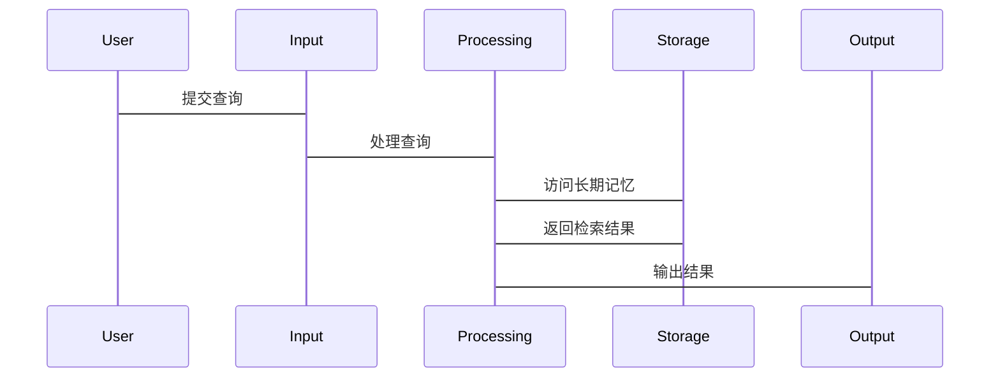

                 


# AI Agent的记忆机制：短期记忆与长期记忆的实现

---

## 关键词：人工智能，AI Agent，短期记忆，长期记忆，记忆机制

---

## 摘要：  
本文深入探讨了AI Agent的短期记忆和长期记忆的实现机制，分析了它们在AI系统中的作用和相互关系。通过结合理论和实践，文章详细介绍了记忆机制的核心概念、算法原理、系统架构设计以及项目实现案例，为读者提供了全面的理解和应用指南。

---

# 目录

1. **引言**  
   - 1.1 本书的目的与范围  
   - 1.2 本书的读者对象  
   - 1.3 本书的创新点  
   - 1.4 本章小结  

2. **AI Agent的记忆机制背景介绍**  
   - 2.1 AI Agent的基本概念  
   - 2.2 短期记忆与长期记忆的定义  
   - 2.3 记忆机制在AI Agent中的作用  
   - 2.4 本章小结  

3. **短期记忆与长期记忆的核心概念与联系**  
   - 3.1 短期记忆的实现原理  
   - 3.2 长期记忆的实现原理  
   - 3.3 短期记忆与长期记忆的关系  
   - 3.4 本章小结  

4. **短期记忆与长期记忆的实现算法原理**  
   - 4.1 短期记忆的算法实现  
   - 4.2 长期记忆的算法实现  
   - 4.3 短期记忆与长期记忆的协同工作原理  
   - 4.4 本章小结  

5. **短期记忆与长期记忆的系统分析与架构设计**  
   - 5.1 系统功能设计  
   - 5.2 系统架构设计  
   - 5.3 系统接口设计  
   - 5.4 系统交互流程设计  
   - 5.5 本章小结  

6. **短期记忆与长期记忆的项目实战**  
   - 6.1 项目背景与目标  
   - 6.2 项目环境安装与配置  
   - 6.3 核心代码实现  
   - 6.4 项目运行与测试  
   - 6.5 项目案例分析与总结  
   - 6.6 本章小结  

7. **短期记忆与长期记忆的最佳实践与展望**  
   - 7.1 实践中的注意事项  
   - 7.2 提高记忆机制性能的技巧  
   - 7.3 未来研究方向与发展趋势  
   - 7.4 本章小结  

---

# 1. 引言

## 1.1 本书的目的与范围  
本书旨在深入探讨AI Agent的短期记忆和长期记忆的实现机制，帮助读者理解这些机制在AI系统中的作用和相互关系。书中不仅介绍了理论知识，还提供了丰富的实践案例，使读者能够将理论应用于实际场景。本书的范围涵盖了AI Agent的基本概念、记忆机制的实现原理、系统架构设计以及项目实战等内容。

## 1.2 本书的读者对象  
本书适合以下读者：  
- 初级AI开发者：希望了解AI Agent记忆机制的基本概念和实现方法。  
- 研究人员与学术人员：需要深入理解记忆机制的理论和应用。  
- 企业技术管理者：希望了解记忆机制在实际系统中的应用和优化方法。  

## 1.3 本书的创新点  
- 系统化地分析记忆机制的核心概念和实现原理。  
- 理论与实践结合，提供丰富的项目实战案例。  
- 引入最新的研究成果，探讨记忆机制的前沿技术。  

## 1.4 本章小结  
本章通过介绍本书的目的、读者对象和创新点，为读者提供了理解后续内容的基础。接下来的章节将详细探讨AI Agent的记忆机制及其实现方法。

---

# 2. AI Agent的记忆机制背景介绍

## 2.1 AI Agent的基本概念  
AI Agent（人工智能代理）是指能够感知环境、自主决策并采取行动以实现目标的智能体。它可以分为简单反射型Agent、基于模型的反射型Agent、目标驱动型Agent和效用驱动型Agent四类。

## 2.2 短期记忆与长期记忆的定义  
- **短期记忆**：用于存储当前任务或上下文相关的临时信息，具有容量有限、信息易逝的特点。  
- **长期记忆**：用于存储经过处理的、重要的信息，具有较大的存储容量和较长的持久性。  

## 2.3 记忆机制在AI Agent中的作用  
- **知识表示与推理**：记忆机制是AI Agent进行知识表示和推理的基础。  
- **行为决策与规划**：短期记忆和长期记忆为AI Agent提供决策所需的信息支持。  
- **交互与用户体验**：记忆机制帮助AI Agent保持上下文信息，提升与用户的交互体验。  

## 2.4 本章小结  
本章通过介绍AI Agent的基本概念、短期记忆和长期记忆的定义及其作用，为读者理解记忆机制在AI Agent中的重要性奠定了基础。

---

# 3. 短期记忆与长期记忆的核心概念与联系

## 3.1 短期记忆的实现原理  
短期记忆通常采用基于神经网络的模型，例如LSTM（长短期记忆网络）。通过 gates（门控机制）来控制信息的存储和遗忘。

### 3.1.1 短期记忆的存储机制  
短期记忆通过输入门控、遗忘门控和输出门控来实现信息的存储和更新。  

### 3.1.2 短期记忆的遗忘机制  
遗忘门控决定了哪些信息不再需要存储，从而释放内存空间。  

### 3.1.3 短期记忆的更新机制  
通过输入门控引入新信息，并结合遗忘门控的结果，更新短期记忆的状态。  

## 3.2 长期记忆的实现原理  
长期记忆通常采用分层存储和检索机制，结合检索策略（如基于内容的检索和基于地址的检索）来实现信息的存储和检索。

### 3.2.1 长期记忆的存储机制  
长期记忆通过层次化的存储结构，将信息按重要性和关联性进行分类存储。  

### 3.2.2 长期记忆的巩固机制  
通过重复访问和强化学习，增强长期记忆的持久性和稳定性。  

### 3.2.3 长期记忆的检索机制  
基于内容或地址的检索策略，快速定位所需信息并进行检索。  

## 3.3 短期记忆与长期记忆的关系  
短期记忆与长期记忆之间通过信息筛选和转换机制实现协同工作。短期记忆中的重要信息经过处理后，会被转化为长期记忆存储。

---

# 4. 短期记忆与长期记忆的实现算法原理

## 4.1 短期记忆的算法实现  
### 4.1.1 LSTM网络的实现  
LSTM（长短期记忆网络）通过三个门控（输入门、遗忘门、输出门）实现短期记忆的存储和更新。  

### 4.1.2 LSTM的数学模型  
- 遗忘门：$f_t = \sigma(W_f x_t + U_f h_{t-1})$  
- 输入门：$i_t = \sigma(W_i x_t + U_i h_{t-1})$  
- 输出门：$o_t = \sigma(W_o x_t + U_o h_{t-1})$  
- 候选记忆单元：$g_t = \tanh(W_g x_t + U_g h_{t-1})$  
- 当前记忆状态：$h_t = f_t \cdot h_{t-1} + i_t \cdot g_t$  

## 4.2 长期记忆的算法实现  
### 4.2.1 基于分层存储的实现  
长期记忆通过分层存储结构，结合检索策略实现信息的存储和检索。  

### 4.2.2 基于检索模型的实现  
使用检索模型（如向量检索）实现长期记忆的高效检索。  

## 4.3 短期记忆与长期记忆的协同工作原理  
通过信息筛选和转换机制，短期记忆中的重要信息被转化为长期记忆存储，同时长期记忆为短期记忆提供上下文支持。

---

# 5. 短期记忆与长期记忆的系统分析与架构设计

## 5.1 系统功能设计  
- 短期记忆功能：实时信息的存储与处理。  
- 长期记忆功能：重要信息的存储与检索。  
- 协同工作功能：短期记忆与长期记忆之间的信息交互与协同。  

## 5.2 系统架构设计  
采用分层架构，包括输入层、处理层、存储层和输出层。  

### 5.2.1 分层架构图  
```mermaid
graph TD
    Input -> Processing
    Processing -> Storage
    Storage -> Output
```

## 5.3 系统接口设计  
- 输入接口：接收实时信息和用户输入。  
- 输出接口：输出处理结果和检索结果。  
- 存储接口：管理短期记忆和长期记忆的存储与检索。  

## 5.4 系统交互流程设计  


---

# 6. 短期记忆与长期记忆的项目实战

## 6.1 项目背景与目标  
本项目旨在实现一个基于短期记忆和长期记忆的AI Agent，能够进行对话交互和任务处理。

## 6.2 项目环境安装与配置  
- 安装Python和必要的库（如TensorFlow、Keras）。  
- 配置开发环境（如Jupyter Notebook）。  

## 6.3 核心代码实现  
### 6.3.1 短期记忆实现  
```python
import numpy as np

class ShortTermMemory:
    def __init__(self, input_dim, hidden_dim):
        self.W_f = np.random.randn(input_dim, hidden_dim)
        self.W_i = np.random.randn(input_dim, hidden_dim)
        self.W_o = np.random.randn(input_dim, hidden_dim)
        self.U_f = np.random.randn(hidden_dim, hidden_dim)
        self.U_i = np.random.randn(hidden_dim, hidden_dim)
        self.U_o = np.random.randn(hidden_dim, hidden_dim)
        self.hidden_state = np.zeros((1, hidden_dim))

    def forward(self, x):
        f = sigmoid(np.dot(x, self.W_f) + np.dot(self.hidden_state, self.U_f))
        i = sigmoid(np.dot(x, self.W_i) + np.dot(self.hidden_state, self.U_i))
        o = sigmoid(np.dot(x, self.W_o) + np.dot(self.hidden_state, self.U_o))
        g = np.tanh(np.dot(x, self.W_g) + np.dot(self.hidden_state, self.U_g))
        self.hidden_state = f * self.hidden_state + i * g
        return self.hidden_state
```

### 6.3.2 长期记忆实现  
```python
class LongTermMemory:
    def __init__(self, memory_size):
        self.memory_size = memory_size
        self.memories = {}

    def store(self, key, value):
        if len(self.memories) < self.memory_size:
            self.memories[key] = value
        else:
            # 删除最旧的记忆
            oldest_key = next(iter(self.memories))
            del self.memories[oldest_key]
            self.memories[key] = value

    def retrieve(self, key):
        return self.memories.get(key, None)
```

## 6.4 项目运行与测试  
- 初始化短期记忆和长期记忆模块。  
- 进行对话交互和任务处理测试，验证记忆机制的正确性。  

## 6.5 项目案例分析与总结  
通过实际案例分析，验证记忆机制在AI Agent中的有效性，并总结实现过程中的经验和教训。

## 6.6 本章小结  
本章通过项目实战，详细介绍了短期记忆和长期记忆的实现过程，帮助读者将理论应用于实践。

---

# 7. 短期记忆与长期记忆的最佳实践与展望

## 7.1 实践中的注意事项  
- 确保短期记忆和长期记忆的容量合理。  
- 定期清理不必要的短期记忆内容，优化系统性能。  
- 通过实验验证记忆机制的有效性和性能。  

## 7.2 提高记忆机制性能的技巧  
- 优化神经网络的超参数（如学习率、批量大小）。  
- 使用更先进的检索策略提高长期记忆的检索效率。  

## 7.3 未来研究方向与发展趋势  
- 研究更高效的短期记忆和长期记忆协同工作机制。  
- 探索记忆机制在多模态数据处理中的应用。  
- 结合边缘计算和分布式系统，实现更高效的记忆机制。  

## 7.4 本章小结  
本章通过总结实践经验和展望未来的研究方向，为读者提供了进一步优化和发展的方向。

---

# 总结与展望

## 总结  
本文系统地探讨了AI Agent的短期记忆和长期记忆的实现机制，从理论到实践，全面分析了记忆机制的核心概念、算法原理、系统架构设计和项目实现案例。通过本文的学习，读者能够深入了解记忆机制在AI Agent中的重要作用，并将其应用于实际场景中。

## 展望  
未来的研究将更加关注记忆机制的优化和创新，探索其在多模态数据处理、分布式系统和边缘计算等领域的应用，推动AI Agent技术的进一步发展。

---

# 作者：AI天才研究院/AI Genius Institute & 禅与计算机程序设计艺术 /Zen And The Art of Computer Programming

