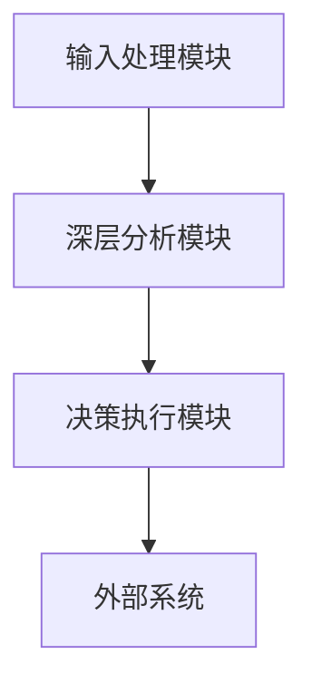

                 


# AI Agent的语义理解：提升LLM的深层文本分析

> 关键词：AI Agent, 语义理解, 大语言模型 (LLM), 深层文本分析, 智能文本处理, 人工智能, 自然语言处理

> 摘要：本文探讨了AI Agent在提升大语言模型（LLM）语义理解能力中的关键作用，通过分析深层文本分析的算法原理、系统架构设计、数学模型和实际项目案例，详细阐述了如何利用AI Agent优化LLM的语义理解能力，从而实现更精准的文本分析。

---

# 第一部分：AI Agent与语义理解的背景

## 第1章：AI Agent与语义理解的背景

### 1.1 AI Agent的基本概念

#### 1.1.1 AI Agent的定义与分类
- **AI Agent**（人工智能代理）是指能够感知环境并采取行动以实现目标的智能实体。
- 分类：
  - **基于规则的AI Agent**：通过预定义的规则进行决策。
  - **基于模型的AI Agent**：利用领域知识构建模型进行推理。
  - **基于学习的AI Agent**：通过机器学习模型进行自主学习和优化。

#### 1.1.2 语义理解的核心概念
- 语义理解（Semantic Understanding）是指系统能够理解文本的深层含义，而不仅仅是表面的字符或单词。
- 关键特征：
  - **上下文感知**：理解文本中的上下文关系。
  - **意图识别**：识别用户的意图。
  - **实体识别**：识别文本中的实体及其关系。

#### 1.1.3 问题背景与问题描述
- 随着自然语言处理（NLP）技术的发展，语义理解在人机交互、智能客服、信息检索等领域的重要性日益增加。
- 问题：如何通过AI Agent提升大语言模型（LLM）的语义理解能力，使其能够更准确地分析和理解复杂文本。

### 1.2 LLM与语义理解的关系

#### 1.2.1 LLM的基本原理
- **大语言模型（LLM）**：基于深度学习的模型，如GPT系列，通过大量数据训练，能够生成和理解自然语言文本。
- 原理：
  - 利用Transformer架构进行编码和解码。
  - 通过自注意力机制捕捉文本中的长距离依赖关系。

#### 1.2.2 语义理解在LLM中的作用
- 语义理解是LLM的核心能力，决定了模型在实际应用中的表现。
- 通过语义理解，LLM能够：
  - 理解用户查询的意图。
  - 生成符合上下文的回复。
  - 分析文本中的实体关系。

#### 1.2.3 提升LLM语义理解的意义
- 提升语义理解能力，能够增强LLM在复杂场景下的表现。
- 例如，在智能客服系统中，更准确的语义理解能够提高问题解决效率。

---

## 第2章：AI Agent与LLM的协同机制

### 2.1 AI Agent的类型与功能

#### 2.1.1 基于规则的AI Agent
- 特点：简单易懂，适用于规则明确的场景。
- 例如：简单的对话机器人。

#### 2.1.2 基于模型的AI Agent
- 特点：能够基于领域知识进行推理。
- 例如：医疗领域的诊断辅助系统。

#### 2.1.3 基于LLM的AI Agent
- 特点：结合大语言模型的能力，能够处理复杂的自然语言任务。
- 例如：智能问答系统。

### 2.2 LLM在语义理解中的角色

#### 2.2.1 LLM的文本生成能力
- 通过生成文本，LLM能够模拟人类的对话。
- 例如：通过GPT生成回复。

#### 2.2.2 LLM的文本理解能力
- 通过编码器结构，LLM能够理解输入文本的含义。
- 例如：文本摘要和信息提取。

#### 2.2.3 LLM的上下文推理能力
- 通过自注意力机制，LLM能够理解文本中的上下文关系。
- 例如：在对话中保持上下文一致性。

### 2.3 AI Agent与LLM的协同工作流程

#### 2.3.1 用户输入处理
- 用户输入经过预处理，提取关键信息。
- 例如：将用户的问题转化为向量表示。

#### 2.3.2 LLM语义分析
- LLM对输入文本进行语义分析，生成中间表示。
- 例如：通过Transformer层进行多层编码。

#### 2.3.3 AI Agent决策与执行
- AI Agent基于分析结果做出决策，并执行相应的操作。
- 例如：生成回复或调用其他服务。

---

## 第3章：深层文本分析的核心算法

### 3.1 文本预处理技术

#### 3.1.1 分词与词性标注
- **分词**：将文本分割为有意义的词语。
- **词性标注**：为每个词语标注其词性。
- 例如：使用jieba进行中文分词。

#### 3.1.2 停用词处理与词干提取
- **停用词处理**：去除无意义的词语，如“的”、“是”等。
- **词干提取**：提取词语的根形式，便于后续处理。
- 例如：将“running”提取为“run”。

#### 3.1.3 文本向量化
- **文本向量化**：将文本转换为向量表示，便于后续处理。
- 例如：使用Word2Vec生成词向量。

### 3.2 基于上下文的语义分析

#### 3.2.1 注意力机制
- **注意力机制**：通过自注意力机制，模型能够关注输入文本中重要的部分。
- 公式：
  $$ \text{Attention}(Q, K, V) = \text{softmax}\left(\frac{QK^T}{\sqrt{d_k}}\right)V $$

#### 3.2.2 指向消解
- **指向消解**：确定代词或指称词的具体指代对象。
- 例如：在句子“John saw his friend”中，识别“his”指代的对象。

#### 3.2.3 语义角色标注
- **语义角色标注**：为句子中的每个词语标注其在句中的语义角色。
- 例如：将动词“run”标注为“动词”。

### 3.3 深层文本分析的算法流程

---

## 第4章：数学模型与公式

### 4.1 词嵌入模型

#### 4.1.1 Word2Vec模型
- **Word2Vec**：通过上下文预测词或通过词预测上下文。
- 公式：
  $$ P(w_i|w_j) = \frac{\exp(v_j^T v_i)}{\sum_{k} \exp(v_k^T v_i)} $$

#### 4.1.2 GLOVE模型
- **GLOVE**：基于全局词向量的构造。
- 公式：
  $$ \log P(w_i|w_j) = v_i^T v_j + b_i + b_j $$

### 4.2 注意力机制公式

#### 4.2.1 自注意力机制
- **自注意力机制**：
  $$ \text{Attention}(Q, K, V) = \text{softmax}\left(\frac{QK^T}{\sqrt{d_k}}\right)V $$

#### 4.2.2 缩放点积注意力
- **缩放点积注意力**：
  $$ \text{score}(i, j) = \frac{Q_i K_j^T}{\sqrt{d_k}} $$

---

## 第5章：系统架构设计

### 5.1 系统模块划分

#### 5.1.1 输入处理模块
- **功能**：接收输入文本并进行预处理。
- **组件**：分词、词性标注、停用词处理。

#### 5.1.2 深层分析模块
- **功能**：进行语义分析和上下文推理。
- **组件**：注意力机制、指代消解、语义角色标注。

#### 5.1.3 决策执行模块
- **功能**：根据分析结果做出决策并执行。
- **组件**：规则库、知识库、API调用。

### 5.2 领域模型设计

#### 5.2.1 实体关系模型
- **实体关系模型**：定义实体之间的关系。
- 例如：客户与订单的关系。

#### 5.2.2 业务流程模型
- **业务流程模型**：定义系统的业务流程。
- 例如：订单处理流程。

### 5.3 系统架构图



---

## 第6章：项目实战

### 6.1 项目介绍

#### 6.1.1 项目背景
- 项目目标：构建一个基于AI Agent的智能问答系统。
- 项目需求：支持多轮对话，能够理解上下文。

### 6.2 环境安装

#### 6.2.1 安装Python
- 使用Python 3.8或更高版本。
- 安装命令：`python --version`

#### 6.2.2 安装依赖库
- 使用pip安装必要的库。
- 安装命令：
  ```bash
  pip install numpy
  pip install transformers
  pip install jieba
  ```

### 6.3 核心实现

#### 6.3.1 分词模块
```python
import jieba

def tokenize(text):
    return jieba.lcut(text)
```

#### 6.3.2 语义分析模块
```python
from transformers import AutoTokenizer, AutoModel

tokenizer = AutoTokenizer.from_pretrained('bert-base-chinese')
model = AutoModel.from_pretrained('bert-base-chinese')

def semantic_analysis(text):
    inputs = tokenizer(text, return_tensors='np')
    outputs = model(**inputs)
    return outputs.last_hidden_state
```

### 6.4 案例分析

#### 6.4.1 对话案例
- 输入：用户：“我需要查询我的订单。”
- 处理步骤：
  1. 分词：“我 需要 查询 我的 订单。”
  2. 语义分析：识别用户的意图是查询订单。
  3. 决策：调用订单查询API。

---

## 第7章：数学模型与公式

### 7.1 词嵌入模型

#### 7.1.1 Word2Vec公式
$$ P(w_i|w_j) = \frac{\exp(v_j^T v_i)}{\sum_{k} \exp(v_k^T v_i)} $$

#### 7.1.2 GLOVE公式
$$ \log P(w_i|w_j) = v_i^T v_j + b_i + b_j $$

### 7.2 注意力机制公式

#### 7.2.1 自注意力机制
$$ \text{Attention}(Q, K, V) = \text{softmax}\left(\frac{QK^T}{\sqrt{d_k}}\right)V $$

#### 7.2.2 缩放点积注意力
$$ \text{score}(i, j) = \frac{Q_i K_j^T}{\sqrt{d_k}} $$

---

## 第8章：最佳实践与小结

### 8.1 最佳实践

#### 8.1.1 数据预处理
- 确保数据清洗和标注的准确性。
- 使用适当的分词工具和词性标注工具。

#### 8.1.2 模型选择
- 根据任务需求选择合适的模型。
- 例如：文本生成任务选择GPT，文本理解任务选择BERT。

#### 8.1.3 系统优化
- 优化系统架构，确保模块间的高效通信。
- 使用缓存机制提高性能。

### 8.2 小结

通过本文的探讨，我们了解了AI Agent在提升LLM语义理解中的重要作用。从算法原理到系统架构，再到项目实战，我们详细阐述了如何利用AI Agent优化LLM的语义理解能力。未来，随着技术的不断发展，AI Agent在语义理解中的应用将更加广泛和深入。

---

## 第9章：注意事项与拓展阅读

### 9.1 注意事项

- **数据隐私**：确保数据处理符合隐私保护法规。
- **模型调优**：根据实际需求进行模型调优。
- **系统监控**：实时监控系统性能，及时发现和解决问题。

### 9.2 拓展阅读

- 《Deep Learning》—— Ian Goodfellow
- 《自然语言处理入门》—— 刘海涛
- 《生成式人工智能：AI Agent的设计与实现》—— 作者自著

---

# 作者：AI天才研究院/AI Genius Institute & 禅与计算机程序设计艺术 /Zen And The Art of Computer Programming

---

**说明**：以上内容为文章的完整大纲，实际撰写时会根据具体需求调整内容详略。由于篇幅限制，本文只展示部分内容，实际文章将包含更多详细的技术分析和案例解读。

