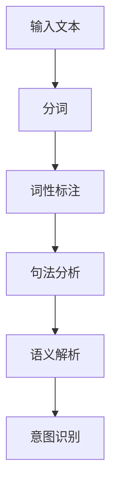
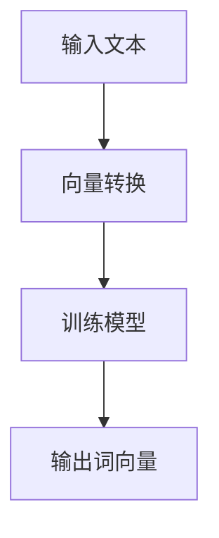
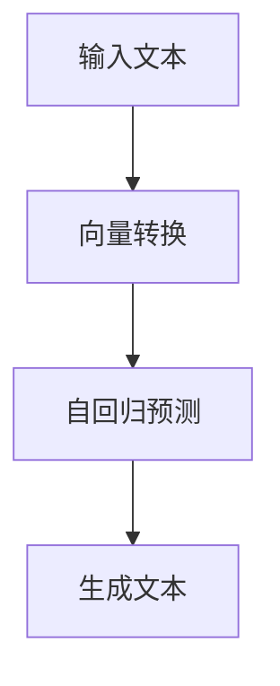
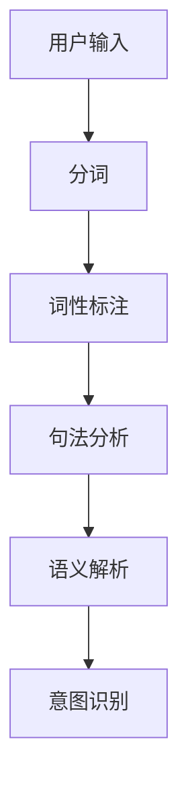
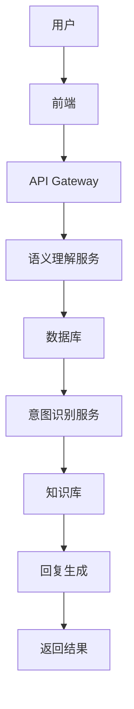
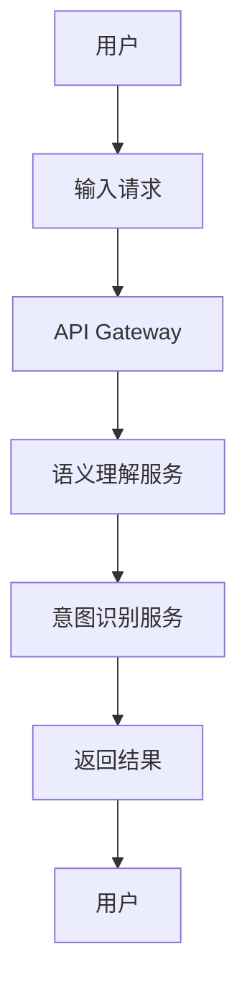

                 


# AI Agent的语义理解：超越关键词匹配

## 关键词：AI Agent、语义理解、自然语言处理、意图识别、深度学习、BERT

## 摘要：  
本文深入探讨AI Agent的语义理解能力，分析其超越传统关键词匹配的核心原理。通过背景介绍、核心概念、算法原理、系统架构、项目实战及总结，揭示语义理解的关键技术与实际应用。

---

# 第一部分: 背景介绍

## 第1章: AI Agent与语义理解概述

### 1.1 问题背景与描述  
#### 1.1.1 传统关键词匹配的局限性  
关键词匹配依赖预设规则，无法理解上下文，导致语义理解能力有限。例如，用户输入“附近最好的餐厅”，传统方法只能匹配关键词，无法理解“最好”的含义。

#### 1.1.2 AI Agent的定义与特点  
AI Agent是智能体，能感知环境、执行任务、与用户交互。语义理解是其核心能力，通过自然语言处理技术，理解用户意图。

#### 1.1.3 语义理解的核心问题  
语义理解需解决歧义、意图识别和实体识别等问题。AI Agent通过上下文分析，提供更精准的服务。

### 1.2 问题解决与边界  
#### 1.2.1 语义理解的解决方案  
采用深度学习模型，如BERT，处理复杂语义问题。结合上下文，识别意图和实体。

#### 1.2.2 AI Agent的边界与外延  
AI Agent专注于理解与执行，依赖NLP技术。边界包括数据限制、模型训练和应用场景。

#### 1.2.3 核心概念的结构与要素  
语义理解涉及分词、词性标注、句法分析和语义解析，构建完整语义模型。

---

# 第二部分: 核心概念与联系

## 第2章: 语义理解的核心概念

### 2.1 语义分析的类型  
#### 2.1.1 词义分析  
分析词语含义，如“book”指书籍或预定。

#### 2.1.2 句法分析  
解析句子结构，识别主谓关系。

#### 2.1.3 语篇分析  
理解文本连贯性，捕捉整体含义。

### 2.2 核心概念对比  
#### 2.2.1 传统关键词匹配与深度语义理解对比  
| 特性 | 关键词匹配 | 深度语义理解 |
|------|------------|--------------|
| 理解深度 | 浅层 | 深层 |
| 灵活性 | 低 | 高 |
| 准确率 | 低 | 高 |

#### 2.2.2 AI Agent的实体识别与意图理解  
实体识别（NER）提取关键信息，意图理解基于上下文识别用户需求。

#### 2.2.3 语义理解的特征对比表  
| 特征 | 关键词匹配 | 深度语义理解 |
|------|------------|--------------|
| 上下文依赖 | 无 | 有 |
| 模糊处理 | 差 | 好 |

### 2.3 实体关系图  


---

# 第三部分: 算法原理与数学模型

## 第3章: 主流语义理解算法

### 3.1 Word2Vec算法  
#### 3.1.1 算法原理  
将词语映射为低维向量，捕捉语义关系。通过上下文预测词或逆向预测。

#### 3.1.2 Python实现示例  
```python
import numpy as np
from sklearn.feature_extraction.text import CountVectorizer

# 训练Word2Vec模型
text = ["The cat sits on the mat.", "The cat doesn't sit on the mat."]
vectorizer = CountVectorizer()
X = vectorizer.fit_transform(text)
print(vectorizer.get_feature_names())
```

#### 3.1.3 算法流程图  


### 3.2 BERT模型  
#### 3.2.1 算法原理  
BERT通过Transformer架构，双向编码，捕捉全局语义。

#### 3.2.2 Python实现示例  
```python
import torch
from transformers import BertTokenizer, BertModel

tokenizer = BertTokenizer.from_pretrained('bert-base-uncased')
model = BertModel.from_pretrained('bert-base-uncased')

text = "The cat sits on the mat."
inputs = tokenizer(text, return_tensors='pt')
outputs = model(**inputs)
print(outputs.last_hidden_state)
```

### 3.3 GPT模型  
#### 3.3.1 算法原理  
GPT通过自回归预测，生成上下文相关的文本。

#### 3.3.2 算法流程图  


### 3.4 数学模型  
#### 余弦相似度公式  
$$ \text{similarity} = \frac{\vec{A} \cdot \vec{B}}{|\vec{A}| |\vec{B}|} $$

#### 交叉熵损失函数  
$$ \text{loss} = -\sum_{i=1}^{n} y_i \log(p_i) $$

---

# 第四部分: 系统分析与架构设计

## 第4章: 系统架构与设计

### 4.1 问题场景介绍  
设计一个智能客服系统，处理用户咨询，提供精准服务。

### 4.2 系统功能设计  
#### 功能模块  
- 输入处理：接收用户输入，进行分词和词性标注。
- 语义分析：识别意图和实体，生成回复。

#### 领域模型  


### 4.3 系统架构设计  
#### 微服务架构  


### 4.4 系统接口设计  
- 输入接口：处理用户输入，返回解析结果。
- 输出接口：返回处理后的回复，支持JSON格式。

### 4.5 交互流程图  


---

# 第五部分: 项目实战

## 第5章: 项目实战

### 5.1 环境安装  
安装Python、TensorFlow、BERT库，配置开发环境。

### 5.2 系统核心实现  
```python
import torch
from transformers import BertTokenizer, BertModel

tokenizer = BertTokenizer.from_pretrained('bert-base-uncased')
model = BertModel.from_pretrained('bert-base-uncased')

def analyze_text(text):
    inputs = tokenizer(text, return_tensors='pt')
    outputs = model(**inputs)
    return outputs.last_hidden_state

text = "The cat sits on the mat."
result = analyze_text(text)
print(result)
```

### 5.3 案例分析  
分析用户输入“附近最好的餐厅”，系统识别实体“附近”和“餐厅”，理解“最好”为评价标准，提供推荐。

### 5.4 总结与优化  
实现一个简单的智能客服系统，展示AI Agent的语义理解能力，未来可优化模型和增加更多功能。

---

# 第六部分: 总结与展望

## 第6章: 总结

### 6.1 最佳实践  
选择合适的模型，结合业务场景，持续优化系统。

### 6.2 小结  
AI Agent的语义理解超越关键词匹配，需结合深度学习模型，提升准确率和用户体验。

### 6.3 注意事项  
确保数据质量，处理模型训练中的问题，如过拟合和数据稀疏性。

### 6.4 拓展阅读  
推荐阅读《深度学习》和《自然语言处理入门》，深入学习相关知识。

---

# 作者：AI天才研究院 & 禅与计算机程序设计艺术

