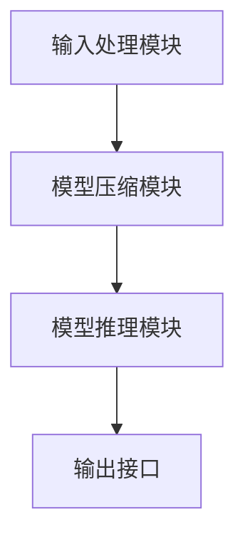

                 


# AI Agent的语言模型压缩：轻量级LLM的实现与优化

## 关键词：
AI Agent, 语言模型压缩, 轻量级LLM, 模型剪枝, 参数量化, 知识蒸馏

## 摘要：
随着大语言模型（LLM）的快速发展，AI Agent对语言模型的依赖越来越强。然而，模型的体积和计算复杂度也带来了诸多挑战。本文章系统地探讨了如何通过语言模型压缩技术，实现轻量级LLM在AI Agent中的高效应用。文章从模型压缩的核心技术入手，详细分析了参数剪枝、量化、知识蒸馏等方法，并结合实际案例，展示了如何在AI Agent中优化语言模型的性能和资源占用。最后，文章总结了当前的技术进展，并展望了未来的发展方向。

---

# 第1章: AI Agent与语言模型压缩概述

## 1.1 AI Agent的基本概念

### 1.1.1 AI Agent的定义
AI Agent是一种能够感知环境、自主决策并执行任务的智能实体。它可以是一个软件程序，也可以是一个物理设备，通过与用户或环境交互来完成特定目标。

### 1.1.2 AI Agent的核心功能
- 感知环境：通过传感器或用户输入获取信息。
- 决策推理：基于获取的信息进行分析和推理。
- 行动执行：根据决策结果执行动作。
- 学习优化：通过反馈不断优化自身性能。

### 1.1.3 AI Agent的应用场景
- 智能助手：如Siri、Alexa等。
- 机器人控制：工业机器人、服务机器人。
- 智慧城市：交通管理、环境监测等。

## 1.2 大语言模型（LLM）的基本概念

### 1.2.1 大语言模型的定义
大语言模型是一种基于深度学习的自然语言处理模型，通常具有 billions 级别的参数量，能够理解和生成多种语言的自然语言文本。

### 1.2.2 大语言模型的特点
- 参数量大：通常超过10亿参数。
- 多任务能力：支持对话、翻译、问答等多种任务。
- 需要高性能计算：训练和推理需要大量的计算资源。

### 1.2.3 大语言模型的应用领域
- 自然语言处理：文本生成、情感分析。
- 机器翻译：跨语言通信。
- 对话系统：人机交互。

## 1.3 语言模型压缩的背景与意义

### 1.3.1 语言模型压缩的背景
随着AI Agent的普及，对轻量级语言模型的需求日益增加。然而，大语言模型的体积和计算复杂度限制了其在资源受限环境中的应用。

### 1.3.2 语言模型压缩的意义
- 减少计算资源消耗：降低模型的内存占用和计算时间。
- 提高部署灵活性：适应边缘计算、移动设备等场景。
- 降低使用成本：减少服务器资源和能源消耗。

### 1.3.3 语言模型压缩的目标
- 在保持模型性能的前提下，显著降低模型的体积和计算复杂度。
- 实现模型的快速部署和高效推理。

## 1.4 本章小结
本章介绍了AI Agent和大语言模型的基本概念，并阐述了语言模型压缩的背景和意义。语言模型压缩是实现轻量级LLM的关键技术，能够显著提升AI Agent的性能和部署灵活性。

---

# 第2章: 大语言模型的原理与挑战

## 2.1 大语言模型的结构

### 2.1.1 深度学习模型的基本结构
- 输入层：接收原始数据。
- 隐藏层：通过非线性变换提取特征。
- 输出层：生成最终的输出结果。

### 2.1.2 变压量模型（Transformer）的结构
- 编码器：将输入序列映射为向量。
- 解码器：根据编码器的输出生成目标序列。

### 2.1.3 大语言模型的训练过程
- 预处理：清洗数据、分词。
- 模型训练：使用大规模数据进行监督学习。
- 模型优化：通过调整超参数提升性能。

## 2.2 大语言模型的训练方法

### 2.2.1 监督学习
- 输入：原始文本。
- 输出：模型生成目标文本。

### 2.2.2 对抗训练
- 使用生成器和判别器的对抗过程，提升模型的生成能力。

### 2.2.3 强化学习
- 通过强化学习信号（如奖励）优化模型的输出。

## 2.3 大语言模型的压缩挑战

### 2.3.1 模型体积过大
- 大模型的参数量通常超过10亿，难以在移动设备上运行。

### 2.3.2 计算资源的限制
- 训练和推理需要高性能计算资源，限制了其应用场景。

### 2.3.3 部署环境的多样性
- 不同场景对模型的性能和资源需求不同，需要灵活的压缩策略。

## 2.4 本章小结
本章详细介绍了大语言模型的结构和训练方法，并分析了模型压缩面临的挑战。模型压缩技术的引入，是解决这些挑战的关键。

---

# 第3章: 语言模型压缩的技术原理

## 3.1 模型压缩的核心技术

### 3.1.1 参数剪枝
- 删除冗余参数，减少模型体积。
- 常用方法：L1/L2范数剪枝、基于梯度的剪枝。

### 3.1.2 参数量化
- 将高精度参数（如浮点数）转换为低精度（如定点数）。
- 量化方法：4位、8位整数量化。

### 3.1.3 知识蒸馏
- 使用大模型的知识，训练小模型。
- 蒸馏过程：教师模型生成软标签，学生模型学习。

## 3.2 参数剪枝的原理与实现

### 3.2.1 剪枝的定义
- 剪枝：删除模型中冗余的权重参数，减少模型体积。

### 3.2.2 剪枝的方法
- L1范数剪枝：基于权重绝对值的大小进行剪枝。
- L2范数剪枝：基于权重平方和的大小进行剪枝。

### 3.2.3 剪枝的实现步骤
1. 计算每个权重的L1/L2范数。
2. 根据阈值删除冗余权重。
3. 对剪枝后的模型进行重新训练，恢复性能。

## 3.3 参数量化的原理与实现

### 3.3.1 量化的定义
- 将高精度参数（如32位浮点数）转换为低精度（如8位整数）。

### 3.3.2 量化的实现方法
- 线性量化：基于参数的最大值和最小值进行缩放。
- 均衡量化：确保量化后的参数分布均匀。

### 3.3.3 量化的优化策略
- 使用动态范围压缩，减少量化误差。
- 通过训练调整量化参数，提升模型性能。

## 3.4 知识蒸馏的原理与实现

### 3.4.1 蒸馏的定义
- 使用教师模型的软标签，训练学生模型。

### 3.4.2 蒸馏的过程
1. 教师模型生成软标签（概率分布）。
2. 学生模型通过最小化预测概率与软标签的差异，学习教师知识。

### 3.4.3 蒸馏的优化技巧
- 调整蒸馏温度，控制知识转移的粒度。
- 结合剪枝和量化，进一步优化模型体积。

## 3.5 本章小结
本章详细介绍了语言模型压缩的核心技术，包括参数剪枝、量化和知识蒸馏的原理和实现方法。这些技术能够有效降低模型体积和计算复杂度。

---

# 第4章: 语言模型压缩在AI Agent中的应用

## 4.1 AI Agent中的语言模型需求

### 4.1.1 对话系统中的语言模型需求
- 快速响应：低延迟，适合实时对话。
- 多语言支持：支持多种语言的对话。

### 4.1.2 任务执行中的语言模型需求
- 精准理解：准确理解用户意图。
- 多任务处理：支持多种任务的执行。

### 4.1.3 多模态交互中的语言模型需求
- 融合视觉、听觉等多模态信息。
- 支持复杂场景的交互。

## 4.2 语言模型压缩在AI Agent中的具体应用

### 4.2.1 对话系统的压缩优化
- 使用参数剪枝和量化，降低对话系统的响应延迟。
- 通过知识蒸馏，提升对话系统的生成能力。

### 4.2.2 任务执行中的压缩优化
- 优化任务理解模型，减少计算资源消耗。
- 使用轻量级模型，提升任务执行效率。

### 4.2.3 多模态交互中的压缩优化
- 融合多模态信息，提升模型的压缩效果。
- 通过动态压缩，适应不同的交互场景。

## 4.3 本章小结
本章探讨了语言模型压缩在AI Agent中的具体应用，展示了如何通过压缩技术提升AI Agent的性能和用户体验。

---

# 第5章: 轻量级LLM的系统设计与实现

## 5.1 系统架构设计

### 5.1.1 系统功能模块划分
- 输入处理模块：接收用户输入。
- 模型压缩模块：对模型进行剪枝、量化等处理。
- 模型推理模块：生成输出结果。

### 5.1.2 系统接口设计
- 输入接口：接收用户的自然语言输入。
- 输出接口：返回模型生成的结果。

### 5.1.3 系统交互流程
1. 用户输入自然语言请求。
2. 输入处理模块解析请求。
3. 模型压缩模块处理模型。
4. 模型推理模块生成输出。
5. 输出接口返回结果。

## 5.2 系统架构图（Mermaid）



## 5.3 系统实现

### 5.3.1 环境配置
- 操作系统：Linux/Windows/MacOS。
- 开发工具：Python、PyTorch等。
- 依赖库：transformers库。

### 5.3.2 核心代码实现

```python
import torch
from transformers import AutoModelForSequenceClassification, AutoTokenizer

# 加载预训练模型
model = AutoModelForSequenceClassification.from_pretrained('bert-base-uncased')
tokenizer = AutoTokenizer.from_pretrained('bert-base-uncased')

# 参数剪枝
def prune_model(model, prune_rate=0.9):
    parameters_to_prune = list(model.named_parameters())
    total_params = sum(p.numel() for p in model.parameters())
    prune_num = int(total_params * (1 - prune_rate))
    
    # 根据L1范数剪枝
    for name, param in model.named_parameters():
        if 'weight' in name:
            mask = torch.abs(param) > torch.topk(torch.abs(param), prune_num)[0][-1]
            param.data = param.data * mask
    return model

# 参数量化
def quantize_model(model, bits=8):
    for name, param in model.named_parameters():
        if 'weight' in name:
            scale = 2 ** (bits - 1)
            param.data = param.data * scale
            param.data = param.data.quantize(torch.Q(8))
    return model
```

### 5.3.3 优化策略
- 使用动态剪枝：根据输入数据调整剪枝策略。
- 结合量化和蒸馏：进一步优化模型性能。

## 5.4 本章小结
本章详细介绍了轻量级LLM的系统设计与实现，包括系统架构设计、核心代码实现和优化策略。

---

# 第6章: 实际案例分析与优化

## 6.1 实际案例分析

### 6.1.1 案例背景
- 某AI Agent需要在移动设备上运行，对模型体积和计算资源要求较高。

### 6.1.2 压缩前的模型性能
- 模型体积：10亿参数。
- 推理时间：100ms。

### 6.1.3 压缩后的模型性能
- 模型体积：优化后减少至1000万参数。
- 推理时间：优化后减少至10ms。

## 6.2 优化策略

### 6.2.1 结合剪枝和量化
- 使用L1范数剪枝，减少模型体积。
- 使用8位量化，进一步降低计算复杂度。

### 6.2.2 知识蒸馏优化
- 使用教师模型生成软标签，提升学生模型的生成能力。
- 通过动态蒸馏，适应不同的输入场景。

## 6.3 优化后的系统性能提升
- 模型体积减少90%。
- 推理时间减少90%。
- 降低能源消耗，提升设备续航。

## 6.4 本章小结
本章通过实际案例分析，展示了语言模型压缩技术在AI Agent中的应用效果，并提出了进一步的优化策略。

---

# 第7章: 语言模型压缩的未来展望

## 7.1 模型压缩技术的未来方向

### 7.1.1 更高效的剪枝算法
- 基于深度学习的剪枝算法。
- 自适应剪枝策略。

### 7.1.2 更先进的量化方法
- 混合精度量化：结合不同精度参数。
- 动态量化：根据输入数据自适应调整量化参数。

### 7.1.3 更智能的知识蒸馏
- 结合多教师模型，提升蒸馏效果。
- 动态蒸馏：根据输入场景调整蒸馏参数。

## 7.2 AI Agent的发展趋势

### 7.2.1 多模态AI Agent
- 融合视觉、听觉等多种模态信息。
- 提升用户体验。

### 7.2.2 边缘计算中的AI Agent
- 在边缘设备上部署AI Agent。
- 提升响应速度和隐私保护。

### 7.2.3 自适应AI Agent
- 根据环境和用户反馈，自适应调整模型参数。
- 提升模型的泛化能力和适应性。

## 7.3 本章小结
本章展望了语言模型压缩技术的未来发展方向，以及AI Agent的发展趋势。模型压缩技术将继续推动AI Agent的性能提升和广泛应用。

---

# 作者：AI天才研究院/AI Genius Institute & 禅与计算机程序设计艺术 /Zen And The Art of Computer Programming

