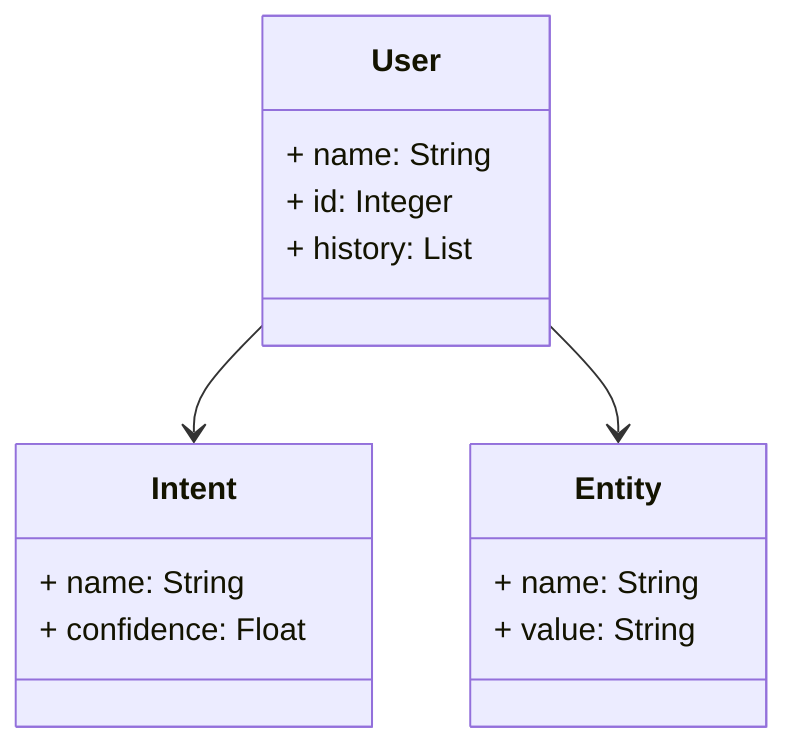
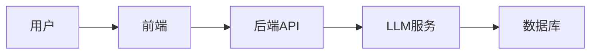
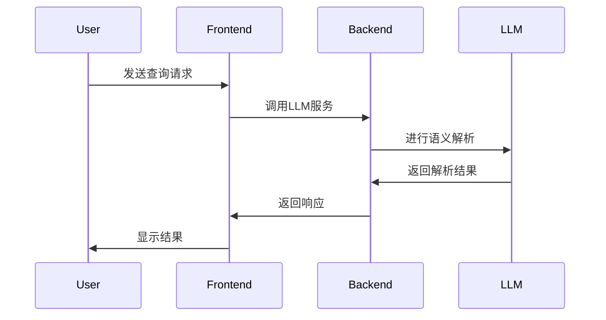

                 


# AI Agent的语言理解：提升LLM的语义解析能力

## 关键词：AI Agent，语言理解，LLM，语义解析，自然语言处理，大语言模型

## 摘要：  
本文深入探讨了AI Agent在语言理解中的应用，重点分析了如何通过提升大语言模型（LLM）的语义解析能力，实现更智能、更自然的交互。文章从背景介绍、核心概念、算法原理、系统设计到项目实战，全面解析了提升LLM语义解析能力的关键技术，并通过具体案例展示了实际应用中的挑战与解决方案。

---

## 第1章: AI Agent与语言理解概述

### 1.1 AI Agent的基本概念  
AI Agent（人工智能代理）是指能够感知环境、自主决策并执行任务的智能实体。它可以是一个软件程序、机器人或其他智能系统。AI Agent的核心能力包括感知、推理、规划和执行。  

#### 1.1.1 AI Agent的定义与分类  
AI Agent可以根据智能水平分为弱AI和强AI。弱AI专注于特定任务（如语音助手），而强AI具备与人类相当或超越的通用智能。  

#### 1.1.2 语言理解在AI Agent中的重要性  
语言理解是AI Agent与人类交互的关键环节。只有准确理解用户的意图，AI Agent才能提供有效的服务。  

#### 1.1.3 AI Agent与人类语言理解的对比  
与人类不同，AI Agent依赖于算法和数据进行语言理解，可能在某些场景下表现更优，但在复杂语境中仍需改进。  

### 1.2 大语言模型（LLM）的背景与发展  
LLM（Large Language Model）是一种基于深度学习的自然语言处理模型，通过大量数据训练，具备强大的语言生成和理解能力。  

#### 1.2.1 LLM的定义与特点  
LLM的特点包括大规模参数、多任务学习能力和强大的上下文理解能力。  

#### 1.2.2 LLM在语言理解中的优势  
LLM能够处理复杂语义，支持多种语言和领域，但需要大量计算资源和数据支持。  

#### 1.2.3 LLM与AI Agent的结合  
将LLM集成到AI Agent中，可以显著提升其语言理解和生成能力，使其更贴近人类交互方式。  

### 1.3 语义解析的核心问题  
语义解析是将输入文本转换为计算机可理解的结构化信息的过程，是AI Agent语言理解的核心任务。  

#### 1.3.1 什么是语义解析  
语义解析通过分析文本的语法和语义，提取实体、关系和意图，生成结构化的语义表示。  

#### 1.3.2 语义解析的挑战与难点  
语义解析面临歧义性、上下文依赖性和领域适应性等挑战。  

#### 1.3.3 提升LLM语义解析能力的意义  
提升LLM的语义解析能力，可以增强AI Agent的智能化水平，使其在更多场景中实现高效交互。  

### 1.4 本章小结  
本章介绍了AI Agent和LLM的基本概念，分析了语言理解在AI Agent中的重要性，并提出了提升LLM语义解析能力的目标和意义。  

---

## 第2章: 语言理解的关键技术  

### 2.1 词法分析与句法分析  
词法分析将文本分割为词或短语，句法分析研究句子的结构和语法关系。  

#### 2.1.1 词法分析的基本概念  
词法分析是语言理解的基础，包括分词、词性标注和命名实体识别。  

#### 2.1.2 句法分析的原理与方法  
句法分析通过构建句法树，揭示句子的语法结构。常用方法包括基于规则的句法分析和基于统计的句法分析。  

#### 2.1.3 常见的句法分析工具  
如依存句法分析，使用工具如spaCy和NLTK实现。  

### 2.2 语义分析与语义网络  
语义分析旨在理解文本的语义含义，构建语义网络用于表示概念之间的关系。  

#### 2.2.1 语义分析的定义与方法  
语义分析通过上下文理解词语的含义，常用方法包括基于词汇语义和基于句法语义的分析。  

#### 2.2.2 语义网络的构建与应用  
语义网络用于表示知识图谱，支持智能检索和推理。  

#### 2.2.3 实体关系图的Mermaid示例  


### 2.3 上下文理解与推理  
上下文理解是基于语境的信息理解，推理是基于逻辑的推断过程。  

#### 2.3.1 上下文理解的挑战  
上下文理解需要处理歧义性、语境依赖性和信息不完整等问题。  

#### 2.3.2 推理在语言理解中的作用  
推理帮助AI Agent理解隐含信息，提升语义解析的准确性。  

### 2.4 本章小结  
本章详细介绍了语言理解的关键技术，包括词法分析、句法分析、语义分析和上下文理解与推理。  

---

## 第3章: LLM的语义解析能力提升方法  

### 3.1 数据增强与微调  
数据增强通过生成多样化的训练数据，微调通过针对性优化模型参数，提升LLM的语义解析能力。  

#### 3.1.1 数据增强的基本原理  
数据增强包括同义词替换、数据扩增和噪声注入等方法。  

#### 3.1.2 微调在LLM优化中的作用  
微调通过在特定领域数据上进行训练，提升模型在该领域的表现。  

#### 3.1.3 数据增强与微调的结合  
结合数据增强和微调，可以显著提升模型的泛化能力和适应性。  

### 3.2 知识图谱与外部知识的整合  
知识图谱提供结构化的外部知识，帮助LLM更好地理解上下文。  

#### 3.2.1 知识图谱的基本概念  
知识图谱是一种以实体和关系为核心的语义网络。  

#### 3.2.2 知识图谱在LLM中的应用  
通过将知识图谱嵌入模型，提升LLM的推理和解释能力。  

#### 3.2.3 外部知识的获取与整合  
外部知识可以通过API或数据库获取，并与LLM的内部表示进行融合。  

### 3.3 多模态学习与跨领域迁移  
多模态学习通过整合多种数据模态，提升模型的泛化能力；跨领域迁移通过迁移学习，提升模型在新领域的适应性。  

#### 3.3.1 多模态学习的定义与优势  
多模态学习结合文本、图像和语音等多种模态信息，提升模型的理解能力。  

#### 3.3.2 跨领域迁移的挑战与解决方案  
跨领域迁移需要解决数据稀缺性和领域差异性问题，可以通过数据增强和模型适配等方法解决。  

### 3.4 本章小结  
本章探讨了提升LLM语义解析能力的多种方法，包括数据增强、知识图谱整合和多模态学习。  

---

## 第4章: AI Agent中的语义解析算法  

### 4.1 基于规则的语义解析算法  
基于规则的算法通过预定义的语法规则进行语义解析，适用于特定领域任务。  

#### 4.1.1 基于规则的算法原理  
基于规则的算法通过匹配预定义的模式，生成结构化的语义表示。  

#### 4.1.2 规则库的构建与维护  
规则库需要根据具体任务进行定制化构建，维护成本较高。  

#### 4.1.3 基于规则算法的优缺点  
优点是可解释性强，缺点是灵活性差，难以应对复杂语义。  

### 4.2 基于统计的语义解析算法  
基于统计的算法通过学习数据的分布规律，自动提取语义特征。  

#### 4.2.1 统计学习的基本原理  
统计学习通过概率模型，基于数据分布进行预测。  

#### 4.2.2 基于统计的模型训练方法  
常用方法包括最大似然估计和贝叶斯推理。  

#### 4.2.3 统计算法的优缺点  
优点是灵活性高，缺点是可解释性差。  

### 4.3 基于深度学习的语义解析算法  
基于深度学习的算法通过神经网络提取高维特征，实现语义解析。  

#### 4.3.1 深度学习的基本原理  
深度学习通过多层神经网络，自动提取高层次特征。  

#### 4.3.2 基于深度学习的模型训练方法  
常用模型包括卷积神经网络（CNN）和循环神经网络（RNN）。  

#### 4.3.3 基于深度学习算法的优缺点  
优点是性能优越，缺点是计算资源需求高。  

### 4.4 本章小结  
本章介绍了几种常见的语义解析算法，分析了各自的优缺点和适用场景。  

---

## 第5章: 系统分析与架构设计方案  

### 5.1 问题场景介绍  
以智能客服为例，分析AI Agent在客服场景中的语义解析需求。  

### 5.2 系统功能设计  
设计一个基于LLM的智能客服系统，功能包括意图识别、实体提取和对话管理。  

#### 5.2.1 领域模型Mermaid类图  


### 5.3 系统架构设计  
采用微服务架构，包括前端、后端和数据存储模块。  

#### 5.3.1 系统架构Mermaid图  


### 5.4 系统接口设计  
定义RESTful API接口，包括POST /parse和GET /intent等接口。  

### 5.5 系统交互Mermaid序列图  


### 5.6 本章小结  
本章通过智能客服场景，详细设计了基于LLM的AI Agent系统架构和接口方案。  

---

## 第6章: 项目实战  

### 6.1 环境安装  
安装Python、TensorFlow和Hugging Face库，配置GPU环境。  

### 6.2 系统核心实现源代码  
以下是一个简单的LLM语义解析实现：  

```python
from transformers import AutoTokenizer, AutoModelForMaskedLM
import torch

tokenizer = AutoTokenizer.from_pretrained("bert-base-chinese")
model = AutoModelForMaskedLM.from_pretrained("bert-base-chinese")

def semantic_parse(text):
    inputs = tokenizer.encode_plus(text, return_tensors="pt", padding=True, truncation=True)
    outputs = model(**inputs)
    # 处理输出，提取语义表示
    return outputs.last_hidden_state

# 示例
text = "预约明天的机票到上海。"
result = semantic_parse(text)
print(result)
```

### 6.3 代码应用解读与分析  
上述代码使用BERT模型进行语义解析，提取文本的隐藏层表示，用于后续意图识别和实体提取。  

### 6.4 实际案例分析  
以智能客服为例，解析用户输入“预约明天的机票到上海”，提取意图“预约机票”和实体“明天”、“上海”。  

### 6.5 项目小结  
本章通过实际案例，展示了如何使用LLM进行语义解析，并提供了完整的代码实现和应用示例。  

---

## 第7章: 总结与展望  

### 7.1 总结  
本文从AI Agent和LLM的基本概念出发，深入分析了语义解析的关键技术，探讨了多种提升LLM语义解析能力的方法，并通过实际案例展示了系统设计和项目实现。  

### 7.2 注意事项  
在实际应用中，需要关注模型的计算资源消耗、数据隐私保护和模型的可解释性问题。  

### 7.3 拓展阅读  
推荐阅读《深度学习》、《自然语言处理实战》等相关书籍，深入理解LLM和语义解析的前沿技术。  

### 7.4 本章小结  
本章总结了全文内容，并展望了未来的研究方向和技术趋势。  

---

## 作者：AI天才研究院/AI Genius Institute & 禅与计算机程序设计艺术 /Zen And The Art of Computer Programming

