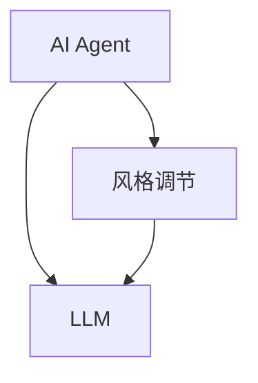
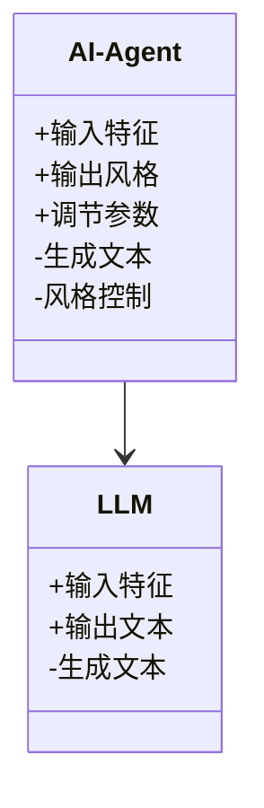
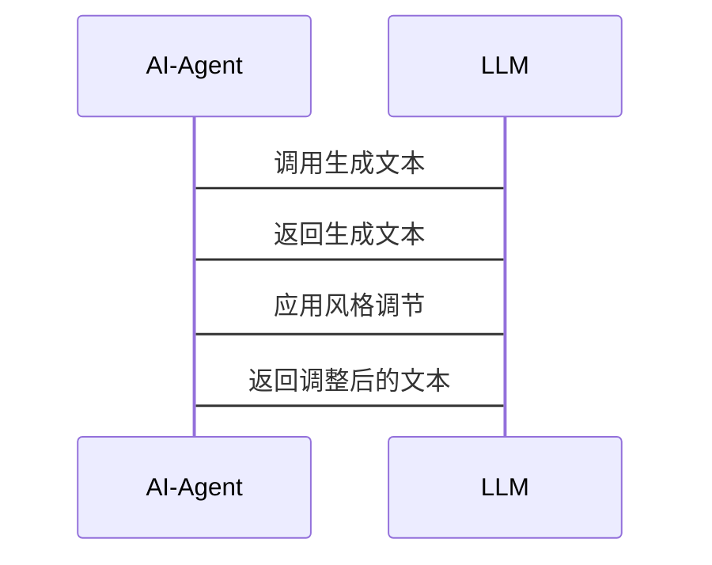

                 


# AI Agent的语言生成控制：精确调节LLM的输出风格

---

## 关键词：AI Agent, LLM, 语言生成控制, 输出风格调节, 自然语言处理, 深度学习

---

## 摘要：本文深入探讨了AI Agent在语言生成控制中的作用，特别是如何精确调节大语言模型（LLM）的输出风格。文章从背景介绍、核心概念、算法原理、系统设计到项目实战，全面解析了如何实现对LLM输出风格的精确控制，并提供了丰富的案例和代码示例，帮助读者理解并掌握这一技术的核心原理和应用方法。

---

## 第一部分: AI Agent与语言生成控制的背景介绍

## 第1章: AI Agent与语言生成控制的背景

### 1.1 问题背景

#### 1.1.1 AI Agent的定义与特点
AI Agent（人工智能代理）是一种能够感知环境并采取行动以实现目标的智能实体。AI Agent的特点包括自主性、反应性、目标导向性和社会性。AI Agent可以通过调用大语言模型（LLM）来生成自然语言文本，从而实现与用户的交互或完成特定任务。

#### 1.1.2 大语言模型（LLM）的崛起
近年来，大语言模型（如GPT-3、GPT-4）的快速发展使得生成高质量的自然语言文本成为可能。这些模型通过深度学习和大量数据训练，能够理解和生成人类语言。然而，LLM的输出风格通常是多样且不可控的，这为AI Agent的使用带来了挑战。

#### 1.1.3 语言生成控制的必要性
AI Agent的任务通常是特定的，例如客服机器人、智能助手等。为了满足这些任务的需求，AI Agent需要对LLM的输出风格进行精确控制，以确保生成文本符合特定的语境、语气和格式要求。

### 1.2 问题描述

#### 1.2.1 LLM输出风格的多样性
LLM的输出风格多样，可以从随意、口语化到正式、严谨。然而，这种多样性在某些场景下可能并不适用，例如在法律咨询或医疗建议中，需要严格的正式语气。

#### 1.2.2 输出风格控制的挑战
LLM的输出风格控制是一个复杂的问题。主要挑战包括：
- **模型内部机制的复杂性**：LLM的输出是由复杂的概率分布决定的，难以直接控制。
- **输入特征的多样性**：不同的输入特征（如上下文、用户身份、任务目标）需要不同的输出风格。
- **实时性要求**：在实时交互中，快速调整输出风格需要高效的算法。

#### 1.2.3 精确调节的需求
为了满足特定任务的需求，AI Agent需要对LLM的输出风格进行精确调节。这种调节需要考虑以下方面：
- **语境适应性**：根据上下文调整语气和用词。
- **用户偏好**：根据用户的个性和偏好调整输出风格。
- **任务目标**：根据任务目标调整输出格式和内容。

### 1.3 问题解决

#### 1.3.1 精确调节的实现方法
实现对LLM输出风格的精确调节可以通过以下方法：
- **输入调整**：在输入中加入风格控制的指令或参数。
- **后处理**：对生成的文本进行风格过滤和调整。
- **模型微调**：通过微调模型参数来适应特定的输出风格。

#### 1.3.2 调节过程中的关键问题
在调节过程中，需要解决以下关键问题：
- **风格一致性**：确保生成文本的风格一致。
- **上下文适应性**：在不同语境下灵活调整风格。
- **实时性与效率**：在实时交互中快速调整风格。

#### 1.3.3 解决方案的可行性分析
通过输入调整和后处理的方法，可以在不修改模型参数的情况下实现风格调节。这种方法具有较高的可行性，适用于实时交互场景。

### 1.4 边界与外延

#### 1.4.1 调节范围的边界
调节范围通常包括语气、用词、句式和格式等方面。语气调节是最常见的调节方式，例如从友好到正式。

#### 1.4.2 调节方法的外延
调节方法可以扩展到多模态生成，例如结合图像和文本生成更复杂的输出。

#### 1.4.3 调节效果的评估标准
调节效果可以通过以下标准进行评估：
- **准确性**：生成文本是否符合预期的风格。
- **一致性**：生成文本在不同场景下的风格是否一致。
- **用户体验**：用户对生成文本的满意度。

### 1.5 概念结构与核心要素

#### 1.5.1 核心概念的组成
- **AI Agent**：调用LLM并进行风格调节的主体。
- **LLM**：提供生成文本能力的模型。
- **风格调节**：调整生成文本的风格以满足特定需求。

#### 1.5.2 要素之间的关系
AI Agent通过输入调整和后处理方法对LLM的输出风格进行调节，确保生成文本符合特定任务需求。

#### 1.5.3 概念结构的可视化
以下是AI Agent与LLM的关系图：



---

## 第2章: AI Agent与LLM的关系

### 2.1 AI Agent的定义与核心功能

#### 2.1.1 AI Agent的定义
AI Agent是一种能够感知环境并采取行动以实现目标的智能实体。它通常通过调用外部服务（如LLM）来完成特定任务。

#### 2.1.2 AI Agent的核心功能
- **感知环境**：通过传感器或API获取环境信息。
- **决策制定**：基于获取的信息做出决策。
- **执行行动**：通过执行特定操作（如调用LLM）实现目标。

#### 2.1.3 AI Agent与人类交互的特点
AI Agent与人类交互的特点包括：
- **实时性**：快速响应用户请求。
- **上下文感知**：根据上下文调整交互方式。
- **个性化**：根据用户偏好调整输出风格。

### 2.2 LLM的工作原理

#### 2.2.1 大语言模型的基本原理
LLM通过深度学习技术训练大规模语料库，生成与输入上下文相关的文本。其核心是基于Transformer的自注意力机制。

#### 2.2.2 LLM的训练过程
训练过程包括：
- **预训练**：使用大规模语料库进行无监督学习。
- **微调**：根据特定任务对模型进行有监督微调。

#### 2.2.3 LLM的输出机制
LLM的输出机制基于生成式模型，通过概率分布生成文本。

### 2.3 AI Agent与LLM的联系

#### 2.3.1 AI Agent调用LLM的方式
AI Agent可以通过API调用LLM生成文本，并根据需要对生成的文本进行风格调节。

#### 2.3.2 LLM作为AI Agent的核心模块
在许多AI Agent系统中，LLM是其核心模块，负责生成自然语言文本。

#### 2.3.3 AI Agent对LLM输出的控制
AI Agent通过输入调整和后处理方法对LLM的输出风格进行控制，确保生成文本符合特定任务需求。

---

## 第3章: 语言生成控制的核心概念

### 3.1 语言生成控制的定义

#### 3.1.1 语言生成控制的定义
语言生成控制是指对生成文本的风格、语气和格式进行调节，以满足特定需求。

#### 3.1.2 控制的目标与范围
控制的目标包括：
- **风格一致性**：确保生成文本风格一致。
- **语境适应性**：根据上下文调整风格。
- **任务目标**：根据任务目标调整输出格式和内容。

#### 3.1.3 控制的实现方式
控制的实现方式包括：
- **输入调整**：在输入中加入风格控制指令。
- **后处理**：对生成的文本进行风格过滤和调整。
- **模型微调**：通过微调模型参数来适应特定的输出风格。

### 3.2 输出风格调节的实现原理

#### 3.2.1 风格调节的数学模型
风格调节可以通过以下数学模型实现：
- **生成式模型**：通过调整生成概率分布来实现风格调节。
- **分类模型**：根据输入特征对生成文本进行分类，从而实现风格调节。

#### 3.2.2 风格调节的算法流程
风格调节的算法流程包括：
1. 输入文本和风格参数。
2. 生成候选文本。
3. 根据风格参数对候选文本进行评分。
4. 选择最优文本。

#### 3.2.3 风格调节的实现步骤
1. **输入调整**：在输入中加入风格控制指令。
2. **文本生成**：使用LLM生成候选文本。
3. **风格评分**：根据风格参数对生成文本进行评分。
4. **文本选择**：选择最优文本作为输出。

### 3.3 风格调节的核心要素

#### 3.3.1 输入特征
输入特征包括：
- **上下文信息**：生成文本的上下文。
- **用户特征**：用户的偏好和身份。
- **任务目标**：生成文本的任务目标。

#### 3.3.2 输出风格
输出风格包括：
- **语气**：正式、友好、幽默等。
- **用词**：专业术语、口语化表达。
- **格式**：段落结构、标点符号。

#### 3.3.3 调节参数
调节参数包括：
- **语气权重**：不同语气的权重。
- **用词偏好**：优先使用特定类型的词汇。
- **格式要求**：生成文本的格式要求。

---

## 第4章: AI Agent语言生成控制的实现方法

### 4.1 基于输入调整的风格控制

#### 4.1.1 输入调整的实现原理
通过在输入中加入风格控制指令，例如在输入前缀中添加风格标签。

#### 4.1.2 输入调整的实现步骤
1. **定义风格标签**：例如“正式”、“友好”、“幽默”等。
2. **在输入中加入风格标签**：例如“请以正式语气回答以下问题：...”。
3. **生成文本**：使用LLM生成文本。

#### 4.1.3 输入调整的优缺点
- **优点**：简单易实现，不需要修改模型参数。
- **缺点**：对生成文本的风格控制能力有限。

### 4.2 基于后处理的风格控制

#### 4.2.1 后处理的实现原理
通过在生成文本后对文本进行风格过滤和调整，例如去除不合适的词汇。

#### 4.2.2 后处理的实现步骤
1. **生成候选文本**：使用LLM生成多个候选文本。
2. **风格评分**：根据风格参数对候选文本进行评分。
3. **选择最优文本**：选择最优文本作为输出。

#### 4.2.3 后处理的优缺点
- **优点**：对生成文本的风格控制能力较强。
- **缺点**：需要额外的计算资源。

### 4.3 基于模型微调的风格控制

#### 4.3.1 模型微调的实现原理
通过对模型进行微调，使其生成符合特定风格的文本。

#### 4.3.2 模型微调的实现步骤
1. **收集特定风格的数据集**：例如正式语气的文本。
2. **对模型进行微调**：使用特定风格的数据集对模型进行微调。
3. **生成文本**：使用微调后的模型生成文本。

#### 4.3.3 模型微调的优缺点
- **优点**：生成文本的风格一致性较高。
- **缺点**：需要大量的数据和计算资源。

---

## 第5章: AI Agent语言生成控制的系统设计

### 5.1 系统功能设计

#### 5.1.1 领域模型设计
以下是领域模型的类图：



#### 5.1.2 系统架构设计
以下是系统架构图：


#### 5.1.3 系统接口设计
系统接口包括：
- **输入接口**：接收输入特征和调节参数。
- **输出接口**：输出生成文本。
- **控制接口**：接收风格调节指令。

#### 5.1.4 系统交互流程
以下是系统交互流程图：



### 5.2 项目实战

#### 5.2.1 环境安装
需要安装以下环境和工具：
- Python 3.8+
- Transformers库
- PyTorch

#### 5.2.2 核心代码实现

```python
from transformers import AutoModelForCausalLM, AutoTokenizer

class AI-Agent:
    def __init__(self):
        self.tokenizer = AutoTokenizer.from_pretrained('gpt2')
        self.model = AutoModelForCausalLM.from_pretrained('gpt2')

    def generate_text(self, input_text, style='friendly'):
        # 输入调整
        if style == 'friendly':
            prefix = "请以友好的语气回答以下问题："
        elif style == 'formal':
            prefix = "请以正式的语气回答以下问题："
        else:
            prefix = ""
        full_input = prefix + input_text
        # 生成文本
        inputs = self.tokenizer(full_input, return_tensors='np')
        outputs = self.model.generate(inputs.input_ids, max_length=50)
        generated_text = self.tokenizer.decode(outputs[0], skip_special_tokens=True)
        return generated_text
```

#### 5.2.3 代码解读
1. **初始化模型和分词器**：使用预训练的GPT-2模型。
2. **生成文本**：根据输入的风格参数生成相应的文本。
3. **返回生成文本**：返回生成的文本。

#### 5.2.4 案例分析
例如，输入“请问如何提高英语水平？”：
- **友好风格**：生成友好的回答。
- **正式风格**：生成正式的回答。

### 5.3 最佳实践

#### 5.3.1 小结
通过输入调整和后处理的方法，可以实现对LLM输出风格的精确控制。

#### 5.3.2 注意事项
- **风格一致性**：确保生成文本风格一致。
- **实时性**：在实时交互中快速调整风格。
- **用户反馈**：根据用户反馈调整风格参数。

#### 5.3.3 拓展阅读
- **生成式模型**：深入理解生成式模型的工作原理。
- **风格迁移**：研究风格迁移的最新技术。

---

## 结语

通过本文的详细讲解，我们深入探讨了AI Agent语言生成控制的核心概念、实现方法和系统设计。通过实际案例的分析，我们展示了如何实现对LLM输出风格的精确控制。未来，随着技术的发展，AI Agent语言生成控制将更加智能化和个性化，为人类与AI的交互带来更美好的体验。

---

## 作者：AI天才研究院/AI Genius Institute & 禅与计算机程序设计艺术 /Zen And The Art of Computer Programming

