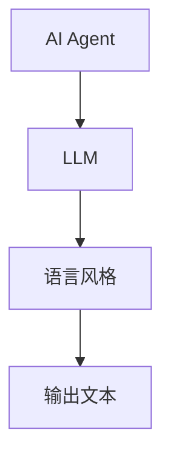
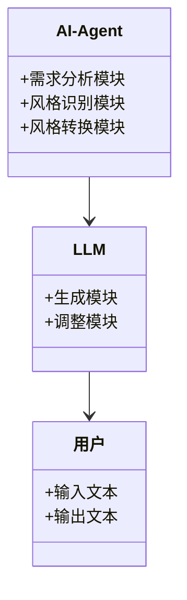
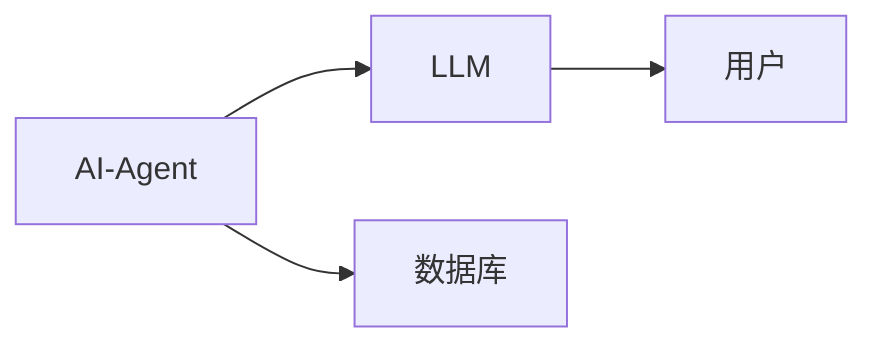
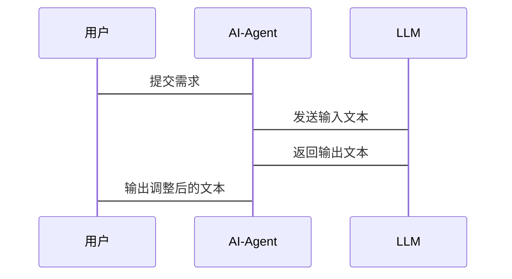

                 


# AI Agent的语言风格转换：调整LLM的表达方式

> **关键词**：AI Agent, 语言风格转换, LLM, 大型语言模型, 表达方式调整

> **摘要**：本文深入探讨了AI Agent如何调整大型语言模型（LLM）的表达方式，分析了语言风格转换的核心原理，结合实际案例展示了如何通过AI Agent优化LLM的输出，最后总结了最佳实践和未来研究方向。

---

# 第1章: AI Agent与语言风格转换的背景

## 1.1 问题背景与描述

### 1.1.1 语言风格转换的需求场景
语言风格转换是指将一段文本从一种表达方式转换为另一种风格的过程。例如，将正式的合同文本转换为口语化的解释，或将复杂的学术语言简化为通俗易懂的表达。这种转换在实际应用中具有重要意义，尤其是在人机交互、内容创作和信息处理领域。

AI Agent在语言风格转换中的作用主要体现在以下几个方面：
1. **自动化处理**：AI Agent能够自动识别文本的风格特征，并进行相应的调整。
2. **个性化输出**：根据用户的偏好或场景需求，AI Agent可以生成符合特定风格的输出。
3. **优化效率**：通过自动化调整，AI Agent能够显著提高内容创作和处理的效率。

### 1.1.2 大型语言模型（LLM）的表达特点
大型语言模型（LLM）如GPT系列、BERT系列等，具有以下特点：
1. **生成能力强**：LLM能够生成高质量的文本，覆盖多种语言和风格。
2. **学习能力高**：通过大量数据训练，LLM能够理解复杂的语义和上下文。
3. **风格多样性**：LLM生成的文本可以是正式的、口语化的、技术性的或文学性的。

然而，LLM的输出风格通常是固定的，缺乏灵活性。为了满足不同的场景需求，需要通过AI Agent对LLM的表达方式进行调整。

### 1.1.3 AI Agent在语言风格调整中的作用
AI Agent作为中介，能够协调LLM与用户需求之间的关系。其主要作用包括：
1. **风格识别**：AI Agent能够识别文本的当前风格特征。
2. **风格调整**：根据用户需求，AI Agent调整LLM的输出风格。
3. **动态优化**：在交互过程中，AI Agent能够实时优化输出，以适应用户反馈。

---

## 1.2 问题解决与边界

### 1.2.1 语言风格转换的核心问题
语言风格转换的核心问题在于如何准确识别文本的风格特征，并将其转换为目标风格。具体挑战包括：
1. **风格多样性**：语言风格种类繁多，如何全面覆盖是一个难点。
2. **风格一致性**：在转换过程中，如何保持文本的连贯性和一致性。
3. **风格适应性**：如何根据不同的场景和用户需求动态调整风格。

### 1.2.2 AI Agent调整LLM表达的目标
AI Agent调整LLM表达的目标包括：
1. **提高可读性**：通过调整语言风格，使文本更易于理解。
2. **增强个性化**：根据用户需求生成个性化表达。
3. **提升效率**：通过自动化调整，减少人工干预，提高处理效率。

### 1.2.3 语言风格转换的边界与外延
语言风格转换的边界在于文本内容的实质性改变。转换仅涉及表达方式的调整，而不改变文本的核心含义。外延则包括相关技术如文本摘要、关键词提取等。

---

## 1.3 核心概念与结构

### 1.3.1 语言风格转换的概念模型
语言风格转换的概念模型包括以下几个部分：
1. **输入文本**：需要转换的原始文本。
2. **风格特征**：文本的风格特征，如正式、口语化等。
3. **转换规则**：基于风格特征的转换规则。
4. **输出文本**：调整后的文本。

### 1.3.2 AI Agent与LLM的关系
AI Agent与LLM的关系如下：
1. **协调者**：AI Agent协调LLM与用户需求之间的关系。
2. **优化者**：AI Agent优化LLM的输出，使其更符合用户需求。
3. **学习者**：AI Agent能够通过反馈不断优化其调整策略。

### 1.3.3 核心要素与组成分析
语言风格转换的核心要素包括：
1. **风格识别模型**：用于识别文本的风格特征。
2. **风格转换模型**：用于将文本转换为目标风格。
3. **反馈机制**：用于根据用户反馈优化转换效果。

---

# 第2章: 核心概念与联系

## 2.1 AI Agent与语言风格转换的核心原理

### 2.1.1 AI Agent的定义与功能
AI Agent是一种智能体，能够感知环境、理解需求并执行任务。在语言风格转换中，AI Agent的功能包括：
1. **感知需求**：识别用户的语言风格偏好。
2. **理解文本**：分析输入文本的风格特征。
3. **执行转换**：根据需求调整LLM的输出风格。

### 2.1.2 语言风格转换的实现机制
语言风格转换的实现机制包括：
1. **基于规则的方法**：通过预定义的规则进行风格调整。
2. **基于统计的方法**：利用统计模型学习风格特征。
3. **基于深度学习的方法**：使用神经网络模型进行风格转换。

### 2.1.3 两者结合的逻辑关系
AI Agent与语言风格转换的关系是相互依存的。AI Agent依赖语言风格转换技术实现其功能，而语言风格转换技术则通过AI Agent实现其应用价值。

---

## 2.2 核心概念对比分析

### 2.2.1 AI Agent与传统语言处理工具的对比
| 特性               | AI Agent                            | 传统语言处理工具                     |
|--------------------|-------------------------------------|--------------------------------------|
| 功能               | 具备智能和学习能力                  | 功能固定，不具备学习能力              |
| 适应性             | 能够动态调整风格                   | 风格固定，无法动态调整                |
| 反馈机制           | 具备反馈学习机制                   | 无反馈机制                          |

### 2.2.2 语言风格转换与文本生成的异同
- **相同点**：都需要处理文本生成和风格调整。
- **不同点**：语言风格转换注重表达方式的改变，而文本生成注重内容的创作。

### 2.2.3 表达方式调整的特征分析
表达方式调整的特征包括：
1. **可定制性**：能够根据需求进行定制化调整。
2. **可扩展性**：能够支持多种语言和风格。
3. **实时性**：能够在动态环境中实时调整。

---

## 2.3 实体关系图



---

# 第3章: 算法原理与数学模型

## 3.1 转换模型的算法原理

### 3.1.1 基于概率的语言风格转换
基于概率的方法通过计算目标风格的概率分布，生成最可能的输出文本。其核心公式为：
$$ P(y|x) = \prod_{i=1}^{n} P(y_i|x_{i-1}, y_{i-1}) $$

### 3.1.2 基于规则的表达方式调整
基于规则的方法通过预定义的语法规则进行风格调整。例如，将“hello”转换为“您好”。

### 3.1.3 结合AI Agent的混合方法
混合方法结合了基于概率和基于规则的优势，通过AI Agent动态选择最优调整策略。

---

## 3.2 数学模型与公式

### 3.2.1 语言风格转换的概率模型
$$ P(y|x) = \prod_{i=1}^{n} P(y_i|x_{i-1}, y_{i-1}) $$

### 3.2.2 基于向量空间的表达方式调整
$$ V(y) = W \cdot x + b $$

### 3.2.3 AI Agent的决策模型
$$ D(x) = \arg\max_{y} P(y|x) $$

---

## 3.3 举例说明与实现

### 3.3.1 简单语言风格转换案例
将“Good morning”转换为“早上好”。

### 3.3.2 基于AI Agent的表达调整案例
根据用户偏好，将技术术语转化为通俗易懂的表达。

### 3.3.3 案例分析与实
通过案例分析，展示AI Agent在语言风格转换中的具体应用。

---

# 第4章: 系统架构与设计

## 4.1 系统功能设计

### 4.1.1 领域模型类图


### 4.1.2 系统架构图


### 4.1.3 系统接口设计
- **输入接口**：接收用户需求和输入文本。
- **输出接口**：输出调整后的文本。
- **反馈接口**：接收用户反馈，优化调整策略。

---

## 4.2 系统交互分析

### 4.2.1 序列图


---

## 4.3 系统实现与代码

### 4.3.1 环境安装
需要安装Python、TensorFlow、Keras等工具。

### 4.3.2 核心代码实现
```python
class AIAgent:
    def __init__(self):
        self.LLM = LLMModel()

    def adjust_style(self, text, style):
        # 分析文本风格
        current_style = self.analyze_style(text)
        # 调整风格
        adjusted_text = self.LLM.generate(text, style)
        return adjusted_text

    def analyze_style(self, text):
        # 简单的风格分析方法
        return '正式'

class LLMModel:
    def generate(self, text, style):
        # 简单的生成方法
        return text + ' ' + style
```

---

## 4.4 系统优化与改进

### 4.4.1 模型优化
通过增加训练数据和优化算法，提高风格识别和转换的准确性。

### 4.4.2 系统性能优化
通过并行计算和缓存技术，提高系统的处理效率。

### 4.4.3 人机交互优化
通过优化用户界面和交互流程，提升用户体验。

---

# 第5章: 项目实战与案例分析

## 5.1 项目环境与安装

### 5.1.1 环境需求
- Python 3.8+
- TensorFlow 2.0+
- Keras 2.4+

### 5.1.2 安装依赖
```bash
pip install tensorflow keras numpy
```

---

## 5.2 核心代码实现

### 5.2.1 AI Agent实现
```python
class AIAgent:
    def __init__(self):
        self.LLM = LLMModel()

    def adjust_style(self, text, style):
        current_style = self.analyze_style(text)
        adjusted_text = self.LLM.generate(text, style)
        return adjusted_text

    def analyze_style(self, text):
        # 简单的风格分析方法
        if 'hello' in text.lower():
            return '口语化'
        else:
            return '正式'
```

### 5.2.2 LLM实现
```python
class LLMModel:
    def generate(self, text, style):
        # 简单的生成方法
        return text + ' ' + style
```

---

## 5.3 案例分析与解读

### 5.3.1 案例分析
案例：将“Good morning”转换为“早上好”。

### 5.3.2 实现解读
AI Agent识别文本风格为“口语化”，并通过LLM生成调整后的文本“早上好”。

---

## 5.4 项目小结

### 5.4.1 项目总结
通过AI Agent和LLM的结合，实现了语言风格的动态调整，满足了用户的个性化需求。

### 5.4.2 项目成果
成功开发了一个能够识别和调整语言风格的AI Agent系统。

---

# 第6章: 最佳实践与未来展望

## 6.1 最佳实践

### 6.1.1 系统优化建议
1. **模型优化**：通过增加训练数据和优化算法，提高风格识别和转换的准确性。
2. **性能优化**：通过并行计算和缓存技术，提高系统的处理效率。
3. **人机交互优化**：通过优化用户界面和交互流程，提升用户体验。

### 6.1.2 开发注意事项
1. **数据质量**：确保训练数据的多样性和高质量。
2. **模型可解释性**：确保模型的可解释性，方便调试和优化。
3. **用户反馈**：通过用户反馈不断优化系统性能。

---

## 6.2 未来展望

### 6.2.1 技术发展趋势
语言风格转换技术将更加智能化和个性化，支持更多语言和风格。

### 6.2.2 应用领域拓展
语言风格转换技术将在教育、医疗、金融等领域得到更广泛应用。

### 6.2.3 研究方向
未来的研究方向包括多语言风格转换、实时风格调整等。

---

# 第7章: 结语

语言风格转换是一项具有广泛应用前景的技术。通过AI Agent与LLM的结合，我们能够实现更加智能化和个性化的语言风格调整。未来，随着技术的不断发展，语言风格转换将在更多领域发挥重要作用。

---

# 作者：AI天才研究院/AI Genius Institute & 禅与计算机程序设计艺术 /Zen And The Art of Computer Programming

